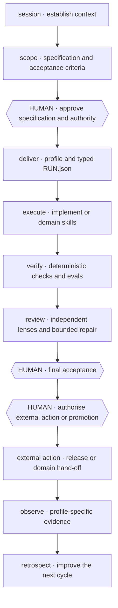

<div align="center">

# Agent Harness

**34 reusable Agent Skills for scoped, verified delivery with Claude Code and Codex.**

[](https://github.com/mblauberg/agent-harness/actions/workflows/ci.yml)
[](LICENSE)

</div>

Claude Code and Codex can each lead and cross-review substantial work; other
models are optional.

Platform policy and explicit human authority lead. Project instructions may
strengthen the harness, but cannot silently expand authority, weaken safety
gates or redefine global memory policy.

## Quick start

Clone, then install the skills and instruction bootstrap:

```sh
git clone https://github.com/mblauberg/agent-harness.git "$HOME/.agents"
export AGENTS_HOME="$HOME/.agents"

# Claude Code
"$AGENTS_HOME/scripts/install-harness" --platform claude

# Codex
"$AGENTS_HOME/scripts/install-harness" --platform codex
```

The installer preserves unmanaged content and disables Codex's bundled
`skill-creator`, leaving portable `skill-authoring` canonical.

Inspect or reconcile without overwriting unmanaged content:

```sh
"$AGENTS_HOME/scripts/manage_installation.py" plan --target "$HOME/.codex/skills"
"$AGENTS_HOME/scripts/manage_installation.py" reconcile \
  --target "$HOME/.codex/skills" \
  --renames "$AGENTS_HOME/config/skill-renames.json"
```

Requires Git and an Agent Skills client. Checks use Python 3.11+, PyYAML and
pytest. [Herdr](https://herdr.dev) enables observable paired work.

## Lifecycle



| Stage | Output | Human decision |
|---|---|---|
| Session | Current context and authority | None |
| Scope | Specification and acceptance criteria | Approve scope and one-way doors |
| Deliver | Artifacts, evidence and independent review | Accept, rescope or stop |
| External action | Deploy, share, file, publish or use decision | Authorise the named action |
| Observe | Profile-specific outcome evidence | None; failure returns to diagnosis |
| Retrospect | Improvements and promoted learning | Material changes return through scope |

Failed checks return to execution. Blocking findings get at most two repair
cycles; scope drift returns to the human. Failed observation opens `diagnose`.
External or irreversible actions need separate authority.

## Core workflows

| Need | Skill | Result |
|---|---|---|
| Turn an idea into an approved contract | [`scope`](skills/scope/SKILL.md) | Specification, stories and acceptance criteria |
| Deliver an approved cross-domain outcome | [`deliver`](skills/deliver/SKILL.md) | Artifacts, evidence, review and acceptance gate |
| Deliver an approved change | [`implement`](skills/implement/SKILL.md) | Verified change, independent review and bounded repair |
| Preserve behaviour while simplifying structure | [`refactor`](skills/refactor/SKILL.md) | Equivalence evidence, ownership reduction and safe deletion proof |
| Investigate a failure | [`diagnose`](skills/diagnose/SKILL.md) | Evidence-backed cause without an unapproved permanent edit |
| Review beyond the diff | [`code-review`](skills/code-review/SKILL.md) | Multi-lens findings with structural and architectural coverage |
| Review a frontend without changing it | [`frontend-review`](skills/frontend-review/SKILL.md) | UI findings with tested and untested evidence coverage |
| Coordinate parallel agents | [`orchestrate`](skills/orchestrate/SKILL.md) | Partitioned work, cross-family verification and synthesis |
| Run a long, resumable effort | [`autonomous-lab`](skills/autonomous-lab/SKILL.md) | Crash-safe progress until a human stops the run |
| Keep long work recoverable | [`session`](skills/session/SKILL.md) and [`work-map`](skills/work-map/SKILL.md) | Lean context, hand-offs and durable state |
| Promote an accepted artifact | [`release`](skills/release/SKILL.md) | Authorised action, reversal and observation |
| Improve the next cycle | [`retrospect`](skills/retrospect/SKILL.md) | Root-cause clusters, regression gates and promoted learning |

## Skill library

<!-- skill-catalogue:start -->
| Area | Skills |
|---|---|
| Delivery | [`session`](skills/session/SKILL.md), [`scope`](skills/scope/SKILL.md), [`deliver`](skills/deliver/SKILL.md), [`implement`](skills/implement/SKILL.md), [`tdd`](skills/tdd/SKILL.md), [`refactor`](skills/refactor/SKILL.md), [`diagnose`](skills/diagnose/SKILL.md), [`code-review`](skills/code-review/SKILL.md), [`evaluate`](skills/evaluate/SKILL.md), [`release`](skills/release/SKILL.md), [`retrospect`](skills/retrospect/SKILL.md), [`work-map`](skills/work-map/SKILL.md) |
| Orchestration | [`orchestrate`](skills/orchestrate/SKILL.md), [`autonomous-lab`](skills/autonomous-lab/SKILL.md) |
| Writing and documentation | [`engineering-docs`](skills/engineering-docs/SKILL.md), [`engineering-writing`](skills/engineering-writing/SKILL.md), [`academic-writing`](skills/academic-writing/SKILL.md), [`legal-writing`](skills/legal-writing/SKILL.md), [`natural-writing`](skills/natural-writing/SKILL.md) |
| Design and diagrams | [`frontend-design`](skills/frontend-design/SKILL.md), [`frontend-review`](skills/frontend-review/SKILL.md), [`prototype`](skills/prototype/SKILL.md), [`d2-diagrams`](skills/d2-diagrams/SKILL.md), [`uml-diagrams`](skills/uml-diagrams/SKILL.md) |
| Web engineering | [`playwright`](skills/playwright/SKILL.md), [`react-performance`](skills/react-performance/SKILL.md), [`tanstack-query`](skills/tanstack-query/SKILL.md), [`typescript-clean-code`](skills/typescript-clean-code/SKILL.md), [`web-stack-conventions`](skills/web-stack-conventions/SKILL.md) |
| Harness development | [`grill-me`](skills/grill-me/SKILL.md), [`skill-audit`](skills/skill-audit/SKILL.md), [`skill-authoring`](skills/skill-authoring/SKILL.md) |
| Presentation | [`caveman`](skills/caveman/SKILL.md) |
<!-- skill-catalogue:end -->

## Models and review

| Role | Policy |
|---|---|
| Session chair | Claude Code or Codex owns communication, authority and final synthesis |
| Native workers | The chair's subagents provide parallel depth within partitioned scopes |
| Other primary | Required independent review for substantial and higher-risk work |
| Additional families | Gemini, xAI and other adapters provide non-blocking blind-spot checks |
| Routing | Runtime capability discovery resolves `flagship`, `workhorse` and `scout` aliases |

Evidence and corroboration—not model votes—make findings blocking. Missing
optional providers are recorded and skipped.

## Delivery profiles

| Profile | Typical outputs | Minimum evidence shape |
|---|---|---|
| Software | Source, migrations, configuration | Tests plus code review |
| Research | Report, dataset, evidence map | Source coverage plus source-quality review |
| Analysis | Model, table, visualisation | Recalculation plus interpretation review |
| Document | Markdown, DOCX, PDF, slides, sheets | Render checks plus audience-fit review |
| Agent product | Prompts, tools, policies, eval sets | Tests, permissions, behavioural eval and red team |

High-stakes work adds source-authority, privacy, qualified-review and explicit
action controls. Profile rules live in
[`config/delivery-profiles.json`](config/delivery-profiles.json); the neutral
receipt and validator live with [`deliver`](skills/deliver/SKILL.md).

Run the profile gate from any directory:

```sh
python3 "${AGENTS_HOME:-$HOME/.agents}/scripts/validate_delivery_scenarios.py"
```

## Safety

| Boundary | Rule |
|---|---|
| Authority | Filesystem access, credentials and subscriptions never grant permission |
| Git | No branch or worktree is created without direct human authorisation |
| Concurrency | Agents never write the same source surface concurrently |
| Knowledge | Durable facts live in project-owned specs, ADRs, runbooks and state files |
| Release | Final acceptance and production promotion remain human decisions |

See [`HARNESS.md`](HARNESS.md) for the operating contract and
[`SECURITY.md`](SECURITY.md) for vulnerability reporting.

[`Architecture`](docs/ARCHITECTURE.md) ·
[`Research`](docs/research/skill-portfolio-practices-2026.md) ·
[`Lifecycle spec`](docs/specs/02-adaptive-agent-harness.md) ·
[`Maintenance`](MAINTAINING.md) ·
[`Acknowledgements`](ACKNOWLEDGEMENTS.md) ·
[`Third-party notices`](THIRD_PARTY_NOTICES.md) ·
[`Security`](SECURITY.md) ·
[`MIT licence`](LICENSE)
