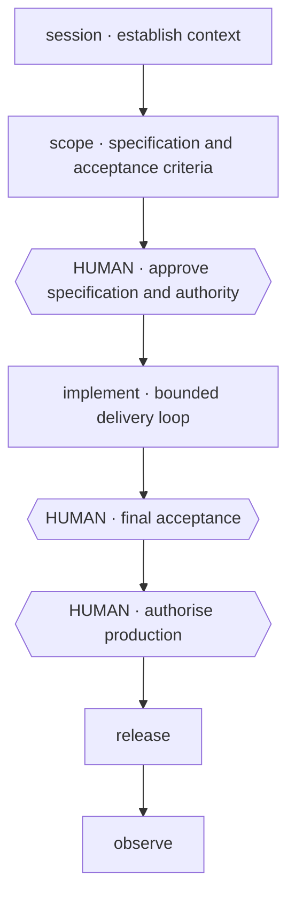
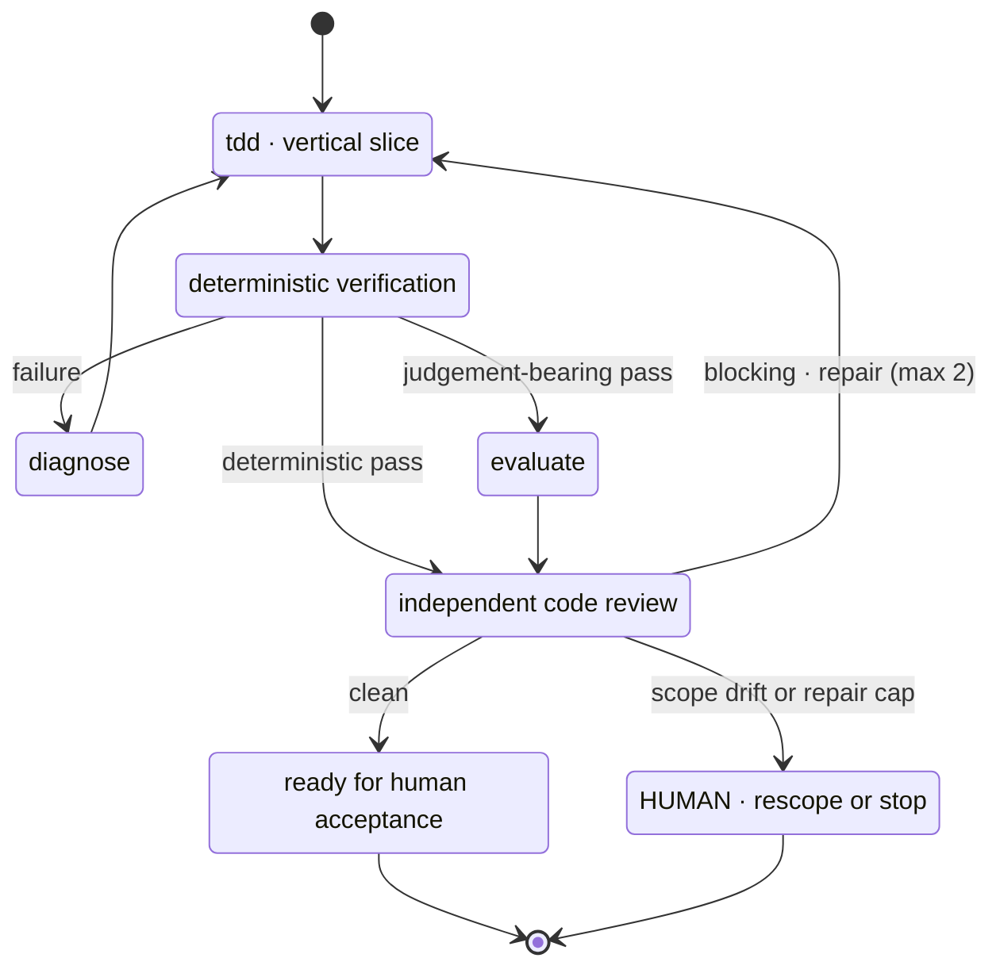

# Agent Harness

[](https://github.com/mblauberg/agent-harness/actions/workflows/ci.yml)
[](LICENSE)

A portable, model-neutral operating layer for serious agent work. It turns a
folder of skills into a governed agentic SDLC: scope first, execute within
explicit authority, verify objectively, review independently, and keep humans
at the decisions that deserve human attention.

Claude Code and Codex are equal primary orchestrators. Native subagents do most
fan-out; the other primary family provides load-bearing independent review on
substantial work. Gemini, xAI and other families can add useful dissent without
becoming availability dependencies.

> Experimental: this is an opinionated personal harness made public for reuse
> and adaptation. Review its authority, model and release policies before using
> it on sensitive or production systems.

## The lifecycle



The implementation stage expands into a bounded repair loop:



`implement` owns the inner loop and calls supporting skills only when the task
needs them. Failed observation re-enters `diagnose` and `implement`, with
evidence back to `scope`. Rescoping returns to the specification gate; stopping
records the evidence. That gate also covers one-way-door decisions.
Cross-cutting skills such as `orchestrate`, `engineering-docs` and `session`
stay out of the geometry so the lifecycle remains legible. The canonical
lifecycle is [HARNESS.md](HARNESS.md); destructive, irreversible and
external-communication actions retain separate human gates. One accountable
chair and one active stage owner remain mandatory, including in paired
Claude/Codex mode.

## What is included

| Area | Skills and machinery |
|---|---|
| SDLC | `session`, `scope`, `implement`, `tdd`, `diagnose`, `code-review`, `evaluate`, `release`, `work-map` |
| Orchestration | `orchestrate`, `autonomous-lab`, model router, Herdr pane and paired-primary contracts |
| Documentation | `engineering-docs`, `engineering-writing`, `academic-writing`, `legal-writing`, `humanise-text` |
| Design and architecture | `prototype`, `frontend-design`, `d2-diagrams`, `uml-diagrams` |
| Harness maintenance | `skill-authoring`, `skill-audit`, contract tests and public-release checks |
| Specialist references | TanStack Query, Playwright, TypeScript, React/Next.js/Vite performance and current web-stack conventions |

<details>
<summary>Full portable skill catalogue (29)</summary>

<!-- skill-catalogue:start -->
`academic-writing`, `agy-headless`, `autonomous-lab`, `code-review`,
`d2-diagrams`, `diagnose`, `engineering-docs`, `engineering-writing`,
`evaluate`, `frontend-design`, `grill-me`, `humanise-text`, `implement`,
`legal-writing`, `orchestrate`, `playwright`, `prototype`, `react-performance`,
`release`, `scope`, `session`, `skill-audit`, `skill-authoring`,
`tanstack-query`, `tdd`, `typescript-clean-code`, `uml-diagrams`,
`web-stack-conventions`, `work-map`.
<!-- skill-catalogue:end -->

</details>

The short constitution is [HARNESS.md](HARNESS.md). The rationale and extension
model are in [docs/ARCHITECTURE.md](docs/ARCHITECTURE.md). Skill maintainers
should start with [MAINTAINING.md](MAINTAINING.md).

## Principles

- Optimise quality per human attention-hour, not token volume.
- Give every worker the narrowest explicit authority it needs.
- Use objective checks before model judgement and fresh reviewers after it.
- Treat cross-family opinions as evidence pressure, never a majority vote.
- Keep project truth in project-owned specs, ADRs, runbooks and state files.
- Keep receipts compact; prune only proven run-owned scratch.
- Stop for specs, one-way doors, destructive actions, external communication,
  final acceptance and production promotion.

## Install

Clone the canonical source:

```sh
git clone https://github.com/mblauberg/agent-harness.git "$HOME/.agents"
export AGENTS_HOME="$HOME/.agents"
"$AGENTS_HOME/scripts/check-harness" --doctor
```

Then expose `skills/` through each agent platform's supported global skill
discovery. For platforms that accept a shared directory, a symlink keeps one
source of truth:

```sh
ln -s "$AGENTS_HOME/skills" "$HOME/.claude/skills"
```

Do not replace an existing platform-owned skill directory blindly. Codex
installations commonly keep system skills in `$CODEX_HOME/skills`; link or copy
selected harness skill directories alongside them, or use the discovery
mechanism supplied by your Codex host. Keep `AGENTS.md` visible to every
operator and set `AGENTS_HOME` when the checkout is not `~/.agents`.

Claude Code, Codex, Herdr and every bonus adapter are optional at install time.
Unavailable bonus families degrade to a recorded skip. Substantial workflows
need at least the active primary plus a working route to the other primary if
you want the full review contract.

## Use

Skills trigger from ordinary requests. Explicit names are useful when the
workflow matters:

```text
$scope grill this feature into a spec and acceptance criteria
$implement take the approved spec through implementation, review and repair
$code-review review beyond the diff using correctness, security and design lenses
$orchestrate use paired Claude/Codex planning and independent verification
$session checkpoint this run and compact project context
```

Model policy is data-driven in `config/model-routing.json` and resolved through
`scripts/model-route`. Runtime discovery wins over the dated catalogue; receipts
record the actual adapter, provider family, model, effort and substitution.

## Safety and Git

The harness does not infer authority from filesystem access, credentials or a
subscription. It never creates branches or linked worktrees without direct
human authorisation. If a linked worktree is authorised, all platforms use the
owning repository's `.worktrees/<task-agent>` directory; see
[docs/worktrees.md](docs/worktrees.md).

Before publishing a fork:

```sh
scripts/check-harness
scripts/public-release-check --history
```

## Repository map

```text
AGENTS.md                 minimal cross-harness bootstrap
HARNESS.md                compact runtime constitution
config/                   risk and model-routing policy
docs/                     architecture and operational policy
scripts/                  routers, checks and worktree helper
skills/<name>/SKILL.md     progressively disclosed workflows
tests/                    harness contract and regression tests
```

## Acknowledgements

This harness adapts and redistributes carefully credited open-source skills and
draws conceptual inspiration from wider agent-workflow research. See
[ACKNOWLEDGEMENTS.md](ACKNOWLEDGEMENTS.md) for the human-readable credits and
[THIRD_PARTY_NOTICES.md](THIRD_PARTY_NOTICES.md) for the legal record.

## Licence

Original material is released under the [MIT Licence](LICENSE). Bundled or
adapted components retain their own licences; see
[THIRD_PARTY_NOTICES.md](THIRD_PARTY_NOTICES.md) and licence files beside those
components.
