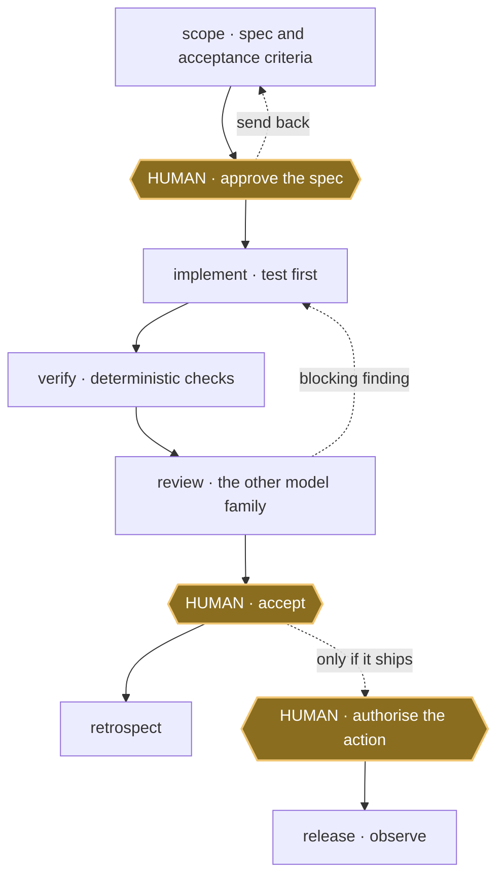

<div align="center">

# Provenant

**A gated delivery lifecycle for coding agents. Scope, verify, review, accept.**

Coding agents improvise. This agent harness is 33 Agent Skills that make Claude
Code and Codex follow one lifecycle instead: agree the spec, build it, verify it,
have the other model review it, then stop for you.

[](https://github.com/mblauberg/provenant/actions/workflows/ci.yml)
[](LICENSE)

</div>

Status: a personal harness, used daily by its author. Interfaces change without
notice.

## What this is

An Agent Skill is a folder with a `SKILL.md`. Only its one-line description sits
in permanent context (the whole 33-skill catalogue is budgeted under 8,000
characters); the body loads when the task matches. This is an operating system
for agent work, not a prompt collection: 33 skills, one constitution
([`HARNESS.md`](HARNESS.md)), and scripts that install both into Claude Code and
Codex.

Over a bare agent you get scoped authority, deterministic checks before anything
reaches you, review by the *other* model family, and hard stops at the decisions
you should make. The objective is quality per human attention-hour. Good fit if
unreviewed agent output is expensive for you; poor fit if you want a prompt pack
to skim. One primary works, but the other is load-bearing for substantial review:
running solo means accepting a recorded degradation.

## Quick start

```sh
git clone https://github.com/mblauberg/provenant.git "$HOME/.agents"
export AGENTS_HOME="$HOME/.agents"   # put this in ~/.zshrc too: skills read it at runtime

"$AGENTS_HOME/scripts/install-harness" --platform claude
"$AGENTS_HOME/scripts/install-harness" --platform codex

# confirm it worked (needs PyYAML and pytest): shows which primaries and
# routes resolve, so you can see if cross-family review is live
"$AGENTS_HOME/scripts/check-harness" --doctor
```

```text
~/.agents/                cloned once
  HARNESS.md    the constitution
  AGENTS.md     the bootstrap line
  skills/       one folder per skill
  scripts/      install, route, check
  config/       risk, routing, profiles
     |
     |  scripts/install-harness
     v
  ~/.claude/skills/   symlinks
  ~/.codex/skills/    symlinks
```

If you already have a `~/.claude/CLAUDE.md` or `~/.codex/AGENTS.md`, the
installer keeps it, exits 3 and prints one bootstrap line to paste in. Skills
still link; the exit code is expected.

The Codex installer appends one block to `~/.codex/config.toml` disabling Codex's
bundled `skill-creator`, leaving `skill-authoring` canonical; everything else in
that file is preserved. To reverse an install, `manage_installation.py
uninstall-managed --target <dir>` reclaims only harness-owned links.

Requires Git, Python 3.11+ (the installer is Python) and an Agent Skills client.
Cross-family review, the headline, needs **both** primaries installed and signed
in: the harness reaches the other family through its provider adapter, falling
back to a sandboxed `claude` or `codex exec` call. With one primary everything
still runs, but the review leg records a skip.
[`scripts/check-harness`](scripts/check-harness) also needs PyYAML and pytest;
`runtime/` and the full CI gate need Node.js 24. [Herdr](https://herdr.dev) is
optional and only observes.

## See it work

```text
you    add rate limiting to the public API
scope  writes the spec, acceptance criteria, risk tier and write paths
       -- STOPS. You approve, revise or stop.
you    approved
impl   tdd for the new behaviour, then the change
       runs the checks: 41 passed
       Codex reviews the diff in a fresh context, having never written it
       1 blocking finding: the limiter is not per-tenant
       repairs, re-verifies, re-reviews: clean
       -- STOPS. You accept, rescope or stop.
```

Nothing was released. That decision is yours.

## Lifecycle



Gold hexagons are human gates; each can send the work back. `verify` is
deterministic checks, and `review` is the other model family reading the diff in
a fresh context, having never written it. The two dotted edges are the loop:
the plan goes back to scope, a blocking finding goes back to implement. Release
and observe sit outside the loop, behind their own gate. The loop is
[`deliver`](skills/deliver/SKILL.md), the kernel binding one run to one receipt,
and [`implement`](skills/implement/SKILL.md) is its software front door. Full
lifecycle, every loop drawn: [`docs/ARCHITECTURE.md`](docs/ARCHITECTURE.md).

## Core workflows

| Need | Skill |
|---|---|
| Agree what to build | [`scope`](skills/scope/SKILL.md) |
| Deliver an approved code change | [`implement`](skills/implement/SKILL.md) |
| Deliver research, analysis or documents | [`deliver`](skills/deliver/SKILL.md) |
| Find a root cause | [`diagnose`](skills/diagnose/SKILL.md) |
| Review without changing the code | [`code-review`](skills/code-review/SKILL.md) |
| Coordinate parallel agents | [`orchestrate`](skills/orchestrate/SKILL.md) |
| Promote an accepted artifact | [`release`](skills/release/SKILL.md) |

## Skill library

<!-- skill-catalogue:start -->
<details>
<summary>All 33 skills</summary>

| Area | Skills |
|---|---|
| Delivery | [`session`](skills/session/SKILL.md), [`scope`](skills/scope/SKILL.md), [`deliver`](skills/deliver/SKILL.md), [`implement`](skills/implement/SKILL.md), [`tdd`](skills/tdd/SKILL.md), [`refactor`](skills/refactor/SKILL.md), [`diagnose`](skills/diagnose/SKILL.md), [`code-review`](skills/code-review/SKILL.md), [`evaluate`](skills/evaluate/SKILL.md), [`release`](skills/release/SKILL.md), [`retrospect`](skills/retrospect/SKILL.md), [`work-map`](skills/work-map/SKILL.md) |
| Orchestration | [`orchestrate`](skills/orchestrate/SKILL.md), [`autonomous-lab`](skills/autonomous-lab/SKILL.md) |
| Writing and documentation | [`engineering-docs`](skills/engineering-docs/SKILL.md), [`engineering-writing`](skills/engineering-writing/SKILL.md), [`academic-writing`](skills/academic-writing/SKILL.md), [`legal-writing`](skills/legal-writing/SKILL.md), [`natural-writing`](skills/natural-writing/SKILL.md) |
| Design and diagrams | [`frontend-design`](skills/frontend-design/SKILL.md), [`frontend-review`](skills/frontend-review/SKILL.md), [`prototype`](skills/prototype/SKILL.md), [`d2-diagrams`](skills/d2-diagrams/SKILL.md), [`uml-diagrams`](skills/uml-diagrams/SKILL.md) |
| Web engineering | [`playwright`](skills/playwright/SKILL.md), [`react-performance`](skills/react-performance/SKILL.md), [`tanstack-query`](skills/tanstack-query/SKILL.md), [`typescript-clean-code`](skills/typescript-clean-code/SKILL.md), [`web-stack-conventions`](skills/web-stack-conventions/SKILL.md) |
| Harness development | [`grill-me`](skills/grill-me/SKILL.md), [`skill-audit`](skills/skill-audit/SKILL.md), [`skill-authoring`](skills/skill-authoring/SKILL.md) |
| Presentation | [`caveman`](skills/caveman/SKILL.md) |

</details>
<!-- skill-catalogue:end -->

## Review, profiles and safety

The client you started is the session chair: it owns authority, run state, gates
and synthesis. It fans out to subagents for depth and sends substantial work to
the other primary for review in a fresh context. Coverage scales with risk:

| Risk | Minimum review pressure |
|---|---|
| `routine` | chair plus objective and native checks |
| `substantial` | fresh-context native review plus the other primary |
| `crucial` | substantial coverage, plus one distinct bonus family attempted |
| `terminal` | substantial coverage, plus two distinct bonus families attempted |

Bonus families (Gemini, xAI, others) never block on absence, quota or API
failure, but at the top two tiers the *attempt* is owed and every skipped leg is
recorded. Evidence and corroboration, not model votes, make a finding blocking.

Each kind of work owes the evidence its delivery profile names: tests and code
review for software, source coverage for research, recalculation for analysis,
render checks for documents, behavioural evals for agent products
([`config/delivery-profiles.json`](config/delivery-profiles.json)). Held-out
cases replayed by `scripts/check-harness` cover the kernel.

Boundaries that always hold: access and credentials never grant permission; no
branch or worktree without a human request or an approved authority envelope; no
two agents writing one source surface; acceptance and promotion stay human
([`HARNESS.md`](HARNESS.md)).

[`Architecture`](docs/ARCHITECTURE.md) ·
[`Lifecycle spec`](docs/specs/02-adaptive-agent-harness.md) ·
[`Research`](docs/research/skill-portfolio-practices-2026.md) ·
[`Maintenance`](MAINTAINING.md) ·
[`Acknowledgements`](ACKNOWLEDGEMENTS.md) ·
[`Third-party notices`](THIRD_PARTY_NOTICES.md) ·
[`Security`](SECURITY.md) ·
[`MIT licence`](LICENSE)
