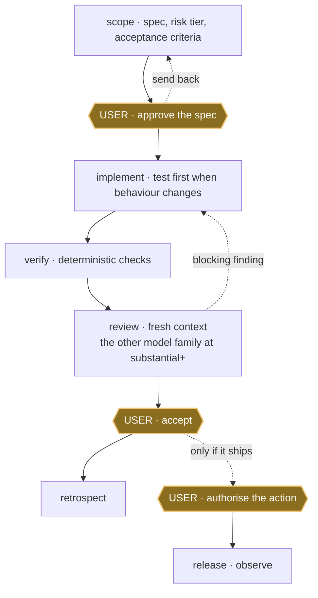

# Provenant

**A personal harness for Claude Code and Codex that turns agent work into a
scoped, verified and independently reviewed delivery workflow.**

[](https://github.com/mblauberg/provenant/actions/workflows/ci.yml)
[](LICENSE)

Provenant is a personal harness, used daily by its author. Interfaces change
without notice and support is best effort. Propose changes through
[GitHub issues](https://github.com/mblauberg/provenant/issues); report
vulnerabilities privately through [`SECURITY.md`](SECURITY.md).

## What Provenant adds

Over a bare agent, Provenant:

- scopes work and requires user approval before implementation starts;
- runs deterministic checks before results surface for review;
- adds review by the *other* model family once the work is substantial; and
- keeps acceptance and release as separate user decisions.

It is built from three parts:

- **Harness:** [`HARNESS.md`](HARNESS.md) defines authority, the delivery
  lifecycle and how much review pressure each risk tier owes.
- **Skills:** the <!--skills-->32<!--/skills--> Agent Skills are task-specific
  procedures, one folder with a `SKILL.md` each. Only the one-line descriptions
  sit in permanent context; a body loads when the task matches.
- **Agent Fabric:** cross-provider execution and durable coordination for
  Claude Code and Codex. Optional bonus providers stay separately activated.

## Quick start

Requirements:

- Git and Python 3.11+;
- Claude Code, Codex, or both;
- Node.js `>=24.15.0 <25` and npm `>=11.12.1 <12` to run repository
  verification (the suite shells out to `node`); and
- PyYAML and pytest for the harness checks. CI installs the versions pinned
  in `uv.lock`; locally, `uv sync --only-group test` reproduces them, or any
  interpreter with both packages works (`scripts/check-harness` honours
  `HARNESS_PYTHON`).

Install either platform independently, or both:

```sh
git clone https://github.com/mblauberg/provenant.git "$HOME/.agents"
export AGENTS_HOME="$HOME/.agents"   # skills read this at runtime; persist it in the shell rc

"$AGENTS_HOME/scripts/install-harness" --platform claude
"$AGENTS_HOME/scripts/install-harness" --platform codex

# verify the harness and Fabric independently
provenant check --doctor
provenant doctor
```

Installation links each skill into `~/.claude/skills/` and `~/.codex/skills/`.
It also links the thin `provenant` command into
`${PROVENANT_BIN_DIR:-$HOME/.local/bin}` and warns when that directory is not
on `PATH`; it never edits shell startup files. The command delegates unchanged
to the existing `route`, `worktree`, `check` and `fabric` scripts. Its `doctor`
command is exactly `scripts/agent-fabric doctor`.
It preserves an existing `~/.claude/CLAUDE.md` or `~/.codex/AGENTS.md`: the file
stays, the installer exits 3, and prints one bootstrap line to paste in. Skills
still link, so exit 3 is expected. `provenant check --doctor` reports which
routes the config resolves to; `provenant doctor` checks Fabric configuration.

<details>
<summary>Installation details: filesystem layout, Codex config and uninstall</summary>

```text
~/.agents/                cloned once
  HARNESS.md    the constitution
  AGENTS.md     the bootstrap line
  skills/       one folder per skill
  scripts/      install, route, check
  config/       risk, routing, profiles
     |
     |  scripts/install-harness
     v
  ~/.claude/skills/   symlinks
  ~/.codex/skills/    symlinks
```

The Codex installer appends one block to `~/.codex/config.toml` disabling
Codex's bundled `skill-creator`, leaving `skill-craft` canonical; the rest of
that file is preserved.

`"$AGENTS_HOME/scripts/manage_installation.py" uninstall-managed --target
<skills-dir>` reclaims the harness-owned skill links and nothing else. The
bootstrap line and the Codex block remain until removed by hand.

</details>

## Core workflows

| Need | Skill |
|---|---|
| Agree what to build | [`scope`](skills/scope/SKILL.md) |
| Deliver an approved code change | [`implement`](skills/implement/SKILL.md) |
| Deliver research, analysis or documents | [`deliver`](skills/deliver/SKILL.md) |
| Find a root cause | [`diagnose`](skills/diagnose/SKILL.md) |
| Review without changing the code | [`code-review`](skills/code-review/SKILL.md) |
| Coordinate parallel agents | [`orchestrate`](skills/orchestrate/SKILL.md) |
| Promote an accepted artifact | [`release`](skills/release/SKILL.md) |

## Lifecycle



Gold hexagons are user gates. Every gate can stop progression; specification
approval and acceptance can return work for revision. `review` runs in a fresh
context that never wrote the diff, and from the `substantial` tier up it must
include the other model family; a receipt missing that leg cannot reach
acceptance. The loop is [`deliver`](skills/deliver/SKILL.md), the kernel binding one run to one receipt,
and [`implement`](skills/implement/SKILL.md) is its software front door. Full
lifecycle: [`docs/ARCHITECTURE.md`](docs/ARCHITECTURE.md).

<details>
<summary>A worked example: add rate limiting to a public API</summary>

```text
user   add rate limiting to the public API
scope  writes the spec, acceptance criteria, risk tier and write paths
       -- STOPS. The user approves, revises or stops.
user   approved
impl   tdd for the new behaviour, then the change
       runs the checks: 41 passed
       the other primary reviews the diff in a fresh context, having never written it
       1 blocking finding: the limiter is not per-tenant
       repairs, re-verifies, re-reviews: clean
       -- STOPS. The user accepts, rescopes or stops.
```

Nothing was released. That decision stays with the user.

</details>

## Important constraints

Coverage scales with the risk tier the work is scoped at:

| Risk | Minimum review pressure |
|---|---|
| `routine` | chair plus objective and native checks |
| `substantial` | fresh-context native review plus the other primary |
| `crucial` | substantial coverage, plus one distinct bonus family attempted |
| `terminal` | substantial coverage, plus two distinct bonus families attempted |

Solo `routine` work still completes, but `substantial` and above cannot reach
acceptance with the other-primary leg missing. Bonus families (Gemini, xAI,
others) never block on absence, quota or API failure, but at the top two tiers
the *attempt* is owed and every skipped leg recorded. Evidence and
corroboration, not model votes, make a finding blocking.

Durable boundaries:

- access and credentials never grant authority;
- creating branches and worktrees for implementation is pre-authorised by the
  constitution, and agents merge pull requests that pass their tier's review
  pressure and green CI; deletion, force-removal and pushes to shared branches
  outside authorised merges stay gated;
- no two agents write one source surface at once; and
- specification approval, acceptance and release stay separate user decisions
  ([`HARNESS.md`](HARNESS.md)).

Agent Fabric owns answer-bearing provider execution and durable coordination;
direct command-line calls are a preflight or a recorded degraded fallback.
[Herdr](https://herdr.dev) is optional: it observes and wakes, never decides.

## Skill library

The full <!--skills-->32<!--/skills-->-skill catalogue, grouped by area:

<!-- skill-catalogue:start -->
<details>
<summary>All 32 skills</summary>

| Area | Skills |
|---|---|
| Delivery | [`session`](skills/session/SKILL.md), [`scope`](skills/scope/SKILL.md), [`deliver`](skills/deliver/SKILL.md), [`implement`](skills/implement/SKILL.md), [`tdd`](skills/tdd/SKILL.md), [`refactor`](skills/refactor/SKILL.md), [`diagnose`](skills/diagnose/SKILL.md), [`code-review`](skills/code-review/SKILL.md), [`evaluate`](skills/evaluate/SKILL.md), [`release`](skills/release/SKILL.md), [`retrospect`](skills/retrospect/SKILL.md), [`work-map`](skills/work-map/SKILL.md), [`github-setup`](skills/github-setup/SKILL.md) |
| Orchestration | [`orchestrate`](skills/orchestrate/SKILL.md), [`autopilot`](skills/autopilot/SKILL.md) |
| Writing and documentation | [`engineering-docs`](skills/engineering-docs/SKILL.md), [`engineering-writing`](skills/engineering-writing/SKILL.md), [`academic-writing`](skills/academic-writing/SKILL.md), [`legal-writing`](skills/legal-writing/SKILL.md), [`natural-writing`](skills/natural-writing/SKILL.md) |
| Design and diagrams | [`ui-ux-design`](skills/ui-ux-design/SKILL.md), [`prototype`](skills/prototype/SKILL.md), [`d2-diagrams`](skills/d2-diagrams/SKILL.md), [`uml-diagrams`](skills/uml-diagrams/SKILL.md) |
| Web engineering | [`playwright`](skills/playwright/SKILL.md), [`react-performance`](skills/react-performance/SKILL.md), [`tanstack-query`](skills/tanstack-query/SKILL.md), [`typescript-clean-code`](skills/typescript-clean-code/SKILL.md), [`web-stack-conventions`](skills/web-stack-conventions/SKILL.md) |
| Harness development | [`grill-me`](skills/grill-me/SKILL.md), [`skill-craft`](skills/skill-craft/SKILL.md) |
| Presentation | [`caveman`](skills/caveman/SKILL.md) |

</details>
<!-- skill-catalogue:end -->

## Documentation and help

- [`Architecture`](docs/ARCHITECTURE.md): system structure and design rationale.
- [`Specifications`](docs/specs/README.md): the component contracts.
- [`Research`](docs/research/skill-portfolio-practices-2026.md): the skill-portfolio basis.
- [`Maintenance`](MAINTAINING.md): how the repository is changed and governed.
- [`Security`](SECURITY.md): private vulnerability reporting.
- [GitHub issues](https://github.com/mblauberg/provenant/issues): normal feedback and change proposals.

Legal: [MIT licence](LICENSE) · [Notices](NOTICE) ·
[Third-party notices](THIRD_PARTY_NOTICES.md) ·
[Acknowledgements](ACKNOWLEDGEMENTS.md)
