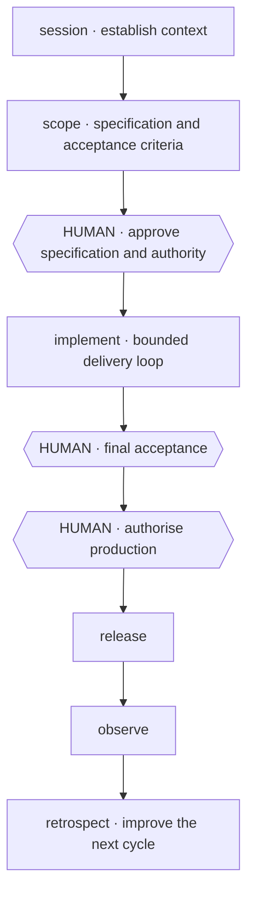
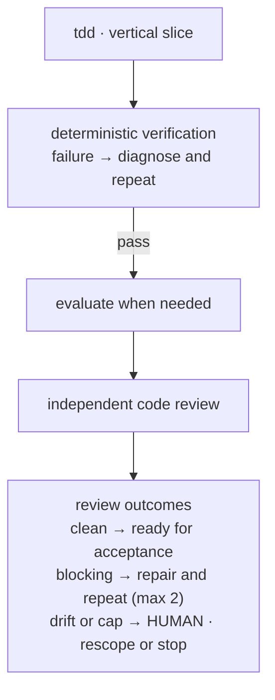

<div align="center">

# Agent Harness

**30 reusable Agent Skills for scoped, verified delivery with Claude Code and Codex.**

[](https://github.com/mblauberg/agent-harness/actions/workflows/ci.yml)
[](LICENSE)

</div>

Claude Code and Codex can each lead. For substantial work, one leads while the
other reviews independently. Gemini, xAI and other configured models can add
second opinions; their absence never blocks the work.

## Quick start

Normal use requires Git and an agent that supports Agent Skills. Clone the
harness, then install its skills and global instruction bootstrap:

```sh
git clone https://github.com/mblauberg/agent-harness.git "$HOME/.agents"
export AGENTS_HOME="$HOME/.agents"

# Claude Code
"$AGENTS_HOME/scripts/install-harness" --platform claude

# Codex
"$AGENTS_HOME/scripts/install-harness" --platform codex
```

The installer creates missing directories, links each skill separately and
adds a small global-instruction bootstrap. It never replaces existing skills
or instructions; when a manual merge is needed, it prints the exact line.

Start with an ordinary request:

> Scope this feature into acceptance criteria, implement it, run independent
> review, repair blocking findings, and stop for final acceptance.

| Component | Needed for |
|---|---|
| Git and a compatible agent | Skill use |
| Python 3.11+, PyYAML and pytest | `scripts/check-harness` validation |
| Claude Code and Codex | Full cross-family review |
| [Herdr](https://herdr.dev), a terminal agent multiplexer | Observable paired-agent panes |
| Gemini, xAI and other adapters | Optional additional review |

Install validation dependencies when needed:

```sh
PYTHON="$(command -v python3)"
"$PYTHON" -m pip install pytest pyyaml
HARNESS_PYTHON="$PYTHON" scripts/check-harness --doctor
```

## Lifecycle



| Stage | Output | Human decision |
|---|---|---|
| Session | Current context and authority | None |
| Scope | Specification and acceptance criteria | Approve scope and one-way doors |
| Implement | Tested change with independent review | Accept, rescope or stop |
| Release | Versioned, reversible promotion | Authorise production |
| Observe | Production evidence | None; failure returns to diagnosis |
| Retrospect | Evidence-backed improvements and promoted learning | Material changes return through scope |

<details>
<summary><strong>Implementation repair loop</strong></summary>



1. Build a test-driven vertical slice and run deterministic checks.
2. Diagnose failures; evaluate judgement-bearing behaviour after checks pass.
3. Review independently. Accept when clean, repair at most twice, or return
   scope drift and capped repairs to the human.

</details>

Failed observation returns to `diagnose` and `implement`, with evidence fed
back into `scope`. Rescoping returns to `scope`; stopping records its evidence.
Retrospect promotes durable learning and routes material changes through scope.
Destructive actions, external communication and production promotion require
separate authority.

## Core workflows

| Need | Skill | Result |
|---|---|---|
| Turn an idea into an approved contract | [`scope`](skills/scope/SKILL.md) | Specification, stories and acceptance criteria |
| Deliver an approved change | [`implement`](skills/implement/SKILL.md) | Verified change, independent review and bounded repair |
| Investigate a failure | [`diagnose`](skills/diagnose/SKILL.md) | Evidence-backed cause without an unapproved permanent edit |
| Review beyond the diff | [`code-review`](skills/code-review/SKILL.md) | Multi-lens findings with structural and architectural coverage |
| Coordinate parallel agents | [`orchestrate`](skills/orchestrate/SKILL.md) | Partitioned work, cross-family verification and synthesis |
| Run a long, resumable effort | [`autonomous-lab`](skills/autonomous-lab/SKILL.md) | Crash-safe progress until a human stops the run |
| Keep long work recoverable | [`session`](skills/session/SKILL.md) and [`work-map`](skills/work-map/SKILL.md) | Lean context, hand-offs and durable state |
| Promote an accepted change | [`release`](skills/release/SKILL.md) | Controlled rollout, rollback and observation |
| Improve the next cycle | [`retrospect`](skills/retrospect/SKILL.md) | Root-cause clusters, regression gates and promoted learning |

## Skill library

<!-- skill-catalogue:start -->
| Area | Skills |
|---|---|
| Delivery | [`session`](skills/session/SKILL.md), [`scope`](skills/scope/SKILL.md), [`implement`](skills/implement/SKILL.md), [`tdd`](skills/tdd/SKILL.md), [`diagnose`](skills/diagnose/SKILL.md), [`code-review`](skills/code-review/SKILL.md), [`evaluate`](skills/evaluate/SKILL.md), [`release`](skills/release/SKILL.md), [`retrospect`](skills/retrospect/SKILL.md), [`work-map`](skills/work-map/SKILL.md) |
| Orchestration | [`orchestrate`](skills/orchestrate/SKILL.md), [`autonomous-lab`](skills/autonomous-lab/SKILL.md), [`agy-headless`](skills/agy-headless/SKILL.md) |
| Writing and documentation | [`engineering-docs`](skills/engineering-docs/SKILL.md), [`engineering-writing`](skills/engineering-writing/SKILL.md), [`academic-writing`](skills/academic-writing/SKILL.md), [`legal-writing`](skills/legal-writing/SKILL.md), [`natural-writing`](skills/natural-writing/SKILL.md) |
| Design and diagrams | [`frontend-design`](skills/frontend-design/SKILL.md), [`prototype`](skills/prototype/SKILL.md), [`d2-diagrams`](skills/d2-diagrams/SKILL.md), [`uml-diagrams`](skills/uml-diagrams/SKILL.md) |
| Web engineering | [`playwright`](skills/playwright/SKILL.md), [`react-performance`](skills/react-performance/SKILL.md), [`tanstack-query`](skills/tanstack-query/SKILL.md), [`typescript-clean-code`](skills/typescript-clean-code/SKILL.md), [`web-stack-conventions`](skills/web-stack-conventions/SKILL.md) |
| Harness development | [`grill-me`](skills/grill-me/SKILL.md), [`skill-audit`](skills/skill-audit/SKILL.md), [`skill-authoring`](skills/skill-authoring/SKILL.md) |
<!-- skill-catalogue:end -->

## Models and review

| Role | Policy |
|---|---|
| Session chair | Claude Code or Codex owns communication, authority and final synthesis |
| Native workers | The chair's subagents provide parallel depth within partitioned scopes |
| Other primary | Required independent review for substantial and higher-risk work |
| Additional families | Gemini, xAI and other adapters provide non-blocking blind-spot checks |
| Routing | Runtime capability discovery resolves `flagship`, `workhorse` and `scout` aliases |

Review findings become blocking through evidence and corroboration, not model
votes. Missing optional providers are recorded and skipped.

## Safety

| Boundary | Rule |
|---|---|
| Authority | Filesystem access, credentials and subscriptions never grant permission |
| Git | No branch or worktree is created without direct human authorisation |
| Concurrency | Agents never write the same source surface concurrently |
| Knowledge | Durable facts live in project-owned specs, ADRs, runbooks and state files |
| Release | Final acceptance and production promotion remain human decisions |

See [`HARNESS.md`](HARNESS.md) for the operating contract and
[`SECURITY.md`](SECURITY.md) for vulnerability reporting.

[`Architecture`](docs/ARCHITECTURE.md) ·
[`Maintenance`](MAINTAINING.md) ·
[`Acknowledgements`](ACKNOWLEDGEMENTS.md) ·
[`Third-party notices`](THIRD_PARTY_NOTICES.md) ·
[`Security`](SECURITY.md) ·
[`MIT licence`](LICENSE)
