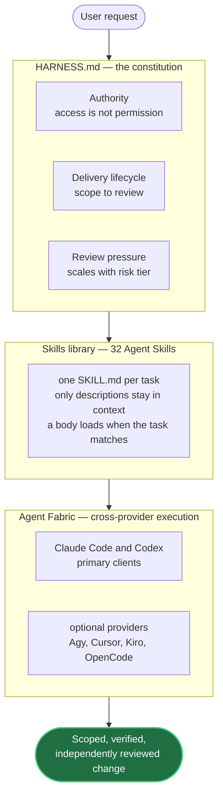
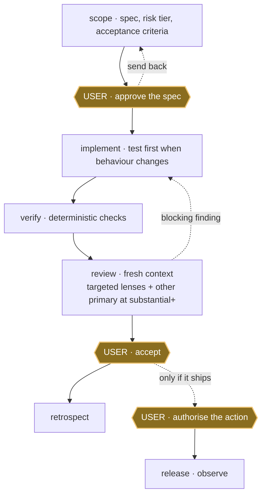

# Provenant

**A personal harness for Claude Code and Codex that turns agent work into a
scoped, verified and independently reviewed delivery workflow.**

[](https://github.com/mblauberg/provenant/actions/workflows/ci.yml)
[](LICENSE)

Provenant is a personal harness, used daily by its author. Interfaces change
without notice and support is best effort. Propose changes through
[GitHub issues](https://github.com/mblauberg/provenant/issues); report
vulnerabilities privately through [`SECURITY.md`](SECURITY.md).

## Contents

- [Why Provenant](#why-provenant)
- [How it fits together](#how-it-fits-together)
- [Quick start](#quick-start)
- [Providers](#providers)
- [Core workflows](#core-workflows)
- [Lifecycle](#lifecycle)
- [What the harness guarantees](#what-the-harness-guarantees)
- [Skill library](#skill-library)
- [Documentation and help](#documentation-and-help)

## Why Provenant

A bare coding agent will write and "finish" a change in one pass, with its own
author as the only reviewer. Provenant puts structure around that:

- it **scopes** work and requires user approval before implementation starts;
- it runs **deterministic checks** before any result surfaces for review;
- it adds **review by the _other_ model family** once the work is substantial:
  Claude checks Codex, Codex checks Claude; and
- it keeps **acceptance and release as separate user decisions**.

A change therefore arrives already scoped, verified and read by a context that
did not write it, so user attention goes to judgement rather than to catching an
agent's own mistakes.

## How it fits together

Provenant is three parts working as one pipeline:



- **Harness:** [`HARNESS.md`](HARNESS.md) is the constitution. It sets
  authority, the delivery lifecycle, and how much review pressure each risk tier
  owes, and stays small so it can be read every session.
- **Skills:** the <!--skills-->32<!--/skills--> Agent Skills are task-specific
  procedures, one folder with a `SKILL.md` each. Only the one-line descriptions
  sit in permanent context; a full body loads only when the task matches it.
- **Agent Fabric:** cross-provider execution and durable coordination, so the
  primaries can run and review each other's work. Optional providers stay
  separately activated.

## Quick start

Requirements:

- Git and Python 3.11+;
- a subscription-authenticated Claude Code or Codex installation for each
  installed primary client;
- Node.js `>=24.15.0 <25` and npm `>=11.12.1 <12` to run repository
  verification (the suite shells out to `node`); and
- PyYAML and pytest for harness checks (`uv sync --only-group test` installs
  the locked versions; `scripts/check-harness` honours `HARNESS_PYTHON`).

Install either platform independently, or both:

```sh
git clone https://github.com/mblauberg/provenant.git "$HOME/.agents"
export AGENTS_HOME="$HOME/.agents"   # optional override; the installed harness defaults here
cd "$AGENTS_HOME"

# install the pinned workspace dependencies and compile Fabric before its first use
npm ci
"$AGENTS_HOME/scripts/agent-fabric-warm"

"$AGENTS_HOME/scripts/install-harness" --platform claude
"$AGENTS_HOME/scripts/install-harness" --platform codex

# discover commands, then verify Fabric
provenant help
provenant doctor

# run the full repository gate when changing Provenant
provenant check
```

Installation links each skill into `~/.claude/skills/` and `~/.codex/skills/`,
and links the thin `provenant` command into
`${PROVENANT_BIN_DIR:-$HOME/.local/bin}`; it warns when that directory is not
on `PATH`, and never edits shell startup files. If the installer exits non-zero,
follow the message it prints: exit `3` flags a command collision, incompatible
instruction target, or managed skill-link conflict, and instruction conflicts
include the bootstrap line to add.

`provenant doctor` checks Fabric configuration and enabled adapters (identity
and non-answer interfaces, not login or quota); Provenant never sets or persists
provider API keys. `provenant check` runs the full repository gate.

<details>
<summary>Filesystem layout, Codex config and uninstall</summary>

```text
~/.agents/                cloned once
  HARNESS.md    the constitution
  AGENTS.md     the bootstrap line
  skills/       one folder per skill
  scripts/      install, route, check
  config/       risk, routing, profiles
     |
     |  scripts/install-harness
     v
  ~/.claude/skills/   symlinks
  ~/.codex/skills/    symlinks
```

The Codex installer appends one block to `~/.codex/config.toml` disabling
Codex's bundled `skill-creator`, leaving `skill-craft` canonical; the rest of
that file is preserved.

`"$AGENTS_HOME/scripts/manage_installation.py" uninstall-managed --target
<skills-dir>` reclaims the harness-owned skill links and nothing else. The
bootstrap line and the Codex block remain until removed by hand.

Before first use, the agent trusts only the exact canonical Git root (or
non-Git directory) with `$HOME/.agents/scripts/agent-fabric workspace trust`,
then calls `fabric_bootstrap` when no seat exists. If bootstrap runs first,
`WORKSPACE_NOT_TRUSTED` provides the recovery command. The same connection
exposes Fabric tools; no project files are needed.

</details>

## Providers

The checked-in profile enables all six clients below. Install and authenticate
each before `provenant doctor`.

| Client or provider | Current integration |
|---|---|
| Claude Code | Primary client and enabled Anthropic provider |
| Codex | Primary client and enabled OpenAI provider |
| Agy | Enabled optional Gemini/Claude provider |
| Cursor | Enabled optional Grok/Composer provider |
| Kiro | Global MCP client and enabled optional open-weight ACP provider |
| OpenCode | Enabled optional ACP provider for its built-in account models |

Provider CLI versions and digests are diagnostic observations, not admission
locks. Provenant revalidates vendor identity, wrapper provenance and each
bounded provider interface at point of use, so an ordinary signed CLI update
does not require a compatibility-table edit.

## Core workflows

Each task has a front-door skill; the agent loads it when a request matches.

| Need | Skill |
|---|---|
| Agree what to build | [`scope`](skills/scope/SKILL.md) |
| Deliver an approved code change | [`implement`](skills/implement/SKILL.md) |
| Deliver research, analysis or documents | [`deliver`](skills/deliver/SKILL.md) |
| Find a root cause | [`diagnose`](skills/diagnose/SKILL.md) |
| Review without changing the code | [`code-review`](skills/code-review/SKILL.md) |
| Coordinate parallel agents | [`orchestrate`](skills/orchestrate/SKILL.md) |
| Promote an accepted artifact | [`release`](skills/release/SKILL.md) |

## Lifecycle

Every change runs the same delivery loop, and it stops at three gates only the
user can pass.



Gold hexagons are user gates. Every gate can stop progression; specification
approval and acceptance can return work for revision. `review` runs in a fresh
context that never wrote the diff. From the `substantial` tier up it requires
multiple targeted lenses plus the other primary; a receipt missing that leg cannot
reach acceptance.

The loop is [`deliver`](skills/deliver/SKILL.md), the kernel binding one run to one receipt;
[`implement`](skills/implement/SKILL.md) is its software front door, and the
full lifecycle lives in [`docs/ARCHITECTURE.md`](docs/ARCHITECTURE.md).

## What the harness guarantees

**Review pressure scales with the risk tier the work is scoped at:**

| Risk | Minimum review pressure |
|---|---|
| `routine` | chair plus objective and native checks |
| `substantial` | multiple targeted lenses plus a strong other-primary review |
| `crucial` | substantial coverage plus a distinct-family review when available |
| `terminal` | all preceding coverage with stronger targeted and adversarial pressure |

Solo `routine` work still completes, but `substantial` and above cannot reach
acceptance with the other-primary leg missing. Distinct-family review is
advisory when available; a skipped terminal distinct-family leg records its
reason. Evidence and corroboration, not model votes, make a finding blocking.
The canonical ladder lives in [`HARNESS.md`](HARNESS.md).

**Durable boundaries hold regardless of tier:**

- access and credentials never grant authority;
- creating branches and worktrees for implementation is pre-authorised;
  merge authority comes from the owning repository (this repo grants it through
  its [GitHub runbook](docs/runbooks/github-workflow.md)); deletion,
  force-removal and unauthorised shared-branch pushes stay gated;
- no two agents write one source surface at once; and
- specification approval, acceptance and release stay separate user decisions
  ([`HARNESS.md`](HARNESS.md)).

Agent Fabric owns answer-bearing provider execution and durable coordination;
direct command-line calls are a preflight or a recorded degraded fallback.
[Herdr](https://herdr.dev) is optional: it observes and wakes, never decides.

## Skill library

The full <!--skills-->32<!--/skills-->-skill catalogue, grouped by area:

<!-- skill-catalogue:start -->
<details>
<summary>All 32 skills</summary>

| Area | Skills |
|---|---|
| Delivery | [`session`](skills/session/SKILL.md), [`scope`](skills/scope/SKILL.md), [`deliver`](skills/deliver/SKILL.md), [`implement`](skills/implement/SKILL.md), [`tdd`](skills/tdd/SKILL.md), [`refactor`](skills/refactor/SKILL.md), [`diagnose`](skills/diagnose/SKILL.md), [`code-review`](skills/code-review/SKILL.md), [`evaluate`](skills/evaluate/SKILL.md), [`release`](skills/release/SKILL.md), [`retrospect`](skills/retrospect/SKILL.md), [`work-map`](skills/work-map/SKILL.md), [`setup-repo`](skills/setup-repo/SKILL.md) |
| Orchestration | [`orchestrate`](skills/orchestrate/SKILL.md), [`autopilot`](skills/autopilot/SKILL.md) |
| Writing and documentation | [`engineering-docs`](skills/engineering-docs/SKILL.md), [`engineering-writing`](skills/engineering-writing/SKILL.md), [`academic-writing`](skills/academic-writing/SKILL.md), [`legal-writing`](skills/legal-writing/SKILL.md), [`natural-writing`](skills/natural-writing/SKILL.md) |
| Design and diagrams | [`ui-ux-design`](skills/ui-ux-design/SKILL.md), [`prototype`](skills/prototype/SKILL.md), [`d2-diagrams`](skills/d2-diagrams/SKILL.md), [`uml-diagrams`](skills/uml-diagrams/SKILL.md) |
| Web engineering | [`playwright`](skills/playwright/SKILL.md), [`react-performance`](skills/react-performance/SKILL.md), [`tanstack-query`](skills/tanstack-query/SKILL.md), [`typescript-clean-code`](skills/typescript-clean-code/SKILL.md), [`web-stack-conventions`](skills/web-stack-conventions/SKILL.md) |
| Harness development | [`grill-me`](skills/grill-me/SKILL.md), [`skill-craft`](skills/skill-craft/SKILL.md) |
| Presentation | [`caveman`](skills/caveman/SKILL.md) |

</details>
<!-- skill-catalogue:end -->

## Documentation and help

- [`Architecture`](docs/ARCHITECTURE.md): system structure and design rationale.
- [`Specifications`](docs/specs/README.md): the component contracts.
- [`Research`](docs/research/README.md): evidence and owners.
- [`Maintenance`](MAINTAINING.md): how the repository is changed and governed.
- [`Security`](SECURITY.md): private vulnerability reporting.
- [GitHub issues](https://github.com/mblauberg/provenant/issues): normal feedback and change proposals.

Legal: [MIT licence](LICENSE) · [Notices](NOTICE) ·
[Third-party notices](THIRD_PARTY_NOTICES.md) ·
[Acknowledgements](ACKNOWLEDGEMENTS.md)
