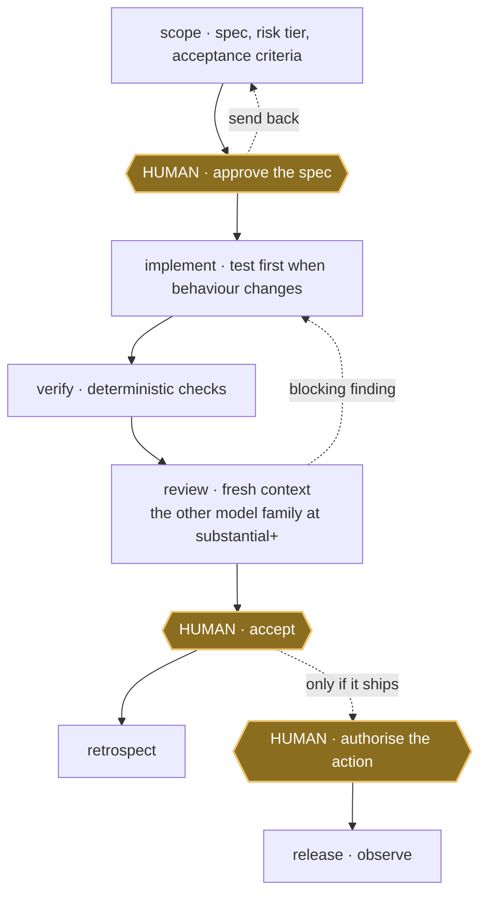

<div align="center">

# Provenant

**A gated delivery lifecycle for coding agents. Scope, verify, review, accept.**

Coding agents improvise. This agent harness is <!--skills-->33<!--/skills--> Agent Skills that make Claude
Code and Codex follow one lifecycle instead: agree the spec, build it, verify it,
have the other model review anything substantial, then stop for you.

[](https://github.com/mblauberg/provenant/actions/workflows/ci.yml)
[](LICENSE)

</div>

Status: a personal harness, used daily by its author. Interfaces change without
notice and support is best effort. Propose changes through
[GitHub issues](https://github.com/mblauberg/provenant/issues); report
vulnerabilities privately through [`SECURITY.md`](SECURITY.md).

## What this is

An Agent Skill is a folder with a `SKILL.md`. Only its one-line description sits
in permanent context (the whole <!--skills-->33<!--/skills-->-skill catalogue is budgeted under 8,000
characters); the body loads when the task matches. An operating system for agent
work, not a prompt collection: one constitution ([`HARNESS.md`](HARNESS.md))
governing both Claude Code and Codex.

Over a bare agent you get scoped authority, deterministic checks before anything
reaches you, review by the *other* model family once the work is substantial, and
hard stops at the decisions you should make. The objective is quality per human
attention-hour. Good fit if unreviewed agent output is expensive for you; poor fit
if you want a prompt pack to skim.

## Quick start

```sh
git clone https://github.com/mblauberg/provenant.git "$HOME/.agents"
export AGENTS_HOME="$HOME/.agents"   # also in ~/.zshrc: skills read it at runtime

"$AGENTS_HOME/scripts/install-harness" --platform claude
"$AGENTS_HOME/scripts/install-harness" --platform codex

# run the gate, then print the routes your config resolves to
# (needs PyYAML, pytest and Node.js: the suite shells out to node)
"$AGENTS_HOME/scripts/check-harness" --doctor
```

```text
~/.agents/                cloned once
  HARNESS.md    the constitution
  AGENTS.md     the bootstrap line
  skills/       one folder per skill
  scripts/      install, route, check
  config/       risk, routing, profiles
     |
     |  scripts/install-harness
     v
  ~/.claude/skills/   symlinks
  ~/.codex/skills/    symlinks
```

If you already have a `~/.claude/CLAUDE.md` or `~/.codex/AGENTS.md`, the installer
keeps the file, exits 3 and prints one bootstrap line to paste in. Skills still
link; exit 3 is expected.

The Codex installer also appends one block to `~/.codex/config.toml` disabling
Codex's bundled `skill-creator`, leaving `skill-authoring` canonical; the rest of
that file is preserved. `"$AGENTS_HOME/scripts/manage_installation.py"
uninstall-managed --target <skills-dir>` reclaims the harness-owned skill links
and nothing else: the bootstrap line and that Codex block stay until you delete
them.

Requires Git, Python 3.11+ and an Agent Skills client.
Cross-family review, the headline, needs **both** primaries signed in: the harness
reaches the other family through its provider adapter, falling back to a sandboxed
`claude` or `codex exec` call. Solo, `routine` work still completes, but
`substantial` and above cannot reach acceptance with the other-primary leg
missing: a blocking gap, not a recorded shrug.
[`scripts/check-harness`](scripts/check-harness) needs PyYAML, pytest and Node.js
24, because it always runs the full `pytest` suite and some tests shell out to
`node`. `--doctor` reports which routes your config resolves to, not whether a
provider is reachable or signed in. [Herdr](https://herdr.dev) is optional: it
observes and wakes, never decides.

## See it work

```text
you    add rate limiting to the public API
scope  writes the spec, acceptance criteria, risk tier and write paths
       -- STOPS. You approve, revise or stop.
you    approved
impl   tdd for the new behaviour, then the change
       runs the checks: 41 passed
       Codex reviews the diff in a fresh context, having never written it
       1 blocking finding: the limiter is not per-tenant
       repairs, re-verifies, re-reviews: clean
       -- STOPS. You accept, rescope or stop.
```

Nothing was released. That decision is yours.

## Lifecycle



Gold hexagons are human gates; each can send the work back. `review` is a fresh
context that never wrote the diff, and from `substantial` up it must include the
other model family: a receipt missing that leg cannot reach acceptance. The loop is
[`deliver`](skills/deliver/SKILL.md), the kernel binding one run to one receipt,
and [`implement`](skills/implement/SKILL.md) is its software front door. Full
lifecycle: [`docs/ARCHITECTURE.md`](docs/ARCHITECTURE.md).

## Core workflows

| Need | Skill |
|---|---|
| Agree what to build | [`scope`](skills/scope/SKILL.md) |
| Deliver an approved code change | [`implement`](skills/implement/SKILL.md) |
| Deliver research, analysis or documents | [`deliver`](skills/deliver/SKILL.md) |
| Find a root cause | [`diagnose`](skills/diagnose/SKILL.md) |
| Review without changing the code | [`code-review`](skills/code-review/SKILL.md) |
| Coordinate parallel agents | [`orchestrate`](skills/orchestrate/SKILL.md) |
| Promote an accepted artifact | [`release`](skills/release/SKILL.md) |

## Skill library

<!-- skill-catalogue:start -->
<details>
<summary>All 33 skills</summary>

| Area | Skills |
|---|---|
| Delivery | [`session`](skills/session/SKILL.md), [`scope`](skills/scope/SKILL.md), [`deliver`](skills/deliver/SKILL.md), [`implement`](skills/implement/SKILL.md), [`tdd`](skills/tdd/SKILL.md), [`refactor`](skills/refactor/SKILL.md), [`diagnose`](skills/diagnose/SKILL.md), [`code-review`](skills/code-review/SKILL.md), [`evaluate`](skills/evaluate/SKILL.md), [`release`](skills/release/SKILL.md), [`retrospect`](skills/retrospect/SKILL.md), [`work-map`](skills/work-map/SKILL.md) |
| Orchestration | [`orchestrate`](skills/orchestrate/SKILL.md), [`autonomous-lab`](skills/autonomous-lab/SKILL.md) |
| Writing and documentation | [`engineering-docs`](skills/engineering-docs/SKILL.md), [`engineering-writing`](skills/engineering-writing/SKILL.md), [`academic-writing`](skills/academic-writing/SKILL.md), [`legal-writing`](skills/legal-writing/SKILL.md), [`natural-writing`](skills/natural-writing/SKILL.md) |
| Design and diagrams | [`frontend-design`](skills/frontend-design/SKILL.md), [`frontend-review`](skills/frontend-review/SKILL.md), [`prototype`](skills/prototype/SKILL.md), [`d2-diagrams`](skills/d2-diagrams/SKILL.md), [`uml-diagrams`](skills/uml-diagrams/SKILL.md) |
| Web engineering | [`playwright`](skills/playwright/SKILL.md), [`react-performance`](skills/react-performance/SKILL.md), [`tanstack-query`](skills/tanstack-query/SKILL.md), [`typescript-clean-code`](skills/typescript-clean-code/SKILL.md), [`web-stack-conventions`](skills/web-stack-conventions/SKILL.md) |
| Harness development | [`grill-me`](skills/grill-me/SKILL.md), [`skill-audit`](skills/skill-audit/SKILL.md), [`skill-authoring`](skills/skill-authoring/SKILL.md) |
| Presentation | [`caveman`](skills/caveman/SKILL.md) |

</details>
<!-- skill-catalogue:end -->

## Review, profiles and safety

The client you started is the session chair: it owns authority, run state, gates
and synthesis. It fans out to native subagents for depth and sends substantial
work to the other primary. Coverage scales with risk:

| Risk | Minimum review pressure |
|---|---|
| `routine` | chair plus objective and native checks |
| `substantial` | fresh-context native review plus the other primary |
| `crucial` | substantial coverage, plus one distinct bonus family attempted |
| `terminal` | substantial coverage, plus two distinct bonus families attempted |

Bonus families (Gemini, xAI, others) never block on absence, quota or API
failure, but at the top two tiers the *attempt* is owed and every skipped leg
recorded. Evidence and corroboration, not model votes, make a finding blocking.

Every delivery profile owes a deterministic gate *and* a judgement one: tests plus
code review for software, source coverage plus source quality for research,
recalculation plus interpretation for analysis, rendering plus audience fit for
documents, and for agent products tests, permission checks, behavioural evals and
red-teaming. Those five are the built-ins in
[`config/delivery-profiles.json`](config/delivery-profiles.json); a project may add
its own, which must declare the same contract. Held-out cases replayed by
`scripts/check-harness` cover the kernel.

Boundaries that always hold: access and credentials never grant permission; no
branch or worktree without a human request or an approved authority envelope; no
two agents writing one source surface; acceptance and promotion stay human
([`HARNESS.md`](HARNESS.md)).

[`Architecture`](docs/ARCHITECTURE.md) ·
[`Specifications`](docs/specs/README.md) ·
[`Research`](docs/research/skill-portfolio-practices-2026.md) ·
[`Maintenance`](MAINTAINING.md) ·
[`Acknowledgements`](ACKNOWLEDGEMENTS.md) ·
[`Third-party notices`](THIRD_PARTY_NOTICES.md) ·
[`Security`](SECURITY.md) ·
[`MIT licence`](LICENSE)
