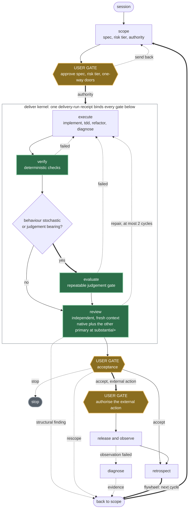
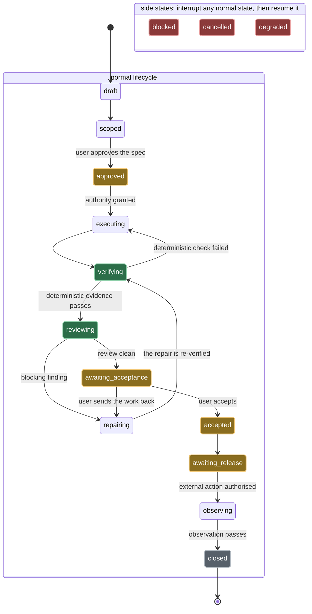
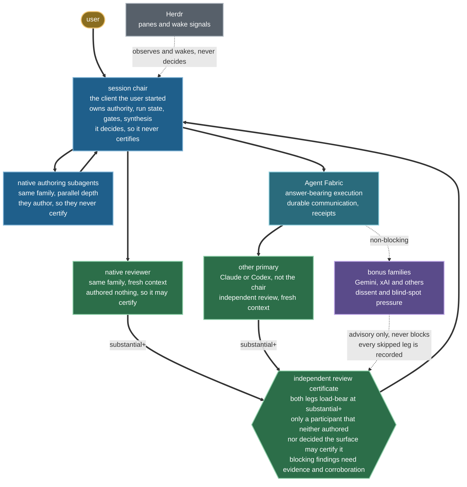

# Provenant architecture

## Purpose

Provenant is an agent harness: a gated delivery lifecycle for coding agents.
This repository is an operating system for agent work, not a prompt collection.
It implements a general agentic SDLC that can be used for software, research,
analysis, documentation and other evidence-bearing work. The objective is
quality per user attention-hour: agents create depth and verification; users
retain scarce judgement at consequential gates.

`AGENTS.md` is the tiny bootstrap every operator sees. `HARNESS.md` is the
compact runtime constitution. Skills load procedural depth only when triggered.
This document preserves the design intent so future maintainers can change the
harness without rediscovering it from individual skills.

## Lifecycle and user gates

Every run takes the same shape; what scales with risk is review pressure. At
`routine`, the chair plus objective and native checks are enough, so routine work
can complete without the other family. From `substantial` up, the review leg owes
both a fresh-context native reviewer and the other primary, and
`skills/deliver/scripts/validate_delivery.py` fails any receipt that reaches
acceptance missing either. The three gold gates are the only places a user must
decide; everything inside the `deliver` kernel is agent work bound to one receipt.

One palette carries the whole document. Every diagram below uses it, and no
colour means two things:

| Colour | Meaning |
|---|---|
| Gold | a user decides here |
| Green | a blocking leg: it can stop the run |
| Purple | an advisory leg: it never blocks, and a skipped leg is recorded |
| Blue | a participant that authors or decides, and so may never certify |
| Teal | transport |
| Red | an interrupt: it suspends a run, and recovery resumes the interrupted state |
| Grey | inert: stopped, closed, or observing only |

Green covers `verify`, `evaluate`, `review` and both load-bearing review legs, the
fresh-context native reviewer and the other primary, because each of them can stop
a run. Purple is reserved for the bonus families, which never can.

Four paths return work to `scope`: a structural review finding, a rescope at the
acceptance gate, evidence from a failed observation, and the retrospect
flywheel. They converge on one `back to scope` collector so the picture carries
one return edge into `scope` instead of five crossing the canvas.

Two orderings in that picture are load-bearing. Deterministic verification runs
first and always. `evaluate` is a separate conditional gate that runs only when
behaviour is stochastic or judgement bearing, so deterministic checks come
before judgement and the two are never fused into one box. Review is independent:
a fresh context, never the author of the surface under review. From `substantial`
up that means two legs, a fresh native reviewer and the other primary family, and
a receipt reaching acceptance without either one fails the machine gate.

The lifecycle loops. A failed check returns to execution; a structural review
finding may return to scope; production evidence may open a diagnosis and a new
implementation run. `retrospect` closes the quality flywheel by benchmarking
the completed trajectory, clustering root causes, proposing small
evidence-backed harness changes, adding regression gates and monitoring the
next comparable run. It promotes durable learning into canonical project docs
instead of accumulating retrospective logs. `autopilot` adds crash-safe
persistence for genuinely sprawling run-until-STOP work, but does not replace
the ordinary delivery loop.

User approval is required for:

- the specification and unresolved acceptance criteria;
- one-way-door architecture and risk-tier downgrades;
- destructive, irreversible or externally visible actions;
- external communications and production promotion;
- final acceptance.

Routine reversible implementation inside approved authority does not need a
stream of micro-approvals.

## Neutral delivery kernel

`deliver` is the cross-domain lifecycle front door and `delivery-run` schema v1 is
its portable state machine. It selects one profile from
`config/delivery-profiles.json`: software, research, analysis, document or
agent product. The high-stakes overlay adds source-authority, privacy,
qualified-review and explicit user-action controls without multiplying the
base profiles.

The state machine is enforced rather than advisory.
`skills/deliver/scripts/validate_delivery.py` holds the transition table and
rejects a receipt whose recorded history jumps a gate, so the states below are
the ones a run can actually occupy.

The three side states are drawn apart from the lifecycle on purpose. Any normal
state may be interrupted into `blocked`, `cancelled` or `degraded`, so wiring
each of them to the lifecycle would mean an edge from and to every state. Each
side state records a reason, a recovery instruction and the state it
interrupted; recovery resumes exactly that state and cannot skip a mandatory
gate. `validate_delivery.py` enforces that rule, not the picture.

Repair is the transition that people get wrong. `repairing` returns to
`verifying`, never straight to acceptance, so a repair is re-verified rather
than trusted, and `repair_cycles` must equal the number of `repairing`
transitions in the recorded history. A user at `awaiting_acceptance` can send
the work back to `repairing` as well as accept it. `closed` requires a passing
observation.

A digest-bound project policy may add a complete profile or add evidence and
measure gates to a built-in profile. Global minima load first and cannot be
removed or reclassified by the project overlay.

The kernel binds approved intent, design, authority, artifacts, deterministic
and judgement evidence, review independence, acceptance, release, observation
and retrospective linkage. Domain skills own methods; the kernel owns state
and proof. `implement` remains the software front door and uses the same
canonical receipt; there is no parallel implementation schema or adapter.
Passing deterministic evidence binds its declared, live-hash-verified artifact;
a syntactically valid digest or exit code alone is not proof.

Software execution composes bounded techniques rather than duplicating
lifecycle owners: `tdd` for new or changed observable behaviour, `refactor` for
approved behaviour-preserving structural work, and `diagnose` when root cause is
unknown. `code-review` remains source-read-only and independent. SOLID,
information hiding, cohesion, coupling, simplicity, idempotency and similar
principles are hypothesis generators; a finding still needs a concrete failure
mechanism, impact, evidence and validation route.

Frontend authority is similarly split: `ui-ux-design`'s design/make branch
supplies authorised design mutation methods inside `implement`, while its
review branch owns read-only UX, visual, accessibility and responsive
evidence. `scope` owns the
design decision and `engineering-docs` owns canonical placement. `playwright`,
`web-stack-conventions` and
`react-performance` provide tool or standards evidence without taking over the
UI finding contract. `caveman` is a presentation overlay only; it cannot narrow
evidence, authority, high-stakes clarity or an artifact's domain-writing rules.

`release` promotes one digest-pinned, user-accepted artifact through a separately
authorised `deploy`, `publish`, `share`, `send` or `activate` action. Targets are
typed as environments, recipients or audiences; execution may use an approved
command, connector or named user operation. Completion requires target-visible
proof and an observation/reversal contract; a successful command by itself is
not proof.

## Equal primaries, accountable ownership

Claude Code and Codex are equal primary orchestrators. Whichever harness the
user starts is the session chair and owns authority, user communication, run
state and synthesis. On substantial work it combines:

1. native same-family subagents for parallel depth, which author and so may never
   certify;
2. a fresh-context native reviewer that authored none of the surface under review;
3. the other primary family for independent review;
4. optional Gemini, xAI or other families for dissent and blind-spot discovery.

Legs 2 and 3 both load-bear from `substantial` up.

Bonus-family failure never blocks the workflow. The other primary is required for
the substantial review contract, and there is no degradation note that buys past
it: a run may execute without that leg, but `validate_delivery.py` rejects the
receipt once it reaches acceptance. The only relief is a user-approved risk
downgrade carrying an approver, a reason and evidence.
Provider-backed external workers, including the other primary, Agy/Gemini and
other bonus families, run through Agent Fabric. Direct CLIs are preflight or an
explicitly recorded degraded fallback, not the primary answer-bearing path;
provider adapters remain under `orchestrate`, not standalone skills.

The picture below separates the legs that can block a run from the legs that
cannot.

Solid legs can block a run; dashed legs cannot. Both blocking legs are
load-bearing from `substantial` up: `validate_delivery.py` rejects a receipt that
reaches acceptance without a passing native review *and* a passing other-primary
review, on distinct primary families with distinct evidence. The independence rule
is written into the nodes rather than drawn as an edge: the chair decides and its
authoring subagents write, so neither may certify. Blue marks exactly those
participants disqualified from certifying their own work, which is why a native
reviewer that opened a fresh context and authored nothing is green rather than
blue. Herdr sits outside the decision path entirely.

Paired-primary mode lets Claude and Codex rotate stage ownership, coordinated
through Agent Fabric, which owns answer-bearing execution and durable
communication; Herdr only observes and wakes.
It still has one chair and one active owner per stage, namespaced artifacts and
non-overlapping write scopes. Pane transcripts are transport, not durable state.
Pi is dormant by default until its provider, economics, permissions and receipt
quality are deliberately accepted.

## Routing, adapters and receipts

The router separates policy from execution:

- `config/model-routing.json` describes families, aliases and fallbacks;
- `scripts/model-route` resolves a role from runtime capabilities;
- adapter scripts execute the resolved route;
- receipts record requested and actual identity, effort and substitutions.

`flagship`, `workhorse` and `scout` are capability aliases, not permanent jobs
for a vendor. Claude Fable is preferred for the Claude lead route with Opus as
fallback; GPT-5.6 supports `ultra` where runtime discovery proves it. Model
catalogues are dated caches, not assertions about current availability.

## Review as a council, not a vote

The review system borrows the useful parts of council-style workflows:
independent first passes, deliberately different lenses, anonymised challenge
where anchoring matters, and a fresh reducer that adjudicates against evidence.
It rejects majority voting and repetitive reviewers.

The review lead chooses lenses proportional to the work: correctness, security,
performance, reliability/concurrency, state and type boundaries, test coverage,
spec alignment, readability/maintainability and larger structural
simplification. Findings become blocking only when evidence and primary-family
corroboration justify it.

## Authority and concurrency

Authority is a machine-readable envelope: allowed source and artifact paths,
prohibited paths/actions, disclosure, secrets, deployment, irreversible
actions, expiry and approver. Delegation may only narrow it.

There is no overlapping concurrent source writing. Partition ownership, use
artifact-only workers, or have one serial integrator apply patches. Worktrees
are visibility and isolation aids, not permission boundaries; their shared
location and lifecycle are defined in [worktrees.md](worktrees.md).

## Context and durable memory

Project knowledge must remain visible to every family. Durable facts therefore
live in project-owned state files, specifications, ADRs ([adr/](adr/)),
runbooks and context digests.
Private harness memory is limited to cross-project user preferences. For this
repository, GitHub issues own the current owner, dependencies and user gates;
Project Status owns workflow state. Project-local effort maps link that work
without restating it. Retention follows project and risk policy plus bounded
run-artifact rules. No canonical backlog contract, cross-store migration or god
manifest is introduced. The governing decisions are recorded in the
[ADR index](adr/README.md).

Workers return compressed findings and artifact paths. Session hygiene checks
freshness, size, duplication, stale logs, scratch manifests and handoff quality.
Pruning is conservative: delete only proven run-owned ephemeral data, compact
rather than blindly append, and merge or split curated documents when their
retrieval cost signals demand it. Sibling `.worktrees` are protected and
excluded from context scans.

## Managed installation

`scripts/manage_installation.py` plans, checks, installs, reconciles and removes
only harness-owned skill links. Every normal install repairs missing or stale
managed links and retires safe managed leftovers. A versioned manifest records
ownership, source tree digests, the bound target and rename history beside the
target skills directory. The post-install integrity check verifies catalogue
presence. Missing or noncanonical required names fail; extra symlinks resolving
outside the canonical skill tree produce warnings. Unmanaged paths are never
claimed, overwritten or automatically removed;
changed managed targets fail for user resolution. A bounded owner-only lock
serialises each mutable manifest read, link plan and durable commit. Atomic
exchange, no-clobber hard links and exact-identity moves retain a private
recovery path when an uncooperative writer wins a race; absent installs enter
the journal only when the live path still matches the exact staged link
identity. The live and recovery directories reach a durability barrier before
manifest replacement and after conditional rollback. The manifest's optional
schema-v1 identity map binds managed names to the exact installed device, inode,
mode, size, modification time and raw link target; legacy manifests baseline
that map during their next successful locked mutation. Identity is checked both
before and after manifest publication. A post-publication replacement or
directory-fsync failure reports typed uncertain committed state, preserves the
live writer and makes subsequent check or mutation fail closed instead of
claiming the replacement or rolling links into a known inconsistency.
Provider bootstraps remain small and share the same precedence sentence.

## Project Fabric Console

The Console remains a projection-only executable over the public
Fabric protocol. Its terminal layer uses Node 24 with a project-owned
responsive cell-grid renderer and bounded keyboard/SGR parser, selected through the
[terminal-runtime decision](research/project-fabric-console-terminal-runtime.md).
It does not use Ink, blessed or a native UI core. The TypeScript spike passed
the default/reference 80 by 24 frame, dynamic terminal reflow, resize-state
preservation, mouse selection, hostile-text handling and terminal-restoration
gates. Those oracles remain required; Rust/Ratatui is the objective fallback
only if a future mandatory terminal gate fails after bounded repair.

The language choice does not move authority into the Console. Fabric remains
the transaction owner, and keyboard, mouse and typed commands converge on one
revision-bound action-intent and confirmation path.

The live control path follows `observe external facts -> commit durable facts
-> derive projection and attention -> typed action`. A snapshot cursor and the
snapshot are read atomically; live transport is a wake accelerator for durable
at-least-once cursor catch-up with stable-cursor idempotence, never another
event truth. Consequential Git actions bind the source and expected destination
object IDs plus state digests, hold or revalidate local state through the
effect, and use an atomic destination lease. These and other retained patterns
are recorded in the
[native orchestration and discovery reference](research/native-orchestration-and-discovery-surfaces.md),
with adapter/runtime seams kept in the separate
[provider boundary reference](research/provider-adapter-and-runtime-boundaries.md).

The canonical skill catalogue is also a constrained interface. Every skill has
balanced positive, negative and boundary routes; descriptions place the trigger
and nearest exclusion early and the complete rendered catalogue stays inside
the provider discovery budget. A skill carries occasional judgement-rich
procedure, a script/hook enforces deterministic policy, an MCP/app adds an
external capability, and a plugin distributes a stable coherent bundle. Public
packs are research inputs, not wholesale imports.

## Completion evidence

Substantial runs record risk and authority, chair/stage ownership, actual model
lineage, checks and evals, reviewer independence, repair cycles, disagreements,
degradation, retained artifacts and user-gate state. Deterministic checks come
before judgement. A fluent answer without trajectory evidence is not complete.

## Design constraints for maintainers

- Keep `AGENTS.md` and `HARNESS.md` small enough to load every session.
- Put operational detail in skill references and executable checks.
- Keep model identities in routing data, not scattered prose or shell cases.
- Make optional providers additive and non-blocking.
- Prefer explicit receipts over raw transcripts or hidden memory.
- Generalise only proven cross-project patterns; leave project policy local.
- Test failure modes that were observed in real runs, including Herdr transport,
  provider limits, context churn and partial review artifacts.
