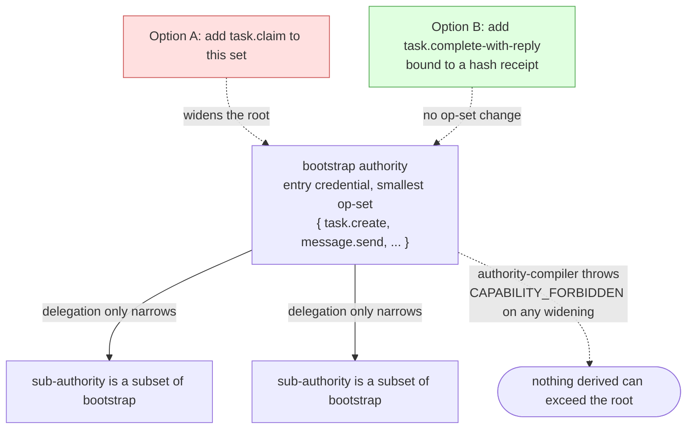

# ADR 0015 — Bootstrap paired-task completion via an evidence-bound reply, not authority widening

**Status:** Accepted 2026-07-21 (user, [issue #336](https://github.com/mblauberg/provenant/issues/336), Gap 3)

**Date:** 21 July 2026

## Context

A Fabric agent holding only the **bootstrap authority** — the entry credential,
minted at `fabric_bootstrap`, with the smallest operation set — cannot complete a
paired-task roundtrip using documented tools. `operations.ts` defines
`fabric.v1.task.claim`, but the bootstrap authority omits it and **delegation only
narrows** (any derived authority is a subset of its parent; `authority-compiler.ts`
throws `CAPABILITY_FORBIDDEN` on any widening). So paired tasks stay `ready` by
design, and both prior chaired runs (r1, r2) had to substitute an undocumented
"correlated response plus artifact-hash" convention to finish the roundtrip.

Two options close the gap:

- **Option A — grant `task.claim` to the bootstrap authority.** Simplest in code
  (one operation added to the allowed set), one uniform lifecycle. But it *widens
  the root*: because delegation only narrows, the bootstrap authority is the
  capability ceiling for the whole agent tree derived from it, so every
  bootstrap-scoped agent everywhere can now claim/seize tasks. It edits a
  compiler-enforced invariant, is a one-way door in practice, and adds no
  completion evidence.
- **Option B — document `task.complete-with-reply`, bound to a hash receipt.**
  Leaves the bootstrap operation set unchanged; the completion path is reachable
  with the authority the agent already holds and binds the reply to a content
  digest.

The 2026 research synthesis (`docs/research/agentic-sdlc-harness-2026.md`) frames
the trade: authority is trajectory evidence and costly-to-reverse widenings belong
in an ADR (§2, §6); persistent receipts and evidence digests are an explicit
*adopt* item (§1). It also notes this is a personal, single-user harness, which
lightens the threat model.

## Decision

Adopt **Option B**, kept thin. Formalize the correlated-response + hash-bound
artifact pattern that r1 and r2 already used into a single first-class
`task.complete-with-reply` completion path, bound to a typed correlated receipt,
reachable under the existing bootstrap authority. Do **not** add `task.claim` to
the bootstrap authority.

Scope guardrail (what keeps this well-engineered rather than over-engineered):
one completion codec plus its evidence contract plus a fixture. A broader task
lifecycle redesign, and any change to the narrowing-only delegation invariant,
are explicit non-goals.

## Consequences

- The narrowing-only delegation invariant stays intact and compiler-enforced;
  the bootstrap authority remains the minimal entry credential, so an agent's
  blast radius is still boundable by inspecting the root alone.
- Paired-task completion becomes **self-evidencing** — bound to a verifiable
  digest rather than an agent's assertion of "done." This is anti-hallucination
  by construction and independent of how much any agent is trusted, so the
  benefit holds even under the light personal-harness threat model.
- The path rides the existing substrate: `schema.ts` already registers many typed
  correlated-response / receipt codecs (`x-reviewCompletionCorrelated`,
  `x-topologyAppendReceiptCorrelated`, `x-reviewPortalResponseBound`, …), so this
  extends an established pattern rather than inventing a parallel lifecycle.
- Cost: bootstrap-scoped peers complete through a different path than
  claim-capable agents. The guardrail above bounds that bifurcation to a single
  documented codec.

## Alternatives considered

- **Option A (grant `task.claim`).** Rejected. It buys a uniform lifecycle by
  relaxing a compiler-enforced security boundary — a one-way widening of the
  least-privileged credential — and adds no completion evidence. If it were ever
  revisited, the normal completion path would still need to bind a receipt, or
  the change would combine wider authority with weaker evidence.
