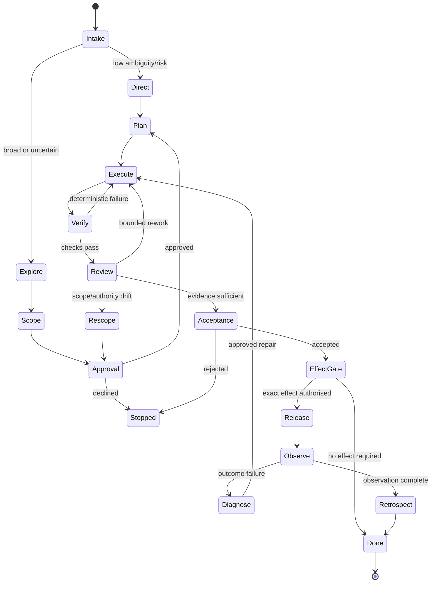
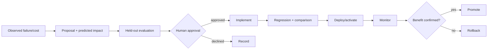

# Agentic SDLC operating model

## 1. Design objectives

The operating model should optimise:

- outcome quality per human attention-hour;
- safe autonomy after explicit scope/authority approval;
- visible agent topology and progress;
- provider-native depth without provider lock-in;
- deterministic evidence before judgement;
- recoverability and bounded continuation;
- minimal repeated instruction and context;
- direct cutover in pre-release systems unless compatibility is evidenced.

The human should be most involved in:

1. defining consequential outcomes and constraints;
2. approving scope, one-way doors and authority;
3. steering when important optional decisions arise;
4. accepting final results and authorising external effects.

The human should not be required to approve routine decomposition, every worktree creation, every agent replacement or every non-overlapping implementation wave when those actions are already covered by the approved envelope.

## 2. Lifecycle



The state machine is data. Skills and UIs render it; they do not redefine it.

## 3. Intake decision

Every request receives a lightweight `IntakeDecision`.

### Required fields

- desired outcome;
- known deliverables;
- ambiguity level and unresolved decisions;
- estimated risk/control overlays;
- authority currently present;
- expected lifecycle route;
- decomposability and coupling;
- candidate provider roles;
- required deterministic and judgement evidence;
- fresh-session expectation;
- human attention requests.

### Direct path

Use a direct path when:

- outcome and acceptance are clear;
- change is local and reversible;
- no one-way door/external effect is involved;
- work does not need parallel exploration;
- a strong oracle exists;
- current authority covers the exact action.

A direct path still records scope, authority and evidence in compact form.

### Scoping path

Use scoping when any of the following applies:

- multiple materially different designs;
- unclear acceptance criteria;
- architecture or data model changes;
- destructive migration;
- broad refactor;
- security/privacy impact;
- multi-repository coordination;
- weak test oracle;
- expensive or irreversible effect;
- substantial disagreement between evidence or models.

## 4. Broad scoping topology

For a wide task, the default topology should be:

```text
Chair (primary A)
├─ repository explorers by bounded area
├─ current-practice research workers
├─ alternative-architecture workers
├─ risk/security/operability worker
└─ challenge primary B
```

The challenge primary should receive enough evidence to critique the problem independently, but should not be given the chair's final conclusion before producing alternatives.

### Research return contract

Every research/explore worker returns:

- bounded question;
- sources/files examined;
- observations;
- uncertainty;
- options;
- recommended implication;
- what it did not inspect;
- no unrequested permanent edits.

### Decision packet

Instead of one question per message, send a decision packet:

| Decision | Recommendation | Alternatives | Consequence of default |
|---|---|---|---|
| persistence boundary | one SQLite modular monolith | services; provider-native only | retains transactions and limits complexity |
| compatibility | direct cutover | adapter/dual path | no known external consumers |
| write profile | offline worktree first | networked write | closes implementation gap safely |

Questions that are genuinely sequential remain separate. Non-dependent exploration continues while the user considers a packet.

## 5. Approval contract

Approval applies to a digest of:

- outcome/non-goals;
- accepted design/spec/ADR set;
- repositories;
- writable paths/worktree policy;
- allowed authority profiles;
- allowed providers/model intent bands;
- maximum risk controls;
- budgets and retry ceilings;
- external effects explicitly included or excluded;
- acceptance criteria;
- expiry.

A plan may change topology inside the envelope. Any change that broadens the digest returns to approval.

## 6. Execution plan

The chair produces an execution plan before implementation.

### Plan components

1. dependency DAG;
2. work packages;
3. agent roles and routes;
4. write ownership;
5. worktree/branch policy;
6. test/evidence plan;
7. review topology;
8. integration owner;
9. budget;
10. stop/replan conditions.

### Agent structure example

| Wave | Role | Provider intent | Effort | Task | Write scope | Completion |
|---|---|---|---|---|---|---|
| 0 | test/contract writer | other primary workhorse | high | characterise provider admission | tests only | failing fixture proves current gap |
| 1A | implementer | native primary flagship | high | authority compiler | new module + tests | profile compilation tests pass |
| 1B | adapter specialist | other primary flagship | high | Claude compiler target | Claude adapter files | conformance passes |
| 1C | adapter specialist | native primary flagship | high | Codex compiler target | Codex adapter files | conformance passes |
| 2 | integrator | chair flagship | high | wire handlers and receipts | integration scope | full deterministic suite |
| 3 | reviewers | fresh native + other primary | high | independent review | read-only | adjudicated findings |
| 4 | verifier | scout/workhorse | medium | clean checkout verification | none | receipt and evidence complete |

### Dynamic modification

The chair may:

- replace a failed worker;
- split a task;
- serialise a coupled wave;
- add a specialist;
- reduce optional review;
- rotate session;
- quarantine an ambiguous effect.

Every change records reason, authority compatibility and revised budget. It is visible to the human without blocking unless it changes approved scope or one-way doors.

## 7. Model and family policy

### Default pairing

For broad scoping and crucial architecture:

- one capable GPT or Claude model chairs;
- the other primary independently challenges and reviews;
- cheaper models handle bounded search, mechanical checks and summarisation;
- additional families are used when their expected information gain exceeds cost.

### Independence

Independence is not equivalent to a different model name. Track:

- distinct family/provider;
- separate context;
- no exposure to the author's conclusion before review;
- different review lens;
- no shared write authorship;
- sufficient evidence access.

### Effort

Route effort by uncertainty and consequence:

- low: deterministic lookup/mechanical transformation;
- medium: bounded implementation with clear tests;
- high: multi-file reasoning, debugging, review;
- xhigh/max/ultra: architecture, weak oracles, critical incident, adversarial review.

Do not use the highest effort merely because it exists. Record substitutions.

## 8. Implementation team patterns

### Pattern A — Serial expert

Use for tightly coupled changes or small local work.

```text
chair/implementer -> deterministic checks -> fresh reviewer
```

### Pattern B — Test writer and implementer

Use when a behaviour contract can be frozen independently.

```text
test writer -> implementer -> integrator -> reviewer
```

The test writer must not overfit to an implementation design unless the spec requires it.

### Pattern C — Parallel slices

Use for independent modules with stable contracts.

```text
contract owner
├─ slice A implementer
├─ slice B implementer
└─ slice C implementer
       -> one integration owner
```

### Pattern D — Competing prototypes

Use for architecture uncertainty.

```text
prototype A (artefact-only)
prototype B (artefact-only)
evaluation/adjudication
selected design -> implementation
```

### Pattern E — Incident cell

Use for urgent failures.

```text
incident chair
├─ containment worker
├─ reproduction worker
├─ telemetry/evidence worker
└─ reviewer/safety
```

Containment and root-cause tracks remain distinct.

## 9. Verification and review loop

### Deterministic order

1. targeted unit/contract tests;
2. type/static checks;
3. integration/acceptance tests;
4. migration/recovery checks;
5. security/supply-chain checks;
6. performance/load where relevant;
7. full clean-checkout gate;
8. provider smoke/human evaluation when explicitly authorised.

### Judgement order

1. author self-review;
2. fresh native reviewer;
3. other-primary load-bearing review according to policy;
4. specialist/bonus family where risk justifies it;
5. chair adjudication;
6. bounded repair;
7. human acceptance.

### Finding states

- confirmed-blocking;
- confirmed-nonblocking;
- investigate;
- disproved;
- accepted-risk;
- out-of-scope;
- duplicate.

“Investigate” prevents uncertain model output from being forced into pass/fail prematurely.

### Repair bounds

Use a default of two review repair cycles, but permit a lifecycle decision to:

- rescope;
- replace the implementation;
- escalate to a specialist;
- return to architecture;
- stop as blocked.

Do not mechanically repeat the same reviewer prompt.

## 10. Fresh-session and hand-off policy

Rotate by phase or context health.

### Mandatory rotation candidates

- broad scope approved and implementation will be substantial;
- chair hand-off to another provider;
- repository evidence exceeds the safe synthesis budget;
- multiple compactions have occurred;
- current context contains superseded design branches;
- incident moves from containment to permanent correction;
- run resumes after a long dormant period and environment changed.

### Handoff schema

```yaml
outcome:
non_goals: []
authority:
  approval_digest:
  expires_at:
decisions:
  accepted: []
  rejected: []
state:
  run_id:
  tasks: []
evidence:
  canonical_paths: []
  receipts: []
risks: []
open_decisions: []
next:
  action:
  verification:
provider_continuity:
  references: []
```

A fresh session verifies the digest and environment before acting.

## 11. Backlog controller

### Separation of concerns

- repository backlog files: human-readable intent and approval;
- Fabric database: live claims, attempts, revisions, locks and receipts;
- issue tracker: optional collaboration surface;
- work map: curated orientation, not queue truth.

### Claim algorithm

1. select `ready` items by priority/value/risk;
2. verify approval digest and freshness;
3. verify dependencies complete;
4. verify queue and project budgets;
5. reserve exact authority/worktree;
6. create intake and execution plan;
7. start scoped run;
8. update claim heartbeat;
9. release or quarantine on termination;
10. return scope changes to approval.

### Stop states

- done;
- retired;
- expired;
- blocked-external;
- paused-decision;
- paused-budget;
- failed-invariant;
- quarantined.

The queue never interprets silence as approval.

## 12. Documentation and visual decision support

Create a visual when it materially improves a human choice:

- architecture before/after;
- task DAG;
- data flow or trust boundary;
- migration/cutover;
- Console prototype;
- alternative UI layouts.

Default to Markdown + Mermaid because it is diffable and repository-native. Use a self-contained HTML prototype when interaction/layout is the decision. Do not generate presentation artefacts solely to demonstrate activity.

## 13. Self-improvement loop



A proposal records:

- editable component;
- observed evidence;
- causal hypothesis;
- predicted metric movement;
- test set;
- possible regressions;
- rollback;
- authority.

No model silently changes global skills, routing or authority policy.

## 14. Operational status shown to the user

At minimum:

- run and phase;
- current approved outcome/scope;
- agent topology;
- task DAG/status;
- model/family/effort;
- write scope/worktree;
- authority profile;
- budget/usage;
- heartbeat/freshness;
- checks and reviews;
- evidence links;
- soft decision requests;
- blockers/degradation;
- effect proposals;
- next expected transition.
