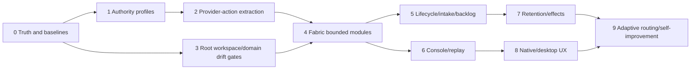

# Implementation roadmap

> **Re-sequenced 2026-07-13** (scoping session, `SCOPING-SESSION.md`): the
> adopted first tranche is codex-pair's 4-step staged path, not section 18's
> single package: (1) authority-contract reconciliation + adapter
> characterisation → (2) pure admission extraction into an `AuthorityCompiler`
> (behaviour unchanged) → (3) **one-provider** write pilot gated on an
> adversarial containment spike (worktree/sibling/symlink/network/settings)
> → (4) second provider, then structural extraction. Foundations (root
> workspace/build fix, truth drift) run in parallel from the consolidated
> project-fabric-console handoff; Lane B owns the active foundation repair.
> Tranche 0's "canonical manifest" item is **rejected**
> — replaced by per-domain owners + drift checks (decision register D-006).
> Tranche 5/7 intake-kernel and backlog-controller items are deferred until the
> write pilot proves out; backlog is schema-first, store-pluggable (markdown
> frontmatter or GitHub Issues per project convention). Retention: design and
> class-tagging now, delete machinery after tranche 1.

## 1. Sequencing principle

Order work by risk reduction and architectural leverage:

1. make current truth measurable;
2. close the read-only implementation gap;
3. create the modular application spine;
4. make lifecycle/backlog/retention executable;
5. improve operator experience;
6. enable governed self-improvement.

Use implementation tranches rather than one giant rewrite. Each tranche must be independently reviewable and leave the repository in a coherent state.

## 2. Tranche map



## 3. Tranche 0 — Truth and baselines

### Scope

- per-domain canonical owners and drift gates;
- generated skill catalogue/count;
- current spec conformance matrix;
- portable/local config split design;
- current-head CI/ruleset verification;
- security check implementation matrix;
- support matrix;
- baseline architecture metrics.

### Tests/evidence

- generated tree clean;
- per-domain projection/schema validation;
- README count generated;
- no tracked machine-local paths;
- CI/check metadata evidence;
- source-to-spec traceability.

### Exit

Product documentation no longer overstates current implementation or verification.

## 4. Tranche 1 — Authority profiles

### Scope

- profile schema/policy;
- `review-readonly` exact compatibility;
- `workspace-write-offline`;
- neutral authority compiler;
- provider compiler ports;
- receipt/projection fields.

### Tests

- profile subset properties;
- path/worktree escape;
- unsupported capability;
- no network;
- no external effect;
- exact native settings snapshot;
- stale authority/workspace generation.

### Exit

Fabric can safely admit a write-capable task without external-effect authority.

## 5. Tranche 2 — Provider-action vertical extraction

### Scope

- stores;
- handler;
- prepare/call/reconcile transaction pattern;
- budget reservation/settlement;
- adapter conformance;
- compatibility façade.

### Tests

- existing characterisation suite;
- crash points;
- duplicate/replay;
- ambiguous lookup;
- budget usage unknown;
- malformed provider response;
- cancellation/interruption;
- receipt/event equivalence.

### Exit

Provider-action behaviour no longer resides in the Fabric aggregate and current callers are unchanged.

## 6. Tranche 3 — Root workspace and generated registry

### Scope

- root package workspace/lock;
- project references;
- root scripts;
- manifest generators;
- provider metadata;
- CLI inventory;
- CI cache/build simplification.

### Exit

One clean root install/check builds all packages and generated artefacts cannot drift.

## 7. Tranche 4 — Fabric modularisation

### Waves

1. authority/budgets;
2. work/topology/leases;
3. assurance/gates/barriers;
4. coordination/handoffs;
5. identity/sessions;
6. lifecycle/recovery;
7. projections;
8. effects.

### Per-wave method

1. characterise;
2. define interface;
3. extract stores/handler;
4. delegate façade;
5. run fault/property/load tests;
6. independent review;
7. delete old path;
8. update architecture/ADR.

### Exit

The composition root is small; bounded contexts and dependencies are enforced.

## 8. Tranche 5 — Executable operating model

### Scope

- intake decision;
- lifecycle decision engine;
- execution plan;
- preliminary topology presentation;
- risk-derived review;
- fresh-session/handoff;
- skill policy deduplication.

### Exit

Every run has one machine-readable route and the same state/gates appear in docs, CLI and Console.

## 9. Tranche 6 — Console and replay

### Scope

- renderer decomposition;
- topology/attention/task/evidence views;
- event replay;
- protocol-only core;
- exports;
- human usability evaluation.

### Exit

An operator can understand and steer a multi-provider run without inspecting raw logs or panes.

## 10. Tranche 7 — Backlog, retention and staged effects

### Scope

- backlog schema/controller;
- approval digest/expiry;
- automatic pause/terminal states;
- retention classes/apply;
- legal hold;
- generic effect proposal/executor;
- migrate typed Git to common effect pattern.

### Exit

Approved work can progress autonomously within ceilings, clean itself safely and cannot perform an unapproved external mutation.

## 11. Tranche 8 — Provider-native and desktop experience

### Scope

- native session names/goals/task labels;
- parent/child topology;
- status summaries;
- desktop/headless adapter;
- Herdr remains optional.

### Exit

The same run is intelligible in Console, native provider UIs and desktop/headless clients.

## 12. Tranche 9 — Adaptive routing and self-improvement

### Scope

- utility scoring;
- capability freshness;
- route outcome calibration;
- team-template evaluation;
- reviewer yield;
- proposal-first harness evolution;
- held-out regression and rollback.

### Exit

Routing and harness changes improve from evidence without silent self-modification.

## 13. Suggested pull-request grouping

Use reviewable vertical PRs, not one mega-PR.

### Early

1. per-domain truth owners and drift gates;
2. config split;
3. authority profile contract/tests;
4. Codex compilation;
5. Claude compilation;
6. provider-action handler extraction.

### Structural

One PR per bounded context or tightly coupled pair. Each includes deletion of the old path.

### Product

Separate Console, installer, backlog, retention and effect PRs.

Open draft PRs only when the slice has a stable contract and later work is unlikely to invalidate its basis. Do not create parallel PRs with overlapping Fabric internals.

## 14. Worktree topology

For a structural tranche:

```text
primary checkout: integration/chair, read-mostly
.worktrees/
  contract-tests
  authority-compiler
  codex-adapter
  claude-adapter
  reviewer-artifacts (detached/read-only if possible)
```

One integration owner applies or merges changes after slice review. Worktree creation/removal uses Fabric-minted capabilities within the approved plan.

## 15. Migration rules

- no compatibility layer without consumer evidence;
- no dual database baseline;
- no old/new policy engine in production simultaneously;
- temporary façade must have deletion issue/test;
- each extraction preserves receipts/state transition semantics;
- provider-native setting changes require conformance;
- no external-effect expansion during the first write-profile tranche.

## 16. Metrics

Track:

### Quality

- deterministic pass;
- escaped defect;
- review yield;
- false blocking;
- recovery success;
- ambiguous effect rate.

### Maintainability

- changed files per operation;
- module fan-in/fan-out;
- cycle count;
- largest application module;
- test setup breadth;
- public API size;
- spec duplication.

### Operator

- time to identify chair/blocker/write scope;
- attention items resolved;
- stale action detection;
- replay task success.

### Economics

- model cost/tokens;
- wall time;
- human intervention count;
- agent retries;
- optional reviewer marginal yield.

Avoid turning line count into the objective. Use it as one indicator of concentration.

## 17. Go/no-go gates

### Before workspace-write release

- path/worktree isolation tests;
- network-off proof;
- secret/effect credential absence;
- provider conformance;
- recovery/ambiguity tests;
- threat model;
- independent security review;
- human acceptance.

### Before autonomous backlog

- approval digest;
- dependency and budget enforcement;
- terminal/pause states;
- retention apply;
- no external effects by default;
- incident/recovery runbook;
- operator attention view.

### Before public stable release

- all active specs conformant;
- supported OS CI;
- installer/update/rollback;
- current-head required checks;
- live primary-provider acceptance;
- human Console usability gate;
- SBOM/provenance;
- migration and compatibility policy;
- documentation and security review.

## 18. First approved implementation recommendation

Create one scoped project:

**Title:** Capability-compiled provider execution and provider-action extraction

**Non-goals:** network access, release/deploy, optional provider redesign, Console redesign, distributed services.

**Acceptance:**

- current read-only behaviour retained as a named profile;
- offline workspace-write profile works on exact worktree for Codex and Claude;
- profile cannot be broadened by provider payload;
- provider action logic extracted behind a handler/unit-of-work pattern;
- receipts contain effective profile;
- all deterministic and recovery tests pass;
- fresh native and other-primary review complete;
- no compatibility path retained.
