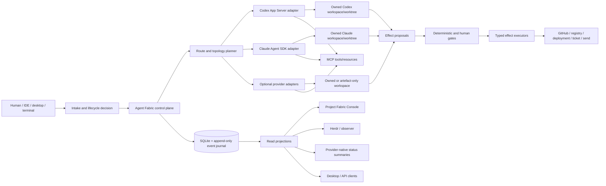
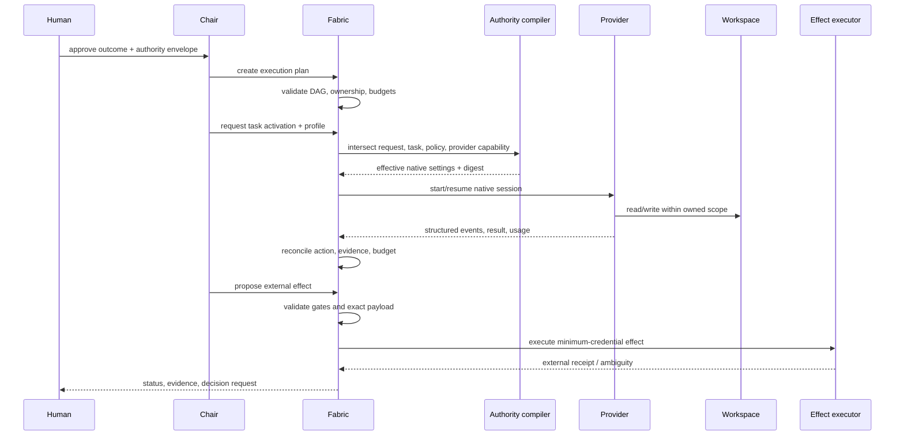

# Target architecture

## 1. Architectural thesis

The harness should be a local-first, capability-compiled modular monolith. It should provide one authoritative control and evidence plane while using each provider's native runtime for model-session mechanics.

The architecture must distinguish five planes:

1. **Control plane** — authority, lifecycle, work state, routing, budgets and reconciliation.
2. **Execution plane** — Codex, Claude Code and optional workers in isolated workspaces.
3. **Effect plane** — exact, gated external mutations with minimum credentials.
4. **Evidence plane** — events, receipts, artefacts, reviews and immutable projections.
5. **Presentation plane** — Console, Herdr, native TUIs, desktop clients and exports.

## 2. Context diagram



## 3. Command flow



## 4. Internal Fabric modules

```text
packages/fabric/src/
  runtime/
    fabric-runtime.ts          # composition root only
    unit-of-work.ts
    command-dispatcher.ts
    event-publisher.ts
  identity/
    commands/
    policies/
    stores/
  authority/
    authority-compiler.ts
    capability-profile.ts
    budget-policy.ts
    stores/
  work/
    task-service.ts
    topology-service.ts
    ownership-policy.ts
    lease-service.ts
    stores/
  providers/
    provider-action-service.ts
    provider-session-service.ts
    reconciliation-service.ts
    ports.ts
    stores/
  coordination/
    mailbox-service.ts
    barrier-service.ts
    stores/
  assurance/
    evidence-service.ts
    gate-service.ts
    review-service.ts
    receipt-service.ts
    stores/
  effects/
    effect-proposal-service.ts
    git-effect-executor.ts
    external-effect-ports.ts
    stores/
  lifecycle/
    lifecycle-engine.ts
    recovery-service.ts
    retention-service.ts
  projections/
    project-view.ts
    run-view.ts
    attention-view.ts
    event-replay.ts
```

### Rules

- Domain modules may depend on shared value types and ports, not on the Console, CLI or provider SDK packages.
- Provider adapters may depend on the protocol and provider SDK, not on Fabric stores.
- Command handlers own transaction boundaries through `UnitOfWork`.
- Stores expose use-case-shaped methods, not a generic CRUD interface.
- Cross-module transitions occur through application commands and events.
- Projection rebuild must be possible from canonical tables/events or a verified snapshot.
- External effects are not performed inside arbitrary command handlers.
- The compatibility façade delegates to handlers and is deleted when internal callers migrate.

## 5. Authority compilation

### Neutral request

```ts
type CapabilityRequest = {
  profileId: "review-readonly" | "workspace-write-offline" |
             "workspace-write-network-allowlist" | "browser-test";
  taskId: string;
  providerId: string;
  workspaceId: string;
  requestedTools?: readonly string[];
};
```

### Effective decision

```ts
type CapabilityDecision = {
  requestedProfileId: string;
  effectiveProfileId: string;
  policyVersion: string;
  authorityDigest: string;
  workspaceDigest: string;
  providerCapabilityDigest: string;
  nativeSettingsDigest: string;
  degraded: readonly {
    capability: string;
    reason: string;
    consequence: "block" | "continue-narrower";
  }[];
};
```

### Compilation rule

```text
effective =
  requested profile
  ∩ human authority
  ∩ task ownership
  ∩ workspace ownership
  ∩ risk controls
  ∩ provider capabilities
  ∩ local trust posture
  ∩ resource budget
```

No provider payload may broaden `effective`.

## 6. Workspace model

A worktree is a collaboration isolation mechanism, not a security sandbox.

Each write-capable task receives:

- one canonical repository;
- one exact worktree root;
- one owner generation;
- one path allowlist/denylist;
- one profile;
- one branch/detached policy;
- one cleanup/retention policy.

Parallelism rules:

- same source surface: serial ownership;
- independent packages/files: separate worktrees or exact non-overlap;
- read-only reviewers: may share a source snapshot;
- generated integration: one designated integrator owns the consolidation worktree;
- branch creation/push/merge remain separate effects unless the approved envelope names them.

## 7. Event and projection model

Use durable events for observability and replay, but do not force full event sourcing for all business state.

Event envelope:

```json
{
  "schemaVersion": 1,
  "eventId": "evt_...",
  "sequence": 1234,
  "occurredAt": "2026-07-13T00:00:00Z",
  "runId": "run_...",
  "taskId": "task_...",
  "agentId": "agent_...",
  "type": "provider.action.completed",
  "subjectRevision": 7,
  "authorityDigest": "sha256:...",
  "payload": {},
  "redaction": {"class": "operational"}
}
```

Projections:

- current run health;
- topology/agent tree;
- task DAG and ownership;
- provider session state;
- budgets and rate limits;
- gates/attention;
- evidence and review;
- external effects;
- degradation/recovery;
- retention candidates.

Projection freshness and source revision are first-class.

## 8. Adapter architecture

Each provider adapter should implement six separate concerns:

1. session lifecycle;
2. authority-profile compilation target;
3. native event normalisation;
4. Fabric tool/receipt bridge;
5. identity and continuity attestation;
6. capability discovery and conformance.

The adapter contract must not hard-code a single execution posture. Read-only remains one profile.

### Codex

Use App Server thread/turn/fork/resume APIs and native permissions profiles. Preserve native subagent lineage and thread names. Fabric identifiers should be attached through supported metadata, goals, names or concise injected context—not terminal decoration.

### Claude

Use the Agent SDK/Claude Code native permission and subagent surfaces. Generate provider settings/hooks from the same policy. Use Claude worktree isolation where it provides value, but reconcile it with the harness's canonical worktree ownership rather than creating a second invisible pool.

## 9. Effect plane

An effect is a typed state transition outside the owned workspace.

Examples:

- create/update/push branch;
- open/update/merge pull request;
- publish package;
- deploy;
- mutate issue/ticket;
- send message/email;
- upload artefact;
- change infrastructure.

Effect proposal fields:

- exact target;
- exact operation;
- payload digest;
- preconditions and expected revision;
- minimum credentials;
- required gates;
- reversibility/rollback;
- idempotency key;
- lookup/reconciliation recipe;
- expiry.

The executor accepts only registered operations. It does not accept arbitrary commands, URLs, environment variables or shell vectors.

## 10. Security modes

| Mode | Assumption | Required controls |
|---|---|---|
| Cooperative local | agents follow policy | native sandbox, path ownership, exact effects, receipts |
| Adversarial input | prompt/tool content may manipulate model | network allowlist, tool filtering, staged effects, content sanitisation, secret minimisation |
| Adversarial process | agent may execute arbitrary code | container/VM or separate identity, kernel-enforced filesystem/network boundaries, isolated credentials |
| Hosted/multi-tenant | operator and workloads are separate tenants | authenticated remote control plane, tenancy isolation, audited key management; out of current scope |

The product should explicitly claim only the modes it implements.

## 11. Why this architecture is maintainable

- It preserves a small number of stable concepts.
- It avoids a second scheduler or generic workflow language.
- It keeps transactions local.
- It lets provider SDKs evolve behind adapters.
- It permits Console, desktop and native TUI presentation without changing authority.
- It makes work and evidence replayable.
- It separates writable code work from privileged external effects.
- It allows gradual extraction with characterisation tests.
