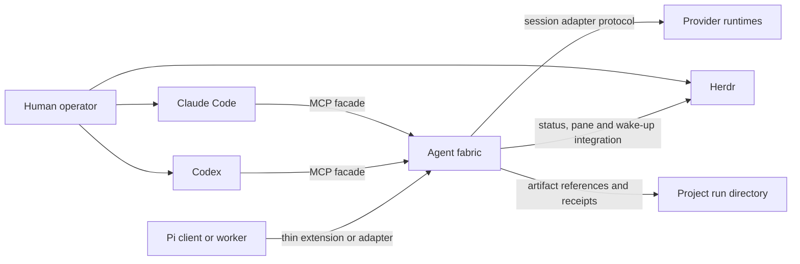

# Shared agent fabric

Status: Project-session and operator extension approved; implementation in progress; final human acceptance pending
Version: 0.4
Date: 11 July 2026
Chair for this design stage: Codex
Decision owner: This specification; no separate ADR is maintained
Human approval: Accepted by direct instruction on 10 July 2026
Approval effect: The same instruction authorised implementation of Stages 1–5

## 1. Decision requested

Implement the accepted local, harness-neutral agent fabric that Claude Code, Codex and future
clients can use through a shared protocol. The fabric provides durable two-way
messages, task and team ownership, provider session control, bounded hierarchy,
and optional Herdr visibility.

The human instruction on 10 July 2026 accepted this specification and named all
five implementation stages. It authorises local source, tests, compatibility
data and documentation. It does not authorise daemon installation or startup,
provider login, MCP registration, external messaging, deployment, release,
provider-session deletion, or Git staging and commits. Those actions retain
their separate gates.

## 2. Problem

The harness already defines Claude Code and Codex as equal primaries, one
session chair, one stage owner and one writer for a shared source surface. Its
paired-primary mode exchanges immutable artifacts and uses Herdr for observable
steering. These contracts prevent competing bosses, but the runtime is still
turn-based:

- pane sends are best-effort wake-ups rather than acknowledged messages;
- there is no shared mailbox or replay cursor;
- no registry binds a fabric identity to Claude, Codex or Pi session IDs;
- team hierarchy, inherited budgets and delegation narrowing are prose rules;
- each provider needs bespoke dispatch glue;
- interactive sessions are observable but cannot accept reliable external
  structured push messages.

The proposed fabric makes those contracts executable while preserving the
existing source of truth and the option to watch paired agents side-by-side.

## 3. Goals

- Give Claude Code and Codex the same chair and participant interface.
- Let either primary chair without making the other primary's private plugin or
  session store authoritative.
- Support persistent paired collaboration with durable request, response and
  acknowledgement semantics.
- Support headless, observed, interactive and hybrid execution profiles.
- Model a single chair, bounded leader teams and workers without creating
  multiple authorities.
- Permit direct agent-to-agent communication without treating messages as
  permission grants.
- Keep model and effort routing in `config/model-routing.json`.
- Add providers through capability-advertising adapters, not provider-specific
  skills.
- Preserve project-owned artifacts and curated project documentation.
- Recover safely from daemon, adapter, worker and chair interruption.
- Make operational cost, context pressure, failures and human intervention
  visible in receipts.

## 4. Non-goals

- A distributed or remote multi-user control plane.
- Global peer-to-peer broadcast or consensus-based ownership.
- Guaranteed structured push into an unmanaged interactive TUI.
- Replacement of Claude Code, Codex, Herdr or provider-native subagents.
- A new model catalogue separate from `config/model-routing.json`.
- Physical filesystem isolation. Coordination leases complement, but do not
  replace, runtime sandboxes and operating-system controls.
- Automatic public release, deployment, provider login or subscription use.
- Unlimited recursive teams in the first release.
- Durable storage of complete chat transcripts as project truth.

## 5. Stakeholders and concerns

| Stakeholder | Concern | Design response |
|---|---|---|
| Human operator | Side-by-side visibility and the ability to intervene | Herdr observed and interactive profiles; intervention receipts |
| Session chair | One interface for assignment, messages, gates and synthesis | Symmetric MCP facade and fenced chair lease |
| Stage or task owner | Clear authority, dependencies and completion barrier | Task graph, authority envelope and task-owner lease |
| Peer or reviewer | Independent access to evidence without write overlap | Read-only authority, artifact references and authorship records |
| Team leader | Bounded ability to delegate and supervise | Narrowing validation, budget reservation and depth limits |
| Worker agent | Stable assignment, mailbox and lifecycle contract | Provider-neutral adapter protocol and resumable identity |
| Maintainer | Replaceable providers and testable upgrades | Adapter capability handshake and contract tests |
| Project owner | Project knowledge remains portable | Project run directories remain authoritative |

### 5.1 Release and conformance boundary

This specification describes the Stage 5 target state. Stages 1 and 2 are
internal foundation milestones. The first operational release ends at Stage 3
and supports one chair, one paired primary, direct chair-owned workers, shared
MCP messaging, and headless, observed and interactive profiles. Provider
expansion is Stage 4. Leader-managed teams, inherited budgets and recursive
records are Stage 5 and remain disabled before that stage.

Each requirement and acceptance scenario names its introduction stage. A stage
passes only the requirements introduced at or before it. The implementation
plan shall contain a requirements traceability matrix covering tests and
stages; an unmapped
requirement blocks acceptance of that stage.

## 6. Risk and authority profile

Risk tier: **crucial**. The design affects a shared harness, credentials-adjacent
provider processes, write authority and stateful runtime data.

The following envelope records the completed design pass. The active delivery
authority is recorded in the canonical `.agent-run/AFAB-001/RUN.json`
`delivery-run` receipt.

```yaml
authority:
  approver: human-maintainer
  expires_at: design-approval-or-rejection
  allowed_source_paths:
    - docs/specs/
  allowed_artifact_paths:
    - /tmp/fable-agent-fabric-design.md
    - /tmp/agent-fabric-review-*.md
  prohibited_actions:
    - implement-runtime-code
    - register-mcp-server
    - modify-provider-authentication
    - start-or-install-daemon
    - delete-or-compact-provider-sessions
    - change-model-routing
    - commit-or-release
  disclosure:
    external_provider_source: local-harness-docs-only
    secrets: prohibited
```

## 7. System context



> The fabric owns coordination state. The project owns durable work products.
> Herdr owns visibility, not authority or message truth.

## 8. Runtime containers

```text
Claude or Codex MCP process
  -> lightweight stdio proxy
  -> private local Unix socket
  -> one shared agent-fabric daemon
       -> SQLite/WAL coordination store
       -> append-only event and receipt exporter
       -> provider adapter supervisors
       -> Herdr integration
       -> project artifact resolver
```

### 8.1 Source layout

```text
~/.agents/
  runtime/agent-fabric/
    package.json
    src/core/
    src/adapters/
    src/transports/
    schemas/
    migrations/
    tests/
  config/agent-fabric.yaml
  config/model-routing.json
  scripts/agent-fabric
  scripts/agent-fabric-mcp
```

### 8.2 Runtime layout

```text
~/.local/state/agent-harness/fabric/fabric-v1.sqlite3
~/.local/state/agent-harness/fabric/exports/<run-id>/
$XDG_RUNTIME_DIR/agent-harness/fabric-v1.sock
<project>/.agent-run/<run-id>/
```

When `XDG_RUNTIME_DIR` is absent, macOS uses a fabric-owned `0700` directory
under `$TMPDIR`. The socket is `0600`. No network listener is enabled by
default.

### 8.3 Configuration precedence

Configuration is validated before use. Unknown keys are errors. Project
configuration is untrusted: it may select only globally allow-listed values and
may narrow policy, never choose executable code, credentials or listeners.

```yaml
configuration_contract:
  schema_version: 1
  unknown_keys: error
  trusted_layers:
    - ${AGENTS_HOME}/config/agent-fabric.yaml
    - ${XDG_CONFIG_HOME}/agent-fabric/local.yaml
  untrusted_project_layer: <project>/.agents/agent-fabric.yaml
  run_layer: validated-run-authority-envelope
  merge_rules:
    authority_sets: intersection
    numeric_limits: minimum
    expiries: earliest
    deny_flags: false-dominates
    named_profile_selection: later-layer-within-trusted-allow-list
  trusted_only_fields:
    - adapter-command
    - adapter-package-or-plugin-path
    - executable-path
    - environment-source
    - listener-or-socket-location
    - provider-credential-selector
  project_permitted_fields:
    - named-execution-profile
    - allow-listed-adapter-id
    - role-routing-within-global-policy
    - narrowed-workspace-roots
    - narrowed-resource-limits
secrets:
  sources:
    - environment
    - operating-system-keychain
  permitted_in_yaml: false
routing:
  source: ~/.agents/config/model-routing.json
```

## 9. Execution control, visibility and inbox delivery

Execution control, operator visibility and inbox delivery are independent
dimensions. A named profile resolves all three and is accepted only when the
selected adapter advertises the required capabilities.

```yaml
profile_dimensions:
  control_mode:
    - managed
    - shared-session-ui
    - attached-interactive
  visibility_mode:
    - none
    - event-mirror
    - provider-tui
  inbox_delivery_mode:
    - structured-push
    - verified-boundary-inject
    - cooperative-pull
    - notify-only
```

Authority, task, mailbox and evidence semantics do not change with the profile.
Control strength, delivery latency and direct-input provenance are explicit in
the run receipt.

### 9.1 Headless managed sessions

Provider sessions run through SDK, app-server, RPC or ACP adapters without a
dedicated Herdr pane. They require `managed` control and normally use
`structured-push`. This is the lowest-overhead profile for mechanical workers
and large fan-out.

### 9.2 Observed managed sessions

The provider session remains owned by its adapter. Herdr starts a read-only
`agent-fabric observe` renderer in a pane. The renderer follows the fabric's
redacted activity-event cursor and displays bounded status, tool and output
events. It cannot send provider turns, acknowledge mailbox messages, acquire
leases or mutate task state.

Closing the pane stops only the renderer. Reopening it resumes from the last
display cursor or a bounded current snapshot; it never creates another provider
session. A provider-native shared-session UI may replace the renderer only when
the adapter contract-tests that capability.

The renderer consumes redacted event-envelope version 1, persists only its
display cursor, and exits non-zero on schema or authentication failure. Its CLI
supports `observe --run <id> [--agent <id>] [--after <cursor>] [--json]`.
Renderer reads never claim or acknowledge mailbox deliveries.

Observed managed sessions are recommended for the non-chair primary when direct
typing into it is not required. The chair remains the human-driven session and
is never replaced by a fabric-owned observer.

### 9.3 Attached interactive sessions

A provider TUI runs in a terminal the operator controls: either the terminal
where the human started it or a Herdr pane opened for it. A running TUI cannot
be re-parented into Herdr. A chair outside Herdr remains interactive but has no
pane telemetry. Its delivery mode is declared by the adapter:

- `verified-boundary-inject` requires an integration that returns the delivered
  message IDs to the fabric;
- `cooperative-pull` requires the agent to call `fabric_message_receive` and
  `fabric_message_ack` at instructed turn boundaries;
- `notify-only` surfaces unread state but cannot satisfy a bounded automatic
  response requirement.

An idle interactive session has no bounded delivery time. The fabric retries
wake-ups with backoff and escalates a still-unacknowledged `requires_ack`
message to the operator after the configured deadline.

A safe turn boundary is a versioned adapter event emitted after the provider
reports no active tool or model turn and before the adapter accepts another
turn. Cooperative clients pull the mailbox only at this boundary or on an
explicit operator request. Absence of this event keeps delivery pending.

A message is consumed only when the fabric receives an authenticated consume or
acknowledgement operation for its ID. Hook invocation, pane focus, terminal
input and prompt submission are not consumption evidence. Terminal input is a
wake-up capability, never a structured `send_turn`.

Direct operator input may change the active turn outside the task plan. Fabric
tools provide an explicit `operator_intervention` operation. When an integration
reports an external revision or the operator records an intervention, the task
owner reconciles it before barrier closure. If direct-input provenance is
unavailable, the receipt records that limitation and interactive task closure
requires explicit owner confirmation.

### 9.4 Profile changes

A profile change that cannot preserve the provider session is a lifecycle
rotation: checkpoint, stop delivery, close the adapter-turn lease, attach or
spawn the replacement, rehydrate it from the checkpoint, then acknowledge the
new generation. Only a contract-tested `shared-session-ui` adapter may add or
remove a view without rotation.

### 9.5 Hybrid profiles

Roles may use different profiles. The default side-by-side profile is:

```yaml
execution_profile:
  name: paired-visible
  default:
    control_mode: managed
    visibility_mode: none
    inbox_delivery_mode: structured-push
  roles:
    chair:
      control_mode: attached-interactive
      visibility_mode: provider-tui
      inbox_delivery_mode: cooperative-pull
    paired-primary:
      control_mode: attached-interactive
      visibility_mode: provider-tui
      inbox_delivery_mode: cooperative-pull
    leader:
      control_mode: managed
      visibility_mode: event-mirror
      inbox_delivery_mode: structured-push
    worker:
      control_mode: managed
      visibility_mode: none
      inbox_delivery_mode: structured-push
  herdr:
    layout: side-by-side
    retain_panes_after_completion: prompt
```

`paired-visible` places both primaries side-by-side only when the chair was
launched or attached under Herdr. Otherwise it shows the peer beside an unpaned
chair and records `visibility-degraded` for chair pane telemetry only.

The `paired-observed` profile keeps the chair interactive and runs the non-chair
primary with managed control, event-mirror visibility and structured push. It
provides stronger control over the peer while preserving the human-driven
chair.

## 10. Authority and team topology

The system combines four structures:

```text
authority:       one rooted supervisor tree
work:            one task dependency graph
communication:   durable addressable mailboxes
evidence:        immutable project artifacts by path and hash
```

Stage 5 supports one chair, up to four leaders and up to five workers per
leader. The schema is recursive, but Stage 5 policy limits the depth to two
levels below the chair.

Each agent has one authority parent per run. It may belong to multiple bounded
discussion groups. Leaders own disjoint task subgraphs. A leader council is
advisory; every task, stage and decision has one named owner.

Native subagents are either:

- **opaque children**, managed by the provider-native parent and counted
  against its budget; or
- **registered children**, given fabric identity because they need direct
  task ownership, cross-team messages or durable reassignment.

An agent cannot be managed simultaneously as both an opaque native child and a
registered fabric child.

## 11. Core records

```yaml
agent:
  agent_id: run-local-stable-id
  provider_session_ref: adapter-owned-resume-reference
  parent_agent_id: sole-authority-parent
  team_id: primary-team
  role: chair-or-leader-or-worker-or-reviewer
  authority_ref: immutable-envelope-hash
  budget_ref: inherited-budget-reservation
  control_mode: managed-or-shared-session-ui-or-attached-interactive
  visibility_mode: none-or-event-mirror-or-provider-tui
  inbox_delivery_mode: structured-push-or-verified-boundary-inject-or-cooperative-pull-or-notify-only
  pane_ref: optional-herdr-pane-id
  observer_ref: optional-renderer-id
  lifecycle: starting-or-ready-or-busy-or-checkpointing-or-idle-or-suspended-or-archived
```

```yaml
task:
  task_id: stable-id
  parent_task_id: optional
  dependencies: []
  owner_agent_id: exactly-one
  authority_ref: immutable-envelope-hash
  budget_ref: reservation
  base_revision: project-revision-or-artifact-generation
  expected_artifacts: []
  objective_checks: []
  human_gates: []
  state: proposed-or-ready-or-active-or-blocked-or-complete-or-cancelled-or-degraded
```

```yaml
budget:
  schema_version: 1
  budget_id: stable-id
  parent_budget_id: optional
  currency: provider-billing-currency-or-none
  hard_limits:
    provider_cost_microunits: integer-or-none
    input_tokens: integer-or-none
    output_tokens: integer-or-none
    provider_calls: integer-or-none
    concurrent_turns: integer-or-none
    descendants: integer-or-none
    message_bytes: integer-or-none
    artifact_bytes: integer-or-none
    wall_clock_milliseconds: integer-or-none
  advisory_limits: same-dimensions-as-hard-limits
  reserved: same-dimensions-as-hard-limits
  consumed: same-dimensions-as-hard-limits
  unknown_usage_policy: freeze-hard-dimension-or-advisory-estimate
```

All quantities are non-negative integers; money uses provider-currency
microunits. A child reservation atomically debits the parent's available
balance. Consumption draws from the reservation. Idempotent release returns
only unused reserved units and cannot raise the parent above its original
grant. Usage unknown for a hard dimension freezes further reservations on that
dimension until reconciled. Unknown advisory usage may continue only with an
estimate and a degraded receipt. Limits in different currencies or provider
token units are not silently combined.

```yaml
message:
  message_id: uuid-v7
  run_id: stable-id
  sender_id: server-derived-agent-id
  audience_selector: agent-or-team-or-task
  kind: request-or-response-or-event-or-steer-or-cancel-or-escalate-or-ack
  conversation_id: bounded-exchange
  reply_to: optional-message-id
  task_id: owning-task
  task_revision: compare-and-set-revision
  inline_body: maximum-4096-bytes
  artifact_refs: []
  requested_action: explicit-or-none
  requires_ack: true-or-false
  dedupe_key: sender-scoped-retry-identity
  expires_at: optional
  hop_count: bounded
```

`agent` is the only stored mailbox recipient. Sending to a team or task
atomically snapshots its authorised membership and creates one immutable
delivery row per recipient. Each delivery records message ID, recipient agent,
mailbox sequence, state, attempt count, claim deadline and acknowledgement
time. Delivery state is `ready`, `claimed`, `acknowledged`, `abandoned` or
`expired`; `delivery-pending` is the derived status for a required delivery that
has not reached a terminal state by its response deadline. Sequence numbers are
monotonic per run and recipient.

Receive claims a delivery for a bounded visibility timeout. A crash before
acknowledgement returns it to ready. Acknowledgement is per delivery and means
that the named agent durably consumed it. A contiguous watermark advances only
past deliveries that are acknowledged, abandoned with a reason, or expired by
policy. Out-of-order acknowledgements do not skip gaps.

`dedupe_key` is unique per run and authenticated sender. It maps to one
immutable audience expansion and payload hash. Reuse with a changed payload or
audience is a conflict. Delivery is at least once; consumers are idempotent.

Task claim, delegation, write-scope transfer, task completion and barrier close
are single SQLite transactions. All predicates are rechecked inside the write
transaction. Budget reservations debit the parent's available ledger balance;
idempotent release cannot increase it above the original grant. Every
transition has a stable command ID and returns the committed result on retry.

## 12. Leases, delegation and barriers

The daemon issues fenced, generation-bearing leases:

- one chair lease per run;
- one owner lease per active task;
- one write-scope lease per canonical path set;
- one adapter-turn lease per fabric-managed provider session. Attached
  interactive sessions have registry and mailbox identity but no fabricated
  external turn control.

Every mutation supplies the expected lease generation. Stale generations fail
closed. Child authority must be a strict or equal subset of its parent for
paths, actions, disclosure, expiry and budget.

Lease expiry or generation change fences fabric mutations only. Before granting
an overlapping successor write-scope or adapter-turn lease, the daemon proves
one of:

1. the predecessor process or turn is terminal and its write capability has
   been revoked;
2. an operating-system sandbox prevents it reaching the successor's scope; or
3. it could produce only immutable patch artifacts and the sole serial applier
   rejects its old generation.

If none is provable, the scope is `quarantined` and no successor writer starts.
Unmanaged interactive or full-access sessions are patch-only unless their
liveness and revocation mechanism is enforced. Lease generation and action ID
are propagated to adapter commands and serial-apply operations.

A subtree leader may close a subtree barrier. Only the chair closes a stage or
run barrier. Closure requires:

- required descendants are terminal, cancelled or explicitly degraded;
- no unresolved provider turn or active write lease remains;
- artifacts and hashes are recorded;
- required checks pass;
- required messages are acknowledged or abandoned with a reason;
- the checkpoint records mailbox cursors and provider resume references;
- human gates are resolved;
- the next owner acknowledges the exact generation and revision.

For the final run barrier, the human acceptance gate takes the place of
next-owner acknowledgement.

Direct filesystem access cannot be perfectly fenced by the daemon. Shared
source retains the serial-applier rule unless write scopes are provably
disjoint and predecessor revocation is enforced.

## 13. Provider adapter contract

Each adapter runs behind a versioned process boundary in the first release.
Adapter failure must not crash the core.

```yaml
adapter_operations:
  registration_required:
    - capabilities
    - status
    - release
    - lookup_action
    - cancel_action
  managed_session_required:
    - spawn
    - send_turn
    - interrupt
    - resume_reference
    - dispatch
  attached_interactive_required:
    - attach
    - status
    - wakeup
    - resume_reference
  optional:
    - steer
    - follow_up
    - compact
    - fork
    - native_subagents
    - enforced_read_only
    - usage_and_cost
    - shared_session_ui
    - verified_boundary_inject
    - compact_in_place
```

Every side-effecting adapter command uses a fabric-generated `action_id`, lease
generation and immutable payload hash. The adapter durably records
`prepared`, `dispatched`, `accepted`, `terminal` or `ambiguous`. The core calls
`lookup_action` after ambiguity and never automatically replays a side-effecting
command unless downstream idempotency for that action ID is proven. Otherwise
the task is quarantined for explicit recovery. The action record commits before
dispatch; its terminal result commits before message acknowledgement.

`lookup_action` applies to every adapter operation with external effects,
including provider-mutating release or wake-up implementations. An adapter may
declare an operation core-only and idempotent only when it does not mutate the
provider session or external state; that declaration is contract-tested.

The scheduler does not assign a role whose control, delivery or recovery
requirements exceed the session's advertised capabilities.

`steer` and `follow_up` execute under the active turn lease held by the turn
initiator; they do not acquire a second generation. Only a new `send_turn`
acquires a new adapter-turn lease. Interactive targets return
`capability_unavailable` for turn-control operations and use mailbox plus
wake-up instead.

Planned adapters:

| Adapter | Intended role | Notes |
|---|---|---|
| Claude Agent SDK | Claude primary, leader or worker | Persistent headless sessions; interactive TUI remains a separate profile |
| Codex app-server | Codex primary, leader or worker | Thread and turn lifecycle; contract-test generated protocol schemas |
| Pi SDK or RPC | Generic API and open-provider workers | Model-neutral worker runtime; not the authority store |
| Agy | Gemini or Antigravity access | Adapter only; no separate provider skill |
| Cursor | Composer and Grok only | Model allow-list remains routing policy |
| Kiro or ACP | Open-model runtime | Capability-discovered, optional and non-blocking |
| Herdr | Pane placement, observation and wake-ups | Never authoritative transport |

Unsupported optional capabilities return a typed `capability_unavailable`
result. The router may choose a compatible substitute only when the existing
model-routing policy permits substitution and records it.

## 14. MCP and client interface

Claude Code and Codex launch separate stdio MCP proxy processes. Each proxy
connects to the same Unix socket and shared daemon. The proxy may safely start
the daemon under a single-instance lock when it is absent.

Full MCP surface, introduced by stage:

```yaml
tools_by_stage:
  stage_2:
    - fabric_run_create
    - fabric_run_status
    - fabric_task_assign
    - fabric_task_claim
    - fabric_task_complete
    - fabric_message_send
    - fabric_message_receive
    - fabric_message_ack
    - fabric_artifact_publish
    - fabric_barrier_close
  stage_3:
    - fabric_agent_spawn
    - fabric_agent_attach
    - fabric_agent_steer
    - fabric_agent_release
    - fabric_lifecycle_request
    - fabric_operator_intervention
  stage_5:
    - fabric_team_create
resources:
  - fabric://runs/{run_id}/status
  - fabric://runs/{run_id}/tasks
  - fabric://runs/{run_id}/agents
  - fabric://runs/{run_id}/receipts
```

Unshipped operations are absent rather than stubbed. Stage 2 contract tests
verify resource round-trips from both MCP clients. If either client lacks the
required resource behaviour, the facade supplies equivalent read-only
`fabric_*_get` tools without changing the underlying resource schema.
Subtree-barrier closure by a leader becomes available with teams in Stage 5;
before then `fabric_barrier_close` accepts only chair-owned run or stage scope.

MCP notifications are not assumed to reach every interactive client. Mailbox
state and adapter delivery remain authoritative.

## 15. Session lifecycle

The agent may request compaction, rotation or release. The fabric validates
only fabric-managed lifecycle actions. Provider-native automatic compaction and
direct interactive lifecycle commands are external events: prevent them where
a supported policy control exists; otherwise detect and journal them when
possible and reconcile at the next boundary.

```yaml
lifecycle_request:
  action: compact-or-rotate-or-completion-ready-or-release
  agent_id: stable-id
  task_revision: exact-revision
  checkpoint_ref: path-and-sha256
  mailbox_watermark: last-contiguous-disposed-sequence
  acknowledged_above_watermark: []
  in_flight_children: []
  open_work: []
  next_action: exact-action
```

Policy by role:

- chair and primary leaders persist for a run and rotate at barriers or context
  pressure;
- team leaders persist for their task subgraph;
- workers are normally ephemeral;
- independent reviewers start with fresh context;
- the fabric refuses lifecycle requests that clear or release a work-owning
  agent without a valid checkpoint, and marks the agent `degraded` if provider
  session state is found reset without one;
- `compact_in_place` is used only when the adapter advertises it and returns the
  resulting provider-session generation;
- the portable fallback is rotation: checkpoint, stop new delivery, reconcile
  children and leases, start or resume a replacement session, inject the
  checkpoint, verify task and mailbox revisions, then release the old lease;
- a session compacted without a valid checkpoint is `context-unreconciled` and
  cannot close a barrier or retain a write lease until reconciled;
- completion drains or cancels children, releases leases, exports receipts and
  archives registry state;
- provider session deletion requires retention policy or human authority.

## 16. Persistence and retention

SQLite/WAL owns concurrent coordination records: agents, tasks, mailbox events,
cursors, leases, budgets, provider resume references and schema migrations.
Stage 1 isolates synchronous SQLite writes and checkpoints from adapter event
processing so a migration or WAL checkpoint cannot stall provider supervision.

Each project run directory owns:

- assignment and authority envelopes;
- checkpoints and handoffs;
- reports, patches and verification evidence;
- model-routing and adapter receipts;
- final synthesis and human-gate state.

Mailbox bodies are operational state and default to ephemeral retention.
Artifacts referenced by messages retain their project-defined classification.
The fabric never deletes provider-native session files. Unknown or user-owned
files are never pruned.

## 17. Failure handling

| Failure | Required behaviour |
|---|---|
| Daemon restart | Replay committed events, restore cursors and reattach provider sessions |
| Duplicate message | Deduplicate by message and action key |
| Unknown provider turn | Reconcile adapter state before retrying any side-effecting action |
| Worker loss | Expire its turn lease, preserve partial artifacts and notify its parent |
| Leader loss | Freeze new grants in its subtree; chair adopts or reassigns with a new generation |
| Chair loss | Require explicit lease takeover and persisted handoff; never silently promote a peer |
| Provider outage | Bound retries; degrade optional families; block required coverage |
| Herdr control or telemetry socket loss | Continue only healthy provider processes; mark `visibility-degraded`; infer no task state from absent telemetry |
| Observed renderer or pane loss | Keep the adapter-owned session; recreate only the renderer and resume its display cursor |
| Interactive TUI or pane-process loss | Freeze delivery and the turn lease; reconcile the provider session; explicitly reattach or rotate with a higher generation |
| Interactive operator edit | Record it where integrations permit; regardless of detection, compare-and-set rejects stale task mutations and forces reconciliation; declare provenance limits honestly |
| Message storm | Apply quotas, hop limits, bounded conversations and no global broadcast |
| Overlapping writes | Reject intersecting leases and verify base revision after writes |
| Store corruption | Stop mutations, preserve the database and require recovery from exports or backup |

## 18. Security and privacy

- The daemon listens only on a per-user Unix socket by default.
- Socket and state directories reject group or world access.
- A discovery token authenticates only a same-user control-plane client; it is
  not an agent-authority credential. Its purpose is to deny access to sandboxed
  worker processes that share the user ID but cannot read the discovery path;
  adapters do not pass it into worker environments.
- On attach, the daemon issues a revocable, run-scoped capability bound to one
  fabric principal, permitted operations, mailbox, authority hash, expiry,
  connection nonce and current lease generation.
- Grants above the client's registered role require chair approval recorded in
  the journal.
- The daemon derives sender, run and authority from authenticated context rather
  than MCP arguments. Chair-only, owner-only and recipient-only access controls
  apply to every tool and resource read.
- Attach, takeover and token rotation are journalled and use compare-and-set
  against the current generation.
- Secrets never appear in configuration, messages, receipts or Herdr pane
  metadata.
- Adapters receive only the environment variables required for their provider.
- Message bodies cannot grant authority. Unrestricted same-user shell access
  may bypass cooperative controls, so receipts distinguish protocol-enforced
  from operating-system-enforced authority.
- Project path resolution rejects traversal, symlink escape and paths outside
  the approved workspace roots.
- Read-only claims distinguish policy-only restrictions from substrate-enforced
  restrictions.
- Remote sockets, WebSocket listeners and external dashboards are disabled in
  the first release.

## 19. Observability and operator control

The fabric exports `<run-dir>/fabric-receipt.json` as generated coordination
evidence. It does not own human acceptance, delivery completion or the final
gate. The chair-owned `.agent-run/<run-id>/RUN.json`, using `contract:
delivery-run` and `schema_version: 1`, remains authoritative. It declares the
fabric receipt as an evidence artifact with a workspace-relative path and
SHA-256 digest; no second run-receipt shape is adopted.

The fabric receipt records observed coordination facts:

```yaml
receipt:
  run_id: stable-id
  chair: agent-and-provider
  stage_owners: []
  agents: []
  execution_profile: name
  direct_input_provenance: complete-or-partial-or-unavailable
  model_routing_receipts: []
  task_and_write_leases: []
  messages_sent_received_abandoned: counts
  objective_checks: []
  cross_family_reviews: []
  provider_failures_and_substitutions: []
  operator_interventions: []
  compactions_and_rotations: []
```

Herdr panes show provider, model family, role, task, lifecycle, context pressure,
unread message count and current lease generation where integrations permit.
The operator may pause, steer, cancel or focus an agent through the fabric or
Herdr. Every fabric-mediated intervention and every intervention reported by a
provider or Herdr integration is journalled. Unattributable direct terminal
input is not fabricated as a receipt event.

## 20. Performance and resource policy

The system is local and single-user through Stage 5. Defaults favour bounded
work; leader limits remain disabled until Stage 5:

```yaml
limits:
  maximum_tree_depth_below_chair: 2
  maximum_leaders: 4
  maximum_workers_per_leader: 5
  maximum_concurrent_provider_turns: 8
  maximum_inline_message_bytes: 4096
  maximum_message_hops: 4
  maximum_unacknowledged_messages_per_agent: 100
  reserve_for_verification_and_recovery_percent: 25
```

The Stage 1 core shall support at least 32 registered simulated agents. Stage 3
shall support eight concurrent provider turns on the local development machine.
Local mailbox and task operations shall complete within 100 ms at p95 under
that load, excluding provider and filesystem artifact latency.

## 21. Pinned implementation baseline

These versions are the proposed Stage 1 core baseline, verified on 10 July
2026. Review shall revalidate them before implementation begins.

| Dependency | Version |
|---|---|
| Node.js | 24.15.0 |
| TypeScript | 7.0.2 |
| `@modelcontextprotocol/sdk` | 1.29.0 |
| `better-sqlite3` | 12.11.1 |
| `yaml` | 2.9.0 |
| `ajv` | 8.20.0 |
| `uuid` | 14.0.1 |
| Vitest | 4.1.10 |
The lockfile pins exact transitive dependencies. A provider stage cannot enter
implementation until `config/adapter-compatibility.yaml` records each adapter's
contract version, exact package version or source commit, protocol/schema
version and hash, supported runtime range, capability fixture version, official
source URL and verification date. Stage 3 pins Claude Agent SDK, Codex
app-server and Herdr contracts. Stage 4 pins Pi, Agy, Cursor and Kiro or ACP.
An adapter without a verified entry remains disabled.

## 22. Requirements

### 22.1 Functional requirements

- **FR-001 (Stage 2):** Claude Code and Codex shall expose the same fabric tool and
  resource semantics through their MCP clients.
- **FR-002 (Stage 2):** Separate client proxies shall communicate with one shared daemon
  and coordination store.
- **FR-003 (Stage 1):** The fabric shall persist each message before delivery and shall
  support receive, acknowledge, retry and replay by cursor.
- **FR-004 (Stage 1):** The fabric shall preserve one chair and one owner for every active
  task or stage.
- **FR-005 (Stage 1):** The fabric shall reject delegation that widens authority, expiry
  or budget.
- **FR-006 (Stage 1):** The fabric shall reject overlapping active write-scope leases.
- **FR-007 (Stage 3):** The fabric shall support headless, observed, interactive and
  hybrid visibility profiles.
- **FR-008 (Stage 3):** The paired-visible profile shall display the chair and paired
  primary side-by-side in Herdr while workers remain headless by default when
  the chair was launched under Herdr; otherwise it shall show the peer and
  record degraded chair-pane visibility.
- **FR-009 (Stage 3):** Loss of Herdr shall not lose tasks, messages, leases or provider
  resume references.
- **FR-010 (Stage 1):** Agents sharing an authorised task, dependency or discussion group
  shall be able to address each other directly.
- **FR-011 (Stage 1):** A direct message shall not transfer task ownership or authority.
- **FR-012 (Stage 3):** The fabric shall support persistent primary sessions
  and ephemeral chair-owned workers through capability-advertising adapters.
- **FR-013 (Stage 3):** Agents shall request compaction, rotation or release through a
  checkpointed lifecycle operation.
- **FR-014 (Stage 3):** The daemon shall not delete provider-native session files.
- **FR-015 (Stage 3):** Model and effort resolution shall use the existing model router
  and retain its receipt.
- **FR-016 (Stage 4):** An optional bonus-family leg shall follow its configured
  retry and acknowledgement deadline, then terminate as degraded or failed and
  record the reason rather than block the required primary path.
- **FR-017 (Stage 1):** The daemon shall resume committed coordination state after an
  unclean restart.
- **FR-018 (Stage 1):** Before barrier closure, the fabric shall export a
  schema-valid `fabric-receipt.json`; the chair shall declare it as the
  `fabric-coordination-receipt` evidence artifact in the canonical
  `delivery-run` receipt before the run is accepted.
- **FR-019 (Stage 5):** The fabric shall support bounded leaders and registered
  worker subtrees subject to depth, authority and budget limits.

### 22.2 Quality requirements

- **NFR-001 (Stage 1, security):** No remote listener shall be active by default.
- **NFR-002 (Stage 1, security):** Socket, state and discovery files shall reject access by
  other local users.
- **NFR-003 (Stage 1, reliability):** A crash after message commit and before delivery
  shall result in replay, not message loss.
- **NFR-004 (Stage 3, reliability):** Retried fabric commands shall map to one
  durable action record. An ambiguous side-effecting provider command shall not
  be replayed automatically unless downstream idempotency is proven for the
  same action ID.
- **NFR-005 (Stage 1, performance):** Local coordination operations shall meet the p95
  target in section 20.
- **NFR-006 (Stage 1, maintainability):** A new fake adapter shall pass the
  published adapter conformance suite without modifying task, lease or mailbox
  core logic; real adapters add only compatibility data and adapter-local code.
- **NFR-007 (Stage 2, portability):** Claude and Codex clients shall use the same protocol
  and schemas without harness-specific forks.
- **NFR-008 (Stage 3, auditability):** Every fabric-mediated intervention and
  every intervention reported by an integration shall appear in the fabric
  receipt. Interactive profiles shall declare direct-input provenance as
  `complete`, `partial` or `unavailable`.
- **NFR-009 (Stage 3, usability):** The operator shall be able to select a named
  execution profile without editing provider adapter code.
- **NFR-010 (Stage 1, recoverability):** Restart tests shall recover the last
  committed mailbox watermark and out-of-order acknowledgements, task revision
  and lease generation.

## 23. Acceptance scenarios

### AC-001 (Stage 3): symmetric paired messaging

Given Claude Code is chair and a persistent Codex peer is attached
When Claude sends a task message and Codex replies
Then both messages, acknowledgements, revisions and artifact hashes are visible
through the same fabric interface
And the scenario also passes with Codex and Claude roles reversed.

### AC-002 (Stage 3): observed paired programming

Given the `paired-observed` profile
And the human launched or attached the chair session inside Herdr
When a Claude/Codex pair begins work
Then Herdr places both primary sessions side-by-side
And their task, lifecycle and unread-message state is visible
And closing the non-chair observed pane stops only its renderer
And recreating that renderer resumes its display cursor without acknowledging
mailbox messages or creating another provider session
And closing or losing the chair TUI follows the interactive-session-loss
behaviour in section 17.

### AC-003 (Stage 3): interactive delivery limitation

Given an interactive TUI is busy in a provider turn
When another agent sends it a structured message
Then the message is durably queued
And no delivery acknowledgement is recorded until the TUI drains and consumes
the message
And a Herdr wake-up alone does not satisfy delivery.

### AC-003A (Stage 3): interactive paired round trip

Given both paired primaries use `cooperative-pull` or a stronger mode
When the chair queues a message while the peer is idle
Then unread state is surfaced in its Herdr pane
And the peer explicitly consumes and acknowledges the exact message ID at its
next safe turn
And its reply is persisted and acknowledged through the same fabric API
And a missed deadline remains `delivery-pending`, not delivered.

### AC-004 (Stage 5): bounded hierarchy

Given a chair delegates a budget and source scope to a leader
When the leader creates worker tasks
Then each child grant is contained by the leader's grant
And an over-depth, over-budget or wider-path grant is rejected.

### AC-005 (Stage 1): fenced ownership recovery

Given a task owner or writer loses its session while holding a task lease
When the chair reassigns the task after checkpoint or expiry
Then the replacement receives a higher lease generation
And the successor cannot start until predecessor revocation, operating-system
isolation or patch-only serial application is proven
And otherwise the scope becomes `quarantined`.

### AC-006 (Stage 1): daemon restart

Given messages, tasks and provider resume references are committed
When the daemon is terminated without graceful shutdown and restarted
Then it restores the last committed state
And redelivers unacknowledged messages without duplicating acknowledged actions.

### AC-007 (Stage 3): visibility degradation

Given observed workers are running and Herdr telemetry or a renderer becomes
unavailable
When the provider runtimes remain healthy
Then work may continue under policy
And the run records `visibility-degraded`
And no task or message is inferred from missing pane telemetry
And loss of an interactive TUI is instead reconciled as provider-session loss.

### AC-008 (Stage 3): safe completion

Given an agent reports completion-ready
When it still owns a write lease or has an in-flight child
Then release is refused
And it is released only after checkpoint, child reconciliation, barrier closure
and lease release.

### AC-009 (Stage 3): unannounced compaction

Given an interactive provider compacts without a valid fabric checkpoint
When the fabric detects a new provider-session generation or context revision
Then the session becomes `context-unreconciled`
And it cannot close a barrier or retain a write lease
And the portable recovery path rotates through a verified checkpoint when
in-place reconciliation is unavailable.

### AC-010 (Stage 1): untrusted project configuration

Given project configuration attempts to replace an adapter command, add an
environment source or widen a workspace root
When configuration is validated
Then validation fails before daemon or adapter startup
And no project field selects executable code or credentials.

### AC-011 (Stage 3): ambiguous provider action

Given an adapter terminates after provider acceptance but before terminal-result
commit
When the daemon recovers
Then it reconciles the stable action ID
And either records the single provider action or quarantines the ambiguity
And it never automatically creates a second side-effecting action.

### AC-012 (Stage 2): shared daemon and symmetric proxies

Given two independently started MCP proxy processes identify as Claude and
Codex clients
When each connects through the per-user socket and calls the same tool and
resource schemas
Then both observe one run, task revision and mailbox store
And no harness-specific fork changes the protocol or resource result.

### AC-013 (Stage 4): optional adapter degradation

Given an enabled optional-family adapter passes conformance but its provider is
unavailable
When its configured retry and acknowledgement deadline expires
Then the optional leg becomes degraded or failed with the reason recorded
And the required Claude/Codex path remains unblocked
And no side-effecting action is replayed without reconciliation.

## 24. Verification strategy

### Static and schema checks

- Parse every YAML configuration example and JSON Schema.
- Validate MCP tool input and output schemas.
- Validate authority subset and path canonicalisation rules.
- Validate `adapter-compatibility.yaml` and reject untrusted configuration that
  selects executable code, credentials or listeners.
- Extend `scripts/check-harness` with fabric protocol and documentation checks.

### Unit tests

- mailbox ordering, cursors, acknowledgement and deduplication;
- task dependency transitions and compare-and-set revisions;
- lease acquisition, renewal, expiry, transfer and stale-generation rejection;
- authority and budget narrowing;
- path overlap, traversal and symlink escape;
- lifecycle checkpoint completeness;
- visibility profile resolution.

### Integration tests

- two simulated MCP clients exchange messages through one daemon;
- daemon crash and restart during message delivery;
- adapter crash without core crash;
- crash injection before dispatch, after provider acceptance and before
  terminal-result commit for every mutating adapter operation;
- one active turn per provider session;
- Herdr telemetry loss, observed-renderer loss and interactive TUI loss as
  distinct cases;
- observed renderer restart and interactive round-trip behaviour;
- Claude-chair/Codex-peer and Codex-chair/Claude-peer smoke tests.

### Evaluation scenarios

Because orchestration is judgement-bearing, deterministic tests are necessary
but insufficient. A repeatable evaluation set shall cover:

- leader over-delegation attempts;
- cross-team confused-deputy messages;
- two agents requesting the same write surface;
- an interactive operator changing the task mid-turn;
- provider outage and optional-family degradation;
- compaction requested before checkpoint;
- a council disagreement incorrectly treated as a vote;
- an agent attempting to clear itself while owning work;
- excessive fan-out and message storms;
- review independence after shared authorship.

## 25. Delivery stages

### Stage 0: approve the design

- Cross-family and independent review of this specification.
- Resolve blocking findings and record disagreements.
- Human accepts, rejects or amends this specification.

### Stage 1: protocol and mailbox slice

- Versioned schemas, file-compatible event export and fake adapters.
- SQLite core, migrations and command-line inspection tools.
- No provider credentials or real provider sessions.

### Stage 2: shared MCP facade

- Two MCP proxies connect to one daemon.
- Symmetric Claude/Codex mailbox, artifact and task operations through the
  Stage 2 subset in section 14.
- Resource round-trip tests from both clients, with the documented read-only
  tool fallback if required.
- No automatic registration without a separate human gate.

### Stage 3: persistent primary pair

- Codex app-server and Claude Agent SDK adapters.
- Headless managed and observed managed profiles.
- Capability-gated interactive inbox delivery and Herdr wake-ups.
- This is the first operational release boundary.

### Stage 4: provider expansion

- Pi as the first generic worker adapter.
- Agy, Cursor Composer/Grok and Kiro or ACP adapters behind the same contract.
- Existing one-shot dispatch becomes a degraded compatibility wrapper.

### Stage 5: teams and hardening

- Shallow leader teams, budget inheritance and subtree recovery.
- Security, load, migration and judgement-bearing evaluation suites.
- Review whether evidence justifies deeper hierarchy or Pi as another chair.

The direct implementation instruction on 10 July 2026 names Stages 1–5. Each
stage still requires deterministic verification and independent review before
the next stage is treated as conformant. External configuration and runtime
activation remain separately gated.

## 26. Decision record and alternatives

Decision status: **Accepted on 10 July 2026**. The human maintainer owns final
implementation acceptance.

The proposed decision is to implement one harness-neutral local agent-fabric
daemon in `~/.agents`. Claude Code and Codex use the same MCP facade. Provider
adapters manage worker sessions. Herdr provides optional observation,
interaction and wake-ups without owning durable messages, authority or project
artifacts. Pi is an optional generic worker runtime rather than the initial
chair.

Consequences:

- either primary can chair through the same protocol;
- visible paired programming remains available;
- provider runtimes and model routing remain replaceable;
- the daemon becomes load-bearing local software with security, migration and
  crash-recovery obligations;
- interactive sessions have explicitly weaker delivery and auditability than
  fabric-managed sessions;
- project artifacts remain outside the coordination database.

### Standalone daemon versus provider plugin

The daemon adds operational weight but avoids giving one harness ownership of
shared state. Thin plugins remain useful for discovery, hooks and commands.

### SQLite versus files only

SQLite provides transactions and concurrent cursors. Append-only exports keep
coordination inspectable and provide a degraded recovery format. Project
artifacts do not move into the database.

### Observed sessions versus interactive TUIs

Observed sessions provide reliable structured control and almost the same
visibility. Interactive TUIs permit direct human intervention but cannot offer
guaranteed mid-turn delivery. Both are supported because paired programming may
value human visibility more than minimum overhead.

### Shallow versus arbitrary hierarchy

The recursive schema keeps future options open. A shallow initial limit avoids
telephone loss, cost growth and unclear ownership before real runs demonstrate
the need for deeper management layers.

### Pi worker versus Pi chair

Pi reduces adapter overhead for model-neutral workers. It does not remove the
need for shared authority, mailboxes and receipts, so it remains below the
fabric until operating evidence supports a chair role.

## 27. Known risks

- Provider protocols, particularly experimental app-server surfaces, may drift.
- The daemon is a new single point of local coordination failure.
- Interactive operator input cannot always be distinguished from provider or
  hook output.
- Flat-rate subscription automation may have economic or terms-of-service
  constraints that differ by provider.
- A coordination lease cannot stop a full-access process from writing outside
  scope; runtime isolation remains necessary.
- Deep teams can spend more context on reporting than execution.
- A central coordination database can become a second source of truth if
  project artifacts are allowed to migrate into it.

## 28. Review questions

Reviewers shall answer with evidence and proposed text changes:

1. Does the observed/interactive/hybrid model preserve both reliable
   orchestration and the requested side-by-side experience?
2. Are authority, ownership and direct messaging sufficiently separated?
3. Can the system recover without silently duplicating side effects?
4. Does any record wrongly compete with project-owned artifacts or provider
   session stores?
5. Are the adapter boundary and capability negotiation flexible enough for Agy,
   Cursor Composer/Grok, Kiro/ACP and future providers?
6. Are lifecycle and compaction responsibilities implementable across Claude,
   Codex and Pi?
7. Which requirements or acceptance scenarios are not objectively testable?
8. Is any first-release surface unnecessarily broad?

## 29. Review history

Version 0.1 received cross-family review from Fable and independent protocol,
visibility and scope reviews. Version 0.2 incorporates their blocking and high
findings:

- removed the separate ADR and made this specification the decision owner;
- separated control, visibility and inbox-delivery capabilities;
- defined observed renderers and honest interactive delivery semantics;
- added principal-bound client capabilities and server-derived identity;
- specified per-recipient mailbox delivery and atomic state transitions;
- quarantined ambiguous provider actions and unrevoked stale writers;
- separated target-state conformance from staged release gates;
- constrained untrusted project configuration;
- made fabric receipts typed evidence in the canonical `delivery-run` receipt.

Review does not constitute human acceptance.

## 30. Approval gate

The specification and Stages 1–5 were authorised by direct human instruction
on 10 July 2026 after the recorded Fable and independent reviews. Final human
acceptance remains mandatory after deterministic verification, evaluation and
independent implementation review. Installation, MCP registration, provider
login, daemon activation, deployment, release and Git publication remain
separate actions.

## 31. Implementation clarifications

These choices refine existing requirements without widening scope:

- Authority paths are canonical workspace-relative prefixes. Empty paths,
  absolute paths, traversal, glob syntax and unresolved symlink escapes are
  rejected. Denies dominate allows. Actions use the versioned fabric operation
  vocabulary; disclosure narrows from `allowed` to `scoped` to `forbidden`.
- Write scopes use the same canonical prefix records. Intersection means equal
  prefixes or one prefix containing the other. Non-existent targets are
  resolved through their nearest existing ancestor before admission.
- Budget dimensions carry a `unit_key`. Currency is `cost:<ISO-4217>` and
  provider-sensitive tokens use `input_tokens:<provider-family>` or
  `output_tokens:<provider-family>`. Unlike units never aggregate.
- Principal generation fences capability rotation. Individual mutations also
  name every required resource lease and expected generation; there is no
  ambiguous principal-wide current lease.
- A ready task has one proposed owner but no owner lease. Claim atomically
  verifies dependencies, advances the task to active and issues its owner
  lease. Complete, cancelled and explicitly degraded dependencies satisfy
  readiness; blocked dependencies do not.
- Task participants are its owner plus explicitly registered participants.
  Direct communication is allowed for a shared task, either direction of a
  direct dependency edge, or a shared discussion group. These records grant no
  work authority.
- The daemon owns the canonical adapter-action journal. Each adapter also keeps
  reconciliation evidence behind its process boundary. The daemon imports that
  evidence only through `lookup_action`.
- `fabric_team_create` accepts the leader, root task, initial registered
  members, discussion groups and reserved budget atomically. Existing agent and
  task operations manage later assignment. Subtree freeze and adoption remain
  chair-only lifecycle commands rather than separate public team tools.
- Deterministic Stage 3 acceptance uses contract fixtures and fake provider
  processes. Live Claude, Codex and Herdr smoke tests are opt-in because they
  require authentication and may consume provider quotas; a live smoke result
  is operational evidence, not a unit-test prerequisite.
- Performance evidence records host, Node version, database mode, agent count,
  operation mix, warm-up and sample count. The 100 ms p95 gate uses at least 32
  simulated agents and 1,000 measured local operations after warm-up.
- If an interactive provider cannot report compaction or context revision, the
  receipt declares detection unavailable. Such a session cannot claim complete
  direct-input provenance and requires explicit owner reconciliation before a
  barrier closes.

## 32. Project-session and operator protocol amendment

This amendment is approved by Spec 05 v1.0 and the direct implementation
instruction of 11 July 2026. It extends the shared protocol; Spec 05 continues
to own Console product behaviour and Spec 04 owns persistence, bootstrap and
daemon-liveness mechanics. Existing run, agent, task, lease and mailbox
contracts remain valid.

### 32.1 Project-session ownership and topology

The daemon shall persist a project session before creating its first
coordination run. A project session records:

```yaml
project_session:
  project_session_id: stable-id
  project_id: stable-id-bound-to-one-canonical-root
  mode: coordinated-or-independent
  state: draft-or-awaiting_launch-or-launching-or-active-or-quiescing-or-awaiting_acceptance-or-closed-or-exceptional
  revision: compare-and-set-integer
  generation: authority-and-takeover-fence
  authority_ref: immutable-envelope-hash
  budget_ref: root-project-session-budget
  launch_packet_ref: path-and-sha256
  membership_revision: compare-and-set-integer
  origin:
    kind: operator-launch-or-legacy-migration
    operator_id: required-only-for-operator-launch
    migration_manifest_ref: required-only-for-legacy-migration

coordination_run:
  run_id: stable-id
  project_session_id: owning-session
  chair_agent_id: exactly-one
  chair_generation: fenced-generation
  authority_ref: narrowing-envelope-hash
  budget_ref: run-resource-budget
  state: revisioned-run-state
  revision: compare-and-set-integer

workstream:
  workstream_id: stable-id
  project_session_id: owning-session
  coordination_run_id: accountable-run
  fabric_task_id: owning-task
  lead_agent_id: bounded-lead-not-chair
  delivery_run_id: canonical-delivery-run-reference
  revision: compare-and-set-integer
```

Membership rows explicitly bind coordination runs, delivery
runs/workstreams, tasks, leases, provider actions, required messages, artifact
obligations, gates and scoped barriers to the project session. `quiescing`
freezes new membership. A transition to `awaiting_acceptance` rechecks in the
same transaction that every run, workstream and task is terminal or explicitly
abandoned with reason; every required message and artifact obligation is
reconciled; no active lease or provider action remains; and every applicable
scoped barrier is closed. `closed` additionally needs the exact acceptance or
cancel/failure terminal path.

Each coordination run has exactly one generation-fenced chair. Coordinated
mode has exactly one non-terminal coordination run and may contain many
delivery workstreams under it, but their leads are not additional chairs. A
concurrent attempt to create a second non-terminal run fails. Independent mode
may contain several coordination runs, each with its own chair and authority.
A project session never implies cross-run authority.

Exceptional project-session states are `launch_failed`, `launch_ambiguous`,
`reconciling`, `visibility_degraded`, `recovery_required`, `quarantined` and
`cancelled`. `closed` and `cancelled` are terminal. `launch_failed` becomes
terminal only through an explicit cancel/failure transition. Ambiguous,
recovery and quarantine states remain non-terminal. Session generation changes
only on authority rotation or takeover and fences prior operator and
chair-facing grants.

### 32.2 Human operator principal and commands

The Console authenticates as a distinct `operator` principal, never as an
agent or chair. An operator capability is revocable and binds:

- one operator, project, optional project session and principal generation;
- an explicit subset of `read`, `decide`, `steer`, `pause`, `resume`,
  `cancel`, `drain`, `stop`, `launch`, `takeover`, `git` and
  `external-effect` operations;
- issue and expiry times no later than the project session;
- the current project/session generation; and
- for takeover, the handoff digest, old chair generation, expected run and
  session revisions and compare-and-set target revision.

A project-bound `launch` capability may create a reviewed session before a
session ID exists. Every other session mutation requires the exact session ID
and generation. Possession of `decide` does not imply `launch`, `takeover` or
`external-effect`.

Every operator mutation carries the capability, stable command ID, expected
revision, actor and provenance. The daemon derives project and actor identity
from the authenticated connection, authorises the exact operation before the
mutation and journals before/after state plus linked evidence. Retrying the
same command and payload returns the committed result. Reusing a command ID
with changed payload, project or expected revision fails as a conflict. Absent,
expired, revoked, wrong-project, wrong-generation and action-insufficient
capabilities fail closed.

Direct conversational input may resolve a gate only through an independently
attested operator-input record containing the provider message ID, exact human
utterance, input-channel provenance, expected gate revision and bound artifact
digests. Echoes, pane or CLI injection, agent-authored text and unavailable
direct-input provenance cannot approve. Consequential decisions also require a
persisted preview and a separate explicit confirmation command.

### 32.3 Revisioned intake and scoped gates

Task intake is a Fabric entity with stable `intake_id`, monotonically
increasing revision and states `draft`, `awaiting-chair`, `discussing`,
`awaiting-human`, `accepted`, `deferred` or `cancelled`. Submission commits the
intake revision, gate references and artifact digests inside its correlated
chair request before any wake-up. A duplicate dedupe key has one effect.
Replies, plan revisions and artifact digests update the same intake after
daemon, Console or provider restart or provider compaction.

A scoped gate records:

```yaml
scoped_gate:
  gate_id: stable-id
  project_session_id: stable-id
  coordination_run_id: stable-id
  scope_kind: task-or-subtree-or-run-or-release
  affected_task_ids: []
  dependency_revision: compare-and-set-integer
  blocked_operation_ids: []
  enforcement_points: [task-readiness, operation, scoped-barrier]
  question: human-readable
  reason: human-readable
  options: []
  recommendation: human-readable-or-empty
  consequences: []
  evidence_refs: []
  revision: compare-and-set-integer
  created_by_ref: authenticated-operator-or-explicit-policy
  expected_approver_ref: authenticated-operator-or-explicit-policy
  resolved_by_operator_id: optional-until-human-resolution
  deadline: optional
  default: optional-non-approving-action
  status: pending-or-approved-or-rejected-or-deferred-or-cancelled-or-superseded
  release_binding: optional-accepted-delivery-receipt-artifact-digest-action-and-target
```

Gate creation, dependency changes and resolution are transactional. The daemon
rechecks applicable unresolved gates before task claim, start and resume;
before each named consequential operation; and before the matching scoped
barrier closes. Dependent descendants block only where the persisted scope and
dependency revision require it. Unrelated siblings remain runnable. A timeout
may alert or defer but never approves.

`dependency_revision` is the owning coordination run's dependency-graph
revision. Every dependency-edge or affected-set mutation increments it and, in
the same transaction, recomputes descendants and rebinds every applicable open
gate. Newly added descendants become blocked immediately; removed descendants
become unblocked only after the rebinding commits. A graph mutation that cannot
produce a complete rebind fails and retains the prior graph and gate revision.

Policy may create, defer, cancel or notify about a gate. Spec, one-way-door,
release, external-effect, irreversible-action and final-acceptance gates require
an authenticated human as both expected approver and resolver; policy can
never approve them. Release-scoped gates additionally bind the exact accepted
delivery receipt, artifact digest, promotion action and target, directly or by
a schema-validated release receipt. Broad session or `external-effect`
authority cannot satisfy that binding.

Existing identifier-only task gates migrate to `task`-scoped gates with
`task-readiness` and `scoped-barrier` enforcement. Migration shall not infer a
run or release scope. After migration there is one gate owner and no parallel
legacy gate truth. Approver-less gate creation and resolution fail closed.

### 32.4 Hierarchical resource admission

Budgets extend from project to project session, coordination run, team and
agent. Every dimension uses the existing unit-key rules and reports `used`,
`reserved`, `remaining` and `unknown`. Admission reserves every affected
ancestor atomically before dispatch, so concurrent runs cannot overbook a
project or session. Terminal completion releases unused reservation; ambiguous
effects retain their stable reservation until reconciliation. Unknown hard
usage freezes new reservations when remaining capacity cannot be proven, while
already-authorised bounded work may reach a terminal state. Child limits only
narrow their parent.

Active writer admission additionally records canonical source prefixes,
repository root, repository-owned worktree path and writer generation. The
daemon rejects intersecting active prefixes before launch. A worktree does not
replace authority, sandbox or predecessor-revocation evidence.

### 32.5 Atomic request, result and callback delivery

Answer-bearing paired work shall create a task and correlated request message
before Herdr wake-up. The request binds task and request revisions,
conversation and message IDs, target agent/provider session, expected
artifacts, acknowledgement requirement, dedupe key, response deadline and a
stable callback ID.

The peer's correlated reply, terminal task result and pending result-delivery
obligation commit in one SQLite transaction or one transactionally equivalent
outbox transition. None may be externally visible without the others. Result
delivery is distinct from mailbox acknowledgement and has states `pending`,
`claimed`, `provider-accepted`, `consumed`, `overdue` and `abandoned`. Its
claim generation, callback ID, request/reply/task revisions and payload digest
make claim, injection and consumption idempotent across daemon, Console,
requester restart and compaction.

A deadline moves a still-required result to `overdue`, alerts the requester and
keeps its dependent barrier open. Same-action retry, reassignment or
abandonment is an explicit revisioned transition; the fabric never blindly
redispatches. A late reply remains evidence and cannot complete reassigned or
abandoned work. Pane state and scrollback never satisfy result delivery.

`fabric_task_request` commits the task, request, recipient deliveries, response
deadline, callback and dependent-barrier link before wake-up.
`fabric_task_complete_with_reply` verifies the task owner, lease generation,
task/request revisions and callback generation, then atomically commits the
reply, terminal result, artifact references and pending callback. Typed claim,
provider-accept, consume, same-action retry, reassign and abandon operations
complete the result-delivery state machine.

### 32.6 Chair takeover

Chair loss freezes the old chair generation, delivery and new authority grants.
Takeover succeeds only when the old generation is revoked or otherwise fenced,
a persisted handoff digest exists, and a takeover-capable operator command
matches the project session, run, expected chair generation and revisions.
The reassignment and new chair lease commit atomically. Peer presence, pane
presence or lease expiry alone cannot promote a chair.

### 32.7 Public protocol surface

The shared typed client shall expose project-session, membership, intake,
operator-command, scoped-gate, resource-reservation, request-result and
takeover operations. Agent MCP operations remain principal-scoped; the Console
uses a separate operator client and shall not import daemon internals. New
operations are absent from a client whose negotiated protocol capability does
not include them.

### 32.8 Added requirements and acceptance scenarios

- **FR-020:** Project-session creation, membership and lifecycle transitions
  shall be revisioned and atomic with their closure predicates.
- **FR-021:** Operator principals and commands shall enforce exact project,
  action, generation, expiry and revision boundaries with idempotent audit.
- **FR-022:** Scoped gates shall block only their persisted task/subtree/run or
  release scope at every declared enforcement point.
- **FR-023:** Intake discussion shall bind the intake revision, gates and
  artifact digests into its correlated request and survive duplicate
  submission, restart and compaction with one stable intake identity.
- **FR-024:** Project/session/run/team/agent budgets shall reserve and reconcile
  every configured dimension without overbooking.
- **FR-025:** Correlated reply, terminal task result and result-delivery outbox
  shall be atomic and replay-safe.
- **FR-026:** Chair takeover shall require generation fencing, a bound handoff
  and an exact takeover capability.
- **FR-027:** Result-delivery claim, deadline, retry, reassignment,
  abandonment and consumption shall persist independently of mailbox delivery.
- **NFR-011:** Console and other operator clients shall use only the negotiated
  public protocol and shall never mutate SQLite directly.
- **NFR-012:** Duplicate and crash-replayed session, intake, gate, request,
  completion and delivery commands shall have one durable effect.
- **NFR-013:** Operator audit shall record authenticated actor, provenance,
  command ID, revisions, before/after state and evidence without capability
  values.
- **NFR-014:** Project-session protocol shall remain usable without Console,
  Herdr or GitHub.

Acceptance adds:

- **AC-014:** project lifecycle, membership, coordinated/independent topology
  and one-chair invariants survive races and restart;
- **AC-015:** the full operator-capability negative matrix and exact takeover
  bindings fail closed, including independent `drain` and `stop` authority;
- **AC-016:** each scoped-gate enforcement point blocks only its affected
  dependency set; added and removed descendants rebind atomically and policy
  auto-approval of a human-only gate fails;
- **AC-017:** concurrent resource admission cannot overbook any ancestor and
  unknown usage remains honest after restart;
- **AC-018:** duplicate discussion, restart and compaction retain one revisioned
  intake and one correlated request bound to the exact intake revision, gates
  and artifact digests;
- **AC-019:** crash injection exposes either all or none of task/request and
  reply/result/callback composite effects; and
- **AC-020:** safe-boundary delivery, busy/idle requester behaviour, overdue,
  retry, reassignment, abandonment and late reply preserve the dependent
  barrier and never use pane state as delivery evidence.

Migration-created sessions use `origin.kind: legacy-migration`, one stable
independent session per legacy run, and a digest-bound migration manifest.
Their launch packet, authority and root budget are derived without widening
from the existing run/root authority and budget records. The migration never
fabricates a human operator or approval; anything not provably closed enters
`recovery_required` for explicit reconciliation.
