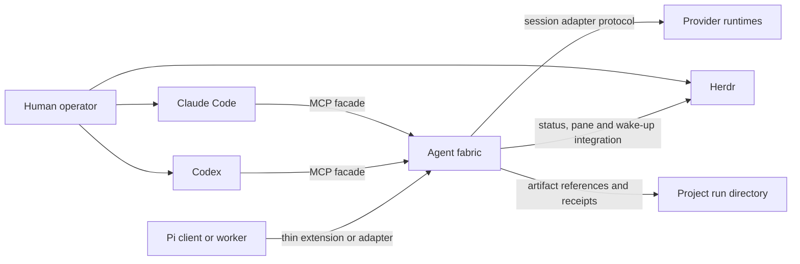

# Shared agent fabric

Status: Project-session and operator extension approved; implementation in progress; final human acceptance pending
Version: 0.14
Date: 12 July 2026
Chair for this design stage: Codex
Decision owner: This specification; no separate ADR is maintained
Human approval: Accepted by direct instruction on 10 July 2026
Approval effect: The same instruction authorised implementation of Stages 1–5

Version 0.14 closes the review-discovered destroyed-conflict recovery dead end.
Version 0.13 closes the implementation-discovered typed Git authority and
operation-semantics gap. Version 0.12 closes the review-discovered retained-
child-bridge and attestation descriptor gaps. Version 0.11 closes the review-discovered MCP bootstrap,
secret-result and descriptor-ownership gaps. Version 0.10 closes the review-discovered
chair-bridge recovery, provider-native attestation evidence, MCP resource parity
and duplicate lifecycle-surface gaps.
Version 0.9 closed the implementation-discovered current-agent MCP parity and
launched-chair tool-surface gap. Version 0.8 closes the provider-session continuity
attestation and live-bridge gap. Version 0.7 closed launch-custody, artifact,
secret-handoff and provider-action identity gaps. Version 0.6 closed the typed
Git-read and Activity message-body binding gaps. Version 0.5 closed local
operator provisioning and reviewed chair launch. None of these amendments
changes Spec 05 product scope or authorises provider login, push, release or
unattended daemon operation.

## 1. Decision requested

Implement the accepted local, harness-neutral agent fabric that Claude Code, Codex and future
clients can use through a shared protocol. The fabric provides durable two-way
messages, task and team ownership, provider session control, bounded hierarchy,
and optional Herdr visibility.

The human instruction on 10 July 2026 accepted this specification and named all
five implementation stages. It authorises local source, tests, compatibility
data and documentation. It does not authorise daemon installation or startup,
provider login, MCP registration, external messaging, deployment, release,
provider-session deletion, or Git staging and commits. Those actions retain
their separate gates.

## 2. Problem

The harness already defines Claude Code and Codex as equal primaries, one
session chair, one stage owner and one writer for a shared source surface. Its
paired-primary mode exchanges immutable artifacts and uses Herdr for observable
steering. These contracts prevent competing bosses, but the runtime is still
turn-based:

- pane sends are best-effort wake-ups rather than acknowledged messages;
- there is no shared mailbox or replay cursor;
- no registry binds a fabric identity to Claude, Codex or Pi session IDs;
- team hierarchy, inherited budgets and delegation narrowing are prose rules;
- each provider needs bespoke dispatch glue;
- interactive sessions are observable but cannot accept reliable external
  structured push messages.

The proposed fabric makes those contracts executable while preserving the
existing source of truth and the option to watch paired agents side-by-side.

## 3. Goals

- Give Claude Code and Codex the same chair and participant interface.
- Let either primary chair without making the other primary's private plugin or
  session store authoritative.
- Support persistent paired collaboration with durable request, response and
  acknowledgement semantics.
- Support headless, observed, interactive and hybrid execution profiles.
- Model a single chair, bounded leader teams and workers without creating
  multiple authorities.
- Permit direct agent-to-agent communication without treating messages as
  permission grants.
- Keep model and effort routing in `config/model-routing.json`.
- Add providers through capability-advertising adapters, not provider-specific
  skills.
- Preserve project-owned artifacts and curated project documentation.
- Recover safely from daemon, adapter, worker and chair interruption.
- Make operational cost, context pressure, failures and human intervention
  visible in receipts.

## 4. Non-goals

- A distributed or remote multi-user control plane.
- Global peer-to-peer broadcast or consensus-based ownership.
- Guaranteed structured push into an unmanaged interactive TUI.
- Replacement of Claude Code, Codex, Herdr or provider-native subagents.
- A new model catalogue separate from `config/model-routing.json`.
- Physical filesystem isolation. Coordination leases complement, but do not
  replace, runtime sandboxes and operating-system controls.
- Automatic public release, deployment, provider login or subscription use.
- Unlimited recursive teams in the first release.
- Durable storage of complete chat transcripts as project truth.

## 5. Stakeholders and concerns

| Stakeholder | Concern | Design response |
|---|---|---|
| Human operator | Side-by-side visibility and the ability to intervene | Herdr observed and interactive profiles; intervention receipts |
| Session chair | One interface for assignment, messages, gates and synthesis | Symmetric MCP facade and fenced chair lease |
| Stage or task owner | Clear authority, dependencies and completion barrier | Task graph, authority envelope and task-owner lease |
| Peer or reviewer | Independent access to evidence without write overlap | Read-only authority, artifact references and authorship records |
| Team leader | Bounded ability to delegate and supervise | Narrowing validation, budget reservation and depth limits |
| Worker agent | Stable assignment, mailbox and lifecycle contract | Provider-neutral adapter protocol and resumable identity |
| Maintainer | Replaceable providers and testable upgrades | Adapter capability handshake and contract tests |
| Project owner | Project knowledge remains portable | Project run directories remain authoritative |

### 5.1 Release and conformance boundary

This specification describes the Stage 5 target state. Stages 1 and 2 are
internal foundation milestones. The first operational release ends at Stage 3
and supports one chair, one paired primary, direct chair-owned workers, shared
MCP messaging, and headless, observed and interactive profiles. Provider
expansion is Stage 4. Leader-managed teams, inherited budgets and recursive
records are Stage 5 and remain disabled before that stage.

Each requirement and acceptance scenario names its introduction stage. A stage
passes only the requirements introduced at or before it. The implementation
plan shall contain a requirements traceability matrix covering tests and
stages; an unmapped
requirement blocks acceptance of that stage.

## 6. Risk and authority profile

Risk tier: **crucial**. The design affects a shared harness, credentials-adjacent
provider processes, write authority and stateful runtime data.

The following envelope records the completed design pass. The active delivery
authority is recorded in the canonical `.agent-run/AFAB-001/RUN.json`
`delivery-run` receipt.

```yaml
authority:
  approver: human-maintainer
  expires_at: design-approval-or-rejection
  allowed_source_paths:
    - docs/specs/
  allowed_artifact_paths:
    - /tmp/fable-agent-fabric-design.md
    - /tmp/agent-fabric-review-*.md
  prohibited_actions:
    - implement-runtime-code
    - register-mcp-server
    - modify-provider-authentication
    - start-or-install-daemon
    - delete-or-compact-provider-sessions
    - change-model-routing
    - commit-or-release
  disclosure:
    external_provider_source: local-harness-docs-only
    secrets: prohibited
```

## 7. System context



> The fabric owns coordination state. The project owns durable work products.
> Herdr owns visibility, not authority or message truth.

## 8. Runtime containers

```text
Claude or Codex MCP process
  -> lightweight stdio proxy
  -> private local Unix socket
  -> one shared agent-fabric daemon
       -> SQLite/WAL coordination store
       -> append-only event and receipt exporter
       -> provider adapter supervisors
       -> Herdr integration
       -> project artifact resolver
```

### 8.1 Source layout

```text
~/.agents/
  runtime/agent-fabric/
    package.json
    src/core/
    src/adapters/
    src/transports/
    schemas/
    migrations/
    tests/
  config/agent-fabric.yaml
  config/model-routing.json
  scripts/agent-fabric
  scripts/agent-fabric-mcp
```

### 8.2 Runtime layout

```text
~/.local/state/agent-harness/fabric/fabric-v1.sqlite3
~/.local/state/agent-harness/fabric/exports/<run-id>/
$XDG_RUNTIME_DIR/agent-harness/fabric-v1.sock
<project>/.agent-run/<run-id>/
```

When `XDG_RUNTIME_DIR` is absent, macOS uses a fabric-owned `0700` directory
under `$TMPDIR`. The socket is `0600`. No network listener is enabled by
default.

### 8.3 Configuration precedence

Configuration is validated before use. Unknown keys are errors. Project
configuration is untrusted: it may select only globally allow-listed values and
may narrow policy, never choose executable code, credentials or listeners.

```yaml
configuration_contract:
  schema_version: 1
  unknown_keys: error
  trusted_layers:
    - ${AGENTS_HOME}/config/agent-fabric.yaml
    - ${XDG_CONFIG_HOME}/agent-fabric/local.yaml
  untrusted_project_layer: <project>/.agents/agent-fabric.yaml
  run_layer: validated-run-authority-envelope
  merge_rules:
    authority_sets: intersection
    numeric_limits: minimum
    expiries: earliest
    deny_flags: false-dominates
    named_profile_selection: later-layer-within-trusted-allow-list
  trusted_only_fields:
    - adapter-command
    - adapter-package-or-plugin-path
    - executable-path
    - environment-source
    - listener-or-socket-location
    - provider-credential-selector
  project_permitted_fields:
    - named-execution-profile
    - allow-listed-adapter-id
    - role-routing-within-global-policy
    - narrowed-workspace-roots
    - narrowed-resource-limits
secrets:
  sources:
    - environment
    - operating-system-keychain
  permitted_in_yaml: false
routing:
  source: ~/.agents/config/model-routing.json
```

## 9. Execution control, visibility and inbox delivery

Execution control, operator visibility and inbox delivery are independent
dimensions. A named profile resolves all three and is accepted only when the
selected adapter advertises the required capabilities.

```yaml
profile_dimensions:
  control_mode:
    - managed
    - shared-session-ui
    - attached-interactive
  visibility_mode:
    - none
    - event-mirror
    - provider-tui
  inbox_delivery_mode:
    - structured-push
    - verified-boundary-inject
    - cooperative-pull
    - notify-only
```

Authority, task, mailbox and evidence semantics do not change with the profile.
Control strength, delivery latency and direct-input provenance are explicit in
the run receipt.

### 9.1 Headless managed sessions

Provider sessions run through SDK, app-server, RPC or ACP adapters without a
dedicated Herdr pane. They require `managed` control and normally use
`structured-push`. This is the lowest-overhead profile for mechanical workers
and large fan-out.

### 9.2 Observed managed sessions

The provider session remains owned by its adapter. Herdr starts a read-only
`agent-fabric observe` renderer in a pane. The renderer follows the fabric's
redacted activity-event cursor and displays bounded status, tool and output
events. It cannot send provider turns, acknowledge mailbox messages, acquire
leases or mutate task state.

Closing the pane stops only the renderer. Reopening it resumes from the last
display cursor or a bounded current snapshot; it never creates another provider
session. A provider-native shared-session UI may replace the renderer only when
the adapter contract-tests that capability.

The renderer consumes redacted event-envelope version 1, persists only its
display cursor, and exits non-zero on schema or authentication failure. Its CLI
supports `observe --run <id> [--agent <id>] [--after <cursor>] [--json]`.
Renderer reads never claim or acknowledge mailbox deliveries.

Observed managed sessions are recommended for the non-chair primary when direct
typing into it is not required. The chair remains the human-driven session and
is never replaced by a fabric-owned observer.

### 9.3 Attached interactive sessions

A provider TUI runs in a terminal the operator controls: either the terminal
where the human started it or a Herdr pane opened for it. A running TUI cannot
be re-parented into Herdr. A chair outside Herdr remains interactive but has no
pane telemetry. Its delivery mode is declared by the adapter:

- `verified-boundary-inject` requires an integration that returns the delivered
  message IDs to the fabric;
- `cooperative-pull` requires the agent to call `fabric_message_receive` and
  `fabric_message_ack` at instructed turn boundaries;
- `notify-only` surfaces unread state but cannot satisfy a bounded automatic
  response requirement.

An idle interactive session has no bounded delivery time. The fabric retries
wake-ups with backoff and escalates a still-unacknowledged `requires_ack`
message to the operator after the configured deadline.

A safe turn boundary is a versioned adapter event emitted after the provider
reports no active tool or model turn and before the adapter accepts another
turn. Cooperative clients pull the mailbox only at this boundary or on an
explicit operator request. Absence of this event keeps delivery pending.

A message is consumed only when the fabric receives an authenticated consume or
acknowledgement operation for its ID. Hook invocation, pane focus, terminal
input and prompt submission are not consumption evidence. Terminal input is a
wake-up capability, never a structured `send_turn`.

Direct operator input may change the active turn outside the task plan. Fabric
tools provide an explicit `operator_intervention` operation. When an integration
reports an external revision or the operator records an intervention, the task
owner reconciles it before barrier closure. If direct-input provenance is
unavailable, the receipt records that limitation and interactive task closure
requires explicit owner confirmation.

### 9.4 Profile changes

A profile change that cannot preserve the provider session is a lifecycle
rotation: checkpoint, stop delivery, close the adapter-turn lease, attach or
spawn the replacement, rehydrate it from the checkpoint, then acknowledge the
new generation. Only a contract-tested `shared-session-ui` adapter may add or
remove a view without rotation.

### 9.5 Hybrid profiles

Roles may use different profiles. The default side-by-side profile is:

```yaml
execution_profile:
  name: paired-visible
  default:
    control_mode: managed
    visibility_mode: none
    inbox_delivery_mode: structured-push
  roles:
    chair:
      control_mode: attached-interactive
      visibility_mode: provider-tui
      inbox_delivery_mode: cooperative-pull
    paired-primary:
      control_mode: attached-interactive
      visibility_mode: provider-tui
      inbox_delivery_mode: cooperative-pull
    leader:
      control_mode: managed
      visibility_mode: event-mirror
      inbox_delivery_mode: structured-push
    worker:
      control_mode: managed
      visibility_mode: none
      inbox_delivery_mode: structured-push
  herdr:
    layout: side-by-side
    retain_panes_after_completion: prompt
```

`paired-visible` places both primaries side-by-side only when the chair was
launched or attached under Herdr. Otherwise it shows the peer beside an unpaned
chair and records `visibility-degraded` for chair pane telemetry only.

The `paired-observed` profile keeps the chair interactive and runs the non-chair
primary with managed control, event-mirror visibility and structured push. It
provides stronger control over the peer while preserving the human-driven
chair.

## 10. Authority and team topology

The system combines four structures:

```text
authority:       one rooted supervisor tree
work:            one task dependency graph
communication:   durable addressable mailboxes
evidence:        immutable project artifacts by path and hash
```

Stage 5 supports one chair, up to four leaders and up to five workers per
leader. The schema is recursive, but Stage 5 policy limits the depth to two
levels below the chair.

Each agent has one authority parent per run. It may belong to multiple bounded
discussion groups. Leaders own disjoint task subgraphs. A leader council is
advisory; every task, stage and decision has one named owner.

Native subagents are either:

- **opaque children**, managed by the provider-native parent and counted
  against its budget; or
- **registered children**, given fabric identity because they need direct
  task ownership, cross-team messages or durable reassignment.

An agent cannot be managed simultaneously as both an opaque native child and a
registered fabric child.

## 11. Core records

```yaml
agent:
  agent_id: run-local-stable-id
  provider_session_ref: adapter-owned-resume-reference
  parent_agent_id: sole-authority-parent
  team_id: primary-team
  role: chair-or-leader-or-worker-or-reviewer
  authority_ref: immutable-envelope-hash
  budget_ref: inherited-budget-reservation
  control_mode: managed-or-shared-session-ui-or-attached-interactive
  visibility_mode: none-or-event-mirror-or-provider-tui
  inbox_delivery_mode: structured-push-or-verified-boundary-inject-or-cooperative-pull-or-notify-only
  pane_ref: optional-herdr-pane-id
  observer_ref: optional-renderer-id
  lifecycle: starting-or-ready-or-busy-or-checkpointing-or-idle-or-suspended-or-archived
```

```yaml
task:
  task_id: stable-id
  parent_task_id: optional
  dependencies: []
  owner_agent_id: exactly-one
  authority_ref: immutable-envelope-hash
  budget_ref: reservation
  base_revision: project-revision-or-artifact-generation
  expected_artifacts: []
  objective_checks: []
  human_gates: []
  state: proposed-or-ready-or-active-or-blocked-or-complete-or-cancelled-or-degraded
```

```yaml
budget:
  schema_version: 1
  budget_id: stable-id
  parent_budget_id: optional
  currency: provider-billing-currency-or-none
  hard_limits:
    provider_cost_microunits: integer-or-none
    input_tokens: integer-or-none
    output_tokens: integer-or-none
    provider_calls: integer-or-none
    concurrent_turns: integer-or-none
    descendants: integer-or-none
    message_bytes: integer-or-none
    artifact_bytes: integer-or-none
    wall_clock_milliseconds: integer-or-none
  advisory_limits: same-dimensions-as-hard-limits
  reserved: same-dimensions-as-hard-limits
  consumed: same-dimensions-as-hard-limits
  unknown_usage_policy: freeze-hard-dimension-or-advisory-estimate
```

All quantities are non-negative integers; money uses provider-currency
microunits. A child reservation atomically debits the parent's available
balance. Consumption draws from the reservation. Idempotent release returns
only unused reserved units and cannot raise the parent above its original
grant. Usage unknown for a hard dimension freezes further reservations on that
dimension until reconciled. Unknown advisory usage may continue only with an
estimate and a degraded receipt. Limits in different currencies or provider
token units are not silently combined.

```yaml
message:
  message_id: uuid-v7
  run_id: stable-id
  sender_id: server-derived-agent-id
  audience_selector: agent-or-team-or-task
  kind: request-or-response-or-event-or-steer-or-cancel-or-escalate-or-ack
  conversation_id: bounded-exchange
  reply_to: optional-message-id
  task_id: owning-task
  task_revision: compare-and-set-revision
  inline_body: maximum-4096-bytes
  artifact_refs: []
  requested_action: explicit-or-none
  requires_ack: true-or-false
  dedupe_key: sender-scoped-retry-identity
  expires_at: optional
  hop_count: bounded
```

`agent` is the only stored mailbox recipient. Sending to a team or task
atomically snapshots its authorised membership and creates one immutable
delivery row per recipient. Each delivery records message ID, recipient agent,
mailbox sequence, state, attempt count, claim deadline and acknowledgement
time. Delivery state is `ready`, `claimed`, `acknowledged`, `abandoned` or
`expired`; `delivery-pending` is the derived status for a required delivery that
has not reached a terminal state by its response deadline. Sequence numbers are
monotonic per run and recipient.

Receive claims a delivery for a bounded visibility timeout. A crash before
acknowledgement returns it to ready. Acknowledgement is per delivery and means
that the named agent durably consumed it. A contiguous watermark advances only
past deliveries that are acknowledged, abandoned with a reason, or expired by
policy. Out-of-order acknowledgements do not skip gaps.

`dedupe_key` is unique per run and authenticated sender. It maps to one
immutable audience expansion and payload hash. Reuse with a changed payload or
audience is a conflict. Delivery is at least once; consumers are idempotent.

Task claim, delegation, write-scope transfer, task completion and barrier close
are single SQLite transactions. All predicates are rechecked inside the write
transaction. Budget reservations debit the parent's available ledger balance;
idempotent release cannot increase it above the original grant. Every
transition has a stable command ID and returns the committed result on retry.

## 12. Leases, delegation and barriers

The daemon issues fenced, generation-bearing leases:

- one chair lease per run;
- one owner lease per active task;
- one write-scope lease per canonical path set;
- one adapter-turn lease per fabric-managed provider session. Attached
  interactive sessions have registry and mailbox identity but no fabricated
  external turn control.

Every mutation supplies the expected lease generation. Stale generations fail
closed. Child authority must be a strict or equal subset of its parent for
paths, actions, disclosure, expiry and budget.

Lease expiry or generation change fences fabric mutations only. Before granting
an overlapping successor write-scope or adapter-turn lease, the daemon proves
one of:

1. the predecessor process or turn is terminal and its write capability has
   been revoked;
2. an operating-system sandbox prevents it reaching the successor's scope; or
3. it could produce only immutable patch artifacts and the sole serial applier
   rejects its old generation.

If none is provable, the scope is `quarantined` and no successor writer starts.
Unmanaged interactive or full-access sessions are patch-only unless their
liveness and revocation mechanism is enforced. Lease generation and action ID
are propagated to adapter commands and serial-apply operations.

A subtree leader may close a subtree barrier. Only the chair closes a stage or
run barrier. Closure requires:

- required descendants are terminal, cancelled or explicitly degraded;
- no unresolved provider turn or active write lease remains;
- artifacts and hashes are recorded;
- required checks pass;
- required messages are acknowledged or abandoned with a reason;
- the checkpoint records mailbox cursors and provider resume references;
- human gates are resolved;
- the next owner acknowledges the exact generation and revision.

For the final run barrier, the human acceptance gate takes the place of
next-owner acknowledgement.

Direct filesystem access cannot be perfectly fenced by the daemon. Shared
source retains the serial-applier rule unless write scopes are provably
disjoint and predecessor revocation is enforced.

## 13. Provider adapter contract

Each adapter runs behind a versioned process boundary in the first release.
Adapter failure must not crash the core.

```yaml
adapter_operations:
  registration_required:
    - capabilities
    - status
    - release
    - lookup_action
    - cancel_action
  managed_session_required:
    - spawn
    - send_turn
    - interrupt
    - resume_reference
    - dispatch
  attached_interactive_required:
    - attach
    - status
    - wakeup
    - resume_reference
  optional:
    - steer
    - follow_up
    - compact
    - fork
    - native_subagents
    - enforced_read_only
    - usage_and_cost
    - shared_session_ui
    - verified_boundary_inject
    - compact_in_place
```

Every side-effecting adapter command uses a fabric-generated `action_id`, lease
generation and immutable payload hash. The adapter durably records
`prepared`, `dispatched`, `accepted`, `terminal` or `ambiguous`. The core calls
`lookup_action` after ambiguity and never automatically replays a side-effecting
command unless downstream idempotency for that action ID is proven. Otherwise
the task is quarantined for explicit recovery. The action record commits before
dispatch; its terminal result commits before message acknowledgement.

`lookup_action` applies to every adapter operation with external effects,
including provider-mutating release or wake-up implementations. An adapter may
declare an operation core-only and idempotent only when it does not mutate the
provider session or external state; that declaration is contract-tested.

The scheduler does not assign a role whose control, delivery or recovery
requirements exceed the session's advertised capabilities.

`steer` and `follow_up` execute under the active turn lease held by the turn
initiator; they do not acquire a second generation. Only a new `send_turn`
acquires a new adapter-turn lease. Interactive targets return
`capability_unavailable` for turn-control operations and use mailbox plus
wake-up instead.

Planned adapters:

| Adapter | Intended role | Notes |
|---|---|---|
| Claude Agent SDK | Claude primary, leader or worker | Persistent headless sessions; interactive TUI remains a separate profile |
| Codex app-server | Codex primary, leader or worker | Thread and turn lifecycle; contract-test generated protocol schemas |
| Pi SDK or RPC | Generic API and open-provider workers | Model-neutral worker runtime; not the authority store |
| Agy | Gemini or Antigravity access | Adapter only; no separate provider skill |
| Cursor | Composer and Grok only | Model allow-list remains routing policy |
| Kiro or ACP | Open-model runtime | Capability-discovered, optional and non-blocking |
| Herdr | Pane placement, observation and wake-ups | Never authoritative transport |

Unsupported optional capabilities return a typed `capability_unavailable`
result. The router may choose a compatible substitute only when the existing
model-routing policy permits substitution and records it.

## 14. MCP and client interface

Claude Code and Codex launch separate stdio MCP proxy processes. Each proxy
connects to the same Unix socket and shared daemon. The proxy may safely start
the daemon under a single-instance lock when it is absent.

The operation registry is the sole owner of the current MCP tool set. Every
active agent-principal operation has an exhaustive `tool` or `none`
classification and every `tool` entry owns one stable name. The generated
descriptor/reference artifact, rather than a second list in this document,
records the Stage 2-5 and Spec 05 names. V1 has exactly one descriptor per
operation; constant-bound aliases such as a steer-only provider action or a
release-only lifecycle action are not additional descriptors. A future variant
projection must replace the whole-operation descriptor with a registry-declared
exhaustive, non-overlapping set and cannot silently omit an admitted enum member.

Run creation is not an agent operation. Legacy `createRun` remains a private
bootstrap compatibility method, while production run creation belongs to
operator launch custody. `fabric_run_create` is never an MCP descriptor. The
proxy accepts only an `afc_` agent capability, initialises with
`expectedPrincipalKind: agent` and rejects a bootstrap credential before
advertising tools.

The generated read descriptors additionally own these resource templates:

- `fabric://runs/{run_id}/status`
- `fabric://runs/{run_id}/tasks`
- `fabric://runs/{run_id}/agents`
- `fabric://runs/{run_id}/receipts`

Unshipped or registry-classified `none` operations are absent rather than
stubbed. Stage 2 contract tests
verify resource round-trips from both MCP clients. The four URI templates are
MCP-native convenience projections of the same generated run-status, task-list,
agent-list and receipt-list descriptors; they are not another schema owner.
Every surface, including Codex dynamic tools, exposes those four generated read
tools even when it has no resource-template channel.
Subtree-barrier closure by a leader becomes available with teams in Stage 5;
before then `fabric_barrier_close` accepts only chair-owned run or stage scope.

MCP notifications are not assumed to reach every interactive client. Mailbox
state and adapter delivery remain authoritative.

The complete current set is generated from the same closed agent-operation
codecs and principal registry as the public protocol. The standalone MCP proxy
negotiates the authenticated agent protocol before advertising tools; it does not retain
a second hand-written method vocabulary. Operations absent from the negotiated
features or current authority are absent from the advertised tool list, not
present as permissive generic RPC. Inputs and outputs are validated by the
shared codecs before and after the daemon call.

Registry classification is compile-time exhaustive. `registerAgent`,
`rotateCapability` and any other operation whose result still contains a bearer
secret are `none`. Spawn and attach become `tool` only with secret-free public
result codecs and shared custody: the daemon generates the target capability,
persists only its digest and privately hands plaintext to a bridge-provisioning
adapter inside the stable one-effect provider action. The model-visible result
contains agent/action/session identity plus `bridgeState` and
`bridgeGeneration`, never the token. An adapter that cannot provision a bridge
advertises that fact before dispatch; attach may then register a bridge-less
mailbox/wake-up participant with `bridgeState: none`, but neither attach nor
spawn fabricates a live Fabric tool surface. A supported retained bridge must
complete a later provider-originated Fabric call before it is claimed active.
Attach remains registry-classified `tool` regardless of the selected adapter's
bridge capability; `bridgeState` reports the runtime outcome.

Every model-visible result is the exact closed public result codec. Opaque
provider output is replaced by typed contract evidence and/or a digest before
projection; `additionalProperties: true`, raw provider JSON and copied output
schemas are forbidden.

A launched chair receives this same current, principal-scoped MCP operation
surface through the secret-consuming provider-session bridge. Its one-use
attestation operation is also registry-classified `tool`, but only the
launch-attestation feature/grant projects it; standalone proxies cannot see it.
“Private” means grant-scoped and one-use, not registry-exempt. Claude SDK MCP
tools and Codex app-server dynamic tools may use provider-specific transport descriptions, but their Fabric names,
schemas, authority results and receipts are generated from the same descriptors.
The provider session must originate every tool call. The adapter wrapper may
route and validate an attributed call but cannot invoke a Fabric operation on
the model's behalf and report that as session activity. Later turns reuse the
same retained bridge; a resume reference without it exposes no Fabric tools and
follows chair-loss recovery.

## 15. Session lifecycle

The agent may request compaction, rotation or release. The fabric validates
only fabric-managed lifecycle actions. Provider-native automatic compaction and
direct interactive lifecycle commands are external events: prevent them where
a supported policy control exists; otherwise detect and journal them when
possible and reconcile at the next boundary.

```yaml
lifecycle_request:
  action: compact-or-rotate-or-completion-ready-or-release
  agent_id: stable-id
  task_revision: exact-revision
  checkpoint_ref: path-and-sha256
  mailbox_watermark: last-contiguous-disposed-sequence
  acknowledged_above_watermark: []
  in_flight_children: []
  open_work: []
  next_action: exact-action
```

Policy by role:

- chair and primary leaders persist for a run and rotate at barriers or context
  pressure;
- team leaders persist for their task subgraph;
- workers are normally ephemeral;
- independent reviewers start with fresh context;
- the fabric refuses lifecycle requests that clear or release a work-owning
  agent without a valid checkpoint, and marks the agent `degraded` if provider
  session state is found reset without one;
- `compact_in_place` is used only when the adapter advertises it and returns the
  resulting provider-session generation;
- the portable fallback is rotation: checkpoint, stop new delivery, reconcile
  children and leases, start or resume a replacement session, inject the
  checkpoint, verify task and mailbox revisions, then release the old lease;
- a session compacted without a valid checkpoint is `context-unreconciled` and
  cannot close a barrier or retain a write lease until reconciled;
- completion drains or cancels children, releases leases, exports receipts and
  archives registry state;
- provider session deletion requires retention policy or human authority.

## 16. Persistence and retention

SQLite/WAL owns concurrent coordination records: agents, tasks, mailbox events,
cursors, leases, budgets, provider resume references and schema migrations.
Stage 1 isolates synchronous SQLite writes and checkpoints from adapter event
processing so a migration or WAL checkpoint cannot stall provider supervision.

Each project run directory owns:

- assignment and authority envelopes;
- checkpoints and handoffs;
- reports, patches and verification evidence;
- model-routing and adapter receipts;
- final synthesis and human-gate state.

Mailbox bodies are operational state and default to ephemeral retention.
Artifacts referenced by messages retain their project-defined classification.
The fabric never deletes provider-native session files. Unknown or user-owned
files are never pruned.

## 17. Failure handling

| Failure | Required behaviour |
|---|---|
| Daemon restart | Replay committed events and restore cursors. Ordinary provider sessions follow their adapter recovery contract. A launched chair whose volatile bridge is lost is journalled and fenced as chair loss; never re-expose Fabric tools from its resume reference alone. Recovery uses the explicit generation-bound chair-bridge recovery custody below. |
| Duplicate message | Deduplicate by message and action key |
| Unknown provider turn | Reconcile adapter state before retrying any side-effecting action |
| Worker loss | Expire its turn lease, preserve partial artifacts and notify its parent |
| Leader loss | Freeze new grants in its subtree; chair adopts or reassigns with a new generation |
| Chair loss | Require explicit lease takeover and persisted handoff; never silently promote a peer |
| Provider outage | Bound retries; degrade optional families; block required coverage |
| Herdr control or telemetry socket loss | Continue only healthy provider processes; mark `visibility-degraded`; infer no task state from absent telemetry |
| Observed renderer or pane loss | Keep the adapter-owned session; recreate only the renderer and resume its display cursor |
| Interactive TUI or pane-process loss | Freeze delivery and the turn lease; reconcile the provider session; explicitly reattach or rotate with a higher generation |
| Interactive operator edit | Record it where integrations permit; regardless of detection, compare-and-set rejects stale task mutations and forces reconciliation; declare provenance limits honestly |
| Message storm | Apply quotas, hop limits, bounded conversations and no global broadcast |
| Overlapping writes | Reject intersecting leases and verify base revision after writes |
| Store corruption | Stop mutations, preserve the database and require recovery from exports or backup |

## 18. Security and privacy

- The daemon listens only on a per-user Unix socket by default.
- Socket and state directories reject group or world access.
- A discovery token authenticates only a same-user control-plane client; it is
  not an agent-authority credential. Its purpose is to deny access to sandboxed
  worker processes that share the user ID but cannot read the discovery path;
  adapters do not pass it into worker environments.
- On attach, the daemon issues a revocable, run-scoped capability bound to one
  fabric principal, permitted operations, mailbox, authority hash, expiry,
  connection nonce and current lease generation.
- Grants above the client's registered role require chair approval recorded in
  the journal.
- The daemon derives sender, run and authority from authenticated context rather
  than MCP arguments. Chair-only, owner-only and recipient-only access controls
  apply to every tool and resource read.
- Attach, takeover and token rotation are journalled and use compare-and-set
  against the current generation.
- Secrets never appear in configuration, messages, receipts or Herdr pane
  metadata.
- Adapters receive only the environment variables required for their provider.
- Message bodies cannot grant authority. Unrestricted same-user shell access
  may bypass cooperative controls, so receipts distinguish protocol-enforced
  from operating-system-enforced authority.
- Project path resolution rejects traversal, symlink escape and paths outside
  the approved workspace roots.
- Read-only claims distinguish policy-only restrictions from substrate-enforced
  restrictions.
- Remote sockets, WebSocket listeners and external dashboards are disabled in
  the first release.

## 19. Observability and operator control

The fabric exports `<run-dir>/fabric-receipt.json` as generated coordination
evidence. It does not own human acceptance, delivery completion or the final
gate. The chair-owned `.agent-run/<run-id>/RUN.json`, using `contract:
delivery-run` and `schema_version: 1`, remains authoritative. It declares the
fabric receipt as an evidence artifact with a workspace-relative path and
SHA-256 digest; no second run-receipt shape is adopted.

The fabric receipt records observed coordination facts:

```yaml
receipt:
  run_id: stable-id
  chair: agent-and-provider
  stage_owners: []
  agents: []
  execution_profile: name
  direct_input_provenance: complete-or-partial-or-unavailable
  model_routing_receipts: []
  task_and_write_leases: []
  messages_sent_received_abandoned: counts
  objective_checks: []
  cross_family_reviews: []
  provider_failures_and_substitutions: []
  operator_interventions: []
  compactions_and_rotations: []
```

Herdr panes show provider, model family, role, task, lifecycle, context pressure,
unread message count and current lease generation where integrations permit.
The operator may pause, steer, cancel or focus an agent through the fabric or
Herdr. Every fabric-mediated intervention and every intervention reported by a
provider or Herdr integration is journalled. Unattributable direct terminal
input is not fabricated as a receipt event.

## 20. Performance and resource policy

The system is local and single-user through Stage 5. Defaults favour bounded
work; leader limits remain disabled until Stage 5:

```yaml
limits:
  maximum_tree_depth_below_chair: 2
  maximum_leaders: 4
  maximum_workers_per_leader: 5
  maximum_concurrent_provider_turns: 8
  maximum_inline_message_bytes: 4096
  maximum_message_hops: 4
  maximum_unacknowledged_messages_per_agent: 100
  reserve_for_verification_and_recovery_percent: 25
```

The Stage 1 core shall support at least 32 registered simulated agents. Stage 3
shall support eight concurrent provider turns on the local development machine.
Local mailbox and task operations shall complete within 100 ms at p95 under
that load, excluding provider and filesystem artifact latency.

## 21. Pinned implementation baseline

These versions are the proposed Stage 1 core baseline, verified on 10 July
2026. Review shall revalidate them before implementation begins.

| Dependency | Version |
|---|---|
| Node.js | 24.15.0 |
| TypeScript | 7.0.2 |
| `@modelcontextprotocol/sdk` | 1.29.0 |
| `better-sqlite3` | 12.11.1 |
| `yaml` | 2.9.0 |
| `ajv` | 8.20.0 |
| `uuid` | 14.0.1 |
| Vitest | 4.1.10 |
The lockfile pins exact transitive dependencies. A provider stage cannot enter
implementation until `config/adapter-compatibility.yaml` records each adapter's
contract version, exact package version or source commit, protocol/schema
version and hash, supported runtime range, capability fixture version, official
source URL and verification date. Stage 3 pins Claude Agent SDK, Codex
app-server and Herdr contracts. Stage 4 pins Pi, Agy, Cursor and Kiro or ACP.
An adapter without a verified entry remains disabled.

## 22. Requirements

### 22.1 Functional requirements

- **FR-001 (Stage 2):** Claude Code and Codex shall expose the same fabric tool and
  resource semantics through their MCP clients.
- **FR-002 (Stage 2):** Separate client proxies shall communicate with one shared daemon
  and coordination store.
- **FR-003 (Stage 1):** The fabric shall persist each message before delivery and shall
  support receive, acknowledge, retry and replay by cursor.
- **FR-004 (Stage 1):** The fabric shall preserve one chair and one owner for every active
  task or stage.
- **FR-005 (Stage 1):** The fabric shall reject delegation that widens authority, expiry
  or budget.
- **FR-006 (Stage 1):** The fabric shall reject overlapping active write-scope leases.
- **FR-007 (Stage 3):** The fabric shall support headless, observed, interactive and
  hybrid visibility profiles.
- **FR-008 (Stage 3):** The paired-visible profile shall display the chair and paired
  primary side-by-side in Herdr while workers remain headless by default when
  the chair was launched under Herdr; otherwise it shall show the peer and
  record degraded chair-pane visibility.
- **FR-009 (Stage 3):** Loss of Herdr shall not lose tasks, messages, leases or provider
  resume references.
- **FR-010 (Stage 1):** Agents sharing an authorised task, dependency or discussion group
  shall be able to address each other directly.
- **FR-011 (Stage 1):** A direct message shall not transfer task ownership or authority.
- **FR-012 (Stage 3):** The fabric shall support persistent primary sessions
  and ephemeral chair-owned workers through capability-advertising adapters.
- **FR-013 (Stage 3):** Agents shall request compaction, rotation or release through a
  checkpointed lifecycle operation.
- **FR-014 (Stage 3):** The daemon shall not delete provider-native session files.
- **FR-015 (Stage 3):** Model and effort resolution shall use the existing model router
  and retain its receipt.
- **FR-016 (Stage 4):** An optional bonus-family leg shall follow its configured
  retry and acknowledgement deadline, then terminate as degraded or failed and
  record the reason rather than block the required primary path.
- **FR-017 (Stage 1):** The daemon shall resume committed coordination state after an
  unclean restart.
- **FR-018 (Stage 1):** Before barrier closure, the fabric shall export a
  schema-valid `fabric-receipt.json`; the chair shall declare it as the
  `fabric-coordination-receipt` evidence artifact in the canonical
  `delivery-run` receipt before the run is accepted.
- **FR-019 (Stage 5):** The fabric shall support bounded leaders and registered
  worker subtrees subject to depth, authority and budget limits.

### 22.2 Quality requirements

- **NFR-001 (Stage 1, security):** No remote listener shall be active by default.
- **NFR-002 (Stage 1, security):** Socket, state and discovery files shall reject access by
  other local users.
- **NFR-003 (Stage 1, reliability):** A crash after message commit and before delivery
  shall result in replay, not message loss.
- **NFR-004 (Stage 3, reliability):** Retried fabric commands shall map to one
  durable action record. An ambiguous side-effecting provider command shall not
  be replayed automatically unless downstream idempotency is proven for the
  same action ID.
- **NFR-005 (Stage 1, performance):** Local coordination operations shall meet the p95
  target in section 20.
- **NFR-006 (Stage 1, maintainability):** A new fake adapter shall pass the
  published adapter conformance suite without modifying task, lease or mailbox
  core logic; real adapters add only compatibility data and adapter-local code.
- **NFR-007 (Stage 2, portability):** Claude and Codex clients shall use the same protocol
  and schemas without harness-specific forks.
- **NFR-008 (Stage 3, auditability):** Every fabric-mediated intervention and
  every intervention reported by an integration shall appear in the fabric
  receipt. Interactive profiles shall declare direct-input provenance as
  `complete`, `partial` or `unavailable`.
- **NFR-009 (Stage 3, usability):** The operator shall be able to select a named
  execution profile without editing provider adapter code.
- **NFR-010 (Stage 1, recoverability):** Restart tests shall recover the last
  committed mailbox watermark and out-of-order acknowledgements, task revision
  and lease generation.

## 23. Acceptance scenarios

### AC-001 (Stage 3): symmetric paired messaging

Given Claude Code is chair and a persistent Codex peer is attached
When Claude sends a task message and Codex replies
Then both messages, acknowledgements, revisions and artifact hashes are visible
through the same fabric interface
And the scenario also passes with Codex and Claude roles reversed.

### AC-002 (Stage 3): observed paired programming

Given the `paired-observed` profile
And the human launched or attached the chair session inside Herdr
When a Claude/Codex pair begins work
Then Herdr places both primary sessions side-by-side
And their task, lifecycle and unread-message state is visible
And closing the non-chair observed pane stops only its renderer
And recreating that renderer resumes its display cursor without acknowledging
mailbox messages or creating another provider session
And closing or losing the chair TUI follows the interactive-session-loss
behaviour in section 17.

### AC-003 (Stage 3): interactive delivery limitation

Given an interactive TUI is busy in a provider turn
When another agent sends it a structured message
Then the message is durably queued
And no delivery acknowledgement is recorded until the TUI drains and consumes
the message
And a Herdr wake-up alone does not satisfy delivery.

### AC-003A (Stage 3): interactive paired round trip

Given both paired primaries use `cooperative-pull` or a stronger mode
When the chair queues a message while the peer is idle
Then unread state is surfaced in its Herdr pane
And the peer explicitly consumes and acknowledges the exact message ID at its
next safe turn
And its reply is persisted and acknowledged through the same fabric API
And a missed deadline remains `delivery-pending`, not delivered.

### AC-004 (Stage 5): bounded hierarchy

Given a chair delegates a budget and source scope to a leader
When the leader creates worker tasks
Then each child grant is contained by the leader's grant
And an over-depth, over-budget or wider-path grant is rejected.

### AC-005 (Stage 1): fenced ownership recovery

Given a task owner or writer loses its session while holding a task lease
When the chair reassigns the task after checkpoint or expiry
Then the replacement receives a higher lease generation
And the successor cannot start until predecessor revocation, operating-system
isolation or patch-only serial application is proven
And otherwise the scope becomes `quarantined`.

### AC-006 (Stage 1): daemon restart

Given messages, tasks and provider resume references are committed
When the daemon is terminated without graceful shutdown and restarted
Then it restores the last committed state
And redelivers unacknowledged messages without duplicating acknowledged actions.

### AC-007 (Stage 3): visibility degradation

Given observed workers are running and Herdr telemetry or a renderer becomes
unavailable
When the provider runtimes remain healthy
Then work may continue under policy
And the run records `visibility-degraded`
And no task or message is inferred from missing pane telemetry
And loss of an interactive TUI is instead reconciled as provider-session loss.

### AC-008 (Stage 3): safe completion

Given an agent reports completion-ready
When it still owns a write lease or has an in-flight child
Then release is refused
And it is released only after checkpoint, child reconciliation, barrier closure
and lease release.

### AC-009 (Stage 3): unannounced compaction

Given an interactive provider compacts without a valid fabric checkpoint
When the fabric detects a new provider-session generation or context revision
Then the session becomes `context-unreconciled`
And it cannot close a barrier or retain a write lease
And the portable recovery path rotates through a verified checkpoint when
in-place reconciliation is unavailable.

### AC-010 (Stage 1): untrusted project configuration

Given project configuration attempts to replace an adapter command, add an
environment source or widen a workspace root
When configuration is validated
Then validation fails before daemon or adapter startup
And no project field selects executable code or credentials.

### AC-011 (Stage 3): ambiguous provider action

Given an adapter terminates after provider acceptance but before terminal-result
commit
When the daemon recovers
Then it reconciles the stable action ID
And either records the single provider action or quarantines the ambiguity
And it never automatically creates a second side-effecting action.

### AC-012 (Stage 2): shared daemon and symmetric proxies

Given two independently started MCP proxy processes identify as Claude and
Codex clients
When each connects through the per-user socket and calls the same tool and
resource schemas
Then both observe one run, task revision and mailbox store
And no harness-specific fork changes the protocol or resource result.

### AC-013 (Stage 4): optional adapter degradation

Given an enabled optional-family adapter passes conformance but its provider is
unavailable
When its configured retry and acknowledgement deadline expires
Then the optional leg becomes degraded or failed with the reason recorded
And the required Claude/Codex path remains unblocked
And no side-effecting action is replayed without reconciliation.

## 24. Verification strategy

### Static and schema checks

- Parse every YAML configuration example and JSON Schema.
- Validate MCP tool input and output schemas.
- Validate authority subset and path canonicalisation rules.
- Validate `adapter-compatibility.yaml` and reject untrusted configuration that
  selects executable code, credentials or listeners.
- Extend `scripts/check-harness` with fabric protocol and documentation checks.

### Unit tests

- mailbox ordering, cursors, acknowledgement and deduplication;
- task dependency transitions and compare-and-set revisions;
- lease acquisition, renewal, expiry, transfer and stale-generation rejection;
- authority and budget narrowing;
- path overlap, traversal and symlink escape;
- lifecycle checkpoint completeness;
- visibility profile resolution.

### Integration tests

- two simulated MCP clients exchange messages through one daemon;
- daemon crash and restart during message delivery;
- adapter crash without core crash;
- crash injection before dispatch, after provider acceptance and before
  terminal-result commit for every mutating adapter operation;
- one active turn per provider session;
- Herdr telemetry loss, observed-renderer loss and interactive TUI loss as
  distinct cases;
- observed renderer restart and interactive round-trip behaviour;
- Claude-chair/Codex-peer and Codex-chair/Claude-peer smoke tests.

### Evaluation scenarios

Because orchestration is judgement-bearing, deterministic tests are necessary
but insufficient. A repeatable evaluation set shall cover:

- leader over-delegation attempts;
- cross-team confused-deputy messages;
- two agents requesting the same write surface;
- an interactive operator changing the task mid-turn;
- provider outage and optional-family degradation;
- compaction requested before checkpoint;
- a council disagreement incorrectly treated as a vote;
- an agent attempting to clear itself while owning work;
- excessive fan-out and message storms;
- review independence after shared authorship.

## 25. Delivery stages

### Stage 0: approve the design

- Cross-family and independent review of this specification.
- Resolve blocking findings and record disagreements.
- Human accepts, rejects or amends this specification.

### Stage 1: protocol and mailbox slice

- Versioned schemas, file-compatible event export and fake adapters.
- SQLite core, migrations and command-line inspection tools.
- No provider credentials or real provider sessions.

### Stage 2: shared MCP facade

- Two MCP proxies connect to one daemon.
- Symmetric Claude/Codex mailbox, artifact and task operations through the
  Stage 2 subset in section 14.
- Resource round-trip tests from both clients, with the documented read-only
  tool fallback if required.
- No automatic registration without a separate human gate.

### Stage 3: persistent primary pair

- Codex app-server and Claude Agent SDK adapters.
- Headless managed and observed managed profiles.
- Capability-gated interactive inbox delivery and Herdr wake-ups.
- This is the first operational release boundary.

### Stage 4: provider expansion

- Pi as the first generic worker adapter.
- Agy, Cursor Composer/Grok and Kiro or ACP adapters behind the same contract.
- Existing one-shot dispatch becomes a degraded compatibility wrapper.

### Stage 5: teams and hardening

- Shallow leader teams, budget inheritance and subtree recovery.
- Security, load, migration and judgement-bearing evaluation suites.
- Review whether evidence justifies deeper hierarchy or Pi as another chair.

The direct implementation instruction on 10 July 2026 names Stages 1–5. Each
stage still requires deterministic verification and independent review before
the next stage is treated as conformant. External configuration and runtime
activation remain separately gated.

## 26. Decision record and alternatives

Decision status: **Accepted on 10 July 2026**. The human maintainer owns final
implementation acceptance.

The proposed decision is to implement one harness-neutral local agent-fabric
daemon in `~/.agents`. Claude Code and Codex use the same MCP facade. Provider
adapters manage worker sessions. Herdr provides optional observation,
interaction and wake-ups without owning durable messages, authority or project
artifacts. Pi is an optional generic worker runtime rather than the initial
chair.

Consequences:

- either primary can chair through the same protocol;
- visible paired programming remains available;
- provider runtimes and model routing remain replaceable;
- the daemon becomes load-bearing local software with security, migration and
  crash-recovery obligations;
- interactive sessions have explicitly weaker delivery and auditability than
  fabric-managed sessions;
- project artifacts remain outside the coordination database.

### Standalone daemon versus provider plugin

The daemon adds operational weight but avoids giving one harness ownership of
shared state. Thin plugins remain useful for discovery, hooks and commands.

### SQLite versus files only

SQLite provides transactions and concurrent cursors. Append-only exports keep
coordination inspectable and provide a degraded recovery format. Project
artifacts do not move into the database.

### Observed sessions versus interactive TUIs

Observed sessions provide reliable structured control and almost the same
visibility. Interactive TUIs permit direct human intervention but cannot offer
guaranteed mid-turn delivery. Both are supported because paired programming may
value human visibility more than minimum overhead.

### Shallow versus arbitrary hierarchy

The recursive schema keeps future options open. A shallow initial limit avoids
telephone loss, cost growth and unclear ownership before real runs demonstrate
the need for deeper management layers.

### Pi worker versus Pi chair

Pi reduces adapter overhead for model-neutral workers. It does not remove the
need for shared authority, mailboxes and receipts, so it remains below the
fabric until operating evidence supports a chair role.

## 27. Known risks

- Provider protocols, particularly experimental app-server surfaces, may drift.
- The daemon is a new single point of local coordination failure.
- Interactive operator input cannot always be distinguished from provider or
  hook output.
- Flat-rate subscription automation may have economic or terms-of-service
  constraints that differ by provider.
- A coordination lease cannot stop a full-access process from writing outside
  scope; runtime isolation remains necessary.
- Deep teams can spend more context on reporting than execution.
- A central coordination database can become a second source of truth if
  project artifacts are allowed to migrate into it.

## 28. Review questions

Reviewers shall answer with evidence and proposed text changes:

1. Does the observed/interactive/hybrid model preserve both reliable
   orchestration and the requested side-by-side experience?
2. Are authority, ownership and direct messaging sufficiently separated?
3. Can the system recover without silently duplicating side effects?
4. Does any record wrongly compete with project-owned artifacts or provider
   session stores?
5. Are the adapter boundary and capability negotiation flexible enough for Agy,
   Cursor Composer/Grok, Kiro/ACP and future providers?
6. Are lifecycle and compaction responsibilities implementable across Claude,
   Codex and Pi?
7. Which requirements or acceptance scenarios are not objectively testable?
8. Is any first-release surface unnecessarily broad?

## 29. Review history

Version 0.1 received cross-family review from Fable and independent protocol,
visibility and scope reviews. Version 0.2 incorporates their blocking and high
findings:

- removed the separate ADR and made this specification the decision owner;
- separated control, visibility and inbox-delivery capabilities;
- defined observed renderers and honest interactive delivery semantics;
- added principal-bound client capabilities and server-derived identity;
- specified per-recipient mailbox delivery and atomic state transitions;
- quarantined ambiguous provider actions and unrevoked stale writers;
- separated target-state conformance from staged release gates;
- constrained untrusted project configuration;
- made fabric receipts typed evidence in the canonical `delivery-run` receipt.

Review does not constitute human acceptance.

## 30. Approval gate

The specification and Stages 1–5 were authorised by direct human instruction
on 10 July 2026 after the recorded Fable and independent reviews. Final human
acceptance remains mandatory after deterministic verification, evaluation and
independent implementation review. Installation, MCP registration, provider
login, daemon activation, deployment, release and Git publication remain
separate actions.

## 31. Implementation clarifications

These choices refine existing requirements without widening scope:

- Authority paths are canonical workspace-relative prefixes. Empty paths,
  absolute paths, traversal, glob syntax and unresolved symlink escapes are
  rejected. Denies dominate allows. Actions use the versioned fabric operation
  vocabulary; disclosure narrows from `allowed` to `scoped` to `forbidden`.
- Write scopes use the same canonical prefix records. Intersection means equal
  prefixes or one prefix containing the other. Non-existent targets are
  resolved through their nearest existing ancestor before admission.
- Budget dimensions carry a `unit_key`. Currency is `cost:<ISO-4217>` and
  provider-sensitive tokens use `input_tokens:<provider-family>` or
  `output_tokens:<provider-family>`. Unlike units never aggregate.
- Principal generation fences capability rotation. Individual mutations also
  name every required resource lease and expected generation; there is no
  ambiguous principal-wide current lease.
- A ready task has one proposed owner but no owner lease. Claim atomically
  verifies dependencies, advances the task to active and issues its owner
  lease. Complete, cancelled and explicitly degraded dependencies satisfy
  readiness; blocked dependencies do not.
- Task participants are its owner plus explicitly registered participants.
  Direct communication is allowed for a shared task, either direction of a
  direct dependency edge, or a shared discussion group. These records grant no
  work authority.
- The daemon owns the canonical adapter-action journal. Each adapter also keeps
  reconciliation evidence behind its process boundary. The daemon imports that
  evidence only through `lookup_action`.
- `fabric_team_create` accepts the leader, root task, initial registered
  members, discussion groups and reserved budget atomically. Existing agent and
  task operations manage later assignment. Subtree freeze and adoption remain
  chair-only lifecycle commands rather than separate public team tools.
- Deterministic Stage 3 acceptance uses contract fixtures and fake provider
  processes. Live Claude, Codex and Herdr smoke tests are opt-in because they
  require authentication and may consume provider quotas; a live smoke result
  is operational evidence, not a unit-test prerequisite.
- Performance evidence records host, Node version, database mode, agent count,
  operation mix, warm-up and sample count. The 100 ms p95 gate uses at least 32
  simulated agents and 1,000 measured local operations after warm-up.
- If an interactive provider cannot report compaction or context revision, the
  receipt declares detection unavailable. Such a session cannot claim complete
  direct-input provenance and requires explicit owner reconciliation before a
  barrier closes.

## 32. Project-session and operator protocol amendment

This amendment is approved by Spec 05 v1.0 and the direct implementation
instruction of 11 July 2026. It extends the shared protocol; Spec 05 continues
to own Console product behaviour and Spec 04 owns persistence, bootstrap and
daemon-liveness mechanics. Existing run, agent, task, lease and mailbox
contracts remain valid.

### 32.1 Project-session ownership and topology

The daemon shall persist a project session before creating its first
coordination run. A project session records:

```yaml
project_session:
  project_session_id: stable-id
  project_id: stable-id-bound-to-one-canonical-root
  mode: coordinated-or-independent
  state: draft-or-awaiting_launch-or-launching-or-active-or-quiescing-or-awaiting_acceptance-or-closed-or-exceptional
  revision: compare-and-set-integer
  generation: authority-and-takeover-fence
  authority_ref: immutable-envelope-hash
  budget_ref: root-project-session-budget
  launch_packet_ref: path-and-sha256
  membership_revision: compare-and-set-integer
  origin:
    kind: operator-launch-or-legacy-migration
    operator_id: required-only-for-operator-launch
    migration_manifest_ref: required-only-for-legacy-migration

coordination_run:
  run_id: stable-id
  project_session_id: owning-session
  chair_agent_id: exactly-one
  chair_generation: fenced-generation
  authority_ref: narrowing-envelope-hash
  authority_revision: compare-and-set-integer
  git_allowlist_epoch: monotonic-authority-fence
  git_allowlist_digest: null-or-exact-sha256
  budget_ref: run-resource-budget
  state: revisioned-run-state
  revision: compare-and-set-integer

workstream:
  workstream_id: stable-id
  project_session_id: owning-session
  coordination_run_id: accountable-run
  fabric_task_id: owning-task
  lead_agent_id: bounded-lead-not-chair
  delivery_run_id: canonical-delivery-run-reference
  revision: compare-and-set-integer
```

Membership rows explicitly bind coordination runs, delivery
runs/workstreams, tasks, leases, provider actions, required messages, artifact
obligations, gates and scoped barriers to the project session. `quiescing`
freezes new membership. A transition to `awaiting_acceptance` rechecks in the
same transaction that every run, workstream and task is terminal or explicitly
abandoned with reason; every required message and artifact obligation is
reconciled; no active lease or provider action remains; every typed Git
custody/reservation is machine-terminal or has the exact human-resolution
record in section 32.13; and every applicable scoped barrier is closed.
`closed` additionally needs the exact acceptance or
cancel/failure terminal path.

Each coordination run has exactly one generation-fenced chair. Coordinated
mode has exactly one non-terminal coordination run and may contain many
delivery workstreams under it, but their leads are not additional chairs. A
concurrent attempt to create a second non-terminal run fails. Independent mode
may contain several coordination runs, each with its own chair and authority.
A project session never implies cross-run authority.

Exceptional project-session states are `launch_failed`, `launch_ambiguous`,
`reconciling`, `visibility_degraded`, `recovery_required`, `quarantined` and
`cancelled`. `closed` and `cancelled` are terminal. `launch_failed` becomes
terminal only through an explicit cancel/failure transition. Ambiguous,
recovery and quarantine states remain non-terminal. Session generation changes
only on authority rotation or takeover and fences prior operator and
chair-facing grants.

### 32.2 Human operator principal and commands

The Console authenticates as a distinct `operator` principal, never as an
agent or chair. An operator capability is revocable and binds:

- one operator, project, optional project session and principal generation;
- an explicit subset of `read`, `decide`, `steer`, `pause`, `resume`,
  `cancel`, `drain`, `stop`, `launch`, `takeover`, `git`, `git-authorise`,
  `git-custody-resolve` and `external-effect` operations;
- issue and expiry times no later than the project session;
- the current project/session generation; and
- for takeover, the handoff digest, old chair generation, expected run and
  session revisions and compare-and-set target revision.

A project-bound `launch` capability may create a reviewed session before a
session ID exists. Every other session mutation requires the exact session ID
and generation. Possession of `decide` does not imply `launch`, `takeover` or
`external-effect`. `git` admits an already-authorised typed mutation;
`git-authorise` may issue or revoke a narrower Git grant but cannot execute one.
`git-custody-resolve` may adjudicate only an eligible unprovable Git custody and
cannot execute Git or issue a grant. None implies another.

Every operator mutation carries the capability, stable command ID, expected
revision, actor and provenance. The daemon derives project and actor identity
from the authenticated connection, authorises the exact operation before the
mutation and journals before/after state plus linked evidence. Retrying the
same command and payload returns the committed result. Reusing a command ID
with changed payload, project or expected revision fails as a conflict. Absent,
expired, revoked, wrong-project, wrong-generation and action-insufficient
capabilities fail closed.

Direct conversational input may resolve a gate only through an independently
attested operator-input record containing the provider message ID, exact human
utterance, input-channel provenance, expected gate revision and bound artifact
digests. Echoes, pane or CLI injection, agent-authored text and unavailable
direct-input provenance cannot approve. Consequential decisions also require a
persisted preview and a separate explicit confirmation command.

### 32.3 Revisioned intake and scoped gates

Task intake is a Fabric entity with stable `intake_id`, monotonically
increasing revision and states `draft`, `awaiting-chair`, `discussing`,
`awaiting-human`, `accepted`, `deferred` or `cancelled`. Submission commits the
intake revision, gate references and artifact digests inside its correlated
chair request before any wake-up. A duplicate dedupe key has one effect.
Replies, plan revisions and artifact digests update the same intake after
daemon, Console or provider restart or provider compaction.

A scoped gate records:

```yaml
scoped_gate:
  gate_id: stable-id
  project_session_id: stable-id
  coordination_run_id: stable-id
  scope_kind: task-or-subtree-or-run-or-release
  affected_task_ids: []
  dependency_revision: compare-and-set-integer
  blocked_operation_ids: []
  enforcement_points: [task-readiness, operation, scoped-barrier]
  question: human-readable
  reason: human-readable
  options: []
  recommendation: human-readable-or-empty
  consequences: []
  evidence_refs: []
  revision: compare-and-set-integer
  created_by_ref: authenticated-operator-or-explicit-policy
  expected_approver_ref: authenticated-operator-or-explicit-policy
  resolved_by_operator_id: optional-until-human-resolution
  deadline: optional
  default: optional-non-approving-action
  status: pending-or-approved-or-rejected-or-deferred-or-cancelled-or-superseded
  release_binding: optional-accepted-delivery-receipt-artifact-digest-action-and-target
```

Gate creation, dependency changes and resolution are transactional. The daemon
rechecks applicable unresolved gates before task claim, start and resume;
before each named consequential operation; and before the matching scoped
barrier closes. Dependent descendants block only where the persisted scope and
dependency revision require it. Unrelated siblings remain runnable. A timeout
may alert or defer but never approves.

`dependency_revision` is the owning coordination run's dependency-graph
revision. Every dependency-edge or affected-set mutation increments it and, in
the same transaction, recomputes descendants and rebinds every applicable open
gate. Newly added descendants become blocked immediately; removed descendants
become unblocked only after the rebinding commits. A graph mutation that cannot
produce a complete rebind fails and retains the prior graph and gate revision.

Policy may create, defer, cancel or notify about a gate. Spec, one-way-door,
release, external-effect, irreversible-action and final-acceptance gates require
an authenticated human as both expected approver and resolver; policy can
never approve them. Release-scoped gates additionally bind the exact accepted
delivery receipt, artifact digest, promotion action and target, directly or by
a schema-validated release receipt. Broad session or `external-effect`
authority cannot satisfy that binding.

Existing identifier-only task gates migrate to `task`-scoped gates with
`task-readiness` and `scoped-barrier` enforcement. Migration shall not infer a
run or release scope. After migration there is one gate owner and no parallel
legacy gate truth. Approver-less gate creation and resolution fail closed.

### 32.4 Hierarchical resource admission

Budgets extend from project to project session, coordination run, team and
agent. Every dimension uses the existing unit-key rules and reports `used`,
`reserved`, `remaining` and `unknown`. Admission reserves every affected
ancestor atomically before dispatch, so concurrent runs cannot overbook a
project or session. Terminal completion releases unused reservation; ambiguous
effects retain their stable reservation until reconciliation. Unknown hard
usage freezes new reservations when remaining capacity cannot be proven, while
already-authorised bounded work may reach a terminal state. Child limits only
narrow their parent.

Active writer admission additionally records canonical source prefixes,
repository root, repository-owned worktree path and writer generation. The
daemon rejects intersecting active prefixes before launch. A worktree does not
replace authority, sandbox or predecessor-revocation evidence.

### 32.5 Atomic request, result and callback delivery

Answer-bearing paired work shall create a task and correlated request message
before Herdr wake-up. The request binds task and request revisions,
conversation and message IDs, target agent/provider session, expected
artifacts, acknowledgement requirement, dedupe key, response deadline and a
stable callback ID.

The peer's correlated reply, terminal task result and pending result-delivery
obligation commit in one SQLite transaction or one transactionally equivalent
outbox transition. None may be externally visible without the others. Result
delivery is distinct from mailbox acknowledgement and has states `pending`,
`claimed`, `provider-accepted`, `consumed`, `overdue` and `abandoned`. Its
claim generation, callback ID, request/reply/task revisions and payload digest
make claim, injection and consumption idempotent across daemon, Console,
requester restart and compaction.

A deadline moves a still-required result to `overdue`, alerts the requester and
keeps its dependent barrier open. Same-action retry, reassignment or
abandonment is an explicit revisioned transition; the fabric never blindly
redispatches. A late reply remains evidence and cannot complete reassigned or
abandoned work. Pane state and scrollback never satisfy result delivery.

`fabric_task_request` commits the task, request, recipient deliveries, response
deadline, callback and dependent-barrier link before wake-up.
`fabric_task_complete_with_reply` verifies the task owner, lease generation,
task/request revisions and callback generation, then atomically commits the
reply, terminal result, artifact references and pending callback. Typed claim,
provider-accept, consume, same-action retry, reassign and abandon operations
complete the result-delivery state machine.

### 32.6 Chair takeover

Chair loss freezes the old chair generation, delivery and new authority grants.
Takeover succeeds only when the old generation is revoked or otherwise fenced,
a persisted handoff digest exists, and a takeover-capable operator command
matches the project session, run, expected chair generation and revisions.
The reassignment and new chair lease commit atomically. Peer presence, pane
presence or lease expiry alone cannot promote a chair.

### 32.7 Public protocol surface

The shared typed client shall expose project-session, membership, intake,
operator-command, scoped-gate, resource-reservation, request-result and
takeover operations. Agent MCP operations remain principal-scoped; the Console
uses a separate operator client and shall not import daemon internals. New
operations are absent from a client whose negotiated protocol capability does
not include them.

### 32.8 Added requirements and acceptance scenarios

- **FR-020:** Project-session creation, membership and lifecycle transitions
  shall be revisioned and atomic with their closure predicates.
- **FR-021:** Operator principals and commands shall enforce exact project,
  action, generation, expiry and revision boundaries with idempotent audit.
- **FR-022:** Scoped gates shall block only their persisted task/subtree/run or
  release scope at every declared enforcement point.
- **FR-023:** Intake discussion shall bind the intake revision, gates and
  artifact digests into its correlated request and survive duplicate
  submission, restart and compaction with one stable intake identity.
- **FR-024:** Project/session/run/team/agent budgets shall reserve and reconcile
  every configured dimension without overbooking.
- **FR-025:** Correlated reply, terminal task result and result-delivery outbox
  shall be atomic and replay-safe.
- **FR-026:** Chair takeover shall require generation fencing, a bound handoff
  and an exact takeover capability.
- **FR-027:** Result-delivery claim, deadline, retry, reassignment,
  abandonment and consumption shall persist independently of mailbox delivery.
- **NFR-011:** Console and other operator clients shall use only the negotiated
  public protocol and shall never mutate SQLite directly.
- **NFR-012:** Duplicate and crash-replayed session, intake, gate, request,
  completion and delivery commands shall have one durable effect.
- **NFR-013:** Operator audit shall record authenticated actor, provenance,
  command ID, revisions, before/after state and evidence without capability
  values.
- **NFR-014:** Project-session protocol shall remain usable without Console,
  Herdr or GitHub.

### 32.9 Local operator bootstrap and reviewed chair launch

`projectSessionCreate` creates only a Fabric-owned draft and has no provider,
process or Git effect. Before that call, the private machine-local control
plane may provision the first operator for an exact trusted project root. This
is not a public operator operation and does not make the bootstrap principal an
operator. The daemon shall:

- recheck the canonical root against the machine-local workspace-trust
  registry and bind one deterministic project identity plus the exact current
  trust-record digest to that root;
- derive the local operator subject from the trusted launcher context, create
  or revalidate its generation-fenced principal, and issue only the requested
  bounded project capability;
- require exact idempotent replay or an explicit generation-bound rotation
  through `OperatorStore.rotatePrincipal`, which increments the principal
  generation and revokes every prior-generation capability;
- persist only capability hashes and return plaintext launch credentials once
  over the private local channel; and
- never write the operator credential to discovery files, audit journals,
  project artifacts, Console state, projections or rendered output.

The initial capability is `project-launch` kind and can create only a draft
session or a project-bound intake. It cannot authorise a session-targeted
command. After draft creation, the private control plane method
`issueLocalOperatorSessionCapability` rechecks the same local subject, project
trust digest, session ID and generation, then issues a session-bound capability
carrying only the requested actions, including `launch` when requested. Its
expiry may not exceed the project capability or the reviewed launch-envelope
expiry. Phase-two launch always authenticates with this session capability and
therefore uses the existing session-generation fence; the public session-create
result never contains a credential.

Starting the first coordination chair is a separate consequential action over
an existing `awaiting_launch` project session. `projectSessionTransition` may
prepare `draft -> awaiting_launch`; that transition requires the reviewed
launch-packet reference, atomically replaces the session's current packet
path/digest and increments its revision. `ProjectSessionTransitionRequest`
therefore adds `launchPacketRef`, required only for `draft -> awaiting_launch`
and forbidden for every other public transition. The public operator path
shall reject every transition into or out of `launching` and every transition
into or out of `launch_ambiguous`. Public `operatorActionReconcile` shall reject
a launch intent. Only the daemon-internal launch-custody service may enter or
leave a launch-owned state or reconcile its provider action.

The operator action protocol adds `ProjectSessionLaunchIntent` to
`OperatorActionIntent` and maps it to the `launch` capability. Its closed wire
shape is:

```yaml
project_session_launch:
  project_id: exact-project
  project_session_id: existing-awaiting-launch-or-proved-failed-session
  expected_project_revision: compare-and-set-integer
  expected_session_revision: compare-and-set-integer
  expected_session_generation: fenced-generation
  trust_record_digest: exact-sha256
  launch_packet_ref: exact-path-and-sha256
  authority_ref: exact-sha256
  budget_ref: exact-reference
  resource_plan_ref: exact-path-and-sha256
  provider_adapter_id: registered-adapter
  provider_action_id: stable-launch-attempt-id
  provider_contract_digest: exact-sha256
  resource_state_digest: exact-sha256
  retry_of:
    provider_adapter_id: exact-prior-adapter
    provider_action_id: exact-prior-action
```

`retry_of` is absent for a first attempt and required only after custody has
proved the referenced attempt failed before provider acceptance. It is a
closed object and is never accepted for an ambiguous, active or merely
unobserved attempt. Unknown keys are rejected.

`launch_packet_v1` is a closed, schema-versioned artifact:

```yaml
launch_packet_v1:
  schema_version: 1
  project_id: exact-project
  project_session_id: exact-session
  run_id: globally-unique-run
  chair_agent_id: exactly-one-chair
  project_run_directory: canonical-root-relative-path
  topology_mode: coordinated-or-independent
  budget_ref: exact-session-budget-ref
  resource_plan_ref: exact-path-and-sha256
  chair_authority: existing-AuthorityInput-wire-shape
  provider:
    adapter_id: exact-registered-adapter
    action_id: stable-launch-attempt-id
    contract_digest: exact-sha256
    input_schema_id: registered-strict-schema
    input: strict-adapter-launch-input
```

`launch_resource_plan_v1` is a separate closed artifact:

```yaml
launch_resource_plan_v1:
  schema_version: 1
  project_id: exact-project
  project_session_id: exact-session
  run_id: exact-packet-run
  budget_ref: exact-session-budget-ref
  scopes:
    project:
      scope_id: stable-id
      limits: qualified-non-negative-resource-amounts
    project_session:
      scope_id: stable-id
      limits: qualified-non-negative-resource-amounts
    coordination_run:
      scope_id: stable-id
      limits: qualified-non-negative-resource-amounts
  launch_reservation:
    amounts: qualified-non-negative-resource-amounts
```

The packet, resource plan and every nested object reject unknown or missing
fields. Provider input is validated by the exact schema selected by
`input_schema_id` under `contract_digest`; it cannot contain a capability,
secret, executable override, environment source or other trusted control
field. Artifact references and `project_run_directory` resolve from the exact
trusted project root and reject absolute paths, traversal and symlink escape.

Preview and commit apply all of these cross-checks:

- intent, packet, plan, stored project/session and topology identities match;
- for a first attempt, the session's current launch-packet path/digest equals
  `launch_packet_ref`; a retry instead binds the stored failed-attempt packet
  and the proposed new packet separately;
- packet and intent adapter, action, contract, budget and resource-plan
  references match exactly;
- normalised `chair_authority` hashes to `authority_ref` and narrows the active
  project/session envelope;
- the authority budget vector equals the coordination-run scope limits, and
  session/run limits narrow every ancestor;
- the current trust record hashes to `trust_record_digest`;
- the registered adapter contract hashes to `provider_contract_digest` and
  validates the strict provider input;
- current scopes, limits, reservations and unknown usage hash to
  `resource_state_digest`; and
- the launch reservation ID is daemon-derived from the provider action
  identity and records `operation_id: provider_action_id`.

Preview persists these exact values and a canonical launch-binding digest.
Commit re-reads the artifacts and current state and rejects any changed packet,
plan, project/session revision, trust record, adapter contract or resource
state before mutation.

The launch-custody service owns a synchronous preparation hook inside the
operator-command transaction. An initial commit advances the session from
`awaiting_launch` to `launching`. A retry commit CASes `launch_failed` to
`launching`, replaces the session's current launch-packet path/digest with the
newly reviewed reference and increments its revision. Either form creates the
coordination run, narrowed authority, one chair, random chair-capability hash,
chair lease, mailbox/adapter binding, required memberships,
project/session/run resource scopes, launch reservation, prepared provider
action, immutable custody row and operator preparation in the same
transaction. Every predicate, including the coordinated/independent one-chair
rule, is rechecked there. Fault at any statement rolls back every launch-owned
row and, for retry, retains the failed attempt's packet binding. The generic
operator effect port cannot prepare, dispatch, status-reconcile or complete a
launch.

The immutable custody row binds one session attempt generation, run, chair,
operator command, provider adapter/action pair, capability hash, reservation,
artifact references and all preview digests. The provider action journal owns
outcome; custody metadata is never rewritten to represent progress. The pair
`(provider_adapter_id, provider_action_id)` is unique across the daemon and is
the immutable launch-attempt identity across all runs and adapter journals.

The chair credential is cryptographically random and never deterministically
rederived. Only its hash is durable. Its plaintext appears once in a volatile
post-commit handle passed to a dedicated, secret-bearing adapter handoff that
configures the launched chair's local Fabric access. It is not part of the
schema-validated provider input, prompt/model input, provider action payload or
history, operator result, preview, projection, event, receipt, discovery
material, log or adapter error. The adapter accepts this handoff at most once
for the exact launch attempt; replay cannot recover or redisclose the secret.

Possession of that credential by the adapter wrapper is not provider-session
continuity. Launch custody generates a 32-byte random challenge before adapter
I/O, persists only its digest and passes the raw challenge once in the volatile
private handle. Before returning terminal success, the exact launched provider
session must echo that challenge through the Fabric tool configured in that
session. The adapter contract, covered by `provider_contract_digest`, declares
its provider-native invocation-attribution mechanism. The real adapter returns
the verbatim bounded native invocation record: provider session reference and
generation, provider-assigned turn and tool-call IDs, adapter/action pair,
contract digest and challenge response. The daemon verifies the record against
the custody challenge and terminal outcome before activation and stores only a
canonical non-secret evidence digest.

The provider adapter is a trusted translation boundary, not a cryptographic
attestor against its own malicious code. The guarantee is narrower and
testable: shipped adapter code has no terminal-success path without an
attributable provider-native callback. A wrapper-side Fabric read, direct
bridge method call, adapter-generated assertion, missing provider turn/call ID
or wrong/replayed challenge cannot attest continuity. Conformance runs the real
adapter against a fake provider transport that emits native events; a fixture
with no provider tool event must remain unproved.

The supervisor retains the secret-consuming adapter/session bridge after a
successful launch. Later turns for that provider session reuse the same bridge;
the credential is not reissued, reconstructed or copied into model input or
history. Loss of the bridge before terminal evidence is ambiguous. Loss after
activation is explicit provider-context/chair loss and requires normal fencing,
handoff or takeover recovery; restart never fabricates continuity from the
resume reference alone. An adapter that cannot obtain session-originated
attestation must fail closed and cannot return terminal success.

The dispatch return and `lookup_action` response use the same closed
`launch_adapter_outcome_v1` union. A terminal success has this shape:

```yaml
launch_adapter_outcome_v1:
  schema_version: 1
  provider_adapter_id: exact-adapter
  provider_action_id: exact-action
  provider_contract_digest: exact-custody-sha256
  observation_kind: dispatch-return-or-lookup
  observed_at: timestamp
  outcome:
    kind: terminal-success
    provider_session_ref: exact-non-secret-resume-reference
    provider_session_generation: positive-integer
    effect_digest: exact-sha256
    resource_usage:
      qualified-unit-key: non-negative-safe-integer-or-unknown
```

A proved no-effect failure has this shape:

```yaml
launch_adapter_outcome_v1:
  schema_version: 1
  provider_adapter_id: exact-adapter
  provider_action_id: exact-action
  provider_contract_digest: exact-custody-sha256
  observation_kind: dispatch-return-or-lookup
  observed_at: timestamp
  outcome:
    kind: terminal-no-effect
    failure_code: bounded-adapter-contract-code
    no_effect_proof:
      schema_id: registered-no-effect-proof-schema
      proof: strict-schema-validated-proof
      digest: exact-sha256
```

Every other result uses or is normalised to this shape:

```yaml
launch_adapter_outcome_v1:
  schema_version: 1
  provider_adapter_id: exact-adapter
  provider_action_id: exact-action
  provider_contract_digest: exact-custody-sha256
  observation_kind: dispatch-return-or-lookup
  observed_at: timestamp
  outcome:
    kind: ambiguous
    reason_code: absent-or-error-or-conflict-or-missing-resume-reference
    evidence_digest: exact-sha256-or-null
```

Each variant and nested object rejects unknown or missing fields and must match
the custody adapter/action pair and contract digest. Terminal success requires
a usable exact resume reference, positive provider-session generation,
session-originated continuity attestation under the live bridge and
resource-usage key for every and only reserved dimension. `accepted` without
that complete terminal evidence is an interim journal state and cannot activate
the session. Only an adapter-contract-validated proof that no provider session
or external effect exists for the pair may produce `terminal-no-effect`;
lookup absence, transport error, malformed output, adapter error, conflicting
evidence or a missing resume reference is `ambiguous`. The daemon validates the
proof under `schema_id` and requires its canonical hash to equal `digest`.

Operator projections use a closed typed reference rather than inventing an
artifact:

```yaml
provider_action_ref_v1:
  schema_version: 1
  project_session_id: exact-session
  coordination_run_id: exact-run
  provider_adapter_id: exact-adapter
  provider_action_id: exact-action
  provider_contract_digest: exact-custody-sha256
  custody_attempt_generation: positive-integer
  journal_revision: positive-integer
  journal_state: prepared-or-dispatched-or-accepted-or-terminal-or-ambiguous
  outcome_kind: terminal-success-or-terminal-no-effect-or-ambiguous-or-null
  outcome_digest: exact-sha256-or-null
```

Launch `OperatorActionStatus` values in pending or ambiguous state and the
terminal `OperatorActionReceipt` require `providerActionRef`. The launch
ambiguous variant no longer requires `effectRef`; an actual immutable effect
artifact may still be linked, but no synthetic `ArtifactRef` is created.
Non-launch action variants retain their existing artifact rules.

Launch custody persists `dispatched` before adapter I/O. The internal
reconciler alone advances `launching` to `active`, `launch_failed` or
`launch_ambiguous` from persisted adapter evidence. `OperatorActionStatus` and
its terminal receipt are read-only projections of the provider-action journal;
they do not fabricate a later operator command or mutate its original audit.

Recovery is attempt-state-specific:

- a custody-owned `prepared` action causes zero adapter calls; recovery revokes
  its chair capability hash and chair lease, releases its reservation and
  terminalises the run/action/session as a proved pre-acceptance
  `launch_failed` attempt;
- a custody-owned `dispatched`, `accepted` or `ambiguous` action permits
  `lookup_action` only; it is never sent again; and
- `terminal-success` activates the same run exactly once,
  `terminal-no-effect` performs failed-attempt cleanup, and an ambiguous
  outcome retains its run, lease, capability hash, reservation and action
  identity in `launch_ambiguous`.

On `terminal-success`, custody reconciles the launch reservation in the same
transaction that persists the exact provider resume reference/generation and
performs the active-state CAS. For each exact usage value it records consumption
and releases the unused remainder. For an `unknown` value it marks that
dimension unknown at every affected ancestor and closes the reservation without
making unproved capacity available. Exact overrun is an integrity failure that
enters `recovery_required`; it is never truncated to the reservation.
`terminal-no-effect` records zero effect and releases the full reservation.
Ambiguity retains the reservation unchanged.

Generic provider startup and public reconciliation exclude every action owned
by launch custody. An ambiguous attempt prohibits retry and a second chair. A
proved failure may retry only after a fresh current-state preview with a newly
reviewed packet, new run ID, new provider adapter/action identity, next custody
attempt generation and `retry_of` bound to the failed attempt. The retry commit
atomically replaces the session's packet reference as described above. Failed
custody rows remain immutable.

Added requirements are:

- **FR-028:** Launch packet and resource-plan artifacts shall be closed,
  versioned, identity-cross-checked and bound to current trust, adapter and
  resource state before any launch mutation.
- **FR-029:** One internal custody transaction shall own launch preparation,
  dispatch fencing and outcome reconciliation; public transition, generic
  effect and generic recovery surfaces shall not own launch state.
- **FR-030:** Launch dispatch and lookup shall return the closed adapter-outcome
  union; operator status/receipt shall bind its typed provider-action reference,
  and terminal success shall reconcile every reserved resource dimension.
- **FR-031:** A proved-failure retry shall atomically replace the session launch
  packet while advancing the failed session under the next custody generation.
- **FR-032:** Terminal chair launch shall require a provider-session-originated,
  challenge-bound Fabric continuity attestation and a retained owning bridge;
  adapter-wrapper possession alone shall never attest continuity.
- **NFR-015:** Chair launch credentials shall be random, hash-only at rest and
  disclosed once only through the dedicated adapter secret handoff.
- **NFR-016:** Provider adapter/action identity shall be daemon-global, and
  crash recovery shall never duplicate a launch effect.
- **NFR-017:** A chair bridge shall retain credential material only in volatile
  session state and shall fail closed on bridge loss without reissuing it.

Acceptance additionally requires:

- **AC-021:** an untrusted/wrong-root bootstrap request, changed idempotent
  replay, stale trust digest, stale operator generation, invalid rotation or
  widened capability fails closed without creating a project or plaintext
  credential residue;
- **AC-022:** duplicate, stale, failed and ambiguous chair launch produces one
  project session, at most one run/action effect for the stable identity, no
  second coordinated chair and no secret in protocol responses, projections,
  logs or receipts;
- **AC-025:** public launch-state transition and reconciliation attempts fail
  with zero launch rows, while transaction fault injection and concurrent
  coordinated commits expose either no launch or one complete custody-owned
  launch; and
- **AC-026:** prepared, dispatched, accepted, failed and ambiguous crash points
  follow the recovery and retry rules above, global adapter/action reuse fails
  before adapter I/O, and secret-canary scans find no durable or model-visible
  credential copy. Terminal-outcome fixtures also prove resume-reference,
  no-effect-proof, typed status-reference and exact/unknown resource settlement
  behaviour. Session-attestation fixtures prove that wrapper self-probes,
  wrong-session challenges and immediate bridge teardown cannot activate.

### 32.10 Typed repository reads and Activity message binding

The public operator protocol adds `operator-repository-read.v1` with
`fabric.v1.operator-repository.read`. The request authenticates an operator,
binds the exact project and optional project session, carries the current
operator snapshot revision, and selects either the trusted project root or an
exact canonical worktree admitted to that session. It accepts only typed diff
selectors (`working-tree`, `staged`, or two exact object digests) plus bounded
log cursor and limit. It accepts no command, shell, argument vector, arbitrary
Git subcommand, environment override or caller-selected repository outside the
trusted project.

The daemon derives and rechecks the repository/worktree boundary, invokes only
its fixed Git-read port, and returns one `GitRepositoryProjection` containing:

- canonical repository and worktree paths;
- head ref, detached state and exact object digest;
- head, index, worktree and remote state digests compatible with
  `GitRepositoryBinding` mutation fences;
- bounded staged, unstaged, untracked and conflicted paths with an explicit
  truncation marker;
- typed merge, rebase, cherry-pick, bisect or clean operation state;
- optional remote/branch upstream with ahead/behind counts;
- an immutable diff artifact reference and its exact base/target digests;
- a bounded cursor-paged log of object digest, parent digests, subject and
  author timestamp;
- bounded typed branch and worktree records with explicit truncation; and
- a separately fresh `ProjectionFact` for optional hosted checks.

Local Git and hosted GitHub facts have independent source, revision, freshness
and observation time. GitHub absence, outage or staleness cannot make the
local Git result unavailable or stale. A changed operator snapshot returns
`resnapshot-required`; a repository change between observation and response
returns a new repository state digest and never fabricates snapshot stability.
The v2 Project row carries only bounded status/count/upstream fields and the
repository state digest; Project detail and repository-read results carry the
full typed projection. Pagination and truncation are explicit and bounded.

The protocol also adds:

```yaml
message_body_ref:
  project_session_id: exact-session
  message_id: exact-message
  expected_revision: positive-integer
```

`ActivityViewItem`, the v2 Activity summary and Activity detail carry
`messageBodyRef`. An Activity item of kind `message` requires the exact ref;
every other kind forbids it. Row, detail and `MessageBodyReadRequest` preserve
the same session, message and revision. The body read remains separately
authorised and revision-fenced; its result must still prove terminal-control
neutralisation and capability-value redaction. No event ID is guessed or
reinterpreted as a message ID.

Acceptance additionally requires:

- **AC-023:** status, diff, log, branches, worktrees, upstream and checks survive
  Project row-to-detail/repository-read projection with exact state digests,
  explicit pagination/truncation and independent Git/GitHub degradation; no
  typed or runtime surface accepts arbitrary Git execution; and
- **AC-024:** message Activity rows require and preserve the exact message-body
  reference, non-message rows reject one, stale revisions fail closed, and the
  Console can read the full neutralised/redacted body without deriving IDs.

Acceptance adds:

- **AC-014:** project lifecycle, membership, coordinated/independent topology
  and one-chair invariants survive races and restart;
- **AC-015:** the full operator-capability negative matrix and exact takeover
  bindings fail closed, including independent `drain` and `stop` authority;
- **AC-016:** each scoped-gate enforcement point blocks only its affected
  dependency set; added and removed descendants rebind atomically and policy
  auto-approval of a human-only gate fails;
- **AC-017:** concurrent resource admission cannot overbook any ancestor and
  unknown usage remains honest after restart;
- **AC-018:** duplicate discussion, restart and compaction retain one revisioned
  intake and one correlated request bound to the exact intake revision, gates
  and artifact digests;
- **AC-019:** crash injection exposes either all or none of task/request and
  reply/result/callback composite effects; and
- **AC-020:** safe-boundary delivery, busy/idle requester behaviour, overdue,
  retry, reassignment, abandonment and late reply preserve the dependent
  barrier and never use pane state as delivery evidence.

Migration-created sessions use `origin.kind: legacy-migration`, one stable
independent session per legacy run, and a digest-bound migration manifest.
Their launch packet, authority and root budget are derived without widening
from the existing run/root authority and budget records. The migration never
fabricates a human operator or approval; anything not provably closed enters
`recovery_required` for explicit reconciliation.

### 32.11 Current-agent MCP parity and launched-chair surface

The canonical MCP descriptor set is the `tool` projection of the active
agent-principal operation registry and its closed protocol codecs. The registry,
not section 14 prose, is the sole membership and stable-name owner. Every active
agent operation is explicitly classified, and adding or removing an operation
without a projection classification fails the build. A descriptor owns
one stable tool name, protocol operation, input codec, output codec, receipt
renderer, optional resource-template URI and required negotiated feature. The
run-status, task-list, agent-list and receipt-list resource templates resolve
through their generated read descriptors; every projection exposes the read
tools even when it cannot expose MCP resources. Standalone proxies and provider-
session bridges import those descriptors; neither copies schemas or accepts an
arbitrary method name.

The standalone proxy authenticates once, negotiates an agent principal and
advertises only descriptors present in the negotiated grant. Every call uses
that connection identity and is reauthorised at the daemon. A tool argument
cannot substitute another capability, run, chair, session generation or
principal. Provider-session bridges apply the same rule and additionally bind
the live provider invocation to the launched session reference/generation and
retained bridge generation. Secret handoff material is never a tool argument,
model-visible descriptor, result, receipt or error.

One V1 descriptor projects one complete operation codec. Constant-bound aliases
are prohibited. A later exhaustive variant set may replace that descriptor only
when every admitted discriminator value is covered exactly once, every binding
is registry-owned and the daemon still parses and reauthorises the complete
canonical operation. Result descriptors are exact closed codec projections;
provider payload/result fields cannot remain open JSON at the model boundary.

Spawn/attach capability issuance uses the same hash-only, prepare-before-I/O,
dispatch-once and lookup-only custody owner as chair launch. Their public
results are secret-free. Bridge-capable adapters consume the target credential
only through volatile private handoff and retain the exact generation-bound
transport; bridge-incapable attach reports `bridgeState: none` while the attach
operation remains registry-classified `tool`. No wrapper,
calling model, MCP proxy persistence or protocol result relays a child token.

The launched-chair surface shall support real coordination, not only
attestation or mailbox probing. After attestation, a later provider-originated
turn must successfully perform at least one schema-derived Fabric operation
through the same retained bridge. Standalone Claude-labelled and Codex-labelled
MCP proxies, Claude SDK in-process MCP and Codex dynamic-tool projections must
produce schema-equivalent success and closed failure for the same authorised
fixture. Adapter or bridge loss removes/degrades the affected surface without
killing the daemon, acknowledging a message, completing a task or fabricating
continuity.

- **FR-033:** The current agent MCP surface shall be generated from the shared
  principal-scoped operation registry and closed protocol codecs, and a launched
  chair shall receive that same authorised surface through its retained bridge.
- **NFR-018:** MCP proxies and provider-session tool projections shall expose no
  generic arbitrary RPC, capability substitution, duplicated schema owner or
  wrapper-originated call evidence.
- **AC-027:** CI conformance uses the real Claude/Codex adapters against fake
  provider transports and proves complete tool-name/schema/resource-read parity,
  native provider invocation attribution, wrong-principal/generation/feature
  rejection, malformed input/output handling, wrapper-self-call rejection and
  bridge-loss fencing. A separate real-provider dogfood gate uses only an
  already authenticated installation under explicit run authority, performs a
  later-turn current-agent Fabric call through the original retained bridge and
  records `not-run` rather than passing when login or provider access would be
  required. No test may claim that fake transport proves provider authenticity.
- **FR-036:** Every active agent operation shall have one registry-owned MCP
  projection classification; the generated `tool` set is complete for the
  negotiated grant and every `none` operation is absent from all projections.
- **FR-037:** Spawn/attach shall return no bearer secret and shall use shared
  effect custody for any private target-bridge provisioning.
- **NFR-021:** Bootstrap authority, plaintext capabilities, raw provider output
  and open result schemas shall never reach an MCP descriptor, structured
  result, text receipt, resource, error, log or persisted proxy state.
- **AC-030:** Descriptor drift tests reject an unclassified operation, copied
  schema, duplicate operation name, secret-bearing result, bootstrap token,
  incomplete variant set or projection mismatch. Real-adapter/fake-provider
  spawn and attach tests prove secret-free results, exact bridge-state honesty,
  later-turn calls over supported retained bridges, post-activation child loss
  revocation/generation fencing and no fabricated surface for unsupported
  interactive attachment. The launch-attestation descriptor is registry-owned,
  grant-scoped to launch and absent from standalone proxies.

### 32.12 Chair-bridge recovery and one lifecycle mutation surface

Loss of a retained bridge after activation atomically creates an immutable
`chair_bridge_loss` record, freezes the old chair lease, delivery and new
authority grants, revokes the old Fabric capability, advances the affected run
and session to `recovery_required`, and captures a daemon-derived recovery
manifest digest over current task, mailbox, lease, checkpoint, provider and
membership revisions. This manifest is loss evidence, not a fabricated
chair-authored handoff.

The volatile registry supervises every retained chair and child bridge. Loss
of a non-chair spawn/attach bridge persists one immutable child-bridge loss,
revokes the exact target capability, advances `bridgeGeneration` and changes
the agent's `bridgeState` from `active` to `lost` or `none`. It does not promote
the child, fabricate provider death or force the whole run into
`recovery_required`; chair loss retains the stronger run/session fencing below.
Repeated observation is idempotent and a dead child bridge cannot authenticate
or replay a later call.

Recovery requires an explicit operator command with `takeover` authority bound
to that exact loss record, recovery manifest, run/session/chair generations,
provider adapter/contract and target revision. The operator chooses one closed
path:

1. `rebind`: retain the same chair identity and provider resume reference under
   a higher chair/principal/session generation. Recovery custody creates a new
   random capability and challenge, invokes a dedicated stable adapter action,
   and requires a fresh provider-native attestation before reactivation.
2. `takeover`: promote an explicitly named existing successor only after its
   live provider bridge and authority are proved; the loss manifest substitutes
   for a chair handoff only for this operator-authorised crash-recovery path.
3. `abandon`: preserve the loss evidence and enter the explicit cancel/failure
   terminal path without deleting provider history.

No path reconstructs or reissues the old credential. Rebind is a newly issued,
generation-bound capability after atomic revocation, not derivation from a hash
or resume reference. Its provider action uses the same prepare-before-I/O,
lookup-only ambiguity and one-effect custody rules as initial launch. Restart
discovers a missing live bridge and persists/fences the loss before admitting
another chair mutation. If no operator acts, the session remains safely
`recovery_required`; it is not silently resumed or promoted.

The typed two-phase `OperatorActionIntent` is the sole production owner of
project-session drain/stop and daemon drain/stop. The direct
`fabric.v1.project-session.{drain,stop}` and `fabric.v1.daemon.{drain,stop}`
operations are retired because their request shapes do not carry the complete
preview/global-revision contract. They are absent from grants and negotiated
clients; retained decoders return the typed retirement failure and point to
`fabric.v1.operator-action.preview`.

- **FR-034:** Post-activation bridge loss shall persist and fence one exact loss
  generation, and only explicit recovery custody may rebind, take over or
  abandon it.
- **FR-035:** All production lifecycle mutations shall use the typed operator-
  action preview/commit/status/reconcile path; incomplete direct lifecycle
  operations shall be retired and ungranted.
- **NFR-019:** Recovery shall never derive, reconstruct or reuse the old chair
  credential, and ambiguous recovery shall never duplicate a provider effect.
- **NFR-020:** The complete authorised MCP descriptor set shall be projected or
  the connection/launch shall fail closed; no projection may silently truncate.
- **AC-028:** daemon/adapter crash after activation creates one loss record and
  freezes the old generation; rebind requires a fresh capability, challenge,
  adapter action and native provider attestation, takeover requires an explicit
  successor with a live bridge, and abandon remains available. Resume-reference-
  only recovery and duplicate effects fail.
- **AC-029:** protocol negotiation exposes no direct lifecycle shortcut, while
  typed lifecycle preview/commit survives restart and preserves exact global,
  session, run and consequence fences.

### 32.13 Typed Git action authority and exact semantics

Possession of a session-bound operator capability containing `git` admits only
the typed Git action family. It never authorises a mutation by itself. Every
`OperatorGitIntent` shall additionally carry one closed
`GitActionAuthorisation` whose common binding is:

```yaml
git_action_authorisation:
  project_id: exact-authenticated-project
  project_session_id: exact-session
  expected_session_revision: compare-and-set-integer
  expected_session_generation: fenced-generation
  coordination_run_id: exact-accountable-run
  expected_run_revision: compare-and-set-integer
  expected_dependency_revision: compare-and-set-integer
  authority_ref: exact-active-run-authority-sha256
  expected_authority_revision: compare-and-set-integer
  expected_git_allowlist_epoch: compare-and-set-integer
  git_allowlist_digest: null-or-exact-sha256
  repository_root: exact-canonical-trusted-root
  worktree_path: exact-canonical-admitted-worktree
  repository_state_digest: exact-sha256
  execution_profile_id: exact-trusted-profile
  execution_profile_revision: compare-and-set-integer
  execution_profile_digest: exact-sha256
  operation_variant: exact-closed-variant
  remote_binding: null-or-exact-registered-target
  result_recipe_digest: exact-sha256
  operation_id: daemon-derived-stable-id
  effect_binding_digest: exact-sha256
  decision: preauthorised-or-gate-variant
```

The common binding and each variant reject unknown or missing fields. The
daemon derives project and operator identity from the authenticated connection,
then cross-checks every duplicated session, run, repository, worktree, revision
and digest against the intent, current Fabric records and a fresh typed Git
observation. `effect_binding_digest` is the canonical SHA-256 of the complete
Git effect, repository and remote bindings, execution profile, closed operation
variant, canonical before state and complete expected result recipe, excluding
only the operator credential, command ID, `operation_id` and the `decision`
variant. The preauthorised variant derives `operation_id` from authenticated
operator, project session, stable Preview ID and `effect_binding_digest`. A
gate variant obtains both immutable values from the pre-effect draft below;
it never derives gate identity from the later final Preview. Exact replay is
stable, while a later preauthorised Preview or new gate draft has a distinct
operation ID. A changed action, path, ref, remote, mode, expected object or
authority-bound state therefore requires a new Preview and decision.

`coordination_run.authority_revision` is the canonical revision owner for the
run's current authority tuple. It starts at one. Each historical
`authority_ref` value is immutable. Authority rotation appends a history row
and atomically changes the current `authority_ref`, increments
`authority_revision` and the run revision, and invalidates every grant issued
under the prior tuple. The common `expected_dependency_revision` is the same
run-owned dependency revision used by scoped gates. No implementation may
invent an authority revision from an operator command, grant row or artifact
timestamp.

`git_allowlist_epoch` is the monotonic revision of `git_allowlist_v1` inside
that same run-authority history; `git_allowlist_digest` is null only while the
allow-list is absent. Adding, replacing or removing the allow-list is an
authority rotation that advances the authority tuple and allow-list epoch in
one transaction. It is not an independent mutable policy owner.

The preauthorised variant is:

```yaml
decision:
  kind: preauthorised
  grant_id: stable-id
  expected_grant_revision: compare-and-set-integer
  grant_digest: exact-sha256
```

The coordination-run authority may contain one closed positive
`git_allowlist_v1`. Absence means that no Git grant can be issued. It names the
maximum operation variants, execution profiles, remote registrations, refs,
canonical path prefixes, worktree-creation permission, expiry and deterministic
rewrite bounds. Denies still dominate. Only launch custody materialising an
already human-approved session envelope, or a separately capable
`git-authorise` operator action with independently attested direct human input,
may issue or revoke a grant. The requested grant shall be a positive subset of
every allow-list dimension; a capability, empty parent field or omission can
never be treated as wildcard authority.

`git-authorise` is itself a closed Preview/Commit operator intent. It selects
`issue`, `revise` or `revoke`; binds the exact project/session/generation and
session/run/dependency/authority revisions; names the current allow-list epoch
and digest; and carries either the complete proposed canonical grant or the exact current
grant ID/revision/digest. Revise binds both. The daemon derives the canonical
child constraints and proposed digest, shows the complete old/new authority
diff, and binds the independently attested direct-human decision to that
Preview. The caller cannot submit opaque constraints, self-attest, reuse the
decision for another grant or receive a bearer credential in the result.

The referenced `GitActionGrant` is an immutable revisioned narrowing of that
active allow-list:

```yaml
git_action_grant:
  grant_id: stable-id
  revision: compare-and-set-integer
  project_id: exact-project
  project_session_id: exact-session
  session_generation: fenced-generation
  issuing_session_revision: exact-revision
  coordination_run_id: exact-run
  issuing_run_revision: exact-revision
  issuing_dependency_revision: exact-revision
  authority_ref: exact-active-run-authority-sha256
  authority_revision: exact-revision
  git_allowlist_epoch: exact-issuance-epoch
  git_allowlist_digest: exact-sha256
  repository_root: exact-canonical-root
  worktree_path: exact-canonical-worktree
  execution_profile_id: exact-trusted-profile
  execution_profile_revision: exact-revision
  execution_profile_digest: exact-sha256
  operation_variants: closed-non-empty-concrete-set
  remote_bindings: closed-registered-target-set
  refs: closed-fully-qualified-ref-set
  path_prefixes: closed-canonical-relative-prefix-set
  source_authority:
    kind: launch-envelope-or-operator-command
    digest: exact-sha256
  expires_at: bounded-timestamp
  revoked_at: null-or-timestamp
```

The daemon hashes the immutable identity, issuing session/run/dependency
provenance, authority and allow-list tuple, repository, constraint and expiry
fields of the closed canonical grant to `grant_digest`; `revoked_at` is
excluded because it is a later lifecycle fact. Empty
constraint sets mean that category is unavailable to an action requiring it,
not unconstrained. `operation_variants` uses the exhaustive action-and-mode
vocabulary below; coarse `branch`, `worktree`, `pull`, `merge`, `rebase` or
`push` values are invalid. A concrete action must match one exact variant,
execution profile, registered remote target, every fully qualified ref and
every canonical repository-relative path. The exact worktree shall retain an
active writer admission for the same project session and run when the effect
can write files.

`issuing_session_revision`, `issuing_run_revision` and
`issuing_dependency_revision` are immutable, hash-bound issuance provenance,
not point-of-use equality fences. They prove where the reusable grant came
from. Ordinary later session, run or dependency revision advances, including
revision changes caused by Git custody/audit activity, neither alter nor
invalidate it. Each action still carries current expected revisions and a stale
Preview fails its own compare-and-set; a new Preview may reuse the same grant.
Ordinary HEAD/ref/index/worktree-content changes likewise stale only the action
Preview, not the grant, while canonical repository and admitted-worktree
identity remain unchanged.

Point-of-use grant equality is required for session generation, current
authority revision/ref, current `git_allowlist_epoch`/digest, execution-profile
revision/digest and every remote registration revision/generation/target
digest. Grant expiry, revocation/non-active state, authority or allow-list
rotation, session-generation change, profile/remote-target change,
repository/worktree identity change or constraint mismatch fails before Git
lock acquisition or process I/O. No action Preview may rewrite issuance
provenance or silently refresh any live authority fence.

The daemon owns a secret-free remote registry independently of `.git/config`:

```yaml
git_remote_registration:
  registration_id: stable-id
  revision: compare-and-set-integer
  generation: target-rotation-fence
  project_id: exact-project
  remote_name: bounded-display-name
  transport_kind: allow-listed-kind
  target_identity: normalised-secret-free-host-port-repository
  target_digest: exact-sha256
  adapter_id: trusted-remote-port
  adapter_contract_digest: exact-sha256
  credential_selector_digest: secret-free-sha256
  state: active-or-revoked
```

For a remote action, `remote_binding` and the grant's `remote_bindings` contain
the registration ID, revision, generation, name, target digest, adapter and
contract digest. A name is display metadata, never authority. Retargeting a
name appends a registration revision, advances generation and invalidates all
prior grants, Previews and custody. Project Git configuration cannot select a
target, remote helper, credential helper or transport executable.

The trusted `GitExecutionProfile` is also closed and digest-bound. It records
the exact Git binary path/version/digest and object format; built-in merge and
rebase algorithm IDs; a sanitised configuration/environment policy; sealed
empty hooks; permitted raw attribute behaviour; the trusted remote-port/helper
registry; and hard result bounds. System, global and repository configuration
cannot select an alias, hook, clean/process filter, custom merge/diff driver,
editor, pager, signing programme, credential helper, remote helper, SSH command
or executable. A profile may instead name an explicitly registered absolute
helper binary plus digest, fixed argument template, credential selector and
enforced sandbox. Unknown attributes, includes, helpers or drivers make the
affected operation unavailable before Preview. Stage uses exact raw bytes, and
merge/rebase use only the profile's built-in deterministic backend.

The exhaustive V1 operation variants are:

| Effect family | Exact operation variants | Preauthorised grant permitted |
| --- | --- | --- |
| fetch | `fetch` | yes |
| pull | `pull-fast-forward-only`, `pull-merge-commit-start`, `pull-rebase-start` | fast-forward only |
| index | `stage`, `unstage` | yes |
| commit | `commit` | yes |
| merge | `merge-fast-forward-only-start`, `merge-commit-start`, `merge-continue`, `merge-abort` | no |
| rebase | `rebase-current-branch-no-autostash-start`, `rebase-continue`, `rebase-abort` | no |
| push | `push-fast-forward-only`, `push-force-with-lease` | fast-forward only |
| branch | `branch-create`, `branch-rename`, `branch-delete-merged-only`, `branch-delete-force` | all except force delete |
| worktree | `worktree-create-detached`, `worktree-create-new-branch`, `worktree-create-existing-branch`, `worktree-move`, `worktree-remove-clean`, `worktree-remove-force` | all except force remove |
| upstream | `upstream-set`, `upstream-unset` | yes |

Each `OperatorGitIntent` discriminator/action/mode/strategy/policy maps to
exactly one row value and vice versa. A grant containing a gate-only variant is
invalid. Pull merge/rebase, all standalone merge/rebase variants,
force-with-lease push, destructive branch deletion and forced worktree removal
always use the gate variant. A grant for one sibling operation, such as
`branch-create`, can never authorise `branch-rename` or either delete mode.

A gate-only operation first creates one typed pre-effect reservation.
`GitOperationDraftIntent` is a closed `OperatorActionIntent` with `create` and
`cancel` discriminators routed only through the existing
`fabric.v1.operator-action.preview`/`commit` owner. Its Preview is read-only;
confirmed Commit creates or cancels the no-authority draft and prepared
admission. Cancel binds the exact draft ID/revision/digest and accepts only
`open`/`gate-bound`. It is not the final Git action Preview/Commit.

```yaml
git_operation_draft:
  draft_id: daemon-generated-stable-id
  revision: compare-and-set-integer
  kind: mutation-or-custody-resolution
  project_id: exact-authenticated-project
  project_session_id: exact-session
  observed_session_revision: draft-cas-fence
  session_generation: fenced-generation
  coordination_run_id: exact-run
  observed_run_revision: draft-cas-fence
  observed_dependency_revision: draft-cas-fence
  authority_ref: exact-current-sha256
  authority_revision: exact-current-revision
  git_allowlist_epoch: exact-current-epoch
  git_allowlist_digest: null-or-exact-sha256
  operation_id: daemon-derived-immutable-id
  operation_kind: exact-gate-only-variant
  payload_digest: exact-binding-sha256
  binding:
    kind: mutation
    effect_binding_digest: exact-sha256
    repository_state_digest: exact-sha256
    result_recipe_digest: exact-sha256
  state: open-or-gate-bound-or-consumed-or-stale-or-expired-or-cancelled
  expires_at: bounded-timestamp
```

The closed `binding` discriminator is `mutation` with the complete repository,
worktree, execution-profile, target, before-state and result-recipe binding, or
`custody-resolution` with the complete resolution binding defined below.
Draft creation requires the corresponding `git` or
`git-custody-resolve` capability and validates current authority, syntax and
typed state through read-only inspection. The daemon derives `operation_id`
from authenticated operator/project/session identity, the random stable
`draft_id` and `payload_digest`, then atomically persists the immutable draft
and one `prepared` `operation_admissions` row whose kind and payload digest
match. It creates no generic effect custody, Git mutation reservation, grant
consumption or mutation authority; makes no mutating Git/remote call; and does
not block session closure or daemon idle stop.

Gate creation may bind only that exact prepared operation ID and draft payload.
The later final Preview names the draft and approved gate, repeats every current
session/run/dependency revision, session generation, authority and typed
repository/custody observation, and requires the recomputed binding digest to
equal the immutable draft; Preview remains read-only. Only a
separately confirmed Commit may atomically consume the draft once, authorise the
admission and write the action's typed rows. A mutation Commit creates effect
custody/reservation; a custody-resolution Commit writes only the adjudication
and target lifecycle changes below. Preview reports a changed binding without
writing; draft reconciliation or a confirmed Commit terminalises the draft as
`stale`, cancels its admission and supersedes the associated gate without
creating custody. It cannot be rebound or refreshed under an earlier human
decision. Expiry, explicit cancellation or rejection/cancellation/supersession
of its gate is likewise terminal/no-authority, cancels the unconsumed admission
and supersedes any remaining association without Git I/O; gate deferral leaves
the bounded draft `gate-bound`. Exact draft-request
replay returns the same identity and operation ID; a new request receives a new
operation ID even for identical repository state.

The gate variant is:

```yaml
decision:
  kind: gate
  draft_id: exact-pre-effect-draft
  expected_draft_revision: compare-and-set-integer
  draft_digest: exact-sha256
  gate_id: exact-id
  expected_gate_revision: compare-and-set-integer
  expected_gate_status: approved
  blocked_operation_id: exact-operation-id
```

The gate shall belong to the draft's project session and coordination run, have
an `operation` enforcement point, bind `blocked_operation_id` exactly to the
draft's `operation_id`, bind the current dependency revision and have an
authenticated human resolver. The preauthorised confirmed Commit creates one
`authorised` admission. The gate draft already owns one `prepared`
admission; final Commit compare-and-sets it to `authorised`. In both cases
`operation_kind` is the exact operation variant and `payload_digest` is the
immutable binding digest. The gate variant additionally requires the persisted
exact `(gate_id, operation_id)` association. An operation kind is
classification data and can never substitute for the unique operation ID.
Policy approval, a gate for another action/draft, a stale/superseded gate or a
general consequential-action capability is insufficient. Commit rechecks the
draft, gate, association, admission and every current common binding after
Preview and immediately before effect preparation. The gate never supplies
release or deployment authority; those retain the exact release binding in
section 32.3.

`OperatorGitIntent.operation` is extended only as needed to close these
semantics:

- **Fetch:** names one registered remote plus exact source and tracking refs.
  It cannot accept a URL, refspec, executable, transport or arbitrary option.
- **Pull:** names the same exact remote/ref pair and selects
  `fast-forward-only`, `merge-commit` or `rebase`. Merge/rebase pull is
  gate-only. Its exact remote observation, tracking-ref update and integration
  recipe share one custody record; a partial fetch is an observable
  non-terminal outcome, not permission to repeat the pull.
- **Stage and unstage:** contain a non-empty, unique set of canonical
  repository-relative paths. Absolute paths, traversal, NUL, pathspec magic,
  option interpretation and paths outside the bound worktree are rejected.
- **Commit:** binds the exact source index, parent and tree object digests, a
  bounded non-empty message, explicit author/committer identities and timestamp,
  and the deterministically derived resulting commit object. Dispatch cannot
  substitute current time or mutable Git identity configuration. It does not
  invoke an editor, pager, signing programme or repository hook, and it cannot
  include unreviewed worktree content.
- **Merge:** names exact source and destination objects and selects either
  `fast-forward-only` or `merge-commit`. `merge-commit` binds the exact backend,
  ordered parents, output tree, author/committer identities and timestamp,
  message and resulting commit object. It is one non-interactive
  non-fast-forward merge with no implicit strategy, editor, autostash or
  project-configured command execution.
- **Rebase:** always uses the gate variant. The source shall be the exact
  currently checked-out local branch and HEAD object in the bound worktree; the
  destination is one exact object/ref. V1 permits only a non-interactive,
  current-branch, `no-autostash` rebase. It forbids `--onto`, root,
  rebase-merges, interactive/exec and rebasing another branch. Its recipe maps
  every bounded source commit to exact new parent/tree, preserved author
  identity/time, explicit committer identity/time and resulting object. Dirty,
  conflicted or detached state fails before preparation.
- **Merge/rebase conflict exit:** a start may produce only the recipe's exact
  success state or exact bounded conflict state. A conflict persists the
  predecessor custody ID, operation variant, conflict generation, index stages,
  affected paths and original before state. `merge-continue` and
  `rebase-continue` are new gate-bound actions over that exact conflict and a
  newly reviewed resolution index/worktree plus complete deterministic result
  recipe. `merge-abort` and `rebase-abort` are also typed gate-bound actions and
  may restore only the predecessor's exact before state. No generic command,
  automatic abort/continue or reuse of the start gate is permitted.
  Startup performs no automatic inspection of a current conflict owner. An
  explicit authenticated reconciliation of the exact custody and conflict
  lineage generation may use only the
  sealed no-process typed local reader. Exact complete conflict proof retains
  the conflict for those typed successors. Complete proof that the persisted
  native operation state, index stages or conflict-path manifest was destroyed
  or altered out of band atomically moves the four custody owners to
  `quarantined`, retains the common-directory reservation, records the new
  lookup evidence and marks only that generation
  `conflict-state-unverifiable`. One transient incomplete, unavailable or
  inconsistent observation retains the conflict without an eligibility marker.
  A closed machine-classified permanent `inspector-unavailable` or
  `evidence-integrity-failure` outcome instead uses the same all-four-owner
  quarantine/eligibility mapping with its exact reason. Reconciliation never
  continues, aborts, restores or otherwise mutates Git.
  The existing observe-only operator-action reconciliation surface adds two
  Git-only `git_conflict` discriminators: `owned-conflict` for a current
  conflict owner and `inherited-successor` for the typed continue/abort custody
  holding a transferred reservation before it has proved itself the new owner.
  Each requires the original target command, exact custody lineage, binding
  state revision, reservation generation, common-directory identity digest,
  lookup generation and nullable prior evidence digest. Both reauthenticate the
  exact project/session and require the distinct `git-custody-resolve`
  capability; the target action's `git` capability alone is insufficient.
  Missing or stale fields change nothing, and no other action family may use
  either discriminator.

  The additive closed request variants are:

  ```yaml
  operator_action_reconcile:
    command: exact-operator-mutation-context
    project_id: exact-authenticated-project
    target_command_id: exact-original-git-command
    expected_status: conflict
    expected_attempt_generation: compare-and-set-integer
    mode: observe-only
    git_conflict:
      kind: owned-conflict
      custody_id: exact-target-custody
      expected_binding_state: conflict
      expected_binding_state_revision: compare-and-set-integer
      expected_owned_conflict_generation: compare-and-set-integer
      expected_predecessor_custody_id: null-or-exact-custody
      expected_predecessor_conflict_generation: null-or-compare-and-set-integer
      expected_reservation_generation: compare-and-set-integer
      expected_common_directory_identity_digest: exact-sha256
      expected_lookup_generation: compare-and-set-non-negative-integer
      expected_lookup_evidence_digest: null-or-exact-sha256
      expected_resolution_eligibility: none
  ```

  ```yaml
  operator_action_reconcile:
    command: exact-operator-mutation-context
    project_id: exact-authenticated-project
    target_command_id: exact-typed-successor-git-command
    expected_status: pending-or-ambiguous-or-quarantined
    expected_attempt_generation: compare-and-set-integer
    mode: observe-only
    git_conflict:
      kind: inherited-successor
      custody_id: exact-target-custody
      expected_binding_state: prepared-or-ambiguous-or-quarantined
      expected_binding_state_revision: compare-and-set-integer
      expected_owned_conflict_generation: null
      expected_predecessor_custody_id: exact-predecessor-custody
      expected_predecessor_conflict_generation: compare-and-set-integer
      expected_reservation_generation: compare-and-set-integer
      expected_common_directory_identity_digest: exact-sha256
      expected_lookup_generation: compare-and-set-non-negative-integer
      expected_lookup_evidence_digest: null-or-exact-sha256
      expected_resolution_eligibility: none
  ```

  The outer status and binding state must map `pending -> prepared`,
  `ambiguous -> ambiguous` or `quarantined -> quarantined`. An
  `owned-conflict` request instead requires `conflict -> conflict`, positive
  owned generation and the exact nullable predecessor generation. The existing
  legacy `pending`/`ambiguous` request rejects `git_conflict`; `quarantined` is
  accepted only for the inherited-successor form. Both Git forms reject their
  absence, crossed lineage fields, an existing eligibility marker or any
  unknown field. The nullable expected evidence
  value shall exactly equal the stored value and is null only before the first
  lookup. An accepted inspection increments lookup and binding-state revision,
  advances attempt generation exactly once, persists a bounded
  outcome/evidence/timestamp and returns the exact current target-command status
  below. It does not change reservation generation,
  conflict-lineage generations or common-directory identity. Exact conflict
  retains an owned conflict or atomically promotes an intact inherited
  successor to the next owned conflict generation. Incomplete, unavailable or
  inconsistent observation retains an existing conflict, otherwise leaves or
  moves the inherited successor to `ambiguous`/`quarantined`, and creates no
  resolution eligibility while transient. Complete proof that the persisted
  owned or inherited conflict no longer holds, or one closed permanent
  inspector/integrity outcome, returns `quarantined` with the matching
  eligibility tuple and retained reservation.

  ```yaml
  operator_action_git_custody_status:
    status: pending-or-ambiguous-or-conflict-or-quarantined
    phase: prepared-when-status-pending-otherwise-absent
    command_id: exact-original-git-command
    intent_digest: exact-sha256
    attempt_generation: positive-integer
    git_custody:
      custody_id: exact-target-custody
      binding_state_revision: positive-integer
      reservation_generation: positive-integer
      common_directory_identity_digest: exact-sha256
      predecessor_custody_id: exact-custody-or-null
      predecessor_conflict_generation: positive-integer-or-null
      owned_conflict_generation: positive-integer-or-null
      lookup_generation: non-negative-integer
      lookup_evidence_digest: null-or-exact-sha256
      lookup_outcome: null-or-closed-outcome-code
      lookup_failure_signature_digest: null-or-exact-sha256
      lookup_observed_at: null-or-timestamp
      resolution_eligibility:
        kind: none-or-eligible
        lookup_generation: absent-unless-eligible-current-generation
        evidence_digest: absent-unless-eligible-current-sha256
        reason: absent-unless-eligible-closed-permanent-unprovability-code
  ```

  The `pending` form is allowed only for an inherited typed successor whose
  binding is `prepared`; it requires `phase: prepared`, the complete positive
  predecessor custody/generation pair, null owned generation and
  `resolution_eligibility.kind: none`. No other generic pending action receives
  `git_custody`, and `phase` is absent from the other three forms. A `conflict`
  status requires a positive owned conflict generation and
  `resolution_eligibility.kind: none`. A `quarantined` status may retain the
  positive predecessor conflict generation;
  `conflict-state-unverifiable` requires at least one positive owned or
  predecessor conflict generation. Predecessor custody ID and generation are
  both null or both present. An inherited successor has their exact positive
  pair and null owned generation until exact intact proof assigns the next owned
  generation. Lookup
  evidence, outcome and observed time are all null exactly at generation zero
  and all present thereafter. Eligibility, when present, exactly equals the
  latest lookup generation/evidence and its outcome code. The closed lookup
  outcomes are `exact-conflict`, `exact-applied`, `exact-no-effect`,
  `incomplete`, `unavailable`, `inconsistent`, `inspector-unavailable`,
  `remote-proof-permanently-unavailable`, `mixed-local-remote-evidence`,
  `evidence-integrity-failure` and `conflict-state-unverifiable`.
  `lookup_failure_signature_digest` is present only for `incomplete`,
  `unavailable`, `inconsistent`, `inspector-unavailable`,
  `remote-proof-permanently-unavailable`, `mixed-local-remote-evidence` or
  `evidence-integrity-failure`; it is null at generation zero and for exact
  state outcomes. It hashes only the normalised bounded failure class and
  stable machine facts, excluding time, command/operator identity and text.

  `inspector-unavailable` is permanent only when the digest-pinned reader or its
  trusted execution-profile contract is absent/revoked for the target
  generation, or after three consecutive accepted `unavailable` observations
  for the same custody/lineage and normalised failure-signature digest under
  distinct reconciliation commands spanning at least 60 seconds. An
  `evidence-integrity-failure` is permanent only when the sealed reader can read
  the bounded canonical files but proves their format/hash relationship cannot
  yield any complete observation, or after the equivalent three-observation
  rule for one identical normalised `inconsistent` signature. The daemon
  derives the streak from immutable reconciliation-command results; project
  files, operator text and the caller cannot select a permanent code. Any
  intervening different outcome/signature resets the streak. Attempts one and
  two remain non-eligible and retain the blocker. The third final-CAS
  transaction persists the permanent outcome, moves all four owners to
  `quarantined` and sets only the matching latest-generation eligibility tuple.

  Reconcile response and exact command replay return the same closed status
  snapshot without another inspection. Reuse of the reconciliation command ID
  with any changed field is a dedupe conflict. Status query by the original
  target command returns its current custody status; status query by the
  reconciliation command returns that command's immutable result snapshot,
  not an operator-action receipt. Both queries require `read` and perform no
  inspection or state change. A new reconciliation command must compare-and-set
  the latest returned tuple.

  If any requested authority or custody field becomes stale after the bounded
  read but before final compare-and-set, the final transaction changes no
  custody, admission or reservation row and terminalises the reconciliation
  command as a closed rejection: `state-changed` for a custody tuple mismatch,
  `generation-stale` for a principal/session generation mismatch or
  `authority-insufficient` for expired/revoked/insufficient capability. Its command ID,
  target intent digest and original evidence references are preserved. Exact
  replay and status query return that immutable rejection with no inspection;
  changed replay conflicts, and another inspection requires a new command over
  the latest target tuple.
- **Push:** names one registered remote, one exact local source ref and one
  exact remote destination ref. `fast-forward-only` relies on the remote's
  atomic non-fast-forward rejection. `force-with-lease` additionally binds the
  exact expected remote object and always uses the gate variant. Neither form
  implies pull-request merge, release or deployment authority.
- **Branch create/rename/delete:** use fully qualified local refs and exact
  objects. Safe deletion is `merged-only` against an exact base and refuses a
  branch checked out in any worktree. Destructive deletion is an explicit
  `force` mode, binds the deleted object and consequence in the gate, and never
  follows from a broad branch grant.
- **Worktree create:** selects `detached`, `new-branch` or `existing-branch`,
  binds the exact source object and any fully qualified branch ref, and places
  the destination at one absent direct child of
  `<repository>/.worktrees/<task-agent>`. It requires the session envelope's
  worktree-creation grant and cannot force an already checked-out branch.
- **Worktree move:** binds the exact current worktree digest and moves only to
  one absent direct child of the same repository-owned `.worktrees` directory.
- **Worktree remove:** selects `clean` or `force`, binds the exact worktree and
  worktree-state digest, and refuses the primary worktree or a locked worktree.
  `clean` rejects modified, untracked, conflicted or unmerged state. `force`
  always uses the gate variant and binds those consequences; no grant can
  silently enable it.
- **Upstream tracking:** `upstream-set` binds one exact local branch and one
  exact registered remote target/ref plus the current local-config digest;
  `upstream-unset` binds the exact existing association and digest. The fixed
  port changes only the branch's remote and merge keys through a locked atomic
  config update. It cannot set an arbitrary Git config key or remote URL.

`git-custody-resolve` is a separate zero-Git-effect `OperatorActionIntent`, not
an `OperatorGitIntent` or mutation variant:

```yaml
git_custody_resolve:
  project_id: exact-authenticated-project
  project_session_id: exact-session
  expected_session_revision: compare-and-set-integer
  expected_session_generation: fenced-generation
  coordination_run_id: exact-run
  expected_run_revision: compare-and-set-integer
  expected_dependency_revision: compare-and-set-integer
  authority_ref: exact-current-sha256
  expected_authority_revision: compare-and-set-integer
  draft_id: exact-custody-resolution-draft
  expected_draft_revision: compare-and-set-integer
  draft_digest: exact-sha256
  operation_id: exact-draft-operation-id
  custody_id: exact-unresolved-git-custody
  expected_custody_state: ambiguous-or-quarantined
  expected_lookup_generation: compare-and-set-integer
  lookup_evidence_digest: exact-sha256
  resolution_eligibility_reason: exact-daemon-reason-code
  adjudication: applied-or-no-effect-or-quarantine-accepted
  reason: bounded-non-empty-human-reason
  gate_id: exact-human-approved-operation-gate
  expected_gate_revision: compare-and-set-integer
  expected_gate_status: approved
```

The target must already carry a daemon-persisted `resolution_eligible` marker
for that lookup generation and evidence digest after the bounded inspector has
declared machine proof permanently unavailable. Ordinary pending lookup and
an intact, still-observable typed conflict are ineligible. A prior conflict is
eligible only after the exact observe path atomically transitions every custody
owner to `quarantined` and records either complete destroyed/altered proof with
`conflict-state-unverifiable`, or one of the closed machine-derived permanent
`inspector-unavailable`/`evidence-integrity-failure` outcomes above. Transient
incomplete/unavailable/inconsistent evidence never suffices. Draft creation
uses the
`custody-resolution` binding. Its payload digest covers the exact current
project/session/run authority, target custody/state, lookup generation/evidence,
eligibility reason, adjudication and human reason, but excludes the later
daemon-assigned draft/operation identity, gate identity and credential. It
follows the exact operation-draft/
gate flow. Final Preview is read-only. Confirmed Commit requires the distinct
`git-custody-resolve` capability and an independently attested direct-human
approval of the exact adjudication/reason; `git`, `git-authorise`, `decide`,
policy or a gate for another operation is insufficient.

Commit performs no Git process, filesystem, ref, index, worktree, configuration
or remote mutation. In one transaction it preserves the machine evidence,
appends one immutable human-adjudication record, terminalises the target custody
and admission, releases its reservation for `applied`/`no-effect` or retires it
for `quarantine-accepted`, and terminalises the resolution command/admission.
The receipt says `human-adjudicated-applied`,
`human-adjudicated-no-effect` or `human-adjudicated-quarantine-accepted`; it
never rewrites or presents the machine outcome as proved. Exact replay returns
that record. A changed custody state, lookup generation, evidence digest,
reason, adjudication, gate or operation ID conflicts with zero state change.

A human-adjudicated result removes only that custody's liveness/reservation
blocker. It does not restore repository state, authorise another Git action,
advance a project session automatically or imply acceptance. For project-
session closure, `quarantine-accepted` is the explicit abandonment with reason
record; other closure predicates and an explicit lifecycle transition still
apply.

Every mutation variant owns one closed `git_result_recipe_v1`. It includes the
execution profile and algorithm IDs; canonical before state; exact expected success and,
where admitted, conflict states; no-effect proof fields; at most 64 atomic ref/
config updates; at most 128 input/output commit mappings; at most 4,096 conflict
paths/index stages; and bounded index/worktree/config digests. Every produced
commit mapping contains ordered parents, tree, author and committer identities
and timestamps, message and derived object digest. The recipe and its digest
are part of `effect_binding_digest` and expected terminal custody state. A
backend, Git binary, configuration, selected identity/timestamp or result-bound
change therefore requires a new Preview and gate/grant decision. An effect
whose exact result or conflict state cannot be computed within these limits is
unavailable in V1; it does not dispatch with an open-ended post-state.

All ref names are fully qualified, validated data. The fixed Git port resolves
them to current native objects and verifies the protocol object digests under
the bound execution profile; no abbreviated revision, caller argument vector,
shell, alias, hook, editor, pager, unregistered helper, environment override or
arbitrary Git subcommand is accepted. Immediately before the durable
`prepared -> dispatching` transition it shall hold the operation-specific
repository/index/ref/config/worktree fence, re-observe every bound filesystem
and Git state, and retain that fence or a native compare-and-set through the
first mutation. A platform that cannot supply the required fence exposes the
variant as unavailable. Quarantining an already unauthorised stale-state
mutation is not a substitute.

The Preview shows repository, worktree, execution profile, current branch,
exact affected paths, source/destination refs and objects, registered remote
target, operation variant, deterministic result recipe and bounds, expected
session/run/dependency/authority revisions, and the grant or gate evidence
before confirmation.

Added requirements are:

- **FR-038:** Every Git mutation shall carry one closed, current
  `GitActionAuthorisation` whose preauthorised or gate variant binds the exact
  project session, run, dependency and authority revisions, repository,
  worktree, execution profile, concrete operation variant, registered remote
  target, refs, paths and result recipe; a broad `git` capability alone shall
  have zero effect.
- **FR-039:** Merge and rebase shall implement only the closed start,
  continue and abort variants above. Branch deletion and worktree create/remove
  shall implement only their named safe/force variants. Pull merge/rebase,
  history rewriting or destructive force shall require the exact human-approved
  gate variant.
- **FR-040:** A Git grant shall be issued or revoked only through launch custody
  materialising an approved positive run allow-list or a distinct
  `git-authorise` capability. It shall hash the exact issuing session/run/
  dependency revisions as provenance and fence use by the current session
  generation, run-authority tuple and allow-list epoch/digest; unrelated later
  orchestration revisions shall not invalidate it.
- **FR-041:** Remote Git and upstream-tracking actions shall bind a daemon-owned
  secret-free remote registration identity, target digest and generation; a
  reused display name or project Git configuration shall confer no authority.
- **FR-042:** Every gate-only Git mutation or custody resolution shall allocate
  one immutable operation ID and binding digest in a typed no-authority draft
  before gate creation; only confirmed final Commit may consume that draft and
  create or resolve effect custody.
- **FR-043:** Permanently unprovable ambiguous/quarantined Git custody,
  including a persisted conflict whose exact bounded state is proved destroyed
  or altered out of band, shall
  remain blocking until machine proof or one exact, independently attested,
  gate-bound `git-custody-resolve` adjudication; human adjudication shall remain
  distinguishable from machine proof in every receipt and projection. Only the
  exact `git-custody-resolve`-capable Git-only observe reconciliation may
  classify a persisted conflict as `conflict-state-unverifiable`.
- **NFR-022:** Typed Git execution shall use one fixed bounded port with no
  arbitrary shell, command, option, hook, editor, pager, executable or
  environment injection surface.
- **NFR-023:** Each Git effect shall be prepared durably before process I/O and
  shall use evidence-only lookup after ambiguity; restart shall never blindly
  repeat a Git mutation.
- **NFR-024:** Every Git mutation shall acquire its declared native lock/CAS
  plan, recheck bound Git and filesystem state immediately before dispatch and
  preserve that fence through the first mutation; an unfenceable variant shall
  fail unavailable before mutation.
- **NFR-025:** Commit-producing actions shall bind one pinned deterministic
  backend and complete bounded output recipe into the authority digest; hostile
  Git configuration, attributes and helpers shall be disabled or rejected
  before Preview.
- **NFR-026:** Typed Git binding, generic custody, operation admission and
  common-directory reservation states shall transition through one enforced
  atomic mapping; restart shall fail closed on an impossible combination.

Acceptance additionally requires:

- **AC-031:** a matrix over missing, expired, revoked, wrong-project,
  wrong-session/generation, tampered or nonexistent issuing provenance, stale
  run-authority/allow-list or grant revision, wrong repository/worktree/
  execution profile, sibling operation variant, remote target/generation, ref
  and path proves zero Git process I/O. A valid grant remains usable through
  unrelated session/run/dependency revision advances after a fresh action
  Preview; pull merge/rebase, push and every gate-only mode reject broad
  authority and a gate for another operation ID.
- **AC-032:** real temporary-repository tests cover every closed Git effect and
  mode, including current-branch/no-autostash rebase, merged-only versus force
  deletion, the three worktree-create modes, clean versus force removal,
  merge/rebase continue/abort and upstream set/unset. Exact command replay has
  one effect; stale repository/filesystem state at every lock/recheck/CAS point
  fails before mutation; crash at each custody boundary performs no blind retry
  and exposes any partial merge, rebase, pull or remote effect as ambiguous or
  quarantined evidence.
- **AC-033:** grant issuance rejects absence of `git-authorise`, an absent or
  negative parent allow-list, every widened operation/profile/remote/ref/path/
  bound and a concurrent session/run/dependency/authority rotation. Direct SQL
  and public protocol tests prove preauthorised final Commit creates one exact
  authorised admission, while gate-draft creation makes one no-authority
  prepared admission and only final Commit may consume it under the same-
  session/run `(gate_id, operation_id)` association and human-approved current
  dependency revision.
- **AC-034:** hostile hook, filter, process, merge/diff driver, include, alias,
  editor, pager, signer, credential/remote helper and SSH command canaries never
  execute. Preview is byte-identical across wall time and mutable Git config for
  one pinned profile; merge, pull and rebase recover only the exact bounded
  commit mapping or conflict state. Retargeting `origin` under the same name
  invalidates the old grant, and upstream tracking can change only through the
  target-bound typed variants.
- **AC-035:** exact gate-draft replay returns one operation ID; changed payload,
  operation-kind substitution, early custody/reservation creation, gate binding
  by kind, final Preview writes and expired/cancelled/stale draft reuse all fail.
  Confirmed Commit atomically consumes one exact approved draft or changes
  nothing, and crash at every draft/gate/Commit boundary grants no mutation.
- **AC-036:** every conflict, ambiguity, quarantine, typed successor and
  terminal outcome matches the four-owner persistence table across restart.
  `git-custody-resolve` rejects stale generation/evidence, ineligible custody,
  every custody still in `conflict`, wrong gate/capability/provenance and
  replay with changed reason or adjudication. An explicit reconcile of an
  intact owned or inherited conflict retains/promotes exactly one owner with
  zero Git mutation; complete proof that its
  persisted conflict state was destroyed or altered out of band, including
  after successor Commit but before dispatch, atomically
  quarantines all four owners, retains the reservation and records
  `conflict-state-unverifiable`; incomplete observation advances only the
  bounded lookup evidence/audit revision and retains every owner without
  eligibility while transient. Immediate machine proof of pinned-inspector
  absence/revocation or canonical-evidence integrity failure, and exactly the
  third identical unavailable/inconsistent failure signature under the bounded
  rule, instead quarantines every owner with the matching permanent eligibility
  reason; a different signature resets the streak.
  The subsequent exact adjudication Commit makes zero Git call, atomically
  releases/retires the reservation, preserves machine evidence, records the
  human-labelled result and removes only the exact closure blocker. Closed
  request/status codecs reject missing, extra, crossed-lineage and cross-
  variant fields; target and reconciliation command queries expose exact
  target `pending/prepared`, `ambiguous`, `conflict`, `quarantined` or
  reconciliation-command `pending/observing` state. Exact
  reconcile replay is read-only and stable, changed replay conflicts, and
  incomplete evidence cannot set eligibility. A transfer or competing lookup
  between inspection and final CAS terminalises only the reconciliation command
  with that exact closed rejection; exact replay makes no inspection, no
  custody row changes and a new command must bind the current tuple.
