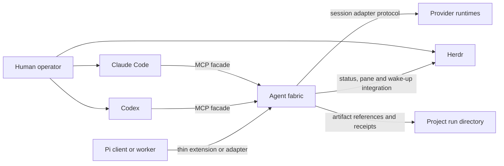

# Shared agent fabric

Status: Current protocol, provider-task, review-snapshot, route-lineage, operator-projection and seat-generation extensions approved; implementation in progress; final human acceptance pending
Version: 0.30
Date: 13 July 2026
Chair for this design stage: Codex
Decision owner: This specification; no separate ADR is maintained
Human approval: Accepted by direct instruction on 10 July 2026
Approval effect: The same instruction authorised implementation of Stages 1–5

Version 0.30 closes the implementation-review gaps in v0.29 without widening
scope. The daemon builds a complete content-addressed review bundle from a
sealed delivery basis and clean base/head state, snapshots proved
publication-time session lineage plus the exact chair/profile, and admits one
linear action/evidence head per slot. Router admission is structural, bounded,
side-effect-free and stable-key single-flight. Raw answers and errors remain
private; public surfaces carry safe result/failure, bundle/coverage, route and
lineage digests. One recovery owner safely settles every certifying action,
including route-integrity custody, and rotate/compact uses asynchronous
suspended lifecycle custody with ABA-safe identity/bridge generations. Version 0.29 closes the provider-review lineage gap already covered by
FR-015, FR-016A, AC-014 and Spec 05 v1.4. A task-bound answer-bearing spawn
now carries one strict route request. At new-action admission the daemon invokes
the trusted existing model router, verifies the resolved adapter, model,
family and effective effort against the admitted provider payload, and commits
the canonical route request, receipt and their digests with the immutable
provider action before provider I/O. Exact replay uses that stored route;
changed route input conflicts. A chair-only typed review-evidence operation
then derives reviewer identity, terminal answer/result digest and structural
independence from durable action, route and reviewed-artifact publisher
lineage. Caller-authored post-hoc route receipts, provider-family assertions
and independence booleans no longer certify review. This clarification does
not approve proposed continuity-routing modes or any other later-spec
capability. Version 0.28 keeps task-bound provider execution within the public protocol's
30-second request ceiling. Dispatch atomically reserves and journals the action
plus command receipt, queues one daemon-owned completion, and returns its
durable `prepared` or `dispatched` receipt before provider completion. The chair reads the same action until
terminal answer evidence and digest are available; disconnect, timeout or an
exact replay never starts another effect. Version 0.27 binds task-bound provider
work and every applicable hard provider
dimension to one delegated authority-budget custody, and closes the Console
decision projections. An ephemeral spawn atomically reserves its enforceable
turn/call/concurrency ceiling plus each configured cost, token or wall-clock
dimension in the same transaction that creates the immutable provider action.
Exact terminal usage consumes and releases the reservation once; ambiguity
retains it; unprovable usage freezes only the affected dimensions until an
authenticated reconciliation proves them. Terminal tasks admit no new
ephemeral work. Attention may carry only a
daemon-derived, revisioned, same-session/run open-gate binding, while a bound
intake may carry only the durable prior chair-request correlation and current
chair target needed to prepare a successor request. These strict projections
give Pause/Resume, Attention decisions and Discuss/Request-changes real typed
paths without making the Console an authority store. Version 0.26 binds every locally provisioned MCP roster to one daemon-owned
active generation. Replacement is an exact predecessor/replacement CAS that
atomically revokes the prior roster; private filesystem publication uses the
same generation CAS, so a delayed writer cannot restore an older roster.
Point-of-use authentication revalidates the active seat, current session/run,
chair lease and principal generation. Version 0.25 closes the answer-bearing
review contract: a successful task-bound ephemeral provider action validates
one nonempty bounded UTF-8 answer plus its canonical result digest. Version
0.30 keeps raw text public only for non-review work and projects certifying
review as digest plus safe parsed result. It never projects the
raw adapter result object, resume reference, usage record, transport detail or
credential. An adapter must explicitly advertise answer-bearing spawn support;
otherwise Fabric rejects the review before provider I/O. Version 0.24 adds one
current task-bound ephemeral provider path for fresh
reviewers and bonus-family workers. `fabric_provider_action_dispatch` accepts
`operation: spawn` only with an exact active task, narrowed authority,
explicit model/family and read-only admitted payload. It records the provider
action and bounded result without creating a retained agent identity or a
second control plane. Version 0.23 remains the normative pre-release
consolidation. Fabric supports one current database baseline and public
protocol, preserves incompatible local
state without mutation, and rejects it explicitly rather than importing or
emulating it. It also owns exact project/session/run topology, coordinated
workstreams, generation-bound live chair handoff and typed operator effects.
Any later reference to an incremental migration number, vintage daemon/client,
implicit run import, retired decoder, coarse authority bundle or compatibility
retry is superseded. Current optional-feature negotiation, provider capability
discovery and pinned adapter artifacts remain required hardening, not
backward-compatibility promises. No amendment authorises provider login, push,
release or unattended daemon operation.

## 1. Decision requested

Implement the accepted local, harness-neutral agent fabric that Claude Code, Codex and future
clients can use through a shared protocol. The fabric provides durable two-way
messages, task and team ownership, provider session control, bounded hierarchy,
and optional Herdr visibility.

The human instruction on 10 July 2026 accepted this specification and named all
five implementation stages. It authorises local source, tests, compatibility
data and documentation. It does not authorise daemon installation or startup,
provider login, MCP registration, external messaging, deployment, release,
provider-session deletion, or Git staging and commits. Those actions retain
their separate gates.

### 1.1 Pre-release baseline and cutover

Until the first human-accepted release, source HEAD owns one canonical database
schema epoch and one current public protocol contract. Fresh state is created
directly from that baseline. The runtime shall not carry old-schema repair,
implicit legacy-run import, vintage-daemon fixtures, old-client/new-daemon
result shims or an old-protocol Console retry. A database bearing an earlier or
unknown schema fingerprint fails closed with a typed cutover-required error;
the runtime never rewrites, deletes or silently adopts it. Any operator-chosen
export, archive or replacement of that state is a separate explicit action.

This rule does not remove current extensibility. Closed codecs, bounded feature
negotiation for independently optional current capabilities, provider
capability handshakes, adapter/model allowlists and pinned compatibility
artifacts remain mandatory. They protect the current system and future
extension; they do not promise execution of an obsolete binary or schema.

## 2. Problem

The harness already defines Claude Code and Codex as equal primaries, one
session chair, one stage owner and one writer for a shared source surface. Its
paired-primary mode exchanges immutable artifacts and uses Herdr for observable
steering. These contracts prevent competing bosses, but the runtime is still
turn-based:

- pane sends are best-effort wake-ups rather than acknowledged messages;
- there is no shared mailbox or replay cursor;
- no registry binds a fabric identity to Claude, Codex or Pi session IDs;
- team hierarchy, inherited budgets and delegation narrowing are prose rules;
- each provider needs bespoke dispatch glue;
- interactive sessions are observable but cannot accept reliable external
  structured push messages.

The proposed fabric makes those contracts executable while preserving the
existing source of truth and the option to watch paired agents side-by-side.

## 3. Goals

- Give Claude Code and Codex the same chair and participant interface.
- Let either primary chair without making the other primary's private plugin or
  session store authoritative.
- Support persistent paired collaboration with durable request, response and
  acknowledgement semantics.
- Support headless, observed, interactive and hybrid execution profiles.
- Model a single chair, bounded leader teams and workers without creating
  multiple authorities.
- Permit direct agent-to-agent communication without treating messages as
  permission grants.
- Keep model and effort routing in `config/model-routing.json`.
- Add providers through capability-advertising adapters, not provider-specific
  skills.
- Preserve project-owned artifacts and curated project documentation.
- Recover safely from daemon, adapter, worker and chair interruption.
- Make operational cost, context pressure, failures and human intervention
  visible in receipts.

## 4. Non-goals

- A distributed or remote multi-user control plane.
- Global peer-to-peer broadcast or consensus-based ownership.
- Guaranteed structured push into an unmanaged interactive TUI.
- Replacement of Claude Code, Codex, Herdr or provider-native subagents.
- A new model catalogue separate from `config/model-routing.json`.
- Physical filesystem isolation. Coordination leases complement, but do not
  replace, runtime sandboxes and operating-system controls.
- Automatic public release, deployment, provider login or subscription use.
- Unlimited recursive teams in the first release.
- Durable storage of complete chat transcripts as project truth.

## 5. Stakeholders and concerns

| Stakeholder | Concern | Design response |
|---|---|---|
| Human operator | Side-by-side visibility and the ability to intervene | Herdr observed and interactive profiles; intervention receipts |
| Session chair | One interface for assignment, messages, gates and synthesis | Symmetric MCP facade and fenced chair lease |
| Stage or task owner | Clear authority, dependencies and completion barrier | Task graph, authority envelope and task-owner lease |
| Peer or reviewer | Independent access to evidence without write overlap | Read-only authority, artifact references and authorship records |
| Team leader | Bounded ability to delegate and supervise | Narrowing validation, budget reservation and depth limits |
| Worker agent | Stable assignment, mailbox and lifecycle contract | Provider-neutral adapter protocol and resumable identity |
| Maintainer | Replaceable providers and testable upgrades | Adapter capability handshake and contract tests |
| Project owner | Project knowledge remains portable | Project run directories remain authoritative |

### 5.1 Release and conformance boundary

This specification describes the Stage 5 target state. Stages 1 and 2 are
internal foundation milestones. The first operational release ends at Stage 3
and supports one chair, one paired primary, direct chair-owned workers, shared
MCP messaging, and headless, observed and interactive profiles. Provider
expansion is Stage 4. Leader-managed teams, inherited budgets and recursive
records are Stage 5 and remain disabled before that stage.

Each requirement and acceptance scenario names its introduction stage. A stage
passes only the requirements introduced at or before it. The implementation
plan shall contain a requirements traceability matrix covering tests and
stages; an unmapped
requirement blocks acceptance of that stage.

## 6. Risk and authority profile

Risk tier: **crucial**. The design affects a shared harness, credentials-adjacent
provider processes, write authority and stateful runtime data.

The following envelope records the completed design pass. The active delivery
authority is recorded in the canonical `.agent-run/AFAB-001/RUN.json`
`delivery-run` receipt.

```yaml
authority:
  approver: human-maintainer
  expires_at: design-approval-or-rejection
  allowed_source_paths:
    - docs/specs/
  allowed_artifact_paths:
    - /tmp/fable-agent-fabric-design.md
    - /tmp/agent-fabric-review-*.md
  prohibited_actions:
    - implement-runtime-code
    - register-mcp-server
    - modify-provider-authentication
    - start-or-install-daemon
    - delete-or-compact-provider-sessions
    - change-model-routing
    - commit-or-release
  disclosure:
    external_provider_source: local-harness-docs-only
    secrets: prohibited
```

## 7. System context



> The fabric owns coordination state. The project owns durable work products.
> Herdr owns visibility, not authority or message truth.

## 8. Runtime containers

```text
Claude or Codex MCP process
  -> lightweight stdio proxy
  -> private local Unix socket
  -> one shared agent-fabric daemon
       -> SQLite/WAL coordination store
       -> append-only event and receipt exporter
       -> provider adapter supervisors
       -> Herdr integration
       -> project artifact resolver
```

### 8.1 Source layout

```text
~/.agents/
  runtime/agent-fabric/
    package.json
    src/core/
    src/adapters/
    src/transports/
    schemas/
    migrations/
    tests/
  config/agent-fabric.yaml
  config/model-routing.json
  scripts/agent-fabric
  scripts/agent-fabric-mcp
```

### 8.2 Runtime layout

```text
~/.local/state/agent-harness/fabric/fabric-v1.sqlite3
~/.local/state/agent-harness/fabric/exports/<run-id>/
$XDG_RUNTIME_DIR/agent-harness/fabric-v1.sock
<project>/.agent-run/<run-id>/
```

When `XDG_RUNTIME_DIR` is absent, macOS uses a fabric-owned `0700` directory
under `$TMPDIR`. The socket is `0600`. No network listener is enabled by
default.

### 8.3 Configuration precedence

Configuration is validated before use. Unknown keys are errors. Project
configuration is untrusted: it may select only globally allow-listed values and
may narrow policy, never choose executable code, credentials or listeners.

```yaml
configuration_contract:
  schema_version: 1
  unknown_keys: error
  trusted_layers:
    - ${AGENTS_HOME}/config/agent-fabric.yaml
    - ${XDG_CONFIG_HOME}/agent-fabric/local.yaml
  untrusted_project_layer: <project>/.agents/agent-fabric.yaml
  run_layer: validated-run-authority-envelope
  merge_rules:
    authority_sets: intersection
    numeric_limits: minimum
    expiries: earliest
    deny_flags: false-dominates
    named_profile_selection: later-layer-within-trusted-allow-list
  trusted_only_fields:
    - adapter-command
    - adapter-package-or-plugin-path
    - executable-path
    - environment-source
    - listener-or-socket-location
    - provider-credential-selector
  project_permitted_fields:
    - named-execution-profile
    - allow-listed-adapter-id
    - role-routing-within-global-policy
    - narrowed-workspace-roots
    - narrowed-resource-limits
secrets:
  sources:
    - environment
    - operating-system-keychain
  permitted_in_yaml: false
routing:
  source: ~/.agents/config/model-routing.json
```

## 9. Execution control, visibility and inbox delivery

Execution control, operator visibility and inbox delivery are independent
dimensions. A named profile resolves all three and is accepted only when the
selected adapter advertises the required capabilities.

```yaml
profile_dimensions:
  control_mode:
    - managed
    - shared-session-ui
    - attached-interactive
  visibility_mode:
    - none
    - event-mirror
    - provider-tui
  inbox_delivery_mode:
    - structured-push
    - verified-boundary-inject
    - cooperative-pull
    - notify-only
```

Authority, task, mailbox and evidence semantics do not change with the profile.
Control strength, delivery latency and direct-input provenance are explicit in
the run receipt.

### 9.1 Headless managed sessions

Provider sessions run through SDK, app-server, RPC or ACP adapters without a
dedicated Herdr pane. They require `managed` control and normally use
`structured-push`. This is the lowest-overhead profile for mechanical workers
and large fan-out.

### 9.2 Observed managed sessions

The provider session remains owned by its adapter. Herdr starts a read-only
`agent-fabric observe` renderer in a pane. The renderer follows the fabric's
redacted activity-event cursor and displays bounded status, tool and output
events. It cannot send provider turns, acknowledge mailbox messages, acquire
leases or mutate task state.

Closing the pane stops only the renderer. Reopening it resumes from the last
display cursor or a bounded current snapshot; it never creates another provider
session. A provider-native shared-session UI may replace the renderer only when
the adapter contract-tests that capability.

The renderer consumes redacted event-envelope version 1, persists only its
display cursor, and exits non-zero on schema or authentication failure. Its CLI
supports `observe --run <id> [--agent <id>] [--after <cursor>] [--json]`.
Renderer reads never claim or acknowledge mailbox deliveries.

Observed managed sessions are recommended for the non-chair primary when direct
typing into it is not required. The chair remains the human-driven session and
is never replaced by a fabric-owned observer.

### 9.3 Attached interactive sessions

A provider TUI runs in a terminal the operator controls: either the terminal
where the human started it or a Herdr pane opened for it. A running TUI cannot
be re-parented into Herdr. A chair outside Herdr remains interactive but has no
pane telemetry. Its delivery mode is declared by the adapter:

- `verified-boundary-inject` requires an integration that returns the delivered
  message IDs to the fabric;
- `cooperative-pull` requires the agent to call `fabric_message_receive` and
  `fabric_message_ack` at instructed turn boundaries;
- `notify-only` surfaces unread state but cannot satisfy a bounded automatic
  response requirement.

An idle interactive session has no bounded delivery time. The fabric retries
wake-ups with backoff and escalates a still-unacknowledged `requires_ack`
message to the operator after the configured deadline.

A safe turn boundary is a versioned adapter event emitted after the provider
reports no active tool or model turn and before the adapter accepts another
turn. Cooperative clients pull the mailbox only at this boundary or on an
explicit operator request. Absence of this event keeps delivery pending.

A message is consumed only when the fabric receives an authenticated consume or
acknowledgement operation for its ID. Hook invocation, pane focus, terminal
input and prompt submission are not consumption evidence. Terminal input is a
wake-up capability, never a structured `send_turn`.

Direct operator input may change the active turn outside the task plan. Fabric
tools provide an explicit `operator_intervention` operation. When an integration
reports an external revision or the operator records an intervention, the task
owner reconciles it before barrier closure. If direct-input provenance is
unavailable, the receipt records that limitation and interactive task closure
requires explicit owner confirmation.

### 9.4 Profile changes

A profile change that cannot preserve the provider session is a lifecycle
rotation: checkpoint, stop delivery, close the adapter-turn lease, attach or
spawn the replacement, rehydrate it from the checkpoint, then acknowledge the
new generation. Only a contract-tested `shared-session-ui` adapter may add or
remove a view without rotation.

### 9.5 Hybrid profiles

Roles may use different profiles. The default side-by-side profile is:

```yaml
execution_profile:
  name: paired-visible
  default:
    control_mode: managed
    visibility_mode: none
    inbox_delivery_mode: structured-push
  roles:
    chair:
      control_mode: attached-interactive
      visibility_mode: provider-tui
      inbox_delivery_mode: cooperative-pull
    paired-primary:
      control_mode: attached-interactive
      visibility_mode: provider-tui
      inbox_delivery_mode: cooperative-pull
    leader:
      control_mode: managed
      visibility_mode: event-mirror
      inbox_delivery_mode: structured-push
    worker:
      control_mode: managed
      visibility_mode: none
      inbox_delivery_mode: structured-push
  herdr:
    layout: side-by-side
    retain_panes_after_completion: prompt
```

`paired-visible` places both primaries side-by-side only when the chair was
launched or attached under Herdr. Otherwise it shows the peer beside an unpaned
chair and records `visibility-degraded` for chair pane telemetry only.

The `paired-observed` profile keeps the chair interactive and runs the non-chair
primary with managed control, event-mirror visibility and structured push. It
provides stronger control over the peer while preserving the human-driven
chair.

## 10. Authority and team topology

The system combines four structures:

```text
authority:       one rooted supervisor tree
work:            one task dependency graph
communication:   durable addressable mailboxes
evidence:        immutable project artifacts by path and hash
```

Stage 5 supports one chair, up to four leaders and up to five workers per
leader. The schema is recursive, but Stage 5 policy limits the depth to two
levels below the chair.

Each agent has one authority parent per run. It may belong to multiple bounded
discussion groups. Leaders own disjoint task subgraphs. A leader council is
advisory; every task, stage and decision has one named owner.

Native subagents are either:

- **opaque children**, managed by the provider-native parent and counted
  against its budget; or
- **registered children**, given fabric identity because they need direct
  task ownership, cross-team messages or durable reassignment.

An agent cannot be managed simultaneously as both an opaque native child and a
registered fabric child.

## 11. Core records

```yaml
agent:
  agent_id: run-local-stable-id
  provider_session_ref: adapter-owned-resume-reference
  parent_agent_id: sole-authority-parent
  team_id: primary-team
  role: chair-or-leader-or-worker-or-reviewer
  authority_ref: immutable-envelope-hash
  budget_ref: inherited-budget-reservation
  control_mode: managed-or-shared-session-ui-or-attached-interactive
  visibility_mode: none-or-event-mirror-or-provider-tui
  inbox_delivery_mode: structured-push-or-verified-boundary-inject-or-cooperative-pull-or-notify-only
  pane_ref: optional-herdr-pane-id
  observer_ref: optional-renderer-id
  lifecycle: starting-or-ready-or-busy-or-checkpointing-or-idle-or-suspended-or-archived
```

```yaml
task:
  task_id: stable-id
  parent_task_id: optional
  dependencies: []
  owner_agent_id: exactly-one
  authority_ref: immutable-envelope-hash
  budget_ref: reservation
  base_revision: project-revision-or-artifact-generation
  expected_artifacts: []
  objective_checks: []
  human_gates: []
  state: proposed-or-ready-or-active-or-blocked-or-complete-or-cancelled-or-degraded
```

```yaml
budget:
  schema_version: 1
  budget_id: stable-id
  parent_budget_id: optional
  currency: provider-billing-currency-or-none
  hard_limits:
    provider_cost_microunits: integer-or-none
    input_tokens: integer-or-none
    output_tokens: integer-or-none
    provider_calls: integer-or-none
    concurrent_turns: integer-or-none
    descendants: integer-or-none
    message_bytes: integer-or-none
    artifact_bytes: integer-or-none
    wall_clock_milliseconds: integer-or-none
  advisory_limits: same-dimensions-as-hard-limits
  reserved: same-dimensions-as-hard-limits
  consumed: same-dimensions-as-hard-limits
  unknown_usage_policy: freeze-hard-dimension-or-advisory-estimate
```

All quantities are non-negative integers; money uses provider-currency
microunits. A child reservation atomically debits the parent's available
balance. Consumption draws from the reservation. Idempotent release returns
only unused reserved units and cannot raise the parent above its original
grant. Usage unknown for a hard dimension freezes further reservations on that
dimension until reconciled. Unknown advisory usage may continue only with an
estimate and a degraded receipt. Limits in different currencies or provider
token units are not silently combined.

```yaml
message:
  message_id: uuid-v7
  run_id: stable-id
  sender_id: server-derived-agent-id
  audience_selector: agent-or-team-or-task
  kind: request-or-response-or-event-or-steer-or-cancel-or-escalate-or-ack
  conversation_id: bounded-exchange
  reply_to: optional-message-id
  task_id: owning-task
  task_revision: compare-and-set-revision
  inline_body: maximum-4096-bytes
  artifact_refs: []
  requested_action: explicit-or-none
  requires_ack: true-or-false
  dedupe_key: sender-scoped-retry-identity
  expires_at: optional
  hop_count: bounded
```

`agent` is the only stored mailbox recipient. Sending to a team or task
atomically snapshots its authorised membership and creates one immutable
delivery row per recipient. Each delivery records message ID, recipient agent,
mailbox sequence, state, attempt count, claim deadline and acknowledgement
time. Delivery state is `ready`, `claimed`, `acknowledged`, `abandoned` or
`expired`; `delivery-pending` is the derived status for a required delivery that
has not reached a terminal state by its response deadline. Sequence numbers are
monotonic per run and recipient.

`successor-pending` is likewise an orthogonal derived routing disposition, not
a delivery state or receipt counter. It is true exactly when stored state is
`ready`, the row is unclaimed for that recipient, and the recipient has one
valid active lifecycle-delivery owner: one nonfinal custody, one standalone
`open` generation loss, or the exact linked pair of a `recovery-in-progress`
loss and its nonfinal fresh custody. A standalone recovery-in-progress loss or
crossed/multiple unrelated owners is integrity-failure and remains claim-
fenced. This single predicate includes
ready rows already present at the custody delivery cut and rows enqueued after
it. Mailbox/operator projections expose
`routingDisposition: normal|successor-pending`; receipt state/count remains
`ready`. Claim uses the same joined predicate and rejects successor-pending.
Adoption finalises the custody and any linked loss without changing the
delivery row, so the predicate becomes false and the same ready row becomes
claimable. Confirmed lifecycle abandon instead changes every matching
successor-pending ready row to
`abandoned` with the recovery reason and watermark transition in its terminal
transaction. No `successor-pending` column or sixth delivery-state value exists.

Receive claims a delivery for a bounded visibility timeout. A crash before
acknowledgement returns it to ready. Acknowledgement is per delivery and means
that the named agent durably consumed it. A contiguous watermark advances only
past deliveries that are acknowledged, abandoned with a reason, or expired by
policy. Out-of-order acknowledgements do not skip gaps.

`dedupe_key` is unique per run and authenticated sender. It maps to one
immutable audience expansion and payload hash. Reuse with a changed payload or
audience is a conflict. Delivery is at least once; consumers are idempotent.

Task claim, delegation, write-scope transfer, task completion and barrier close
are single SQLite transactions. All predicates are rechecked inside the write
transaction. Budget reservations debit the parent's available ledger balance;
idempotent release cannot increase it above the original grant. Every
transition has a stable command ID and returns the committed result on retry.

## 12. Leases, delegation and barriers

The daemon issues fenced, generation-bearing leases:

- one chair lease per run;
- one owner lease per active task;
- one write-scope lease per canonical path set;
- one adapter-turn lease per fabric-managed provider session. Attached
  interactive sessions have registry and mailbox identity but no fabricated
  external turn control.

Every mutation supplies the expected lease generation. Stale generations fail
closed. Child authority must be a strict or equal subset of its parent for
paths, actions, disclosure, expiry and budget.

Lease expiry or generation change fences fabric mutations only. Before granting
an overlapping successor write-scope or adapter-turn lease, the daemon proves
one of:

1. the predecessor process or turn is terminal and its write capability has
   been revoked;
2. an operating-system sandbox prevents it reaching the successor's scope; or
3. it could produce only immutable patch artifacts and the sole serial applier
   rejects its old generation.

If none is provable, the scope is `quarantined` and no successor writer starts.
Unmanaged interactive or full-access sessions are patch-only unless their
liveness and revocation mechanism is enforced. Lease generation and action ID
are propagated to adapter commands and serial-apply operations.

A subtree leader may close a subtree barrier. Only the chair closes a stage or
run barrier. Closure requires:

- required descendants are terminal, cancelled or explicitly degraded;
- no unresolved provider turn or active write lease remains;
- artifacts and hashes are recorded;
- required checks pass;
- required messages are acknowledged or abandoned with a reason;
- the checkpoint records mailbox cursors and provider resume references;
- human gates are resolved;
- the next owner acknowledges the exact generation and revision.

For the final run barrier, the human acceptance gate takes the place of
next-owner acknowledgement.

Direct filesystem access cannot be perfectly fenced by the daemon. Shared
source retains the serial-applier rule unless write scopes are provably
disjoint and predecessor revocation is enforced.

## 13. Provider adapter contract

Each adapter runs behind a versioned process boundary in the first release.
Adapter failure must not crash the core.

```yaml
adapter_operations:
  registration_required:
    - capabilities
    - status
    - release
    - lookup_action
    - cancel_action
  managed_session_required:
    - spawn
    - send_turn
    - interrupt
    - resume_reference
    - dispatch
  attached_interactive_required:
    - attach
    - status
    - wakeup
    - resume_reference
  optional:
    - steer
    - follow_up
    - compact
    - fork
    - native_subagents
    - enforced_read_only
    - usage_and_cost
    - shared_session_ui
    - verified_boundary_inject
    - compact_in_place
```

Every side-effecting adapter command uses a fabric-generated `action_id`, lease
generation and immutable payload hash. The adapter durably records
`prepared`, `dispatched`, `accepted`, `terminal` or `ambiguous`. The core calls
`lookup_action` after ambiguity and never automatically replays a side-effecting
command unless downstream idempotency for that action ID is proven. Otherwise
the task is quarantined for explicit recovery. The action record commits before
dispatch; its terminal result commits before message acknowledgement.

`lookup_action` applies to every adapter operation with external effects,
including provider-mutating release or wake-up implementations. An adapter may
declare an operation core-only and idempotent only when it does not mutate the
provider session or external state; that declaration is contract-tested.

The scheduler does not assign a role whose control, delivery or recovery
requirements exceed the session's advertised capabilities.

`steer` and `follow_up` execute under the active turn lease held by the turn
initiator; they do not acquire a second generation. Only a new `send_turn`
acquires a new adapter-turn lease. Interactive targets return
`capability_unavailable` for turn-control operations and use mailbox plus
wake-up instead.

Planned adapters:

| Adapter | Intended role | Notes |
|---|---|---|
| Claude Agent SDK | Claude primary, leader or worker | Persistent headless sessions; interactive TUI remains a separate profile |
| Codex app-server | Codex primary, leader or worker | Thread and turn lifecycle; contract-test generated protocol schemas |
| Pi SDK or RPC | Generic API and open-provider workers | Model-neutral worker runtime; not the authority store |
| Agy | Gemini or Antigravity access | Adapter only; no separate provider skill |
| Cursor | Composer and Grok only | Model allow-list remains routing policy |
| Kiro or ACP | Open-model runtime | Capability-discovered, optional and non-blocking |
| Herdr | Pane placement, observation and wake-ups | Never authoritative transport |

Unsupported optional capabilities return a typed `capability_unavailable`
result. The router may choose a compatible substitute only when the existing
model-routing policy permits substitution and records it.

## 14. MCP and client interface

Claude Code and Codex launch separate stdio MCP proxy processes. Each proxy
connects to the same Unix socket and shared daemon. The proxy may safely start
the daemon under a single-instance lock when it is absent.

The operation registry is the sole owner of the current MCP tool set. Every
active agent-principal operation has an exhaustive `tool` or `none`
classification and every `tool` entry owns one stable name. The generated
descriptor/reference artifact, rather than a second list in this document,
records the Stage 2-5 and Spec 05 names. V1 has exactly one descriptor per
operation; constant-bound aliases such as a steer-only provider action or a
release-only lifecycle action are not additional descriptors. A future variant
projection must replace the whole-operation descriptor with a registry-declared
exhaustive, non-overlapping set and cannot silently omit an admitted enum member.

Run creation belongs only to reviewed operator launch custody. There is no
private or agent `createRun` method, and `fabric_run_create` is never an MCP descriptor. The
proxy accepts only an `afc_` agent capability, initialises with
`expectedPrincipalKind: agent` and rejects a bootstrap credential before
advertising tools.

Private local seat provisioning names an expected prior roster generation and
one immutable replacement generation for the exact project/session/run/chair
identity. The database owns the sole active generation per project and revokes
all capabilities belonging to its predecessor in the same transaction that
activates the replacement. Exact current-generation replay is idempotent;
stale, rollback and cross-project attempts fail closed.

The generated read descriptors additionally own these resource templates:

- `fabric://runs/{run_id}/status`
- `fabric://runs/{run_id}/tasks`
- `fabric://runs/{run_id}/agents`
- `fabric://runs/{run_id}/receipts`

Unshipped or registry-classified `none` operations are absent rather than
stubbed. Stage 2 contract tests
verify resource round-trips from both MCP clients. The four URI templates are
MCP-native convenience projections of the same generated run-status, task-list,
agent-list and receipt-list descriptors; they are not another schema owner.
Every surface, including Codex dynamic tools, exposes those four generated read
tools even when it has no resource-template channel.
Subtree-barrier closure by a leader becomes available with teams in Stage 5;
before then `fabric_barrier_close` accepts only chair-owned run or stage scope.

MCP notifications are not assumed to reach every interactive client. Mailbox
state and adapter delivery remain authoritative.

The complete current set is generated from the same closed agent-operation
codecs and principal registry as the public protocol. The standalone MCP proxy
negotiates the authenticated agent protocol before advertising tools; it does not retain
a second hand-written method vocabulary. Operations absent from the negotiated
features or current authority are absent from the advertised tool list, not
present as permissive generic RPC. Inputs and outputs are validated by the
shared codecs before and after the daemon call.

Registry classification is compile-time exhaustive. `registerAgent`,
`rotateCapability` and any other operation whose result still contains a bearer
secret are `none`. Spawn and attach become `tool` only with secret-free public
result codecs and shared custody: the daemon generates the target capability,
persists only its digest and privately hands plaintext to a bridge-provisioning
adapter inside the stable one-effect provider action. The model-visible result
contains agent/action/session identity plus `bridgeState` and
`bridgeGeneration`, never the token. An adapter that cannot provision a bridge
advertises that fact before dispatch; attach may then register a bridge-less
mailbox/wake-up participant with `bridgeState: none`, but neither attach nor
spawn fabricates a live Fabric tool surface. A supported retained bridge must
complete a later provider-originated Fabric call before it is claimed active.
Attach remains registry-classified `tool` regardless of the selected adapter's
bridge capability; `bridgeState` reports the runtime outcome.

Every model-visible result is the exact closed public result codec. Opaque
provider output is replaced by typed contract evidence and/or a digest before
projection. A validated bounded `providerAnswer` remains available only for a
non-review task-bound ephemeral spawn. A certifying review projects its answer
digest and safe parsed result, never raw text. `additionalProperties: true`,
raw provider JSON and copied output schemas are forbidden.

A launched chair receives this same current, principal-scoped MCP operation
surface through the secret-consuming provider-session bridge. Its one-use
attestation operation is also registry-classified `tool`, but only the
launch-attestation feature/grant projects it; standalone proxies cannot see it.
“Private” means grant-scoped and one-use, not registry-exempt. Claude SDK MCP
tools and Codex app-server dynamic tools may use provider-specific transport descriptions, but their Fabric names,
schemas, authority results and receipts are generated from the same descriptors.
The provider session must originate every tool call. The adapter wrapper may
route and validate an attributed call but cannot invoke a Fabric operation on
the model's behalf and report that as session activity. Later turns reuse the
same retained bridge; a resume reference without it exposes no Fabric tools and
follows chair-loss recovery.

## 15. Session lifecycle

The agent may request compaction, rotation or release. The fabric validates
only fabric-managed lifecycle actions. Provider-native automatic compaction and
direct interactive lifecycle commands are external events: prevent them where
a supported policy control exists; otherwise detect and journal them when
possible and reconcile at the next boundary.

```yaml
lifecycle_request:
  action: compact-or-rotate-or-completion-ready-or-release
  agent_id: stable-id
  task_revision: exact-revision
  checkpoint_ref: path-and-sha256
  mailbox_watermark: last-contiguous-disposed-sequence
  acknowledged_above_watermark: []
  in_flight_children: []
  open_work: []
  next_action: exact-action
```

Policy by role:

- chair and primary leaders persist for a run and rotate at barriers or context
  pressure;
- team leaders persist for their task subgraph;
- workers are normally ephemeral;
- independent reviewers start with fresh context;
- the fabric refuses lifecycle requests that clear or release a work-owning
  agent without a valid checkpoint, and marks the agent `degraded` if provider
  session state is found reset without one;
- `compact_in_place` is used only when the adapter advertises it and returns the
  resulting provider-session generation;
- the portable fallback is rotation: checkpoint, stop new delivery, reconcile
  children and leases, start or resume a replacement session, inject the
  checkpoint, verify task and mailbox revisions, then release the old lease;
- a session compacted without a valid checkpoint is `context-unreconciled` and
  cannot close a barrier or retain a write lease until reconciled;
- completion drains or cancels children, releases leases, exports receipts and
  archives registry state;
- provider session deletion requires retention policy or human authority.

## 16. Persistence and retention

SQLite/WAL owns concurrent coordination records: agents, tasks, mailbox events,
cursors, leases, budgets, provider resume references and schema migrations.
Stage 1 isolates synchronous SQLite writes and checkpoints from adapter event
processing so a migration or WAL checkpoint cannot stall provider supervision.

Each project run directory owns:

- assignment and authority envelopes;
- checkpoints and handoffs;
- reports, patches and verification evidence;
- model-routing and adapter receipts;
- final synthesis and human-gate state.

Mailbox bodies are operational state and default to ephemeral retention.
Artifacts referenced by messages retain their project-defined classification.
The fabric never deletes provider-native session files. Unknown or user-owned
files are never pruned.

## 17. Failure handling

| Failure | Required behaviour |
|---|---|
| Daemon restart | Replay committed events and restore cursors. Ordinary provider sessions follow their adapter recovery contract. A launched chair whose volatile bridge is lost is journalled and fenced as chair loss; never re-expose Fabric tools from its resume reference alone. Recovery uses the explicit generation-bound chair-bridge recovery custody below. |
| Duplicate message | Deduplicate by message and action key |
| Unknown provider turn | Reconcile adapter state before retrying any side-effecting action |
| Worker loss | Expire its turn lease, preserve partial artifacts and notify its parent |
| Leader loss | Freeze new grants in its subtree; chair adopts or reassigns with a new generation |
| Chair loss | Require explicit lease takeover and persisted handoff; never silently promote a peer |
| Provider outage | Bound retries; degrade optional families; block required coverage |
| Herdr control or telemetry socket loss | Continue only healthy provider processes; mark `visibility-degraded`; infer no task state from absent telemetry |
| Observed renderer or pane loss | Keep the adapter-owned session; recreate only the renderer and resume its display cursor |
| Interactive TUI or pane-process loss | Freeze delivery and the turn lease; reconcile the provider session; explicitly reattach or rotate with a higher generation |
| Interactive operator edit | Record it where integrations permit; regardless of detection, compare-and-set rejects stale task mutations and forces reconciliation; declare provenance limits honestly |
| Message storm | Apply quotas, hop limits, bounded conversations and no global broadcast |
| Overlapping writes | Reject intersecting leases and verify base revision after writes |
| Store corruption | Stop mutations, preserve the database and require recovery from exports or backup |

## 18. Security and privacy

- The daemon listens only on a per-user Unix socket by default.
- Socket and state directories reject group or world access.
- A discovery token authenticates only a same-user control-plane client; it is
  not an agent-authority credential. Its purpose is to deny access to sandboxed
  worker processes that share the user ID but cannot read the discovery path;
  adapters do not pass it into worker environments.
- On attach, the daemon issues a revocable, run-scoped capability bound to one
  fabric principal, permitted operations, mailbox, authority hash, expiry,
  connection nonce and current lease generation.
- Grants above the client's registered role require chair approval recorded in
  the journal.
- The daemon derives sender, run and authority from authenticated context rather
  than MCP arguments. Chair-only, owner-only and recipient-only access controls
  apply to every tool and resource read.
- Attach, takeover and token rotation are journalled and use compare-and-set
  against the current generation.
- Secrets never appear in configuration, messages, receipts or Herdr pane
  metadata.
- Adapters receive only the environment variables required for their provider.
- Message bodies cannot grant authority. Unrestricted same-user shell access
  may bypass cooperative controls, so receipts distinguish protocol-enforced
  from operating-system-enforced authority.
- Project path resolution rejects traversal, symlink escape and paths outside
  the approved workspace roots.
- Read-only claims distinguish policy-only restrictions from substrate-enforced
  restrictions.
- Remote sockets, WebSocket listeners and external dashboards are disabled in
  the first release.

## 19. Observability and operator control

The fabric exports `<run-dir>/fabric-receipt.json` as generated coordination
evidence. It does not own human acceptance, delivery completion or the final
gate. The chair-owned `.agent-run/<run-id>/RUN.json`, using `contract:
delivery-run` and `schema_version: 1`, remains authoritative. It declares the
fabric receipt as an evidence artifact with a workspace-relative path and
SHA-256 digest; no second run-receipt shape is adopted. Fabric receipt schema
version 2 is the only current codec. No v1 decoder/import/projection exists;
non-current files are preserved but rejected as protocol evidence.

`schemas/fabric-receipt.v2.schema.json` is the normative standalone Draft
2020-12 schema. Every object has `additionalProperties: false`; every property
shown below is required unless its value explicitly admits null; every reference
is local `#/$defs/...`. The runtime shall delete the v1 decoder/import/
projection and fixtures rather than accepting either shape.

The root required properties are exactly:

~~~yaml
$schema: https://json-schema.org/draft/2020-12/schema
type: object
additionalProperties: false
required: [schemaVersion, runId, chair, taskOwners, agents, executionProfile,
  directInputProvenance, reviewCompletion, providerRoutes, providerReviews,
  routeIntegrityRecoveries, taskAndWriteLeases, messageAndDeliveryCounts,
  objectiveChecks, providerFailuresAndSubstitutions, operatorInterventions,
  compactionsAndRotations, eventWatermark, counts, stateHash]
properties:
  schemaVersion: {const: 2}
  runId: {$ref: '#/$defs/id'}
  chair: {$ref: '#/$defs/chair'}
  taskOwners: {$ref: '#/$defs/taskOwners'}
  agents: {$ref: '#/$defs/agents'}
  executionProfile: {$ref: '#/$defs/executionProfile'}
  directInputProvenance: {$ref: '#/$defs/directInput'}
  reviewCompletion: {$ref: '#/$defs/reviewCompletion'}
  providerRoutes: {$ref: '#/$defs/providerRoutes'}
  providerReviews: {$ref: '#/$defs/providerReviews'}
  routeIntegrityRecoveries: {$ref: '#/$defs/recoveries'}
  taskAndWriteLeases: {$ref: '#/$defs/leases'}
  messageAndDeliveryCounts: {$ref: '#/$defs/messageCounts'}
  objectiveChecks: {$ref: '#/$defs/objectiveChecks'}
  providerFailuresAndSubstitutions: {$ref: '#/$defs/providerFailures'}
  operatorInterventions: {$ref: '#/$defs/interventions'}
  compactionsAndRotations: {$ref: '#/$defs/lifecycleRows'}
  eventWatermark: {$ref: '#/$defs/nonnegative'}
  counts: {$ref: '#/$defs/counts'}
  stateHash: {$ref: '#/$defs/digest'}
~~~

Common local scalars are `id` (`type:string`, `minLength:1`,
`maxLength:256`), `nonnegative` (`type:integer`, minimum 0), `positive`
(`type:integer`, minimum 1), `boolean`, `digest` (`type:string`, lowercase
pattern `^sha256:[0-9a-f]{64}$`), `nullableDigest` (`digest|null`) and
`timestamp` (RFC 3339 `date-time`). JSON Schema length counts Unicode code
points, not UTF-8 bytes. After schema validation and before projection/hash,
the runtime therefore performs a mandatory UTF-8 byte validator: every `id` is
1..256 bytes, finding ID 1..64, safe summary 1..256 and safe evidence 1..768.
No schema-valid value bypasses that validator. Closed object definitions have
these exact property sets, scalar mappings and null rules. The following is
binding schema shorthand, not a claim that keys such as `nullOnly` are JSON
Schema vocabulary; the checked-in schema must expand every line into standard
`properties`, `required`, `enum`, `oneOf` and conditional constraints:

~~~yaml
reviewBlockerEnum: [missing-target, stale-target, profile-unavailable,
  missing-evidence, nonterminal-action, ambiguous-action,
  provider-terminal-failure, terminal-no-effect, retired-unknown,
  route-integrity, insufficient-read-coverage, noncertifying, unusable,
  superseded, wrong-artifact, wrong-bundle, wrong-route, wrong-provider,
  wrong-model, wrong-chair-generation, reviewer-independence, open-findings,
  integrity-failure]

chair:
  required: [agentId, principalGeneration, chairLeaseGeneration,
    providerSessionGeneration, bridgeGeneration, adapterId,
    adapterContractDigest, modelFamily, model, routeReceiptDigest]
  nullOnly: [routeReceiptDigest]
  ids: [agentId, adapterId, modelFamily, model]
  positive: [principalGeneration, chairLeaseGeneration,
    providerSessionGeneration, bridgeGeneration]
  digests: [adapterContractDigest]
  nullableDigests: [routeReceiptDigest]

taskOwner:
  required: [taskId, taskRevision, taskState, ownerAgentId, ownerLeaseId,
    ownerLeaseGeneration, ownerLeaseState, membershipRevision]
  taskStateEnum: [blocked, ready, active, complete, cancelled, degraded]
  ownerLeaseStateEnum: [active, frozen, released, revoked, abandoned]
  ids: [taskId, ownerAgentId, ownerLeaseId]
  positive: [taskRevision, ownerLeaseGeneration, membershipRevision]

agent:
  required: [agentId, role, lifecycle, contextState, principalGeneration,
    providerSessionGeneration, bridgeGeneration, currentTaskId,
    checkpointDigest, membershipRevision, membershipState]
  nullOnly: [currentTaskId, checkpointDigest]
  lifecycleEnum: [starting, ready, busy, checkpointing, idle, suspended, archived]
  contextStateEnum: [current, context-unreconciled]
  roleEnum: [chair, leader, worker, reviewer]
  membershipStateEnum: [active, released, abandoned]
  ids: [agentId, currentTaskId]
  positive: [principalGeneration, providerSessionGeneration, bridgeGeneration,
    membershipRevision]
  nullableDigests: [checkpointDigest]

executionProfile:
  required: [profileId, profileSchemaDigest, resolvedProfileDigest,
    authorityDigest, budgetDigest]
  ids: [profileId]
  digests: [profileSchemaDigest, resolvedProfileDigest, authorityDigest,
    budgetDigest]

directInput:
  required: [state, attestations]
  stateEnum: [complete, partial, unavailable]
  attestationRequired: [attestationId, providerMessageId, operatorId,
    provenanceDigest, evidenceDigest]
  attestationIds: [attestationId, providerMessageId, operatorId]
  attestationDigests: [provenanceDigest, evidenceDigest]

targetChair:
  required: [agentId, principalGeneration, chairLeaseGeneration, adapterId,
    modelFamily, model, routeReceiptDigest]
  ids: [agentId, adapterId, modelFamily, model]
  positive: [principalGeneration, chairLeaseGeneration]
  nullableDigests: [routeReceiptDigest]

localProviderRoute:
  required: [schemaVersion, routeRequestDigest, routeReceiptDigest, adapterId,
    adapterContractDigest, providerFamily, resolvedModel, requestedEffort,
    effectiveEffort, targetGeneration, slot, reviewedArtifactRef,
    publicationLineageDigest, bundleDigest, manifestRootDigest,
    coverageDigest, bundleSearchIndexDigest, riskReadMapDigest,
    mandatoryReadSetDigest, finalPromptDigest, targetChair,
    profileDigest, slotHeadGeneration, attemptGeneration]
  schemaVersion: {const: 1}
  nullTogetherForNonReview: [targetGeneration, slot, reviewedArtifactRef,
    publicationLineageDigest, bundleDigest, manifestRootDigest,
    coverageDigest, bundleSearchIndexDigest, riskReadMapDigest,
    mandatoryReadSetDigest, finalPromptDigest, targetChair, profileDigest,
    slotHeadGeneration, attemptGeneration]
  targetChairType: targetChair-or-null
  requestedEffortType: id-or-null
  effectiveEffortType: id
  ids: [adapterId, providerFamily, resolvedModel, reviewedArtifactRef,
    effectiveEffort]
  digests: [routeRequestDigest, routeReceiptDigest, adapterContractDigest]
  nullableDigests: [publicationLineageDigest, bundleDigest,
    manifestRootDigest, coverageDigest, bundleSearchIndexDigest,
    riskReadMapDigest, mandatoryReadSetDigest, finalPromptDigest,
    profileDigest]
  nullablePositive: [targetGeneration, attemptGeneration]
  nullableNonnegative: [slotHeadGeneration]
  slotEnum: [native, other-primary, cursor-grok, agy-gemini, null]

providerRoute:
  required: [actionId, taskId, route]
  route: localProviderRoute
  ids: [actionId, taskId]

safeFinding:
  required: [findingDigest, findingId, severity, summary, evidence,
    originTargetGeneration, originActionRef, originResultDigest,
    originArtifactRevision, originRepositorySourceStateDigest]
  severityEnum: [P0, P1, P2]
  findingDigestType: digest
  findingIdType: byte-validated-finding-id
  summaryType: byte-validated-safe-summary
  evidenceType: byte-validated-safe-evidence
  positive: [originTargetGeneration, originArtifactRevision]
  digests: [originResultDigest, originRepositorySourceStateDigest]
  originActionRef:
    required: [adapterId, actionId]
    ids: [adapterId, actionId]

coverageSummary:
  required: [mode, mandatoryComplete, groups, byteComplete]
  mode: {const: manifest-complete-risk-directed}
  mandatoryCompleteType: boolean
  byteCompleteType: boolean
  groups:
    itemsRequired: [groupId, totalCount, readCount, unreadCount,
      unreadObjectSetDigest]
    itemIds: [groupId]
    groupIdEnum: [security-auth, protocol-schema, persistence-migration,
      provider-adapter, console-ui, tests-evaluations, documentation,
      generated-other]
    itemNonnegative: [totalCount, readCount, unreadCount]
    itemDigests: [unreadObjectSetDigest]
    itemInvariant: totalCount-equals-readCount-plus-unreadCount
    ordering: strictly-ascending-unique-by-groupId

reviewRecord:
  required: [evidenceId, targetGeneration, slot, taskId, actionId,
    terminalKind, verdict, answerSafety, providerAnswerDigest,
    terminalResultDigest, reviewResultDigest, providerFailureCode,
    providerFailureDigest, routeReceiptDigest,
    finalPromptDigest, adapterId, providerFamily, model, bundleDigest,
    coverageDigest, profileDigest, priorHeadGeneration, newHeadGeneration,
    attemptGeneration, priorEvidenceId, priorOpenFindings,
    reportedResolvedFindingDigests, acceptedResolvedFindingDigests, findings,
    newOpenFindings, repairRequiredFindingDigests, readCoverageDigest,
    coverageSummary, mutationReceiptDigest]
  nullOnly: [reviewResultDigest, providerFailureCode, providerFailureDigest,
    priorEvidenceId]
  nullConstants: [providerFailureCode, providerFailureDigest]
  arraysOfSafeFinding: [priorOpenFindings, findings, newOpenFindings]
  terminalKindEnum: [safe-answer, unusable-answer]
  verdictEnum: [CLEAN, FINDINGS, UNUSABLE]
  answerSafetyEnum: [safe, unusable]
  conditional: safe-answer requires safe and CLEAN-or-FINDINGS with nonnull
    reviewResultDigest; unusable-answer requires unusable and UNUSABLE with null
    reviewResultDigest
  ids: [evidenceId, taskId, actionId, adapterId, providerFamily, model,
    priorEvidenceId]
  positive: [targetGeneration, newHeadGeneration, attemptGeneration]
  nonnegative: [priorHeadGeneration]
  digests: [providerAnswerDigest, terminalResultDigest, routeReceiptDigest,
    finalPromptDigest, bundleDigest, coverageDigest, profileDigest,
    readCoverageDigest, mutationReceiptDigest]
  nullableDigests: [reviewResultDigest]
  digestArrays: [reportedResolvedFindingDigests,
    acceptedResolvedFindingDigests, repairRequiredFindingDigests]
  slotEnum: [native, other-primary, cursor-grok, agy-gemini]
  coverageSummary: coverageSummary

reviewCurrency:
  required: [target, source, chair, profile, certifying, blockerCodes]
  targetEnum: [current, stale, superseded]
  sourceChairProfileEnum: [current, stale]
  certifyingType: boolean
  blockerCodes: ordered-closed-review-blocker-enum

providerReview:
  required: [record, currencyAtWatermark]
  record: reviewRecord
  currencyAtWatermark: reviewCurrency

recovery:
  required: [actionId, recoveryGeneration, reason, state, disposition,
    reservationDigest, routeState, routeReceiptDigest, lookupState,
    lookupEvidenceDigest, settlementDigest, recoveryEvidenceDigest]
  routeStateEnum: [present, missing, integrity-failed]
  routeReceiptDigestInvariant: nonnull-iff-routeState-present
  nullOnly: [disposition, routeReceiptDigest, lookupEvidenceDigest,
    settlementDigest]
  stateEnum: [detected, inspecting, terminal-proved-no-effect,
    terminal-proved-usage, awaiting-human-retire, terminal-retired-unknown]
  reasonEnum: [intact-effect-ambiguity, route-row-missing,
    route-row-conflict, route-receipt-mismatch, target-binding-invalid,
    bundle-binding-invalid, prompt-binding-invalid, profile-binding-invalid,
    lineage-binding-invalid]
  dispositionEnum: [proved-no-effect-release, exact-usage-settled,
    conservative-full-ceiling-settled, full-ceiling-retired, null]
  lookupStateEnum: [not-attempted, in-flight, completed]
  ids: [actionId]
  positive: [recoveryGeneration]
  digests: [reservationDigest, recoveryEvidenceDigest]
  nullableDigests: [routeReceiptDigest, lookupEvidenceDigest, settlementDigest]
  conditional: lookupEvidenceDigest is nonnull iff lookupState completed;
    detected/inspecting/awaiting-human-retire require null disposition and
    settlementDigest; terminal-proved-no-effect requires disposition proved-no-
    effect-release and nonnull settlementDigest; terminal-proved-usage requires
    exact-usage-settled or conservative-full-ceiling-settled and nonnull
    settlementDigest; terminal-retired-unknown requires full-ceiling-retired and
    nonnull settlementDigest

objectiveCheck:
  required: [taskId, checkId, kind, state, evidenceRef, evidenceDigest,
    observedSourceStateDigest]
  stateEnum: [pass, fail, not-run]
  nullOnly: [evidenceRef, evidenceDigest]
  conditional: evidenceRef and evidenceDigest are both nonnull iff state pass-or-fail;
    both null iff not-run
  ids: [taskId, checkId, evidenceRef]
  kindType: id-equality-validated-against-checked-in-objective-catalogue
  digests: [observedSourceStateDigest]
  nullableDigests: [evidenceDigest]

providerFailure:
  required: [actionId, requestedAdapterId, requestedFamily, requestedModel,
    resolvedAdapterId, resolvedFamily, resolvedModel, code, evidenceDigest]
  nullOnly: [resolvedAdapterId, resolvedFamily, resolvedModel]
  conditional: resolvedAdapterId/resolvedFamily/resolvedModel are all nonnull or all null
  ids: [actionId, requestedAdapterId, requestedFamily, requestedModel,
    resolvedAdapterId, resolvedFamily, resolvedModel]
  codeType: id-equality-validated-against-activated-adapter-failure-and-substitution-catalogue
  digests: [evidenceDigest]

intervention:
  required: [commandId, operation, operatorId, targetRef, targetRevision,
    directInputAttestationId, resultDigest]
  nullOnly: [directInputAttestationId]
  ids: [commandId, operation, operatorId, targetRef,
    directInputAttestationId]
  positive: [targetRevision]
  digests: [resultDigest]
~~~

`lease` and `lifecycleRow` are tagged unions, never nullable bags:

~~~yaml
lease:
  oneOf:
    - leaseKind: task
      required: [leaseKind, leaseId, ownerAgentId, generation, state,
        taskId, taskRevision, expiry, revision]
      stateEnum: [active, frozen, released, revoked, abandoned]
      expiryType: RFC3339-date-time-or-null
      ids: [leaseId, ownerAgentId, taskId]
      positive: [generation, taskRevision, revision]
    - leaseKind: write
      required: [leaseKind, leaseId, ownerAgentId, generation, state,
        pathScopeDigest, expiry, revision]
      stateEnum: [active, quarantined, lifecycle-quarantined, released,
        revoked-abandoned, expired]
      expiryType: RFC3339-date-time-or-null
      ids: [leaseId, ownerAgentId]
      positive: [generation, revision]
      digests: [pathScopeDigest]

lifecycleRow:
  oneOf:
    - sourceKind: custody
      required: [sourceKind, agentId, custodyId, actionId, state,
        disposition, sourceProviderGeneration, sourcePrincipalGeneration,
        sourceBridgeGeneration, targetProviderGeneration,
        targetPrincipalGeneration, targetBridgeGeneration, checkpointDigest,
        terminalEvidenceDigest]
      nullOnly: [terminalEvidenceDigest]
      stateEnum: [awaiting-boundary, prepared, dispatched, accepted, ambiguous,
        provider-terminal, committing, finalized]
      dispositionEnum: [adopted, no-effect, quarantined, superseded, abandoned, null]
      conditional: disposition is null before finalized and is nonnull exactly
        at finalized; terminalEvidenceDigest is null in awaiting-boundary,
        prepared, dispatched, accepted and ambiguous and is nonnull in provider-
        terminal, committing and finalized
      ids: [agentId, custodyId, actionId]
      positive: [sourceProviderGeneration, sourcePrincipalGeneration,
        sourceBridgeGeneration, targetProviderGeneration,
        targetPrincipalGeneration, targetBridgeGeneration]
      digests: [checkpointDigest]
      nullableDigests: [terminalEvidenceDigest]
    - sourceKind: generation-loss
      required: [sourceKind, agentId, generationLossId, lossKind, actionId,
        state, disposition, oldProviderGeneration, newProviderGeneration,
        oldContextRevision, newContextRevision, checkpointState,
        checkpointDigest, lossEvidenceDigest, terminalEvidenceDigest]
      nullOnly: [actionId, oldContextRevision, checkpointDigest,
        terminalEvidenceDigest]
      lossKindEnum: [generation-advance, context-advance]
      stateEnum: [open, recovery-in-progress, recovered-adopted, abandoned]
      dispositionEnum: [recovered-adopted, abandoned, null]
      checkpointStateEnum: [absent, invalid, last-validated]
      conditional: checkpointDigest nonnull iff last-validated; generation-
        advance requires newProviderGeneration greater than old; context-advance
        requires newProviderGeneration equal oldProviderGeneration, nonnull
        oldContextRevision and different newContextRevision; disposition is null for open/recovery-
        in-progress, exactly recovered-adopted for recovered-adopted and exactly
        abandoned for abandoned; terminalEvidenceDigest is nonnull exactly in
        the two terminal states; actionId is null in open and nonnull in recovery-
        in-progress, recovered-adopted and abandoned
      ids: [agentId, generationLossId, actionId]
      positive: [oldProviderGeneration, newProviderGeneration]
      nonnegative: [newContextRevision]
      nullableNonnegative: [oldContextRevision]
      digests: [lossEvidenceDigest]
      nullableDigests: [checkpointDigest, terminalEvidenceDigest]
~~~

`reviewCompletion` is a local blocker-dependent union, not an external `$ref`:

~~~yaml
reviewCompletion:
  required: [schemaVersion, blockers, targetGeneration, targetChair, reviewedArtifactRef,
    publicationLineageDigest, bundleDigest, manifestRootDigest, coverageDigest,
    riskReadMapDigest, mandatoryReadSetDigest, profileDigest, slots,
    finalReviewComplete]
  schemaVersion: {const: 1}
  blockerItems: reviewBlockerEnum
  nullablePositive: [targetGeneration]
  nullableIds: [reviewedArtifactRef]
  targetChairType: targetChair-or-null
  nullableDigests: [publicationLineageDigest, bundleDigest,
    manifestRootDigest, coverageDigest, riskReadMapDigest,
    mandatoryReadSetDigest, profileDigest]
  finalReviewCompleteType: boolean
  oneOf:
    - when: targetGeneration-null-and-blockers-exactly-missing-target
      blockers: [missing-target]
      targetFields: all-null
      profileDigest: null
      slots: []
      finalReviewComplete: false
    - when: targetGeneration-null-and-blockers-exactly-integrity-failure
      blockers: [integrity-failure]
      targetFields: all-null
      profileDigest: null
      slots: []
      finalReviewComplete: false
    - when: targetGeneration-nonnull-and-profileDigest-null
      requiredTargetFields: [targetGeneration, targetChair,
        reviewedArtifactRef, publicationLineageDigest, bundleDigest,
        manifestRootDigest, coverageDigest, riskReadMapDigest,
        mandatoryReadSetDigest]
      blockersContains: profile-unavailable
      profileDigest: null
      slots: []
      finalReviewComplete: false
    - when: targetGeneration-and-profileDigest-nonnull
      requiredTargetFields: [targetGeneration, targetChair,
        reviewedArtifactRef, publicationLineageDigest, bundleDigest,
        manifestRootDigest, coverageDigest, riskReadMapDigest,
        mandatoryReadSetDigest, profileDigest]
      slots: exactly-four-reviewSlot-objects
      finalReviewCompleteIff: top-blockers-empty-and-every-slot-blockers-empty

reviewSlot:
  required: [slot, headGeneration, attemptGeneration, actionId, evidenceId,
    verdict, resultDigest, routeReceiptDigest, adapterId, providerFamily,
    model, readCoverageDigest, reviewerIndependence, certifying,
    openFindings, blockers]
  nullOnly: [actionId, evidenceId, verdict, resultDigest,
    routeReceiptDigest, readCoverageDigest]
  slotEnum: [native, other-primary, cursor-grok, agy-gemini]
  verdictEnum: [CLEAN, FINDINGS, UNUSABLE, null]
  reviewerIndependenceEnum: [exempt, proved, failed]
  ids: [adapterId, providerFamily, model]
  nullableIds: [actionId, evidenceId]
  nonnegative: [headGeneration, attemptGeneration]
  nullableDigests: [resultDigest, routeReceiptDigest, readCoverageDigest]
  certifyingType: boolean
  openFindingsItems: safeFinding
  blockerItems: reviewBlockerEnum
~~~

Count objects are fully named:

~~~yaml
messageCounts:
  required: [mailbox, resultDelivery, deliveryWatermark]
  mailboxRequired: [ready, claimed, acknowledged, abandoned, expired]
  resultDeliveryRequired: [pending, claimed, providerAccepted, consumed,
    overdue, abandoned]
  counterType: every displayed leaf is nonnegative

counts:
  required: [taskOwners, agents, providerRoutes, providerReviews,
    routeIntegrityRecoveries, taskLeases, writeLeases, objectiveChecks,
    providerFailuresAndSubstitutions, operatorInterventions,
    compactionsAndRotations, mailboxTotal, resultDeliveryTotal]
  counterType: every displayed property is nonnegative
~~~

All displayed enum strings are literal. Every array item uses its local object
definition. Arrays are strictly ascending and unique by these tuples:
`taskOwners(taskId)`, `agents(agentId)`,
`directInput.attestations(attestationId)`, `providerRoutes(actionId)`,
`providerReviews(targetGeneration,slot,newHeadGeneration,evidenceId)`,
`routeIntegrityRecoveries(actionId,recoveryGeneration)`,
`taskAndWriteLeases(leaseKind,leaseId)`,
`objectiveChecks(taskId,checkId)`,
`providerFailuresAndSubstitutions(actionId)`,
`operatorInterventions(commandId)` and, by lifecycle union arm,
`compactionsAndRotations(agentId,custody,custodyId,targetProviderGeneration)`
or `(agentId,generation-loss,generationLossId,newProviderGeneration,
newContextRevision)`.
Every safe-finding array is strictly ascending and unique by
`(findingDigest,findingId)` using lowercase UTF-8 byte order; every digest-only
array is strictly ascending and unique by its lowercase digest bytes. Each
`findingDigest` is SHA-256 over RFC 8785 JCS of that complete safeFinding object
with `findingDigest` omitted, so it is neither caller-selected nor self-
referential. Slot order is native, other-primary, cursor-grok, agy-gemini.

`fabric.v1.receipt.export` is bounded two-phase publication. Phase A opens one
read snapshot, fixes `eventWatermark`, captures every projection-owner revision
and captures the exact external currency tokens used by review completion:
Git object format/base/full HEAD/head tree/index tree/worktree-clean state,
repository source-state digest and every registered external source/evidence
revision/digest. It runs each producer at that watermark and writes only a
private temporary candidate. Phase B opens a new read transaction, equality-
rechecks all captured database revisions, and reruns the fixed no-follow Git/
external-source token reads before atomic publication. Any drift discards the
candidate and boundedly retries or fails; it can never publish
`finalReviewComplete:true` for bytes that became stale between projection and
write. Only the current slot evidence in providerReviews must equal the
corresponding resolved reviewCompletion slot;
historical rows instead form contiguous prior/new-head and prior-evidence chains
within their target/slot. A recovery with `routeState=present` equals one
providerRoutes row. `missing` and `integrity-failed` instead require a null
route-receipt digest and non-null safe recovery-evidence digest and cannot
reconstruct a route. Chair/agent/
task/lease/run identities and every route/result/bundle/head digest otherwise
equality-join, and counts equal array lengths and the sums of the explicitly
named state counters. Missing, duplicate, extra or crossed rows fail export.

Canonical bytes are RFC 8785 JCS, UTF-8, with no BOM or trailing newline.
`stateHash` is omitted during canonicalisation, then set to lowercase
`sha256:<64hex>` over those exact bytes; export canonicalises again with the
field present. No caller supplies a row. The receipt contains no private answer,
diagnostic, usage, bundle byte, prompt or capability. `delivery-run` v1 remains
separate and is never a receipt-v2 nested codec.

Herdr panes show provider, model family, role, task, lifecycle, context pressure,
unread message count and current lease generation where integrations permit.
The operator may pause, steer, cancel or focus an agent through the fabric or
Herdr. Every fabric-mediated intervention and every intervention reported by a
provider or Herdr integration is journalled. Unattributable direct terminal
input is not fabricated as a receipt event.

## 20. Performance and resource policy

The system is local and single-user through Stage 5. Defaults favour bounded
work; leader limits remain disabled until Stage 5:

```yaml
limits:
  maximum_tree_depth_below_chair: 2
  maximum_leaders: 4
  maximum_workers_per_leader: 5
  maximum_concurrent_provider_turns: 8
  maximum_inline_message_bytes: 4096
  maximum_message_hops: 4
  maximum_unacknowledged_messages_per_agent: 100
  reserve_for_verification_and_recovery_percent: 25
```

`maximum_leaders` is the run-wide count of all active top-level and nested team
leaders, not a per-depth allowance. The fifth leader is rejected atomically
before any authority, agent, task, group or budget row survives.

The Stage 1 core shall support at least 32 registered simulated agents. Stage 3
shall support eight concurrent provider turns on the local development machine.
Local mailbox and task operations shall complete within 100 ms at p95 under
that load, excluding provider and filesystem artifact latency.

## 21. Pinned implementation baseline

These versions are the proposed Stage 1 core baseline, verified on 10 July
2026. Review shall revalidate them before implementation begins.

| Dependency | Version |
|---|---|
| Node.js | 24.15.0 |
| TypeScript | 7.0.2 |
| `@modelcontextprotocol/sdk` | 1.29.0 |
| `better-sqlite3` | 12.11.1 |
| `yaml` | 2.9.0 |
| `ajv` | 8.20.0 |
| `uuid` | 14.0.1 |
| Vitest | 4.1.10 |
The lockfile pins exact transitive dependencies. A provider stage cannot enter
implementation until `config/adapter-compatibility.yaml` records each adapter's
contract version, exact package version or source commit, protocol/schema
version and hash, supported runtime range, capability fixture version, official
source URL and verification date. Stage 3 pins Claude Agent SDK, Codex
app-server and Herdr contracts. Stage 4 pins Pi, Agy, Cursor and Kiro or ACP.
An adapter without a verified entry remains disabled.

## 22. Requirements

### 22.1 Functional requirements

- **FR-001 (Stage 2):** Claude Code and Codex shall expose the same fabric tool and
  resource semantics through their MCP clients.
- **FR-002 (Stage 2):** Separate client proxies shall communicate with one shared daemon
  and coordination store.
- **FR-003 (Stage 1):** The fabric shall persist each message before delivery and shall
  support receive, acknowledge, retry and replay by cursor.
- **FR-004 (Stage 1):** The fabric shall preserve one chair and one owner for every active
  task or stage.
- **FR-005 (Stage 1):** The fabric shall reject delegation that widens authority, expiry
  or budget.
- **FR-006 (Stage 1):** The fabric shall reject overlapping active write-scope leases.
- **FR-007 (Stage 3):** The fabric shall support headless, observed, interactive and
  hybrid visibility profiles.
- **FR-008 (Stage 3):** The paired-visible profile shall display the chair and paired
  primary side-by-side in Herdr while workers remain headless by default when
  the chair was launched under Herdr; otherwise it shall show the peer and
  record degraded chair-pane visibility.
- **FR-009 (Stage 3):** Loss of Herdr shall not lose tasks, messages, leases or provider
  resume references.
- **FR-010 (Stage 1):** Agents sharing an authorised task, dependency or discussion group
  shall be able to address each other directly.
- **FR-011 (Stage 1):** A direct message shall not transfer task ownership or authority.
- **FR-012 (Stage 3):** The fabric shall support persistent primary sessions
  and ephemeral chair-owned workers through capability-advertising adapters.
- **FR-013 (Stage 3):** Agents shall request compaction, rotation or release through a
  checkpointed lifecycle operation.
- **FR-014 (Stage 3):** The daemon shall not delete provider-native session files.
- **FR-015 (Stage 3):** Model and effort resolution shall use the existing
  trusted model router. For a task-bound answer-bearing spawn, the daemon shall
  invoke it from a strict route request at new-action admission and atomically
  retain the canonical request, receipt and both digests on the provider action
  before provider I/O; a caller-authored post-hoc receipt cannot certify the
  action.
- **FR-016 (Stage 4):** An optional bonus-family leg shall follow its configured
  retry and acknowledgement deadline, then terminate as degraded or failed and
  record the reason rather than block the required primary path.
- **FR-016A (Stage 4):** A fresh ephemeral provider worker or reviewer shall run
  through a route-bound, task-bound `provider-action.dispatch` `spawn`, commit
  its bounded answer privately and project the applicable bounded answer or
  certifying-review digest/safe result. It shall create no
  retained agent identity or implicit provider-session authority. Review
  certification shall use the terminal action's daemon-derived route and
  artifact lineage rather than caller-supplied provider family or independence.
- **FR-017 (Stage 1):** The daemon shall resume committed coordination state after an
  unclean restart.
- **FR-018 (Stage 1):** Before barrier closure, the fabric shall export a
  schema-valid `fabric-receipt.json`; the chair shall declare it as the
  `fabric-coordination-receipt` evidence artifact in the canonical
  `delivery-run` receipt before the run is accepted.
- **FR-019 (Stage 5):** The fabric shall support bounded leaders and registered
  worker subtrees subject to depth, authority and budget limits.

### 22.2 Quality requirements

- **NFR-001 (Stage 1, security):** No remote listener shall be active by default.
- **NFR-002 (Stage 1, security):** Socket, state and discovery files shall reject access by
  other local users.
- **NFR-003 (Stage 1, reliability):** A crash after message commit and before delivery
  shall result in replay, not message loss.
- **NFR-004 (Stage 3, reliability):** Retried fabric commands shall map to one
  durable action record. An ambiguous side-effecting provider command shall not
  be replayed automatically unless downstream idempotency is proven for the
  same action ID.
- **NFR-005 (Stage 1, performance):** Local coordination operations shall meet the p95
  target in section 20.
- **NFR-006 (Stage 1, maintainability):** A new fake adapter shall pass the
  published adapter conformance suite without modifying task, lease or mailbox
  core logic; real adapters add only compatibility data and adapter-local code.
- **NFR-007 (Stage 2, portability):** Claude and Codex clients shall use the same protocol
  and schemas without harness-specific forks.
- **NFR-008 (Stage 3, auditability):** Every fabric-mediated intervention and
  every intervention reported by an integration shall appear in the fabric
  receipt. Interactive profiles shall declare direct-input provenance as
  `complete`, `partial` or `unavailable`.
- **NFR-009 (Stage 3, usability):** The operator shall be able to select a named
  execution profile without editing provider adapter code.
- **NFR-010 (Stage 1, recoverability):** Restart tests shall recover the last
  committed mailbox watermark and out-of-order acknowledgements, task revision
  and lease generation.

## 23. Acceptance scenarios

### AC-001 (Stage 3): symmetric paired messaging

Given Claude Code is chair and a persistent Codex peer is attached
When Claude sends a task message and Codex replies
Then both messages, acknowledgements, revisions and artifact hashes are visible
through the same fabric interface
And the scenario also passes with Codex and Claude roles reversed.

### AC-002 (Stage 3): observed paired programming

Given the `paired-observed` profile
And the human launched or attached the chair session inside Herdr
When a Claude/Codex pair begins work
Then Herdr places both primary sessions side-by-side
And their task, lifecycle and unread-message state is visible
And closing the non-chair observed pane stops only its renderer
And recreating that renderer resumes its display cursor without acknowledging
mailbox messages or creating another provider session
And closing or losing the chair TUI follows the interactive-session-loss
behaviour in section 17.

### AC-003 (Stage 3): interactive delivery limitation

Given an interactive TUI is busy in a provider turn
When another agent sends it a structured message
Then the message is durably queued
And no delivery acknowledgement is recorded until the TUI drains and consumes
the message
And a Herdr wake-up alone does not satisfy delivery.

### AC-003A (Stage 3): interactive paired round trip

Given both paired primaries use `cooperative-pull` or a stronger mode
When the chair queues a message while the peer is idle
Then unread state is surfaced in its Herdr pane
And the peer explicitly consumes and acknowledges the exact message ID at its
next safe turn
And its reply is persisted and acknowledged through the same fabric API
And a missed deadline remains `delivery-pending`, not delivered.

### AC-004 (Stage 5): bounded hierarchy

Given a chair delegates a budget and source scope to a leader
When the leader creates worker tasks
Then each child grant is contained by the leader's grant
And an over-depth, over-budget or wider-path grant is rejected.

### AC-005 (Stage 1): fenced ownership recovery

Given a task owner or writer loses its session while holding a task lease
When the chair reassigns the task after checkpoint or expiry
Then the replacement receives a higher lease generation
And the successor cannot start until predecessor revocation, operating-system
isolation or patch-only serial application is proven
And otherwise the scope becomes `quarantined`.

### AC-006 (Stage 1): daemon restart

Given messages, tasks and provider resume references are committed
When the daemon is terminated without graceful shutdown and restarted
Then it restores the last committed state
And redelivers unacknowledged messages without duplicating acknowledged actions.

### AC-007 (Stage 3): visibility degradation

Given observed workers are running and Herdr telemetry or a renderer becomes
unavailable
When the provider runtimes remain healthy
Then work may continue under policy
And the run records `visibility-degraded`
And no task or message is inferred from missing pane telemetry
And loss of an interactive TUI is instead reconciled as provider-session loss.

### AC-008 (Stage 3): safe completion

Given an agent reports completion-ready
When it still owns a write lease or has an in-flight child
Then release is refused
And it is released only after checkpoint, child reconciliation, barrier closure
and lease release.

### AC-009 (Stage 3): unannounced compaction

Given an interactive provider compacts without a valid fabric checkpoint
When the fabric detects a new provider-session generation or context revision
Then it atomically records one typed generation-loss predecessor with the exact
old/new session, generation, bridge, capability, checkpoint and source rows
And the agent becomes `context-unreconciled`, its writes/turns/claims/barriers
are fenced, and no missing custody is inferred
And `agent-lifecycle-recovery` accepts that exact generation-loss arm or an
exact custody arm, never a bare null predecessor
And only fresh rotation through a verified checkpoint or confirmed abandonment
can close the loss; generic Resume and chair-loss recovery cannot.

### AC-010 (Stage 1): untrusted project configuration

Given project configuration attempts to replace an adapter command, add an
environment source or widen a workspace root
When configuration is validated
Then validation fails before daemon or adapter startup
And no project field selects executable code or credentials.

### AC-011 (Stage 3): ambiguous provider action

Given an adapter terminates after provider acceptance but before terminal-result
commit
When the daemon recovers
Then it reconciles the stable action ID
And either records the single provider action or quarantines the ambiguity
And it never automatically creates a second side-effecting action.

### AC-012 (Stage 2): shared daemon and symmetric proxies

Given two independently started MCP proxy processes identify as Claude and
Codex clients
When each connects through the per-user socket and calls the same tool and
resource schemas
Then both observe one run, task revision and mailbox store
And no harness-specific fork changes the protocol or resource result.

### AC-013 (Stage 4): optional adapter degradation

Given an enabled optional-family adapter passes conformance but its provider is
unavailable
When its configured retry and acknowledgement deadline expires
Then the optional leg becomes degraded or failed with the reason recorded
And the required Claude/Codex path remains unblocked
And no side-effecting action is replayed without reconciliation.

### AC-014 (Stage 4): task-bound ephemeral provider review

Given the chair owns or participates in one active review task and delegates a
read-only externally disclosable authority envelope
When it dispatches `operation: spawn` as the current target chair to an
activated certifying-review-packet-only.v1 adapter with an exact current
target/slot/head, structural
route request, resolved profile, complete bundle/coverage and exact task ID
Then Fabric persists one action and promptly returns its immutable accepted
`prepared` or `dispatched` dispatch receipt; provider completion never changes
that receipt
And the action's immutable route binding contains the canonical daemon-produced
route receipt and digest before provider I/O
And one daemon-owned completion settles it while the chair reads the same
action through `provider-action.read` rather than redispatching
And a safe or UNUSABLE terminal result automatically creates immutable evidence
and CAS-advances the reserved slot head before that terminal read is visible;
optional `review-evidence.annotate` cannot change certification
And exact replay returns that same route and action, while a missing task,
stale task scope, forbidden disclosure, route/payload mismatch, changed route
request, duplicate changed action or unsupported adapter fails before provider
work
And Fabric derives the safe result, model identity, open findings and one
target-family reviewer-independence disposition from the exact terminal action,
target/head/bundle, route, task, result/answer digests and reviewed artifact
And no retained agent identity, capability or hidden direct-CLI result path is
created.

## 24. Verification strategy

### Static and schema checks

- Parse every YAML configuration example and JSON Schema.
- Validate MCP tool input and output schemas.
- Validate authority subset and path canonicalisation rules.
- Validate `adapter-compatibility.yaml` and reject untrusted configuration that
  selects executable code, credentials or listeners.
- Extend `scripts/check-harness` with fabric protocol and documentation checks.

### Unit tests

- mailbox ordering, cursors, acknowledgement and deduplication;
- task dependency transitions and compare-and-set revisions;
- lease acquisition, renewal, expiry, transfer and stale-generation rejection;
- authority and budget narrowing;
- path overlap, traversal and symlink escape;
- lifecycle checkpoint completeness;
- visibility profile resolution.

### Integration tests

- two simulated MCP clients exchange messages through one daemon;
- daemon crash and restart during message delivery;
- adapter crash without core crash;
- crash injection before dispatch, after provider acceptance and before
  terminal-result commit for every mutating adapter operation;
- one active turn per provider session;
- Herdr telemetry loss, observed-renderer loss and interactive TUI loss as
  distinct cases;
- observed renderer restart and interactive round-trip behaviour;
- Claude-chair/Codex-peer and Codex-chair/Claude-peer smoke tests.

### Evaluation scenarios

Because orchestration is judgement-bearing, deterministic tests are necessary
but insufficient. A repeatable evaluation set shall cover:

- leader over-delegation attempts;
- cross-team confused-deputy messages;
- two agents requesting the same write surface;
- an interactive operator changing the task mid-turn;
- provider outage and optional-family degradation;
- compaction requested before checkpoint;
- a council disagreement incorrectly treated as a vote;
- an agent attempting to clear itself while owning work;
- excessive fan-out and message storms;
- review independence after shared authorship.

## 25. Delivery stages

### Stage 0: approve the design

- Cross-family and independent review of this specification.
- Resolve blocking findings and record disagreements.
- Human accepts, rejects or amends this specification.

### Stage 1: protocol and mailbox slice

- Versioned schemas, file-compatible event export and fake adapters.
- SQLite core, migrations and command-line inspection tools.
- No provider credentials or real provider sessions.

### Stage 2: shared MCP facade

- Two MCP proxies connect to one daemon.
- Symmetric Claude/Codex mailbox, artifact and task operations through the
  Stage 2 subset in section 14.
- Resource round-trip tests from both clients, with the documented read-only
  tool fallback if required.
- No automatic registration without a separate human gate.

### Stage 3: persistent primary pair

- Codex app-server and Claude Agent SDK adapters.
- Headless managed and observed managed profiles.
- Capability-gated interactive inbox delivery and Herdr wake-ups.
- This is the first operational release boundary.

### Stage 4: provider expansion

- Pi as the first generic worker adapter.
- Agy, Cursor Composer/Grok and Kiro or ACP adapters behind the same contract.
- Fresh optional-family work uses the current task-bound ephemeral provider
  action; retained child agents continue to require a generation-bound bridge.

### Stage 5: teams and hardening

- Shallow leader teams, budget inheritance and subtree recovery.
- Security, load, migration and judgement-bearing evaluation suites.
- Review whether evidence justifies deeper hierarchy or Pi as another chair.

The direct implementation instruction on 10 July 2026 names Stages 1–5. Each
stage still requires deterministic verification and independent review before
the next stage is treated as conformant. External configuration and runtime
activation remain separately gated.

## 26. Decision record and alternatives

Decision status: **Accepted on 10 July 2026**. The human maintainer owns final
implementation acceptance.

The proposed decision is to implement one harness-neutral local agent-fabric
daemon in `~/.agents`. Claude Code and Codex use the same MCP facade. Provider
adapters manage worker sessions. Herdr provides optional observation,
interaction and wake-ups without owning durable messages, authority or project
artifacts. Pi is an optional generic worker runtime rather than the initial
chair.

Consequences:

- either primary can chair through the same protocol;
- visible paired programming remains available;
- provider runtimes and model routing remain replaceable;
- the daemon becomes load-bearing local software with security, migration and
  crash-recovery obligations;
- interactive sessions have explicitly weaker delivery and auditability than
  fabric-managed sessions;
- project artifacts remain outside the coordination database.

### Standalone daemon versus provider plugin

The daemon adds operational weight but avoids giving one harness ownership of
shared state. Thin plugins remain useful for discovery, hooks and commands.

### SQLite versus files only

SQLite provides transactions and concurrent cursors. Append-only exports keep
coordination inspectable and provide a degraded recovery format. Project
artifacts do not move into the database.

### Observed sessions versus interactive TUIs

Observed sessions provide reliable structured control and almost the same
visibility. Interactive TUIs permit direct human intervention but cannot offer
guaranteed mid-turn delivery. Both are supported because paired programming may
value human visibility more than minimum overhead.

### Shallow versus arbitrary hierarchy

The recursive schema keeps future options open. A shallow initial limit avoids
telephone loss, cost growth and unclear ownership before real runs demonstrate
the need for deeper management layers.

### Pi worker versus Pi chair

Pi reduces adapter overhead for model-neutral workers. It does not remove the
need for shared authority, mailboxes and receipts, so it remains below the
fabric until operating evidence supports a chair role.

## 27. Known risks

- Provider protocols, particularly experimental app-server surfaces, may drift.
- The daemon is a new single point of local coordination failure.
- Interactive operator input cannot always be distinguished from provider or
  hook output.
- Flat-rate subscription automation may have economic or terms-of-service
  constraints that differ by provider.
- A coordination lease cannot stop a full-access process from writing outside
  scope; runtime isolation remains necessary.
- Deep teams can spend more context on reporting than execution.
- A central coordination database can become a second source of truth if
  project artifacts are allowed to migrate into it.

## 28. Review questions

Reviewers shall answer with evidence and proposed text changes:

1. Does the observed/interactive/hybrid model preserve both reliable
   orchestration and the requested side-by-side experience?
2. Are authority, ownership and direct messaging sufficiently separated?
3. Can the system recover without silently duplicating side effects?
4. Does any record wrongly compete with project-owned artifacts or provider
   session stores?
5. Are the adapter boundary and capability negotiation flexible enough for Agy,
   Cursor Composer/Grok, Kiro/ACP and future providers?
6. Are lifecycle and compaction responsibilities implementable across Claude,
   Codex and Pi?
7. Which requirements or acceptance scenarios are not objectively testable?
8. Is any first-release surface unnecessarily broad?

## 29. Review history

Version 0.1 received cross-family review from Fable and independent protocol,
visibility and scope reviews. Version 0.2 incorporates their blocking and high
findings:

- removed the separate ADR and made this specification the decision owner;
- separated control, visibility and inbox-delivery capabilities;
- defined observed renderers and honest interactive delivery semantics;
- added principal-bound client capabilities and server-derived identity;
- specified per-recipient mailbox delivery and atomic state transitions;
- quarantined ambiguous provider actions and unrevoked stale writers;
- separated target-state conformance from staged release gates;
- constrained untrusted project configuration;
- made fabric receipts typed evidence in the canonical `delivery-run` receipt.

Review does not constitute human acceptance.

## 30. Approval gate

The specification and Stages 1–5 were authorised by direct human instruction
on 10 July 2026 after the recorded Fable and independent reviews. Final human
acceptance remains mandatory after deterministic verification, evaluation and
independent implementation review. Installation, MCP registration, provider
login, daemon activation, deployment, release and Git publication remain
separate actions.

## 31. Implementation clarifications

These choices refine existing requirements without widening scope:

- Authority paths are canonical workspace-relative prefixes. Empty paths,
  absolute paths, traversal, glob syntax and unresolved symlink escapes are
  rejected. Denies dominate allows. Actions use the versioned fabric operation
  vocabulary; disclosure narrows from `allowed` to `scoped` to `forbidden`.
- Write scopes use the same canonical prefix records. Intersection means equal
  prefixes or one prefix containing the other. Non-existent targets are
  resolved through their nearest existing ancestor before admission.
- Budget dimensions carry a `unit_key`. Currency is `cost:<ISO-4217>` and
  provider-sensitive tokens use `input_tokens:<provider-family>` or
  `output_tokens:<provider-family>`. Unlike units never aggregate.
- Principal generation fences capability rotation. Individual mutations also
  name every required resource lease and expected generation; there is no
  ambiguous principal-wide current lease.
- A ready task has one proposed owner but no owner lease. Claim atomically
  verifies dependencies, advances the task to active and issues its owner
  lease. Complete, cancelled and explicitly degraded dependencies satisfy
  readiness; blocked dependencies do not.
- Task participants are its owner plus explicitly registered participants.
  Direct communication is allowed for a shared task, either direction of a
  direct dependency edge, or a shared discussion group. These records grant no
  work authority.
- The daemon owns the canonical adapter-action journal. Each adapter also keeps
  reconciliation evidence behind its process boundary. The daemon imports that
  evidence only through `lookup_action`.
- `fabric_team_create` accepts the leader, root task, initial registered
  members, discussion groups and reserved budget atomically. Existing agent and
  task operations manage later assignment. Subtree freeze and adoption remain
  chair-only lifecycle commands rather than separate public team tools.
- Deterministic Stage 3 acceptance uses contract fixtures and fake provider
  processes. Live Claude, Codex and Herdr smoke tests are opt-in because they
  require authentication and may consume provider quotas; a live smoke result
  is operational evidence, not a unit-test prerequisite.
- Performance evidence records host, Node version, database mode, agent count,
  operation mix, warm-up and sample count. The 100 ms p95 gate uses at least 32
  simulated agents and 1,000 measured local operations after warm-up.
- If an interactive provider cannot report compaction or context revision, the
  receipt declares detection unavailable. Such a session cannot claim complete
  direct-input provenance and requires explicit owner reconciliation before a
  barrier closes.

## 32. Project-session and operator protocol amendment

This amendment is approved by Spec 05 v1.0 and the direct implementation
instruction of 11 July 2026. It extends the shared protocol; Spec 05 continues
to own Console product behaviour and Spec 04 owns persistence, bootstrap and
daemon-liveness mechanics. Existing run, agent, task, lease and mailbox
contracts remain valid.

### 32.1 Project-session ownership and topology

The daemon shall persist a project session before creating its first
coordination run. A project session records:

```yaml
project_session:
  project_session_id: stable-id
  project_id: stable-id-bound-to-one-canonical-root
  mode: coordinated-or-independent
  state: draft-or-awaiting_launch-or-launching-or-active-or-quiescing-or-awaiting_acceptance-or-closed-or-exceptional
  revision: compare-and-set-integer
  generation: authority-and-takeover-fence
  authority_ref: immutable-envelope-hash
  budget_ref: root-project-session-budget
  launch_packet_ref: path-and-sha256
  membership_revision: compare-and-set-integer
  origin:
    operator_id: required-current-operator

coordination_run:
  run_id: stable-id
  project_session_id: owning-session
  chair_agent_id: exactly-one
  chair_generation: fenced-generation
  authority_ref: narrowing-envelope-hash
  authority_revision: compare-and-set-integer
  git_allowlist_epoch: monotonic-authority-fence
  git_allowlist_digest: null-or-exact-sha256
  budget_ref: run-resource-budget
  state: revisioned-run-state
  revision: compare-and-set-integer

workstream:
  workstream_id: stable-id
  project_session_id: owning-session
  coordination_run_id: accountable-run
  fabric_task_id: owning-task
  lead_agent_id: bounded-lead-not-chair
  delivery_run_id: canonical-delivery-run-reference
  revision: compare-and-set-integer
```

Membership rows explicitly bind coordination runs, delivery
runs/workstreams, tasks, leases, provider actions, required messages, artifact
obligations, gates and scoped barriers to the project session. `quiescing`
freezes new membership. A transition to `awaiting_acceptance` rechecks in the
same transaction that every run, workstream and task is terminal or explicitly
abandoned with reason; every required message and artifact obligation is
reconciled; no active lease, provider action or unresolved operator-effect
custody remains; every typed Git
custody/reservation is machine-terminal or has the exact human-resolution
record in section 32.13; and every applicable scoped barrier is closed.
`closed` additionally needs the exact acceptance or cancel/failure terminal
path. An accepted path's `acceptance_ref` is not an arbitrary receipt digest:
it is the canonical digest of the complete sorted set of approved, human-
required final-acceptance gates in the same project session, exactly one for
each run currently in `awaiting_acceptance`. Each binding includes gate ID,
owning run, gate revision, approved status, persisted resolution and evidence
references. Every gate must be run-scoped, enforce the exact
`fabric.v1.project-session.close` operation, name the authenticated human
operator sentinel or the resolving operator, and contain a typed-Console or
provider-native explicit confirmation. The daemon recomputes the digest from
current durable state in the close transaction. Missing, stale, substituted,
duplicate, extra, cross-run, cross-session or non-human acceptance fails
closed. Historical terminal runs require no new acceptance gate and retain
their terminal disposition. Thus one run's authority can never accept another
nonterminal independent run.
Such a final-close gate may be approved only while its session and owning run
are `quiescing`, after every task, non-chair lease, provider action, required
result/message, artifact obligation, non-final gate, barrier and unrelated
operator effect is settled. Active-session approval fails closed. Quiescing
forbids new work and new membership,
so an approved gate cannot outlive a subsequent source mutation; only source-
valid settlement remains permitted.

Every exit from `quiescing` other than the exact receipt-bound transition to
`awaiting_acceptance`, and every exit from `awaiting_acceptance` other than
accepted close, invalidates the current acceptance cycle. Returning
`quiescing -> active`, reopening `awaiting_acceptance -> active`, or entering a
reconciliation/recovery/quarantine detour supersedes every prior gate that names
`fabric.v1.project-session.close`, whether pending, deferred or approved, and
terminalises any active membership for those gates. A later drain/close
requires newly created gates and fresh explicit human resolutions. No prior
acceptance reference or confirmation may authorise work or evidence changed
after that exit.
Pending or deferred gates receive a closed `system-supersession` terminal
disposition containing a typed durable cause (`operator-command`, `chair-
bridge-loss` or `system-recovery`) with its exact reference, reason and
timestamp. It carries
no operator ID, approval or evidence authority and is forbidden for approved
or rejected status. An already human-resolved gate retains its human resolution
as historical audit evidence when its status becomes superseded.
The `system-supersession` result arm is exposed only when the connection
negotiates `gate-system-supersession.v1`. A peer without that additive result-
shape feature receives `FEATURE_UNAVAILABLE` before any read/replay response
would contain the new arm; existing human-resolution v1 shapes remain byte-
compatible.

Public project-session transition cannot enter `quiescing`; the typed,
receipt-producing project-drain custody is its sole owner and changes the
session and every affected run atomically. Public transitions among `active`,
`visibility_degraded`, `reconciling`, `recovery_required` and `quarantined`
likewise compare-and-set the session, affected runs and current chair leases in
one transaction. Work-admitting targets keep the current chair lease active;
reconciliation, recovery and quarantine freeze it. Reactivation requires a
live current-chair capability plus exact active required run and current-chair-
lease membership. A durable lost launched-chair bridge reserves every
lifecycle departure to chair-recovery custody. Legacy imports create both
required run and current-chair-lease membership; an additive migration repairs
earlier source-invalid membership without rewriting migration history.

Each coordination run has exactly one generation-fenced chair. Every chair
generation change atomically revokes the prior chair lease, abandons its
membership with the exact takeover/recovery reason and
binds the successor lease as the sole active required chair-lease membership;
takeover or bridge recovery cannot leave the new current lease outside project-
session membership. Coordinated
mode has exactly one non-terminal coordination run and may contain many
delivery workstreams under it, but their leads are not additional chairs. A
concurrent attempt to create a second non-terminal run fails. Independent mode
also has exactly one non-terminal coordination run per project session; a
project view represents concurrent unrelated runs as separate independent
project sessions, each with its own chair and session authority. Historical
terminal run rows may remain in either mode without becoming live authority.
A project session never implies cross-run authority.

SQLite enforces at most one non-terminal coordination run per project session
in either mode and at most one `active` chair lease per run. Frozen predecessor
leases may coexist only inside a bounded takeover/recovery transaction; a
forward migration deterministically revokes non-current predecessors and
repairs their membership, but refuses ambiguous duplicate current runs. A
cancelled or failed project close is valid only from `draft`,
`awaiting_launch`, terminal `launch_failed`, or `awaiting_acceptance`; the last
case first supersedes the whole acceptance cycle. Accepted close still requires
`awaiting_acceptance`. Unsafe live, ambiguous, recovery or quarantine states
must use their typed lifecycle owner instead of generic close.

Clean close, stop and recovery-abandon commit an immutable launched-chair
bridge-retirement record only after the exact run/session is terminal, its
current chair lease and bridge capability are revoked and its agents are
archived. Active child bridges atomically become `none` with their provider and
capability binding cleared. Startup and live supervision ignore only a valid
retirement record; a lost/pending bridge remains recovery-owned. Durable
retirement commits before best-effort volatile transport removal, so crash can
leak neither authority nor a fabricated loss. Recovery-abandon additionally
requires every unrelated task, workstream, lease, provider action, result,
message, gate, barrier, resource and external effect settled, abandons the
exact run/current-chair memberships with reason, revokes remaining
capabilities, archives agents and advances membership revision once.

A retained launched-chair handoff is not the generic database-only takeover.
It uses typed live-handoff custody bound to the current bridge generation,
handoff artifact, successor retained child bridge, provider contract and
successor promotion observation. It revokes the predecessor capability/lease,
promotes and rebinds the exact provider bridge, installs one successor chair
lease/membership and advances session/run generations atomically. Missing or
ambiguous promotion remains fenced; loss recovery never fabricates a graceful
handoff.

In coordinated mode `fabric.v1.workstream.create` is a chair-only
`workstreams.v1` operation. One transaction creates or reuses the root Fabric
task/team, narrowed lead authority and budget, hierarchical resource scope,
workstream row and required project-session membership. It creates no run,
chair or cross-session authority. Terminal workstream state derives from its
root task/team sources. Independent concurrency instead creates another
project session.

Exceptional project-session states are `launch_failed`, `launch_ambiguous`,
`reconciling`, `visibility_degraded`, `recovery_required`, `quarantined` and
`cancelled`. `closed` and `cancelled` are terminal. `launch_failed` becomes
terminal only through an explicit cancel/failure transition. Ambiguous,
recovery and quarantine states remain non-terminal. Session generation changes
only on authority rotation or takeover and fences prior operator and
chair-facing grants.

### 32.2 Human operator principal and commands

The Console authenticates as a distinct `operator` principal, never as an
agent or chair. An operator capability is revocable and binds:

- one operator, project, optional project session and principal generation;
- an explicit subset of `read`, `decide`, `steer`, `pause`, `resume`,
  `cancel`, `drain`, `stop`, `launch`, `takeover`, `git`, `git-authorise`,
  `git-custody-resolve`, `agent-lifecycle-recovery-issue` and
  `external-effect` operations;
- issue and expiry times no later than the project session;
- the current project/session generation; and
- for takeover, the handoff digest, old chair generation, expected run and
  session revisions and compare-and-set target revision.

A project-bound `launch` capability may create a reviewed session before a
session ID exists. Every other session mutation requires the exact session ID
and generation. Possession of `decide` does not imply `launch`, `takeover` or
`external-effect`. `git` admits an already-authorised typed mutation;
`git-authorise` may issue or revoke a narrower Git grant but cannot execute one.
`git-custody-resolve` may adjudicate only an eligible unprovable Git custody and
cannot execute Git or issue a grant. `agent-lifecycle-recovery-issue` is a
session-bound local-control action only: it may issue the exact narrow
fresh-rotate capability in section 32.20 after its bound consequential gate,
but cannot rotate, call a provider, take over a chair or abandon an agent.
None implies another.

Every operator mutation carries the capability, stable command ID, expected
revision, actor and provenance. The daemon derives project and actor identity
from the authenticated connection, authorises the exact operation before the
mutation and journals before/after state plus linked evidence. Retrying the
same command and payload returns the committed result. Reusing a command ID
with changed payload, project or expected revision fails as a conflict. Absent,
expired, revoked, wrong-project, wrong-generation and action-insufficient
capabilities fail closed.

Direct conversational input may resolve a gate only through an independently
attested operator-input record containing the provider message ID, exact human
utterance, input-channel provenance, expected gate revision and bound artifact
digests. Echoes, pane or CLI injection, agent-authored text and unavailable
direct-input provenance cannot approve. Consequential decisions also require a
persisted preview and a separate explicit confirmation command.

### 32.3 Revisioned intake and scoped gates

Task intake is a Fabric entity with stable `intake_id`, monotonically
increasing revision and states `draft`, `awaiting-chair`, `discussing`,
`awaiting-human`, `accepted`, `deferred` or `cancelled`. Submission commits the
intake revision, gate references and artifact digests inside its correlated
chair request before any wake-up. A duplicate dedupe key has one effect.
Replies, plan revisions and artifact digests update the same intake after
daemon, Console or provider restart or provider compaction.

A scoped gate records:

```yaml
scoped_gate:
  gate_id: stable-id
  project_session_id: stable-id
  coordination_run_id: stable-id
  scope_kind: task-or-subtree-or-run-or-release
  affected_task_ids: []
  dependency_revision: compare-and-set-integer
  blocked_operation_ids: []
  enforcement_points: [task-readiness, operation, scoped-barrier]
  question: human-readable
  reason: human-readable
  options: []
  recommendation: human-readable-or-empty
  consequences: []
  evidence_refs: []
  revision: compare-and-set-integer
  created_by_ref: authenticated-operator-or-explicit-policy
  expected_approver_ref: authenticated-operator-or-explicit-policy
  resolved_by_operator_id: optional-until-human-resolution
  deadline: optional
  default: optional-non-approving-action
  status: pending-or-approved-or-rejected-or-deferred-or-cancelled-or-superseded
  release_binding: optional-accepted-delivery-receipt-artifact-digest-action-and-target
```

Gate creation, dependency changes and resolution are transactional. The daemon
advances the owning project session's membership revision exactly once whenever
gate creation adds required membership or terminal gate resolution/supersession
settles it. A stale membership client cannot remain current across either
change. The daemon
rechecks applicable unresolved gates before task claim, start and resume;
before each named consequential operation; and before the matching scoped
barrier closes. Dependent descendants block only where the persisted scope and
dependency revision require it. Unrelated siblings remain runnable. A timeout
may alert or defer but never approves.

An operation enforcement check is always target-bound. Its closed target is
either `{kind: run}` for an operation whose effect belongs to the exact
`coordinationRunId`, or `{kind: task, taskId}` for an operation whose effect
belongs to one exact task in that run. The request also carries the current
run-owned `dependencyRevision`. A task/subtree gate matches only the task form
when that task occurs in the gate's affected-task binding at the same dependency
revision; it never blocks a run target or an unrelated sibling. A run/release
gate may match either form inside its exact run. Omission, a task from another
run, a stale dependency revision and substitution of the run form for a
task-owned effect fail closed rather than widening or bypassing the gate.

`dependency_revision` is the owning coordination run's dependency-graph
revision. Every dependency-edge or affected-set mutation increments it and, in
the same transaction, recomputes descendants and rebinds every applicable open
gate. Newly added descendants become blocked immediately; removed descendants
become unblocked only after the rebinding commits. A graph mutation that cannot
produce a complete rebind fails and retains the prior graph and gate revision.

Policy may create, defer, cancel or notify about a gate. Spec, one-way-door,
release, external-effect, irreversible-action and final-acceptance gates require
an authenticated human as both expected approver and resolver; policy can
never approve them. Release-scoped gates additionally bind the exact accepted
delivery receipt, artifact digest, promotion action and target, directly or by
a schema-validated release receipt. Broad session or `external-effect`
authority cannot satisfy that binding.

Final acceptance uses the same gate authority rather than a parallel approval
record. The public `acceptance_ref` is the digest of the complete sorted array:

```text
sha256(canonical-json({
  kind: "project-session-final-acceptance",
  projectSessionId,
  gates: [
    {
      gateId,
      coordinationRunId,
      gateRevision,
      status: "approved",
      resolution,
      evidenceRefs
    }
  ]
}))
```

The `gates` array is non-empty and sorted by `coordinationRunId`, then
`gateId`; it contains exactly one binding for every run currently awaiting
acceptance and no binding for terminal history. Only gates satisfying section
32.1 may produce that reference. Historical
terminal runs do not need to be reopened for session acceptance: `closed` run
memberships are reconciled, `cancelled`/terminal `launch_failed` memberships
are explicitly abandoned, and only current `quiescing` runs transition to
`awaiting_acceptance`. Reopen and accepted close mutate only runs currently in
`awaiting_acceptance`; pre-existing terminal history retains its terminal
state.
Reopen supersession increments each affected gate revision, retains its prior
resolution only as audit evidence, and removes it from the approved candidate
set; it does not fabricate a replacement approval.
An approved/rejected human-resolved gate and its later superseded audit row
remain reconciled history. A cancelled gate, or a pending/deferred gate ended
by `system-supersession`, is abandoned with an explicit durable reason.

Identifier-only task gates do not exist in the current baseline. Only scoped
gates with explicit enforcement bindings are admitted; no run or release scope
is inferred. There is one gate owner. Approver-less gate creation and
resolution fail closed.

### 32.4 Hierarchical resource admission

Budgets extend from project to project session, coordination run, team and
agent. Every dimension uses the existing unit-key rules and reports `used`,
`reserved`, `remaining` and `unknown`. Admission reserves every affected
ancestor atomically before dispatch, so concurrent runs cannot overbook a
project or session. Terminal completion releases unused reservation; ambiguous
effects retain their stable reservation until reconciliation. Unknown hard
usage freezes new reservations when remaining capacity cannot be proven, while
already-authorised bounded work may reach a terminal state. Child limits only
narrow their parent.

Active writer admission additionally records canonical source prefixes,
repository root, repository-owned worktree path and writer generation. The
daemon rejects intersecting active prefixes before launch. A worktree does not
replace authority, sandbox or predecessor-revocation evidence.

### 32.5 Atomic request, result and callback delivery

Answer-bearing paired work shall create a task and correlated request message
before Herdr wake-up. The request binds task and request revisions,
conversation and message IDs, target agent/provider session, expected
artifacts, acknowledgement requirement, dedupe key, response deadline and a
stable callback ID.

The peer's correlated reply, terminal task result and pending result-delivery
obligation commit in one SQLite transaction or one transactionally equivalent
outbox transition. None may be externally visible without the others. Result
delivery is distinct from mailbox acknowledgement and has states `pending`,
`claimed`, `provider-accepted`, `consumed`, `overdue` and `abandoned`. Its
claim generation, callback ID, request/reply/task revisions and payload digest
make claim, injection and consumption idempotent across daemon, Console,
requester restart and compaction.

A deadline moves a still-required result to `overdue`, alerts the requester and
keeps its dependent barrier open. Same-action retry, reassignment or
abandonment is an explicit revisioned transition; the fabric never blindly
redispatches. A late reply remains evidence and cannot complete reassigned or
abandoned work. Pane state and scrollback never satisfy result delivery.

`fabric_task_request` commits the task, request, recipient deliveries, response
deadline, callback and dependent-barrier link before wake-up.
`fabric_task_complete_with_reply` verifies the task owner, lease generation,
task/request revisions and callback generation, then atomically commits the
reply, terminal result, artifact references and pending callback. Typed claim,
provider-accept, consume, same-action retry, reassign and abandon operations
complete the result-delivery state machine.

### 32.6 Chair takeover

Chair loss freezes the old chair generation, delivery and new authority grants.
Takeover succeeds only when the old generation is revoked or otherwise fenced,
a persisted handoff digest exists, and a takeover-capable operator command
matches the project session, run, expected chair generation and revisions.
The reassignment and new chair lease commit atomically. Peer presence, pane
presence or lease expiry alone cannot promote a chair.

### 32.7 Public protocol surface

The shared typed client shall expose project-session, membership, intake,
operator-command, scoped-gate, resource-reservation, request-result and
takeover operations. Agent MCP operations remain principal-scoped; the Console
uses a separate operator client and shall not import daemon internals. New
operations are absent from a client whose negotiated protocol capability does
not include them.

### 32.8 Added requirements and acceptance scenarios

- **FR-020:** Project-session creation, membership and lifecycle transitions
  shall be revisioned and atomic with their closure predicates.
- **FR-021:** Operator principals and commands shall enforce exact project,
  action, generation, expiry and revision boundaries with idempotent audit.
- **FR-022:** Scoped gates shall block only their persisted task/subtree/run or
  release scope at every declared enforcement point.
- **FR-023:** Intake discussion shall bind the intake revision, gates and
  artifact digests into its correlated request and survive duplicate
  submission, restart and compaction with one stable intake identity.
- **FR-024:** Project/session/run/team/agent budgets shall reserve and reconcile
  every configured dimension without overbooking.
- **FR-025:** Correlated reply, terminal task result and result-delivery outbox
  shall be atomic and replay-safe.
- **FR-026:** Chair takeover shall require generation fencing, a bound handoff
  and an exact takeover capability.
- **FR-027:** Result-delivery claim, deadline, retry, reassignment,
  abandonment and consumption shall persist independently of mailbox delivery.
- **NFR-011:** Console and other operator clients shall use only the negotiated
  public protocol and shall never mutate SQLite directly.
- **NFR-012:** Duplicate and crash-replayed session, intake, gate, request,
  completion and delivery commands shall have one durable effect.
- **NFR-013:** Operator audit shall record authenticated actor, provenance,
  command ID, revisions, before/after state and evidence without capability
  values.
- **NFR-014:** Project-session protocol shall remain usable without Console,
  Herdr or GitHub.

### 32.9 Local operator bootstrap and reviewed chair launch

`projectSessionCreate` creates only a Fabric-owned draft and has no provider,
process or Git effect. Before that call, the private machine-local control
plane may provision the first operator for an exact trusted project root. This
is not a public operator operation and does not make the bootstrap principal an
operator. The daemon shall:

- recheck the canonical root against the machine-local workspace-trust
  registry and bind one deterministic project identity plus the exact current
  trust-record digest to that root;
- derive the local operator subject from the trusted launcher context, create
  or revalidate its generation-fenced principal, and issue only the requested
  bounded project capability;
- require exact idempotent replay or an explicit generation-bound rotation
  through `OperatorStore.rotatePrincipal`, which increments the principal
  generation and revokes every prior-generation capability;
- persist only capability hashes and return plaintext launch credentials once
  over the private local channel; and
- never write the operator credential to discovery files, audit journals,
  project artifacts, Console state, projections or rendered output.

The initial capability is `project-launch` kind and can create only a draft
session or a project-bound intake. It cannot authorise a session-targeted
command. After draft creation, the private control plane method
`issueLocalOperatorSessionCapability` rechecks the same local subject, project
trust digest, session ID and generation, then issues a session-bound capability
carrying only the requested actions, including `launch` when requested. Its
expiry may not exceed the project capability or the reviewed launch-envelope
expiry. Phase-two launch always authenticates with this session capability and
therefore uses the existing session-generation fence; the public session-create
result never contains a credential.

Starting the first coordination chair is a separate consequential action over
an existing `awaiting_launch` project session. `projectSessionTransition` may
prepare `draft -> awaiting_launch`; that transition requires the reviewed
launch-packet reference, atomically replaces the session's current packet
path/digest and increments its revision. `ProjectSessionTransitionRequest`
therefore adds `launchPacketRef`, required only for `draft -> awaiting_launch`
and forbidden for every other public transition. The public operator path
shall reject every transition into or out of `launching` and every transition
into or out of `launch_ambiguous`. Public `operatorActionReconcile` shall reject
a launch intent. Only the daemon-internal launch-custody service may enter or
leave a launch-owned state or reconcile its provider action.

The operator action protocol adds `ProjectSessionLaunchIntent` to
`OperatorActionIntent` and maps it to the `launch` capability. Its closed wire
shape is:

```yaml
project_session_launch:
  project_id: exact-project
  project_session_id: existing-awaiting-launch-or-proved-failed-session
  expected_project_revision: compare-and-set-integer
  expected_session_revision: compare-and-set-integer
  expected_session_generation: fenced-generation
  trust_record_digest: exact-sha256
  launch_packet_ref: exact-path-and-sha256
  authority_ref: exact-sha256
  budget_ref: exact-reference
  resource_plan_ref: exact-path-and-sha256
  provider_adapter_id: registered-adapter
  provider_action_id: stable-launch-attempt-id
  provider_contract_digest: exact-sha256
  resource_state_digest: exact-sha256
  retry_of:
    provider_adapter_id: exact-prior-adapter
    provider_action_id: exact-prior-action
```

`retry_of` is absent for a first attempt and required only after custody has
proved the referenced attempt failed before provider acceptance. It is a
closed object and is never accepted for an ambiguous, active or merely
unobserved attempt. Unknown keys are rejected.

`launch_packet_v1` is a closed, schema-versioned artifact:

```yaml
launch_packet_v1:
  schema_version: 1
  project_id: exact-project
  project_session_id: exact-session
  run_id: globally-unique-run
  chair_agent_id: exactly-one-chair
  project_run_directory: canonical-root-relative-path
  topology_mode: coordinated-or-independent
  budget_ref: exact-session-budget-ref
  resource_plan_ref: exact-path-and-sha256
  chair_authority: existing-AuthorityInput-wire-shape
  provider:
    adapter_id: exact-registered-adapter
    action_id: stable-launch-attempt-id
    contract_digest: exact-sha256
    input_schema_id: registered-strict-schema
    input: strict-adapter-launch-input
```

`launch_resource_plan_v1` is a separate closed artifact:

```yaml
launch_resource_plan_v1:
  schema_version: 1
  project_id: exact-project
  project_session_id: exact-session
  run_id: exact-packet-run
  budget_ref: exact-session-budget-ref
  scopes:
    project:
      scope_id: stable-id
      limits: qualified-non-negative-resource-amounts
    project_session:
      scope_id: stable-id
      limits: qualified-non-negative-resource-amounts
    coordination_run:
      scope_id: stable-id
      limits: qualified-non-negative-resource-amounts
  launch_reservation:
    amounts: qualified-non-negative-resource-amounts
```

The packet, resource plan and every nested object reject unknown or missing
fields. Provider input is validated by the exact schema selected by
`input_schema_id` under `contract_digest`; it cannot contain a capability,
secret, executable override, environment source or other trusted control
field. Artifact references and `project_run_directory` resolve from the exact
trusted project root and reject absolute paths, traversal and symlink escape.

Preview and commit apply all of these cross-checks:

- intent, packet, plan, stored project/session and topology identities match;
- for a first attempt, the session's current launch-packet path/digest equals
  `launch_packet_ref`; a retry instead binds the stored failed-attempt packet
  and the proposed new packet separately;
- packet and intent adapter, action, contract, budget and resource-plan
  references match exactly;
- normalised `chair_authority` hashes to `authority_ref` and narrows the active
  project/session envelope;
- the authority budget vector equals the coordination-run scope limits, and
  session/run limits narrow every ancestor;
- the current trust record hashes to `trust_record_digest`;
- the registered adapter contract hashes to `provider_contract_digest` and
  validates the strict provider input;
- current scopes, limits, reservations and unknown usage hash to
  `resource_state_digest`; and
- the launch reservation ID is daemon-derived from the provider action
  identity and records `operation_id: provider_action_id`.

Preview persists these exact values and a canonical launch-binding digest.
Commit re-reads the artifacts and current state and rejects any changed packet,
plan, project/session revision, trust record, adapter contract or resource
state before mutation.

The launch-custody service owns a synchronous preparation hook inside the
operator-command transaction. An initial commit advances the session from
`awaiting_launch` to `launching`. A retry commit CASes `launch_failed` to
`launching`, replaces the session's current launch-packet path/digest with the
newly reviewed reference and increments its revision. Either form creates the
coordination run, narrowed authority, one chair, random chair-capability hash,
chair lease, mailbox/adapter binding, required memberships,
project/session/run resource scopes, launch reservation, prepared provider
action, immutable custody row and operator preparation in the same
transaction. Every predicate, including the coordinated/independent one-chair
rule, is rechecked there. Fault at any statement rolls back every launch-owned
row and, for retry, retains the failed attempt's packet binding. The generic
operator effect port cannot prepare, dispatch, status-reconcile or complete a
launch.

The immutable custody row binds one session attempt generation, run, chair,
operator command, provider adapter/action pair, capability hash, reservation,
artifact references and all preview digests. The provider action journal owns
outcome; custody metadata is never rewritten to represent progress. The pair
`(provider_adapter_id, provider_action_id)` is unique across the daemon and is
the immutable launch-attempt identity across all runs and adapter journals.

The chair credential is cryptographically random and never deterministically
rederived. Only its hash is durable. Its plaintext appears once in a volatile
post-commit handle passed to a dedicated, secret-bearing adapter handoff that
configures the launched chair's local Fabric access. It is not part of the
schema-validated provider input, prompt/model input, provider action payload or
history, operator result, preview, projection, event, receipt, discovery
material, log or adapter error. The adapter accepts this handoff at most once
for the exact launch attempt; replay cannot recover or redisclose the secret.

Possession of that credential by the adapter wrapper is not provider-session
continuity. Launch custody generates a 32-byte random challenge before adapter
I/O, persists only its digest and passes the raw challenge once in the volatile
private handle. Before returning terminal success, the exact launched provider
session must echo that challenge through the Fabric tool configured in that
session. The adapter contract, covered by `provider_contract_digest`, declares
its provider-native invocation-attribution mechanism. The real adapter returns
the verbatim bounded native invocation record: provider session reference and
generation, provider-assigned turn and tool-call IDs, adapter/action pair,
contract digest and challenge response. The daemon verifies the record against
the custody challenge and terminal outcome before activation and stores only a
canonical non-secret evidence digest.

The provider adapter is a trusted translation boundary, not a cryptographic
attestor against its own malicious code. The guarantee is narrower and
testable: shipped adapter code has no terminal-success path without an
attributable provider-native callback. A wrapper-side Fabric read, direct
bridge method call, adapter-generated assertion, missing provider turn/call ID
or wrong/replayed challenge cannot attest continuity. Conformance runs the real
adapter against a fake provider transport that emits native events; a fixture
with no provider tool event must remain unproved.

The supervisor retains the secret-consuming adapter/session bridge after a
successful launch. Later turns for that provider session reuse the same bridge;
the credential is not reissued, reconstructed or copied into model input or
history. Loss of the bridge before terminal evidence is ambiguous. Loss after
activation is explicit provider-context/chair loss and requires normal fencing,
handoff or takeover recovery; restart never fabricates continuity from the
resume reference alone. An adapter that cannot obtain session-originated
attestation must fail closed and cannot return terminal success.

The dispatch return and `lookup_action` response use the same closed
`launch_adapter_outcome_v1` union. A terminal success has this shape:

```yaml
launch_adapter_outcome_v1:
  schema_version: 1
  provider_adapter_id: exact-adapter
  provider_action_id: exact-action
  provider_contract_digest: exact-custody-sha256
  observation_kind: dispatch-return-or-lookup
  observed_at: timestamp
  outcome:
    kind: terminal-success
    provider_session_ref: exact-non-secret-resume-reference
    provider_session_generation: positive-integer
    effect_digest: exact-sha256
    resource_usage:
      qualified-unit-key: non-negative-safe-integer-or-unknown
```

A proved no-effect failure has this shape:

```yaml
launch_adapter_outcome_v1:
  schema_version: 1
  provider_adapter_id: exact-adapter
  provider_action_id: exact-action
  provider_contract_digest: exact-custody-sha256
  observation_kind: dispatch-return-or-lookup
  observed_at: timestamp
  outcome:
    kind: terminal-no-effect
    failure_code: bounded-adapter-contract-code
    no_effect_proof:
      schema_id: registered-no-effect-proof-schema
      proof: strict-schema-validated-proof
      digest: exact-sha256
```

Every other result uses or is normalised to this shape:

```yaml
launch_adapter_outcome_v1:
  schema_version: 1
  provider_adapter_id: exact-adapter
  provider_action_id: exact-action
  provider_contract_digest: exact-custody-sha256
  observation_kind: dispatch-return-or-lookup
  observed_at: timestamp
  outcome:
    kind: ambiguous
    reason_code: absent-or-error-or-conflict-or-missing-resume-reference
    evidence_digest: exact-sha256-or-null
```

Each variant and nested object rejects unknown or missing fields and must match
the custody adapter/action pair and contract digest. Terminal success requires
a usable exact resume reference, positive provider-session generation,
session-originated continuity attestation under the live bridge and
resource-usage key for every and only reserved dimension. `accepted` without
that complete terminal evidence is an interim journal state and cannot activate
the session. Only an adapter-contract-validated proof that no provider session
or external effect exists for the pair may produce `terminal-no-effect`;
lookup absence, transport error, malformed output, adapter error, conflicting
evidence or a missing resume reference is `ambiguous`. The daemon validates the
proof under `schema_id` and requires its canonical hash to equal `digest`.

Operator projections use a closed typed reference rather than inventing an
artifact:

```yaml
provider_action_ref_v1:
  schema_version: 1
  project_session_id: exact-session
  coordination_run_id: exact-run
  provider_adapter_id: exact-adapter
  provider_action_id: exact-action
  provider_contract_digest: exact-custody-sha256
  custody_attempt_generation: positive-integer
  journal_revision: positive-integer
  journal_state: prepared-or-dispatched-or-accepted-or-terminal-or-ambiguous
  outcome_kind: terminal-success-or-terminal-no-effect-or-ambiguous-or-null
  outcome_digest: exact-sha256-or-null
```

Launch `OperatorActionStatus` values in pending or ambiguous state and the
terminal `OperatorActionReceipt` require `providerActionRef`. The launch
ambiguous variant no longer requires `effectRef`; an actual immutable effect
artifact may still be linked, but no synthetic `ArtifactRef` is created.
Non-launch action variants retain their existing artifact rules.

Launch custody persists `dispatched` before adapter I/O. The internal
reconciler alone advances `launching` to `active`, `launch_failed` or
`launch_ambiguous` from persisted adapter evidence. `OperatorActionStatus` and
its terminal receipt are read-only projections of the provider-action journal;
they do not fabricate a later operator command or mutate its original audit.

Recovery is attempt-state-specific:

- a custody-owned `prepared` action causes zero adapter calls; recovery revokes
  its chair capability hash and chair lease, releases its reservation and
  terminalises the run/action/session as a proved pre-acceptance
  `launch_failed` attempt;
- a custody-owned `dispatched`, `accepted` or `ambiguous` action permits
  `lookup_action` only; it is never sent again; and
- `terminal-success` activates the same run exactly once,
  `terminal-no-effect` performs failed-attempt cleanup, and an ambiguous
  outcome retains its run, lease, capability hash, reservation and action
  identity in `launch_ambiguous`.

On `terminal-success`, custody reconciles the launch reservation in the same
transaction that persists the exact provider resume reference/generation and
performs the active-state CAS. For each exact usage value it records consumption
and releases the unused remainder. For an `unknown` value it marks that
dimension unknown at every affected ancestor and closes the reservation without
making unproved capacity available. Exact overrun is an integrity failure that
enters `recovery_required`; it is never truncated to the reservation.
`terminal-no-effect` records zero effect and releases the full reservation.
Ambiguity retains the reservation unchanged.

Generic provider startup and public reconciliation exclude every action owned
by launch custody. An ambiguous attempt prohibits retry and a second chair. A
proved failure may retry only after a fresh current-state preview with a newly
reviewed packet, new run ID, new provider adapter/action identity, next custody
attempt generation and `retry_of` bound to the failed attempt. The retry commit
atomically replaces the session's packet reference as described above. Failed
custody rows remain immutable.

Added requirements are:

- **FR-028:** Launch packet and resource-plan artifacts shall be closed,
  versioned, identity-cross-checked and bound to current trust, adapter and
  resource state before any launch mutation.
- **FR-029:** One internal custody transaction shall own launch preparation,
  dispatch fencing and outcome reconciliation; public transition, generic
  effect and generic recovery surfaces shall not own launch state.
- **FR-030:** Launch dispatch and lookup shall return the closed adapter-outcome
  union; operator status/receipt shall bind its typed provider-action reference,
  and terminal success shall reconcile every reserved resource dimension.
- **FR-031:** A proved-failure retry shall atomically replace the session launch
  packet while advancing the failed session under the next custody generation.
- **FR-032:** Terminal chair launch shall require a provider-session-originated,
  challenge-bound Fabric continuity attestation and a retained owning bridge;
  adapter-wrapper possession alone shall never attest continuity.
- **NFR-015:** Chair launch credentials shall be random, hash-only at rest and
  disclosed once only through the dedicated adapter secret handoff.
- **NFR-016:** Provider adapter/action identity shall be daemon-global, and
  crash recovery shall never duplicate a launch effect.
- **NFR-017:** A chair bridge shall retain credential material only in volatile
  session state and shall fail closed on bridge loss without reissuing it.

Acceptance additionally requires:

- **AC-021:** an untrusted/wrong-root bootstrap request, changed idempotent
  replay, stale trust digest, stale operator generation, invalid rotation or
  widened capability fails closed without creating a project or plaintext
  credential residue;
- **AC-022:** duplicate, stale, failed and ambiguous chair launch produces one
  project session, at most one run/action effect for the stable identity, no
  second coordinated chair and no secret in protocol responses, projections,
  logs or receipts;
- **AC-025:** public launch-state transition and reconciliation attempts fail
  with zero launch rows, while transaction fault injection and concurrent
  coordinated commits expose either no launch or one complete custody-owned
  launch; and
- **AC-026:** prepared, dispatched, accepted, failed and ambiguous crash points
  follow the recovery and retry rules above, global adapter/action reuse fails
  before adapter I/O, and secret-canary scans find no durable or model-visible
  credential copy. Terminal-outcome fixtures also prove resume-reference,
  no-effect-proof, typed status-reference and exact/unknown resource settlement
  behaviour. Session-attestation fixtures prove that wrapper self-probes,
  wrong-session challenges and immediate bridge teardown cannot activate.

### 32.10 Typed repository reads and Activity message binding

The public operator protocol adds `operator-repository-read.v1` with
`fabric.v1.operator-repository.read`. The request authenticates an operator,
binds the exact project and optional project session, carries the current
operator snapshot revision, and selects either the trusted project root or an
exact canonical worktree admitted to that session. It accepts only typed diff
selectors (`working-tree`, `staged`, or two exact object digests) plus bounded
log cursor and limit. It accepts no command, shell, argument vector, arbitrary
Git subcommand, environment override or caller-selected repository outside the
trusted project.

The daemon derives and rechecks the repository/worktree boundary, invokes only
its fixed Git-read port, and returns one `GitRepositoryProjection` containing:

- canonical repository and worktree paths;
- head ref, detached state and exact object digest;
- head, index, worktree and remote state digests compatible with
  `GitRepositoryBinding` mutation fences;
- bounded staged, unstaged, untracked and conflicted paths with an explicit
  truncation marker;
- typed merge, rebase, cherry-pick, bisect or clean operation state;
- optional remote/branch upstream with ahead/behind counts;
- an immutable diff artifact reference and its exact base/target digests;
- a bounded cursor-paged log of object digest, parent digests, subject and
  author timestamp;
- bounded typed branch and worktree records with explicit truncation; and
- a separately fresh `ProjectionFact` for optional hosted checks.

Local Git and hosted GitHub facts have independent source, revision, freshness
and observation time. GitHub absence, outage or staleness cannot make the
local Git result unavailable or stale. A changed operator snapshot returns
`resnapshot-required`; a repository change between observation and response
returns a new repository state digest and never fabricates snapshot stability.
The v2 Project row carries only bounded status/count/upstream fields and the
repository state digest; Project detail and repository-read results carry the
full typed projection. Pagination and truncation are explicit and bounded.

The protocol also adds:

```yaml
message_body_ref:
  project_session_id: exact-session
  message_id: exact-message
  expected_revision: positive-integer
```

`ActivityViewItem`, the v2 Activity summary and Activity detail carry
`messageBodyRef`. An Activity item of kind `message` requires the exact ref;
every other kind forbids it. Row, detail and `MessageBodyReadRequest` preserve
the same session, message and revision. The body read remains separately
authorised and revision-fenced; its result must still prove terminal-control
neutralisation and capability-value redaction. No event ID is guessed or
reinterpreted as a message ID.

Acceptance additionally requires:

- **AC-023:** status, diff, log, branches, worktrees, upstream and checks survive
  Project row-to-detail/repository-read projection with exact state digests,
  explicit pagination/truncation and independent Git/GitHub degradation; no
  typed or runtime surface accepts arbitrary Git execution; and
- **AC-024:** message Activity rows require and preserve the exact message-body
  reference, non-message rows reject one, stale revisions fail closed, and the
  Console can read the full neutralised/redacted body without deriving IDs.

Acceptance adds:

- **AC-014:** project lifecycle, membership, coordinated/independent topology
  and one-chair invariants survive races and restart;
- **AC-015:** the full operator-capability negative matrix and exact takeover
  bindings fail closed, including independent `drain` and `stop` authority;
- **AC-016:** each scoped-gate enforcement point blocks only its affected
  dependency set; added and removed descendants rebind atomically and policy
  auto-approval of a human-only gate fails;
- **AC-017:** concurrent resource admission cannot overbook any ancestor and
  unknown usage remains honest after restart;
- **AC-018:** duplicate discussion, restart and compaction retain one revisioned
  intake and one correlated request bound to the exact intake revision, gates
  and artifact digests;
- **AC-019:** crash injection exposes either all or none of task/request and
  reply/result/callback composite effects; and
- **AC-020:** safe-boundary delivery, busy/idle requester behaviour, overdue,
  retry, reassignment, abandonment and late reply preserve the dependent
  barrier and never use pane state as delivery evidence.

No session or run is imported from an earlier database epoch. Every current
session has an explicit current operator origin and every run enters through
reviewed launch custody.

### 32.11 Current-agent MCP parity and launched-chair surface

The canonical MCP descriptor set is the `tool` projection of the active
agent-principal operation registry and its closed protocol codecs. The registry,
not section 14 prose, is the sole membership and stable-name owner. Every active
agent operation is explicitly classified, and adding or removing an operation
without a projection classification fails the build. A descriptor owns
one stable tool name, protocol operation, input codec, output codec, receipt
renderer, optional resource-template URI and required negotiated feature. The
run-status, task-list, agent-list and receipt-list resource templates resolve
through their generated read descriptors; every projection exposes the read
tools even when it cannot expose MCP resources. Standalone proxies and provider-
session bridges import those descriptors; neither copies schemas or accepts an
arbitrary method name.

The standalone proxy authenticates once, negotiates an agent principal and
advertises only descriptors present in the negotiated grant. Every call uses
that connection identity and is reauthorised at the daemon. A tool argument
cannot substitute another capability, run, chair, session generation or
principal. Provider-session bridges apply the same rule and additionally bind
the live provider invocation to the launched session reference/generation and
retained bridge generation. Secret handoff material is never a tool argument,
model-visible descriptor, result, receipt or error.

One V1 descriptor projects one complete operation codec. Constant-bound aliases
are prohibited. A later exhaustive variant set may replace that descriptor only
when every admitted discriminator value is covered exactly once, every binding
is registry-owned and the daemon still parses and reauthorises the complete
canonical operation. Result descriptors are exact closed codec projections;
provider payload/result fields cannot remain open JSON at the model boundary.

Spawn/attach capability issuance uses the same hash-only, prepare-before-I/O,
dispatch-once and lookup-only custody owner as chair launch. Their public
results are secret-free. Bridge-capable adapters consume the target credential
only through volatile private handoff and retain the exact generation-bound
transport; bridge-incapable attach reports `bridgeState: none` while the attach
operation remains registry-classified `tool`. No wrapper,
calling model, MCP proxy persistence or protocol result relays a child token.

The launched-chair surface shall support real coordination, not only
attestation or mailbox probing. After attestation, a later provider-originated
turn must successfully perform at least one schema-derived Fabric operation
through the same retained bridge. Standalone Claude-labelled and Codex-labelled
MCP proxies, Claude SDK in-process MCP and Codex dynamic-tool projections must
produce schema-equivalent success and closed failure for the same authorised
fixture. Adapter or bridge loss removes/degrades the affected surface without
killing the daemon, acknowledging a message, completing a task or fabricating
continuity.

- **FR-033:** The current agent MCP surface shall be generated from the shared
  principal-scoped operation registry and closed protocol codecs, and a launched
  chair shall receive that same authorised surface through its retained bridge.
- **NFR-018:** MCP proxies and provider-session tool projections shall expose no
  generic arbitrary RPC, capability substitution, duplicated schema owner or
  wrapper-originated call evidence.
- **AC-027:** CI conformance uses the real Claude/Codex adapters against fake
  provider transports and proves complete tool-name/schema/resource-read parity,
  native provider invocation attribution, wrong-principal/generation/feature
  rejection, malformed input/output handling, wrapper-self-call rejection and
  bridge-loss fencing. A separate real-provider dogfood gate uses only an
  already authenticated installation under explicit run authority, performs a
  later-turn current-agent Fabric call through the original retained bridge and
  records `not-run` rather than passing when login or provider access would be
  required. No test may claim that fake transport proves provider authenticity.
- **FR-036:** Every active agent operation shall have one registry-owned MCP
  projection classification; the generated `tool` set is complete for the
  negotiated grant and every `none` operation is absent from all projections.
- **FR-037:** Spawn/attach shall return no bearer secret and shall use shared
  effect custody for any private target-bridge provisioning.
- **NFR-021:** Bootstrap authority, plaintext capabilities, raw provider output
  and open result schemas shall never reach an MCP descriptor, structured
  result, text receipt, resource, error, log or persisted proxy state.
- **AC-030:** Descriptor drift tests reject an unclassified operation, copied
  schema, duplicate operation name, secret-bearing result, bootstrap token,
  incomplete variant set or projection mismatch. Real-adapter/fake-provider
  spawn and attach tests prove secret-free results, exact bridge-state honesty,
  later-turn calls over supported retained bridges, post-activation child loss
  revocation/generation fencing and no fabricated surface for unsupported
  interactive attachment. The launch-attestation descriptor is registry-owned,
  grant-scoped to launch and absent from standalone proxies.

### 32.12 Chair-bridge recovery and one lifecycle mutation surface

Loss of a retained bridge after activation atomically creates an immutable
`chair_bridge_loss` record, freezes the old chair lease, delivery and new
authority grants, revokes the old Fabric capability, advances the affected run
and session to `recovery_required`, and captures a daemon-derived recovery
manifest digest over current task, mailbox, lease, checkpoint, provider and
membership revisions. This manifest is loss evidence, not a fabricated
chair-authored handoff.

The volatile registry supervises every retained chair and child bridge. Loss
of a non-chair spawn/attach bridge persists one immutable child-bridge loss,
revokes the exact target capability, advances `bridgeGeneration` and changes
the agent's `bridgeState` from `active` to `lost` or `none`. It does not promote
the child, fabricate provider death or force the whole run into
`recovery_required`; chair loss retains the stronger run/session fencing below.
Repeated observation is idempotent and a dead child bridge cannot authenticate
or replay a later call.

Recovery requires an explicit operator command with `takeover` authority bound
to that exact loss record, recovery manifest, run/session/chair generations,
provider adapter/contract and target revision. The operator chooses one closed
path:

1. `rebind`: retain the same chair identity and provider resume reference under
   a higher chair/principal/session generation. Recovery custody creates a new
   random capability and challenge, invokes a dedicated stable adapter action,
   and requires a fresh provider-native attestation before reactivation.
2. `takeover`: promote an explicitly named existing successor only after its
   live provider bridge and authority are proved; the loss manifest substitutes
   for a chair handoff only for this operator-authorised crash-recovery path.
3. `abandon`: preserve the loss evidence and enter the explicit cancel/failure
   terminal path without deleting provider history.

No path reconstructs or reissues the old credential. Rebind is a newly issued,
generation-bound capability after atomic revocation, not derivation from a hash
or resume reference. Its provider action uses the same prepare-before-I/O,
lookup-only ambiguity and one-effect custody rules as initial launch. Restart
discovers a missing live bridge and persists/fences the loss before admitting
another chair mutation. If no operator acts, the session remains safely
`recovery_required`; it is not silently resumed or promoted.

The typed two-phase `OperatorActionIntent` is the sole production owner of
project-session drain/stop and daemon drain/stop. The direct
`fabric.v1.project-session.{drain,stop}` and `fabric.v1.daemon.{drain,stop}`
operations are retired because their request shapes do not carry the complete
preview/global-revision contract. They are absent from grants and negotiated
clients; retained decoders return the typed retirement failure and point to
`fabric.v1.operator-action.preview`.

- **FR-034:** Post-activation bridge loss shall persist and fence one exact loss
  generation, and only explicit recovery custody may rebind, take over or
  abandon it.
- **FR-035:** All production lifecycle mutations shall use the typed operator-
  action preview/commit/status/reconcile path; incomplete direct lifecycle
  operations shall be retired and ungranted.
- **NFR-019:** Recovery shall never derive, reconstruct or reuse the old chair
  credential, and ambiguous recovery shall never duplicate a provider effect.
- **NFR-020:** The complete authorised MCP descriptor set shall be projected or
  the connection/launch shall fail closed; no projection may silently truncate.
- **AC-028:** daemon/adapter crash after activation creates one loss record and
  freezes the old generation; rebind requires a fresh capability, challenge,
  adapter action and native provider attestation, takeover requires an explicit
  successor with a live bridge, and abandon remains available. Resume-reference-
  only recovery and duplicate effects fail.
- **AC-029:** protocol negotiation exposes no direct lifecycle shortcut, while
  typed lifecycle preview/commit survives restart and preserves exact global,
  session, run and consequence fences.

### 32.13 Typed Git action authority and exact semantics

Possession of a session-bound operator capability containing `git` admits only
the typed Git action family. It never authorises a mutation by itself. Every
`OperatorGitIntent` shall additionally carry one closed
`GitActionAuthorisation` whose common binding is:

```yaml
git_action_authorisation:
  project_id: exact-authenticated-project
  project_session_id: exact-session
  expected_session_revision: compare-and-set-integer
  expected_session_generation: fenced-generation
  coordination_run_id: exact-accountable-run
  expected_run_revision: compare-and-set-integer
  expected_dependency_revision: compare-and-set-integer
  authority_ref: exact-active-run-authority-sha256
  expected_authority_revision: compare-and-set-integer
  expected_git_allowlist_epoch: compare-and-set-integer
  git_allowlist_digest: null-or-exact-sha256
  repository_root: exact-canonical-trusted-root
  worktree_path: exact-canonical-admitted-worktree
  repository_state_digest: exact-sha256
  execution_profile_id: exact-trusted-profile
  execution_profile_revision: compare-and-set-integer
  execution_profile_digest: exact-sha256
  operation_variant: exact-closed-variant
  remote_binding: null-or-exact-registered-target
  result_recipe_digest: exact-sha256
  operation_id: daemon-derived-stable-id
  effect_binding_digest: exact-sha256
  decision: preauthorised-or-gate-variant
```

The common binding and each variant reject unknown or missing fields. The
daemon derives project and operator identity from the authenticated connection,
then cross-checks every duplicated session, run, repository, worktree, revision
and digest against the intent, current Fabric records and a fresh typed Git
observation. `effect_binding_digest` is the canonical SHA-256 of the complete
Git effect, repository and remote bindings, execution profile, closed operation
variant, canonical before state and complete expected result recipe, excluding
only the operator credential, command ID, `operation_id` and the `decision`
variant. The preauthorised variant derives `operation_id` from authenticated
operator, project session, stable Preview ID and `effect_binding_digest`. A
gate variant obtains both immutable values from the pre-effect draft below;
it never derives gate identity from the later final Preview. Exact replay is
stable, while a later preauthorised Preview or new gate draft has a distinct
operation ID. A changed action, path, ref, remote, mode, expected object or
authority-bound state therefore requires a new Preview and decision.

`coordination_run.authority_revision` is the canonical revision owner for the
run's current authority tuple. It starts at one. Each historical
`authority_ref` value is immutable. Authority rotation appends a history row
and atomically changes the current `authority_ref`, increments
`authority_revision` and the run revision, and invalidates every grant issued
under the prior tuple. The common `expected_dependency_revision` is the same
run-owned dependency revision used by scoped gates. No implementation may
invent an authority revision from an operator command, grant row or artifact
timestamp.

`git_allowlist_epoch` is the monotonic revision of `git_allowlist_v1` inside
that same run-authority history; `git_allowlist_digest` is null only while the
allow-list is absent. Adding, replacing or removing the allow-list is an
authority rotation that advances the authority tuple and allow-list epoch in
one transaction. It is not an independent mutable policy owner.

The preauthorised variant is:

```yaml
decision:
  kind: preauthorised
  grant_id: stable-id
  expected_grant_revision: compare-and-set-integer
  grant_digest: exact-sha256
```

The coordination-run authority may contain one closed positive
`git_allowlist_v1`. Absence means that no Git grant can be issued. It names the
maximum operation variants, execution profiles, remote registrations, refs,
canonical path prefixes, worktree-creation permission, expiry and deterministic
rewrite bounds. Denies still dominate. Only launch custody materialising an
already human-approved session envelope, or a separately capable
`git-authorise` operator action with independently attested direct human input,
may issue or revoke a grant. The requested grant shall be a positive subset of
every allow-list dimension; a capability, empty parent field or omission can
never be treated as wildcard authority.

`git-authorise` is itself a closed Preview/Commit operator intent. It selects
`issue`, `revise` or `revoke`; binds the exact project/session/generation and
session/run/dependency/authority revisions; names the current allow-list epoch
and digest; and carries either the complete proposed canonical grant or the exact current
grant ID/revision/digest. Revise binds both. The daemon derives the canonical
child constraints and proposed digest, shows the complete old/new authority
diff, and binds the independently attested direct-human decision to that
Preview. The caller cannot submit opaque constraints, self-attest, reuse the
decision for another grant or receive a bearer credential in the result.

The referenced `GitActionGrant` is an immutable revisioned narrowing of that
active allow-list:

```yaml
git_action_grant:
  grant_id: stable-id
  revision: compare-and-set-integer
  project_id: exact-project
  project_session_id: exact-session
  session_generation: fenced-generation
  issuing_session_revision: exact-revision
  coordination_run_id: exact-run
  issuing_run_revision: exact-revision
  issuing_dependency_revision: exact-revision
  authority_ref: exact-active-run-authority-sha256
  authority_revision: exact-revision
  git_allowlist_epoch: exact-issuance-epoch
  git_allowlist_digest: exact-sha256
  repository_root: exact-canonical-root
  worktree_path: exact-canonical-worktree
  execution_profile_id: exact-trusted-profile
  execution_profile_revision: exact-revision
  execution_profile_digest: exact-sha256
  operation_variants: closed-non-empty-concrete-set
  remote_bindings: closed-registered-target-set
  refs: closed-fully-qualified-ref-set
  path_prefixes: closed-canonical-relative-prefix-set
  source_authority:
    kind: launch-envelope-or-operator-command
    digest: exact-sha256
  expires_at: bounded-timestamp
  revoked_at: null-or-timestamp
```

The daemon hashes the immutable identity, issuing session/run/dependency
provenance, authority and allow-list tuple, repository, constraint and expiry
fields of the closed canonical grant to `grant_digest`; `revoked_at` is
excluded because it is a later lifecycle fact. Empty
constraint sets mean that category is unavailable to an action requiring it,
not unconstrained. `operation_variants` uses the exhaustive action-and-mode
vocabulary below; coarse `branch`, `worktree`, `pull`, `merge`, `rebase` or
`push` values are invalid. A concrete action must match one exact variant,
execution profile, registered remote target, every fully qualified ref and
every canonical repository-relative path. The exact worktree shall retain an
active writer admission for the same project session and run when the effect
can write files.

`issuing_session_revision`, `issuing_run_revision` and
`issuing_dependency_revision` are immutable, hash-bound issuance provenance,
not point-of-use equality fences. They prove where the reusable grant came
from. Ordinary later session, run or dependency revision advances, including
revision changes caused by Git custody/audit activity, neither alter nor
invalidate it. Each action still carries current expected revisions and a stale
Preview fails its own compare-and-set; a new Preview may reuse the same grant.
Ordinary HEAD/ref/index/worktree-content changes likewise stale only the action
Preview, not the grant, while canonical repository and admitted-worktree
identity remain unchanged.

Point-of-use grant equality is required for session generation, current
authority revision/ref, current `git_allowlist_epoch`/digest, execution-profile
revision/digest and every remote registration revision/generation/target
digest. Grant expiry, revocation/non-active state, authority or allow-list
rotation, session-generation change, profile/remote-target change,
repository/worktree identity change or constraint mismatch fails before Git
lock acquisition or process I/O. No action Preview may rewrite issuance
provenance or silently refresh any live authority fence.

The daemon owns a secret-free remote registry independently of `.git/config`:

```yaml
git_remote_registration:
  registration_id: stable-id
  revision: compare-and-set-integer
  generation: target-rotation-fence
  project_id: exact-project
  remote_name: bounded-display-name
  transport_kind: allow-listed-kind
  target_identity: normalised-secret-free-host-port-repository
  target_digest: exact-sha256
  adapter_id: trusted-remote-port
  adapter_contract_digest: exact-sha256
  credential_selector_digest: secret-free-sha256
  state: active-or-revoked
```

For a remote action, `remote_binding` and the grant's `remote_bindings` contain
the registration ID, revision, generation, name, target digest, adapter and
contract digest. A name is display metadata, never authority. Retargeting a
name appends a registration revision, advances generation and invalidates all
prior grants, Previews and custody. Project Git configuration cannot select a
target, remote helper, credential helper or transport executable.

The trusted `GitExecutionProfile` is also closed and digest-bound. It records
the exact Git binary path/version/digest and object format; built-in merge and
rebase algorithm IDs; a sanitised configuration/environment policy; sealed
empty hooks; permitted raw attribute behaviour; the trusted remote-port/helper
registry; and hard result bounds. System, global and repository configuration
cannot select an alias, hook, clean/process filter, custom merge/diff driver,
editor, pager, signing programme, credential helper, remote helper, SSH command
or executable. A profile may instead name an explicitly registered absolute
helper binary plus digest, fixed argument template, credential selector and
enforced sandbox. Unknown attributes, includes, helpers or drivers make the
affected operation unavailable before Preview. Stage uses exact raw bytes, and
merge/rebase use only the profile's built-in deterministic backend.

The exhaustive V1 operation variants are:

| Effect family | Exact operation variants | Preauthorised grant permitted |
| --- | --- | --- |
| fetch | `fetch` | yes |
| pull | `pull-fast-forward-only`, `pull-merge-commit-start`, `pull-rebase-start` | fast-forward only |
| index | `stage`, `unstage` | yes |
| commit | `commit` | yes |
| merge | `merge-fast-forward-only-start`, `merge-commit-start`, `merge-continue`, `merge-abort` | no |
| rebase | `rebase-current-branch-no-autostash-start`, `rebase-continue`, `rebase-abort` | no |
| push | `push-fast-forward-only`, `push-force-with-lease` | fast-forward only |
| branch | `branch-create`, `branch-rename`, `branch-delete-merged-only`, `branch-delete-force` | all except force delete |
| worktree | `worktree-create-detached`, `worktree-create-new-branch`, `worktree-create-existing-branch`, `worktree-move`, `worktree-remove-clean`, `worktree-remove-force` | all except force remove |
| upstream | `upstream-set`, `upstream-unset` | yes |

Each `OperatorGitIntent` discriminator/action/mode/strategy/policy maps to
exactly one row value and vice versa. A grant containing a gate-only variant is
invalid. Pull merge/rebase, all standalone merge/rebase variants,
force-with-lease push, destructive branch deletion and forced worktree removal
always use the gate variant. A grant for one sibling operation, such as
`branch-create`, can never authorise `branch-rename` or either delete mode.

A gate-only operation first creates one typed pre-effect reservation.
`GitOperationDraftIntent` is a closed `OperatorActionIntent` with `create` and
`cancel` discriminators routed only through the existing
`fabric.v1.operator-action.preview`/`commit` owner. Its Preview is read-only;
confirmed Commit creates or cancels the no-authority draft and prepared
admission. Cancel binds the exact draft ID/revision/digest and accepts only
`open`/`gate-bound`. It is not the final Git action Preview/Commit.

```yaml
git_operation_draft:
  draft_id: daemon-generated-stable-id
  revision: compare-and-set-integer
  kind: mutation-or-custody-resolution
  project_id: exact-authenticated-project
  project_session_id: exact-session
  observed_session_revision: draft-cas-fence
  session_generation: fenced-generation
  coordination_run_id: exact-run
  observed_run_revision: draft-cas-fence
  observed_dependency_revision: draft-cas-fence
  authority_ref: exact-current-sha256
  authority_revision: exact-current-revision
  git_allowlist_epoch: exact-current-epoch
  git_allowlist_digest: null-or-exact-sha256
  operation_id: daemon-derived-immutable-id
  operation_kind: exact-gate-only-variant
  payload_digest: exact-binding-sha256
  binding:
    kind: mutation
    effect_binding_digest: exact-sha256
    repository_state_digest: exact-sha256
    result_recipe_digest: exact-sha256
  state: open-or-gate-bound-or-consumed-or-stale-or-expired-or-cancelled
  expires_at: bounded-timestamp
```

The closed `binding` discriminator is `mutation` with the complete repository,
worktree, execution-profile, target, before-state and result-recipe binding, or
`custody-resolution` with the complete resolution binding defined below.
Draft creation requires the corresponding `git` or
`git-custody-resolve` capability and validates current authority, syntax and
typed state through read-only inspection. The daemon derives `operation_id`
from authenticated operator/project/session identity, the random stable
`draft_id` and `payload_digest`, then atomically persists the immutable draft
and one `prepared` `operation_admissions` row whose kind and payload digest
match. It creates no generic effect custody, Git mutation reservation, grant
consumption or mutation authority; makes no mutating Git/remote call; and does
not block session closure or daemon idle stop.

Gate creation may bind only that exact prepared operation ID and draft payload.
The later final Preview names the draft and approved gate, repeats every current
session/run/dependency revision, session generation, authority and typed
repository/custody observation, and requires the recomputed binding digest to
equal the immutable draft; Preview remains read-only. Only a
separately confirmed Commit may atomically consume the draft once, authorise the
admission and write the action's typed rows. A mutation Commit creates effect
custody/reservation; a custody-resolution Commit writes only the adjudication
and target lifecycle changes below. Preview reports a changed binding without
writing; draft reconciliation or a confirmed Commit terminalises the draft as
`stale`, cancels its admission and supersedes the associated gate without
creating custody. It cannot be rebound or refreshed under an earlier human
decision. Expiry, explicit cancellation or rejection/cancellation/supersession
of its gate is likewise terminal/no-authority, cancels the unconsumed admission
and supersedes any remaining association without Git I/O; gate deferral leaves
the bounded draft `gate-bound`. Exact draft-request
replay returns the same identity and operation ID; a new request receives a new
operation ID even for identical repository state.

The gate variant is:

```yaml
decision:
  kind: gate
  draft_id: exact-pre-effect-draft
  expected_draft_revision: compare-and-set-integer
  draft_digest: exact-sha256
  gate_id: exact-id
  expected_gate_revision: compare-and-set-integer
  expected_gate_status: approved
  blocked_operation_id: exact-operation-id
```

The gate shall belong to the draft's project session and coordination run, have
an `operation` enforcement point, bind `blocked_operation_id` exactly to the
draft's `operation_id`, bind the current dependency revision and have an
authenticated human resolver. The preauthorised confirmed Commit creates one
`authorised` admission. The gate draft already owns one `prepared`
admission; final Commit compare-and-sets it to `authorised`. In both cases
`operation_kind` is the exact operation variant and `payload_digest` is the
immutable binding digest. The gate variant additionally requires the persisted
exact `(gate_id, operation_id)` association. An operation kind is
classification data and can never substitute for the unique operation ID.
Policy approval, a gate for another action/draft, a stale/superseded gate or a
general consequential-action capability is insufficient. Commit rechecks the
draft, gate, association, admission and every current common binding after
Preview and immediately before effect preparation. The gate never supplies
release or deployment authority; those retain the exact release binding in
section 32.3.

`OperatorGitIntent.operation` is extended only as needed to close these
semantics:

- **Fetch:** names one registered remote plus exact source and tracking refs.
  It cannot accept a URL, refspec, executable, transport or arbitrary option.
- **Pull:** names the same exact remote/ref pair and selects
  `fast-forward-only`, `merge-commit` or `rebase`. Merge/rebase pull is
  gate-only. Its exact remote observation, tracking-ref update and integration
  recipe share one custody record; a partial fetch is an observable
  non-terminal outcome, not permission to repeat the pull.
- **Stage and unstage:** contain a non-empty, unique set of canonical
  repository-relative paths. Absolute paths, traversal, NUL, pathspec magic,
  option interpretation and paths outside the bound worktree are rejected.
- **Commit:** binds the exact source index, parent and tree object digests, a
  bounded non-empty message, explicit author/committer identities and timestamp,
  and the deterministically derived resulting commit object. Dispatch cannot
  substitute current time or mutable Git identity configuration. It does not
  invoke an editor, pager, signing programme or repository hook, and it cannot
  include unreviewed worktree content.
- **Merge:** names exact source and destination objects and selects either
  `fast-forward-only` or `merge-commit`. `merge-commit` binds the exact backend,
  ordered parents, output tree, author/committer identities and timestamp,
  message and resulting commit object. It is one non-interactive
  non-fast-forward merge with no implicit strategy, editor, autostash or
  project-configured command execution.
- **Rebase:** always uses the gate variant. The source shall be the exact
  currently checked-out local branch and HEAD object in the bound worktree; the
  destination is one exact object/ref. V1 permits only a non-interactive,
  current-branch, `no-autostash` rebase. It forbids `--onto`, root,
  rebase-merges, interactive/exec and rebasing another branch. Its recipe maps
  every bounded source commit to exact new parent/tree, preserved author
  identity/time, explicit committer identity/time and resulting object. Dirty,
  conflicted or detached state fails before preparation.
- **Merge/rebase conflict exit:** a start may produce only the recipe's exact
  success state or exact bounded conflict state. A conflict persists the
  predecessor custody ID, operation variant, conflict generation, index stages,
  affected paths and original before state. `merge-continue` and
  `rebase-continue` are new gate-bound actions over that exact conflict and a
  newly reviewed resolution index/worktree plus complete deterministic result
  recipe. `merge-abort` and `rebase-abort` are also typed gate-bound actions and
  may restore only the predecessor's exact before state. No generic command,
  automatic abort/continue or reuse of the start gate is permitted.
  Startup performs no automatic inspection of a current conflict owner. An
  explicit authenticated reconciliation of the exact custody and conflict
  lineage generation may use only the
  sealed no-process typed local reader. Exact complete conflict proof retains
  the conflict for those typed successors. Complete proof that the persisted
  native operation state, index stages or conflict-path manifest was destroyed
  or altered out of band atomically moves the four custody owners to
  `quarantined`, retains the common-directory reservation, records the new
  lookup evidence and marks only that generation
  `conflict-state-unverifiable`. One transient incomplete, unavailable or
  inconsistent observation retains the conflict without an eligibility marker.
  A closed machine-classified permanent `inspector-unavailable` or
  `evidence-integrity-failure` outcome instead uses the same all-four-owner
  quarantine/eligibility mapping with its exact reason. Reconciliation never
  continues, aborts, restores or otherwise mutates Git.
  The existing observe-only operator-action reconciliation surface adds two
  Git-only `git_conflict` discriminators: `owned-conflict` for a current
  conflict owner and `inherited-successor` for the typed continue/abort custody
  holding a transferred reservation before it has proved itself the new owner.
  Each requires the original target command, exact custody lineage, binding
  state revision, reservation generation, common-directory identity digest,
  lookup generation and nullable prior evidence digest. Both reauthenticate the
  exact project/session and require the distinct `git-custody-resolve`
  capability; the target action's `git` capability alone is insufficient.
  Missing or stale fields change nothing, and no other action family may use
  either discriminator.

  The additive closed request variants are:

  ```yaml
  operator_action_reconcile:
    command: exact-operator-mutation-context
    project_id: exact-authenticated-project
    target_command_id: exact-original-git-command
    expected_status: conflict
    expected_attempt_generation: compare-and-set-integer
    mode: observe-only
    git_conflict:
      kind: owned-conflict
      custody_id: exact-target-custody
      expected_binding_state: conflict
      expected_binding_state_revision: compare-and-set-integer
      expected_owned_conflict_generation: compare-and-set-integer
      expected_predecessor_custody_id: null-or-exact-custody
      expected_predecessor_conflict_generation: null-or-compare-and-set-integer
      expected_reservation_generation: compare-and-set-integer
      expected_common_directory_identity_digest: exact-sha256
      expected_lookup_generation: compare-and-set-non-negative-integer
      expected_lookup_evidence_digest: null-or-exact-sha256
      expected_resolution_eligibility: none
  ```

  ```yaml
  operator_action_reconcile:
    command: exact-operator-mutation-context
    project_id: exact-authenticated-project
    target_command_id: exact-typed-successor-git-command
    expected_status: pending-or-ambiguous-or-quarantined
    expected_attempt_generation: compare-and-set-integer
    mode: observe-only
    git_conflict:
      kind: inherited-successor
      custody_id: exact-target-custody
      expected_binding_state: prepared-or-ambiguous-or-quarantined
      expected_binding_state_revision: compare-and-set-integer
      expected_owned_conflict_generation: null
      expected_predecessor_custody_id: exact-predecessor-custody
      expected_predecessor_conflict_generation: compare-and-set-integer
      expected_reservation_generation: compare-and-set-integer
      expected_common_directory_identity_digest: exact-sha256
      expected_lookup_generation: compare-and-set-non-negative-integer
      expected_lookup_evidence_digest: null-or-exact-sha256
      expected_resolution_eligibility: none
  ```

  The outer status and binding state must map `pending -> prepared`,
  `ambiguous -> ambiguous` or `quarantined -> quarantined`. An
  `owned-conflict` request instead requires `conflict -> conflict`, positive
  owned generation and the exact nullable predecessor generation. The existing
  generic `pending`/`ambiguous` request rejects `git_conflict`; `quarantined` is
  accepted only for the inherited-successor form. Both Git forms reject their
  absence, crossed lineage fields, an existing eligibility marker or any
  unknown field. The nullable expected evidence
  value shall exactly equal the stored value and is null only before the first
  lookup. An accepted inspection increments lookup and binding-state revision,
  advances attempt generation exactly once, persists a bounded
  outcome/evidence/timestamp and returns the exact current target-command status
  below. It does not change reservation generation,
  conflict-lineage generations or common-directory identity. Exact conflict
  retains an owned conflict or atomically promotes an intact inherited
  successor to the next owned conflict generation. Incomplete, unavailable or
  inconsistent observation retains an existing conflict, otherwise leaves or
  moves the inherited successor to `ambiguous`/`quarantined`, and creates no
  resolution eligibility while transient. Complete proof that the persisted
  owned or inherited conflict no longer holds, or one closed permanent
  inspector/integrity outcome, returns `quarantined` with the matching
  eligibility tuple and retained reservation.

  ```yaml
  operator_action_git_custody_status:
    status: pending-or-ambiguous-or-conflict-or-quarantined
    phase: prepared-when-status-pending-otherwise-absent
    command_id: exact-original-git-command
    intent_digest: exact-sha256
    attempt_generation: positive-integer
    git_custody:
      custody_id: exact-target-custody
      binding_state_revision: positive-integer
      reservation_generation: positive-integer
      common_directory_identity_digest: exact-sha256
      predecessor_custody_id: exact-custody-or-null
      predecessor_conflict_generation: positive-integer-or-null
      owned_conflict_generation: positive-integer-or-null
      lookup_generation: non-negative-integer
      lookup_evidence_digest: null-or-exact-sha256
      lookup_outcome: null-or-closed-outcome-code
      lookup_failure_signature_digest: null-or-exact-sha256
      lookup_observed_at: null-or-timestamp
      resolution_eligibility:
        kind: none-or-eligible
        lookup_generation: absent-unless-eligible-current-generation
        evidence_digest: absent-unless-eligible-current-sha256
        reason: absent-unless-eligible-closed-permanent-unprovability-code
  ```

  The `pending` form is allowed only for an inherited typed successor whose
  binding is `prepared`; it requires `phase: prepared`, the complete positive
  predecessor custody/generation pair, null owned generation and
  `resolution_eligibility.kind: none`. No other generic pending action receives
  `git_custody`, and `phase` is absent from the other three forms. A `conflict`
  status requires a positive owned conflict generation and
  `resolution_eligibility.kind: none`. A `quarantined` status may retain the
  positive predecessor conflict generation;
  `conflict-state-unverifiable` requires at least one positive owned or
  predecessor conflict generation. Predecessor custody ID and generation are
  both null or both present. An inherited successor has their exact positive
  pair and null owned generation until exact intact proof assigns the next owned
  generation. Lookup
  evidence, outcome and observed time are all null exactly at generation zero
  and all present thereafter. Eligibility, when present, exactly equals the
  latest lookup generation/evidence and its outcome code. The closed lookup
  outcomes are `exact-conflict`, `exact-applied`, `exact-no-effect`,
  `incomplete`, `unavailable`, `inconsistent`, `inspector-unavailable`,
  `remote-proof-permanently-unavailable`, `mixed-local-remote-evidence`,
  `evidence-integrity-failure` and `conflict-state-unverifiable`.
  `lookup_failure_signature_digest` is present only for `incomplete`,
  `unavailable`, `inconsistent`, `inspector-unavailable`,
  `remote-proof-permanently-unavailable`, `mixed-local-remote-evidence` or
  `evidence-integrity-failure`; it is null at generation zero and for exact
  state outcomes. It hashes only the normalised bounded failure class and
  stable machine facts, excluding time, command/operator identity and text.

  `inspector-unavailable` is permanent only when the digest-pinned reader or its
  trusted execution-profile contract is absent/revoked for the target
  generation, or after three consecutive accepted `unavailable` observations
  for the same custody/lineage and normalised failure-signature digest under
  distinct reconciliation commands spanning at least 60 seconds. An
  `evidence-integrity-failure` is permanent only when the sealed reader can read
  the bounded canonical files but proves their format/hash relationship cannot
  yield any complete observation, or after the equivalent three-observation
  rule for one identical normalised `inconsistent` signature. The daemon
  derives the streak from immutable reconciliation-command results; project
  files, operator text and the caller cannot select a permanent code. Any
  intervening different outcome/signature resets the streak. Attempts one and
  two remain non-eligible and retain the blocker. The third final-CAS
  transaction persists the permanent outcome, moves all four owners to
  `quarantined` and sets only the matching latest-generation eligibility tuple.

  Reconcile response and exact command replay return the same closed status
  snapshot without another inspection. Reuse of the reconciliation command ID
  with any changed field is a dedupe conflict. Status query by the original
  target command returns its current custody status; status query by the
  reconciliation command returns that command's immutable result snapshot,
  not an operator-action receipt. Both queries require `read` and perform no
  inspection or state change. A new reconciliation command must compare-and-set
  the latest returned tuple.

  If any requested authority or custody field becomes stale after the bounded
  read but before final compare-and-set, the final transaction changes no
  custody, admission or reservation row and terminalises the reconciliation
  command as a closed rejection: `state-changed` for a custody tuple mismatch,
  `generation-stale` for a principal/session generation mismatch or
  `authority-insufficient` for expired/revoked/insufficient capability. Its command ID,
  target intent digest and original evidence references are preserved. Exact
  replay and status query return that immutable rejection with no inspection;
  changed replay conflicts, and another inspection requires a new command over
  the latest target tuple.
- **Push:** names one registered remote, one exact local source ref and one
  exact remote destination ref. `fast-forward-only` relies on the remote's
  atomic non-fast-forward rejection. `force-with-lease` additionally binds the
  exact expected remote object and always uses the gate variant. Neither form
  implies pull-request merge, release or deployment authority.
- **Branch create/rename/delete:** use fully qualified local refs and exact
  objects. Safe deletion is `merged-only` against an exact base and refuses a
  branch checked out in any worktree. Destructive deletion is an explicit
  `force` mode, binds the deleted object and consequence in the gate, and never
  follows from a broad branch grant.
- **Worktree create:** selects `detached`, `new-branch` or `existing-branch`,
  binds the exact source object and any fully qualified branch ref, and places
  the destination at one absent direct child of
  `<repository>/.worktrees/<task-agent>`. It requires the session envelope's
  worktree-creation grant and cannot force an already checked-out branch.
- **Worktree move:** binds the exact current worktree digest and moves only to
  one absent direct child of the same repository-owned `.worktrees` directory.
- **Worktree remove:** selects `clean` or `force`, binds the exact worktree and
  worktree-state digest, and refuses the primary worktree or a locked worktree.
  `clean` rejects modified, untracked, conflicted or unmerged state. `force`
  always uses the gate variant and binds those consequences; no grant can
  silently enable it.
- **Upstream tracking:** `upstream-set` binds one exact local branch and one
  exact registered remote target/ref plus the current local-config digest;
  `upstream-unset` binds the exact existing association and digest. The fixed
  port changes only the branch's remote and merge keys through a locked atomic
  config update. It cannot set an arbitrary Git config key or remote URL.

`git-custody-resolve` is a separate zero-Git-effect `OperatorActionIntent`, not
an `OperatorGitIntent` or mutation variant:

```yaml
git_custody_resolve:
  project_id: exact-authenticated-project
  project_session_id: exact-session
  expected_session_revision: compare-and-set-integer
  expected_session_generation: fenced-generation
  coordination_run_id: exact-run
  expected_run_revision: compare-and-set-integer
  expected_dependency_revision: compare-and-set-integer
  authority_ref: exact-current-sha256
  expected_authority_revision: compare-and-set-integer
  draft_id: exact-custody-resolution-draft
  expected_draft_revision: compare-and-set-integer
  draft_digest: exact-sha256
  operation_id: exact-draft-operation-id
  custody_id: exact-unresolved-git-custody
  expected_custody_state: ambiguous-or-quarantined
  expected_lookup_generation: compare-and-set-integer
  lookup_evidence_digest: exact-sha256
  resolution_eligibility_reason: exact-daemon-reason-code
  adjudication: applied-or-no-effect-or-quarantine-accepted
  reason: bounded-non-empty-human-reason
  gate_id: exact-human-approved-operation-gate
  expected_gate_revision: compare-and-set-integer
  expected_gate_status: approved
```

The target must already carry a daemon-persisted `resolution_eligible` marker
for that lookup generation and evidence digest after the bounded inspector has
declared machine proof permanently unavailable. Ordinary pending lookup and
an intact, still-observable typed conflict are ineligible. A prior conflict is
eligible only after the exact observe path atomically transitions every custody
owner to `quarantined` and records either complete destroyed/altered proof with
`conflict-state-unverifiable`, or one of the closed machine-derived permanent
`inspector-unavailable`/`evidence-integrity-failure` outcomes above. Transient
incomplete/unavailable/inconsistent evidence never suffices. Draft creation
uses the
`custody-resolution` binding. Its payload digest covers the exact current
project/session/run authority, target custody/state, lookup generation/evidence,
eligibility reason, adjudication and human reason, but excludes the later
daemon-assigned draft/operation identity, gate identity and credential. It
follows the exact operation-draft/
gate flow. Final Preview is read-only. Confirmed Commit requires the distinct
`git-custody-resolve` capability and an independently attested direct-human
approval of the exact adjudication/reason; `git`, `git-authorise`, `decide`,
policy or a gate for another operation is insufficient.

Commit performs no Git process, filesystem, ref, index, worktree, configuration
or remote mutation. In one transaction it preserves the machine evidence,
appends one immutable human-adjudication record, terminalises the target custody
and admission, releases its reservation for `applied`/`no-effect` or retires it
for `quarantine-accepted`, and terminalises the resolution command/admission.
The receipt says `human-adjudicated-applied`,
`human-adjudicated-no-effect` or `human-adjudicated-quarantine-accepted`; it
never rewrites or presents the machine outcome as proved. Exact replay returns
that record. A changed custody state, lookup generation, evidence digest,
reason, adjudication, gate or operation ID conflicts with zero state change.

A human-adjudicated result removes only that custody's liveness/reservation
blocker. It does not restore repository state, authorise another Git action,
advance a project session automatically or imply acceptance. For project-
session closure, `quarantine-accepted` is the explicit abandonment with reason
record; other closure predicates and an explicit lifecycle transition still
apply.

Every mutation variant owns one closed `git_result_recipe_v1`. It includes the
execution profile and algorithm IDs; canonical before state; exact expected success and,
where admitted, conflict states; no-effect proof fields; at most 64 atomic ref/
config updates; at most 128 input/output commit mappings; at most 4,096 conflict
paths/index stages; and bounded index/worktree/config digests. Every produced
commit mapping contains ordered parents, tree, author and committer identities
and timestamps, message and derived object digest. The recipe and its digest
are part of `effect_binding_digest` and expected terminal custody state. A
backend, Git binary, configuration, selected identity/timestamp or result-bound
change therefore requires a new Preview and gate/grant decision. An effect
whose exact result or conflict state cannot be computed within these limits is
unavailable in V1; it does not dispatch with an open-ended post-state.

All ref names are fully qualified, validated data. The fixed Git port resolves
them to current native objects and verifies the protocol object digests under
the bound execution profile; no abbreviated revision, caller argument vector,
shell, alias, hook, editor, pager, unregistered helper, environment override or
arbitrary Git subcommand is accepted. Immediately before the durable
`prepared -> dispatching` transition it shall hold the operation-specific
repository/index/ref/config/worktree fence, re-observe every bound filesystem
and Git state, and retain that fence or a native compare-and-set through the
first mutation. A platform that cannot supply the required fence exposes the
variant as unavailable. Quarantining an already unauthorised stale-state
mutation is not a substitute.

The Preview shows repository, worktree, execution profile, current branch,
exact affected paths, source/destination refs and objects, registered remote
target, operation variant, deterministic result recipe and bounds, expected
session/run/dependency/authority revisions, and the grant or gate evidence
before confirmation.

Added requirements are:

- **FR-038:** Every Git mutation shall carry one closed, current
  `GitActionAuthorisation` whose preauthorised or gate variant binds the exact
  project session, run, dependency and authority revisions, repository,
  worktree, execution profile, concrete operation variant, registered remote
  target, refs, paths and result recipe; a broad `git` capability alone shall
  have zero effect.
- **FR-039:** Merge and rebase shall implement only the closed start,
  continue and abort variants above. Branch deletion and worktree create/remove
  shall implement only their named safe/force variants. Pull merge/rebase,
  history rewriting or destructive force shall require the exact human-approved
  gate variant.
- **FR-040:** A Git grant shall be issued or revoked only through launch custody
  materialising an approved positive run allow-list or a distinct
  `git-authorise` capability. It shall hash the exact issuing session/run/
  dependency revisions as provenance and fence use by the current session
  generation, run-authority tuple and allow-list epoch/digest; unrelated later
  orchestration revisions shall not invalidate it.
- **FR-041:** Remote Git and upstream-tracking actions shall bind a daemon-owned
  secret-free remote registration identity, target digest and generation; a
  reused display name or project Git configuration shall confer no authority.
- **FR-042:** Every gate-only Git mutation or custody resolution shall allocate
  one immutable operation ID and binding digest in a typed no-authority draft
  before gate creation; only confirmed final Commit may consume that draft and
  create or resolve effect custody.
- **FR-043:** Permanently unprovable ambiguous/quarantined Git custody,
  including a persisted conflict whose exact bounded state is proved destroyed
  or altered out of band, shall
  remain blocking until machine proof or one exact, independently attested,
  gate-bound `git-custody-resolve` adjudication; human adjudication shall remain
  distinguishable from machine proof in every receipt and projection. Only the
  exact `git-custody-resolve`-capable Git-only observe reconciliation may
  classify a persisted conflict as `conflict-state-unverifiable`.
- **NFR-022:** Typed Git execution shall use one fixed bounded port with no
  arbitrary shell, command, option, hook, editor, pager, executable or
  environment injection surface.
- **NFR-023:** Each Git effect shall be prepared durably before process I/O and
  shall use evidence-only lookup after ambiguity; restart shall never blindly
  repeat a Git mutation.
- **NFR-024:** Every Git mutation shall acquire its declared native lock/CAS
  plan, recheck bound Git and filesystem state immediately before dispatch and
  preserve that fence through the first mutation; an unfenceable variant shall
  fail unavailable before mutation.
- **NFR-025:** Commit-producing actions shall bind one pinned deterministic
  backend and complete bounded output recipe into the authority digest; hostile
  Git configuration, attributes and helpers shall be disabled or rejected
  before Preview.
- **NFR-026:** Typed Git binding, generic custody, operation admission and
  common-directory reservation states shall transition through one enforced
  atomic mapping; restart shall fail closed on an impossible combination.

Acceptance additionally requires:

- **AC-031:** a matrix over missing, expired, revoked, wrong-project,
  wrong-session/generation, tampered or nonexistent issuing provenance, stale
  run-authority/allow-list or grant revision, wrong repository/worktree/
  execution profile, sibling operation variant, remote target/generation, ref
  and path proves zero Git process I/O. A valid grant remains usable through
  unrelated session/run/dependency revision advances after a fresh action
  Preview; pull merge/rebase, push and every gate-only mode reject broad
  authority and a gate for another operation ID.
- **AC-032:** real temporary-repository tests cover every closed Git effect and
  mode, including current-branch/no-autostash rebase, merged-only versus force
  deletion, the three worktree-create modes, clean versus force removal,
  merge/rebase continue/abort and upstream set/unset. Exact command replay has
  one effect; stale repository/filesystem state at every lock/recheck/CAS point
  fails before mutation; crash at each custody boundary performs no blind retry
  and exposes any partial merge, rebase, pull or remote effect as ambiguous or
  quarantined evidence.
- **AC-033:** grant issuance rejects absence of `git-authorise`, an absent or
  negative parent allow-list, every widened operation/profile/remote/ref/path/
  bound and a concurrent session/run/dependency/authority rotation. Direct SQL
  and public protocol tests prove preauthorised final Commit creates one exact
  authorised admission, while gate-draft creation makes one no-authority
  prepared admission and only final Commit may consume it under the same-
  session/run `(gate_id, operation_id)` association and human-approved current
  dependency revision.
- **AC-034:** hostile hook, filter, process, merge/diff driver, include, alias,
  editor, pager, signer, credential/remote helper and SSH command canaries never
  execute. Preview is byte-identical across wall time and mutable Git config for
  one pinned profile; merge, pull and rebase recover only the exact bounded
  commit mapping or conflict state. Retargeting `origin` under the same name
  invalidates the old grant, and upstream tracking can change only through the
  target-bound typed variants.
- **AC-035:** exact gate-draft replay returns one operation ID; changed payload,
  operation-kind substitution, early custody/reservation creation, gate binding
  by kind, final Preview writes and expired/cancelled/stale draft reuse all fail.
  Confirmed Commit atomically consumes one exact approved draft or changes
  nothing, and crash at every draft/gate/Commit boundary grants no mutation.
- **AC-036:** every conflict, ambiguity, quarantine, typed successor and
  terminal outcome matches the four-owner persistence table across restart.
  `git-custody-resolve` rejects stale generation/evidence, ineligible custody,
  every custody still in `conflict`, wrong gate/capability/provenance and
  replay with changed reason or adjudication. An explicit reconcile of an
  intact owned or inherited conflict retains/promotes exactly one owner with
  zero Git mutation; complete proof that its
  persisted conflict state was destroyed or altered out of band, including
  after successor Commit but before dispatch, atomically
  quarantines all four owners, retains the reservation and records
  `conflict-state-unverifiable`; incomplete observation advances only the
  bounded lookup evidence/audit revision and retains every owner without
  eligibility while transient. Immediate machine proof of pinned-inspector
  absence/revocation or canonical-evidence integrity failure, and exactly the
  third identical unavailable/inconsistent failure signature under the bounded
  rule, instead quarantines every owner with the matching permanent eligibility
  reason; a different signature resets the streak.
  The subsequent exact adjudication Commit makes zero Git call, atomically
  releases/retires the reservation, preserves machine evidence, records the
  human-labelled result and removes only the exact closure blocker. Closed
  request/status codecs reject missing, extra, crossed-lineage and cross-
  variant fields; target and reconciliation command queries expose exact
  target `pending/prepared`, `ambiguous`, `conflict`, `quarantined` or
  reconciliation-command `pending/observing` state. Exact
  reconcile replay is read-only and stable, changed replay conflicts, and
  incomplete evidence cannot set eligibility. A transfer or competing lookup
  between inspection and final CAS terminalises only the reconciliation command
  with that exact closed rejection; exact replay makes no inspection, no
  custody row changes and a new command must bind the current tuple.

### 32.14 Bounded operator artifact-content reads

Spec 05 requires the Console to review the actual immutable artifact, not only
its path and digest. The public operator protocol therefore adds negotiated
optional feature `artifact-content-read.v1` and read-only operation
`fabric.v1.operator-artifact-content.read`. This is a projection read. It does
not publish an artifact, acknowledge evidence, resolve Attention, grant
authority or create effect custody.

Every spec, ADR, diff, decision, test, review and receipt exposed in the
Console has one daemon-owned `EvidenceArtifactRegistration`. This is immutable
projection metadata in the canonical `artifacts` relation, not another byte
store. It binds an evidence ID/revision/kind, exact project/session/run scope,
fixed source owner, artifact ref, publisher provenance and creation time. The
three V1 source owners are `project-file`, `run-file` and
`git-private-diff`. A content read accepts no caller-selected source kind or
root.

Registration also snapshots publication-time provider lineage. The closed
snapshot always records publisher kind/reference and, for an agent publisher,
the exact publisher agent and principal generation. When one current provider
custody is provable it additionally records that custody action and provider-
session generation, adapter, admitted model family/model and immutable route
receipt digest when available. Its state is `proved` or `unproved` with a
closed reason; absent, multiple or crossed custody is `unproved`. The daemon
canonicalises and digests this snapshot in the artifact-registration
transaction. Later agent rotation, route admission, artifact-kind promotion or
registry revision cannot rewrite it.

Negotiated feature `artifact-registry.v1` adds
`fabric.v1.evidence.publish` for an authenticated agent to register an exact
`project-file` or `run-file` already inside its current artifact-path
authority. The closed request includes command identity, run/task binding,
requested source kind, evidence kind, canonical relative path and source
digest; it accepts no root or locator. The daemon derives the effective source:
a requested `run-file` is admitted only below a dedicated strict-descendant run
root; for root `.` it becomes an authority-proved `project-file` or is rejected.
No active `run-file` registration may resolve to `.`. Base
`fabric.v1.artifact.publish` registers `run-file` only beneath a
strict-descendant current run root, or an authority-proved `project-file` when
the current run root is the project root. The fixed Git-read service alone registers
`git-private-diff`; receipt export and result completion use their existing
daemon/agent owners. Exact identity replay returns one evidence ID. Changed
scope, source, path, digest, publisher or kind conflicts.

A bound intake, gate, decision or acceptance may reference only a current
registration from its exact project, session and run. When an intake enters
`accepted`, that closed revision adds one `acceptedScopeRef` which must occur
exactly once in its registered `artifactRefs`; every other intake state forbids
it. Project/session projection derives accepted scope only from this persisted
binding. A prose path, launch ref or unbound intake ref is not reviewable
evidence.

The closed request is:

```yaml
credential: exact-operator-read-capability
projectId: exact-project
projectSessionId: optional-exact-session
evidenceId: exact-artifact-id
expectedEvidenceRevision: positive-integer
artifactRef:
  path: canonical-relative-path
  digest: sha256:64-lowercase-hex
cursor: null-or-daemon-issued-bounded-cursor
maximumBytes: integer-4-through-131072
maximumLines: positive-integer-at-most-2000
```

The request accepts no caller-selected filesystem root, run directory, media
type, transform, command, executable or arbitrary path. `artifactRef` is an
exact cross-check against the canonical evidence row; it is never the resolver
authority. The current project, optional session, evidence registration
revision, artifact ID, path and source digest must all still agree. The opaque
cursor carries no authority; it is integrity-bound to that tuple, the safety
algorithm version and the next rendered UTF-8 boundary.

The result repeats the exact `artifactRef` and is exactly one closed variant:

```yaml
available: false
artifactRef: {path: canonical-relative-path, digest: sha256:source-digest}
reason: not-found|forbidden|unsupported-media|unsafe-content|stale|oversized
```

or:

```yaml
available: true
artifactRef: {path: canonical-relative-path, digest: sha256:source-digest}
mediaType: text/markdown|application/json|text/x-diff|text/plain
content: bounded-inert-utf8
totalBytes: non-negative-source-byte-count
totalLines: non-negative-source-line-count
renderedTotalBytes: non-negative-rendered-byte-count
renderedTotalLines: non-negative-rendered-line-count
pageIndex: non-negative-integer
lineFragment: whole|start|middle|end
pageContentDigest: sha256:returned-page-digest
renderedArtifactDigest: sha256:complete-rendered-artifact-digest
nextCursor: null-or-daemon-issued-bounded-cursor
transformation: none|terminal-neutralised|capability-redacted|credential-redacted|combined
terminalNeutralised: true
capabilityValuesRedacted: true
credentialValuesRedacted: true
```

`totalBytes`/`totalLines` describe the verified source and
`renderedTotalBytes`/`renderedTotalLines` describe the complete inert rendering.
An empty value has zero lines; every non-empty value has one plus its LF count.
Each page obeys both requested bounds after whole-artifact safety
transformation. Page boundaries are monotonic, non-overlapping valid UTF-8
boundaries, prefer the final complete line inside the byte limit, and may split
a longer line only at a code-point boundary. The result therefore also carries
`lineFragment: whole|start|middle|end`; a fragment counts as one returned page
line without changing `renderedTotalLines`. A boundary cannot leave a partial
terminal escape or credential token.
`nextCursor: null` proves the final page. Every page repeats the same source and
complete rendered-artifact digests; the client verifies each
`pageContentDigest` and may stream all pages into `renderedArtifactDigest`. For
a single-page `none` transformation, both rendered and page digests equal the
source `artifactRef.digest`. Otherwise the source digest remains immutable
provenance, not a claim about displayed bytes. An absent, repeated, skipped,
reordered or cross-artifact cursor fails closed.

The daemon resolves only through the canonical evidence registration and its
fixed source owner. `project-file` resolves beneath the canonical trusted
project root; `run-file` resolves beneath the exact run's dedicated artifact
directory; `git-private-diff` resolves by digest beneath the daemon's canonical
private Git-diff root. It opens one regular file without following links,
proves canonical containment, rejects any symlink or multiple-link alias,
records and rechecks device, inode, size and modification time, bounds the
source to 1 MiB and verifies its raw SHA-256 before decoding on every page. A
missing registration/source is `not-found`; a project/session/permission
mismatch is `forbidden`; a changed registration, row, ref, cursor or file is
`stale`; source or inert rendering beyond its hard ceiling is `oversized`;
binary, invalid UTF-8/JSON or unsupported media is `unsupported-media`; and
content that cannot be safely classified/redacted is `unsafe-content`.

Media classification is daemon-owned and extension allow-listed. `.md` and
`.markdown` map to `text/markdown`; `.json` maps to `application/json` only
after bounded parsing succeeds; `.diff` and `.patch` map to `text/x-diff`;
`.txt`, `.log`, `.yaml`, `.yml`, `.toml`, `.ini` and extensionless UTF-8 map to
`text/plain`. Content sniffing cannot widen this list. Before projection the
daemon neutralises terminal controls, redacts every registry-owned bearer
prefix including `afb_`, `afc_` and `afop_`, and applies the closed daemon-owned
credential classifier defined by Spec 04. It then freshly reauthenticates and
rechecks the evidence/source tuple and file identity. Mixed-revision or
pre-change content is never returned as current.

Added requirements are:

- **FR-044:** Artifact content shall be read only through the exact current
  operator/project/session/evidence/ref/cursor tuple and daemon-owned evidence
  registration plus fixed source owner. Caller path or media claims confer no
  filesystem authority.
- **NFR-027:** Artifact reads shall be no-follow, race-rechecked, source-bounded,
  cursor-paged, UTF-8/media allow-listed, terminal-neutralised and credential-
  redacted before projection, with separate source, complete-rendering and page
  digests.
- **FR-045:** Every Console evidence ref and accepted scope shall bind one
  current, exactly scoped evidence registration before projection or decision;
  no prose/path-only reference or unregistered private artifact is reviewable.

Acceptance additionally requires:

- **AC-037:** closed-codec fixtures reject missing, extra, cross-variant or
  incorrectly typed fields and limits outside `4..131072` bytes or `1..2000`
  lines. Deterministic reads cover Markdown, JSON, diff and plain text;
  untransformed and transformed whole/page digests; empty, exact-bound and
  multi-page files; monotonic continuation, restart and duplicate/skip/reorder/
  cross-artifact cursor negatives; multibyte/line boundaries; every wrong
  project/session/evidence revision/ref/digest; absolute, traversal, symlink and
  hard-link aliases; file/registration change during read; binary, invalid
  UTF-8/JSON, unsupported/unsafe media and oversize source/rendering; terminal,
  bearer and unrelated-credential canaries; absent/disabled feature; and exact
  registered scoping intake through Evidence row, detail, all content pages and
  accepted-scope projection. Baseline publication, result artifacts, receipts
  and private Git diffs register idempotently; every producer's root-equal
  `run-file` request reclassifies only with exact project-file authority or
  rejects, and direct SQL cannot retain an active root-equal `run-file`. An
  unregistered or cross-scope ref cannot enter a bound intake/gate/acceptance.
  Every rejected or unavailable
  read performs no mutation and creates no liveness, membership,
  acknowledgement or custody state.

### 32.15 Negotiated native-notification projection shape

Spec 05 requires native delivery state on Attention without making a Console
and daemon built from different compatible revisions reject each other's
otherwise valid projection frames. Negotiated result-shape feature
`native-notification-projection.v1` therefore extends the existing
`fabric.v1.operator-projection.snapshot` and
`fabric.v1.operator-projection.page` Attention variant plus
`fabric.v1.operator-projection.view-page` Attention result. It grants no
operation and cannot widen operator authority.

The summary is part of the already-authorised exact project/session Attention
read. It exposes only the fixed `native-desktop` integration identifier and
bounded delivery/availability state; it carries no destination, credential,
actionable link or unrelated integration data. Negotiation never changes an
authorisation decision. A future need to hide or add summary data requires a
new closed result-shape feature rather than omission or field-level redaction
inside v1. The v1 summary shape is otherwise frozen.

Without that negotiated feature, all three operations retain their pre-extension
closed shapes and omit `nativeNotification`. With the feature, every Attention
item in a snapshot and every Attention view-row summary requires exactly one
closed `nativeNotification` value. Other views never carry it. The value binds
the exact Attention item revision to target `native-desktop`, delivery journal
state and revision/generation, integration availability and observation time;
its Console label is only `available`, `unavailable` or `stale`.

The server derives the result shape from the authenticated connection's
negotiated current feature set and omits the extension when the independently
optional native-notification feature is unavailable. The Console then renders
`feature-unavailable` without implying a delivery-journal observation. When
the feature is negotiated, a missing or malformed extension fails closed as a
protocol result error; an extension received without negotiation also fails.
Every Attention-typed node reachable from one result root, including conflict
candidates, uses the same mode. Mixed presence invalidates the whole result.
The client consumes no partial projection and the operator receives a typed
`protocol-incompatible` connection failure with the rejected operation and
closed reason. There is one connection attempt and no alternate-profile retry or
result-shape translation.

For future additive features, the amended daemon accepts bounded, unique,
well-formed feature names in initialise requests. An unknown required name
produces `required-features-unavailable`; an unknown optional name is ignored.
Names use the closed lowercase dotted-version grammar, are at most 64 bytes and
the required and optional arrays contain at most 64 names combined. The exact
ASCII grammar is
`^[a-z][a-z0-9]*(?:-[a-z0-9]+)*(?:\.[a-z][a-z0-9]*(?:-[a-z0-9]+)*)*\.v[1-9][0-9]*$`.
No exact name may repeat within or across the two arrays. Initialise results still carry
only features known to and negotiated by both peers. This forward-tolerance
does not grant an unknown operation or relax result validation. A count,
duplicate, ASCII-byte-length or grammar violation rejects the entire initialise
request as `PROTOCOL_INVALID` before required/optional classification. Parsing
uses exact ASCII byte equality without truncation, case folding or Unicode
normalisation.

The Console's feature-unavailable presentation has no timestamp, count, empty
journal state or synthetic zero. Notification aggregates exclude that branch
rather than treating unavailable as zero; Markdown/JSON exports preserve the
explicit unknown state.

Every insert, update or delete that can change the projected native delivery
summary advances `daemon_global_state.revision` in the same SQLite transaction.
This includes `notification_deliveries`; `integration_availability` remains
covered by its existing revision triggers. The next snapshot/page therefore
cannot reuse a revision or state digest after a pending, claimed, sent, failed,
deduplicated or ambiguous transition. An eventless resnapshot that otherwise
returns the same stable rows preserves selection, focus, scroll, draft and
pending command state as required by Spec 05. Load evaluation bounds refresh
work under delivery churn; correctness never depends on coalescing multiple
row triggers into one revision increment.

The deterministic churn gate starts from 1,000 open Attention rows and one
attached Console, applies 2,000 delivery transitions in 200 transactions of 10
across a simulated 10-second interval, and drives exactly twenty 500 ms poll
ticks. After warm-up it permits at most twenty completed resnapshots, zero
overlapping refreshes, 250 ms p95 refresh latency, five seconds total wall and
process CPU time, and 32 MiB additional heap. It records host and Node version.

Added requirements are:

- **FR-046:** Native notification delivery fields shall appear only under the
  exact negotiated result-shape feature and shall be required there, while the
  unextended projection shapes remain wire-compatible and closed.
- **NFR-028:** Every database transition visible in a notification delivery
  summary shall atomically invalidate the daemon projection revision.
- **NFR-029:** Protocol initialise shall ignore bounded well-formed unknown
  optional features, report unknown required features as unavailable and never
  derive an operation grant from an unknown name.
- **NFR-030:** Result-shape validation shall cover every Attention node at one
  mandatory send/receive boundary, reject mixed or wrong negotiated presence as
  a whole-result incompatibility and never expose partial data.

Acceptance additionally requires:

- **AC-038:** compatibility tests exercise old client/new daemon, new
  client/old daemon, negotiated success, negotiated-missing-field,
  unnegotiated-extra-field and malformed-summary frames for both snapshot and
  Attention projection-page and view-page. A genuine pre-feature daemon fixture
  pinned at `af548f8` proves the single fresh-connection fallback, pinned
  optional-feature profile, preserved required features, fresh nonce, absence
  of any pre-initialise mutation and honest unavailable UI. A separate
  `466e5c7` fixture proves the unnegotiated required-field intermediate fails
  closed with no fallback row or partial projection. Retry fixtures prove only
  structured `PROTOCOL_INVALID` retries, all other error classes do not, the
  original error remains primary on second failure and successful downgrade is
  visible. Future-name fixtures prove unknown optional names are ignored,
  unknown required names fail as unavailable and malformed, duplicate,
  65-combined-entry, 64-plus-64, cross-array duplicate, over-64-byte or non-
  ASCII names reject without truncation or normalisation. Shape fixtures include
  mixed presence and every conflict candidate. Legacy evaluation/export
  fixtures prove no zero-fill, timestamp or
  aggregate claim. Migration tests prove insert/update/delete delivery
  changes advance global revision exactly as defined, force resnapshot for a
  stale page, and cause a polling Console to observe pending-to-terminal state
  without an unrelated Fabric event while resize/resnapshot preserves stable UI
  state and bounded load. No notification state change
  acknowledges, approves, focuses or otherwise mutates its Attention item.

### 32.16 Exact scoped-operation targets and optional Herdr composition

The public `fabric.v1.scoped-gate.check` operation form is extended to require
this closed target in addition to its existing exact project session,
coordination run, dependency revision and protocol operation ID:

```yaml
operationTarget:
  kind: run
```

or:

```yaml
operationTarget:
  kind: task
  taskId: exact-task-in-coordination-run
```

No target-less operation check is accepted. This is an enforcement
target, not authority: the daemon still derives identity, reauthorises the
operation and checks the current dependency graph. The stored gate operation
kind and the exact current affected-task bindings form one predicate; neither
may be checked alone.

The optional Herdr boundary is one daemon-owned integration seam, not a direct
Console-to-pane mutation path. It accepts only the closed operations
`console.ensure-pane`, `agent.ensure-pane`, `panes.arrange`,
`agent.project-metadata`, `attention.project`, `target.focus`, `agent.wake`,
`notification.show` and the separately reference-validated
`steer.inject-fire-and-forget`. Every effect has one stable Fabric action ID,
is durably prepared before Herdr I/O, is marked dispatched before the call and
uses evidence-only lookup after ambiguity or restart. Prepared actions are
never dispatched by recovery. A missing, disabled or incompatible Herdr
integration exposes typed unavailability/`visibility-degraded`; all Fabric and
Console coordination remains portable without it. Pane/process presence,
absence, focus or scrollback never proves provider identity, task state,
message/result delivery or effect outcome.

Added requirements are:

- **FR-047:** Operation gate checks shall bind one exact run/task target and
  current dependency revision, and task/subtree gates shall block only matching
  affected tasks while unrelated siblings remain runnable.
- **FR-048:** Optional Herdr effects shall use one stable daemon-owned action
  preparation/dispatch/recovery seam with closed operation variants and honest
  disabled/degraded behaviour; pane state shall confer no Fabric truth.

Acceptance additionally requires:

- **AC-039:** closed-codec fixtures reject a missing, extra, malformed,
  cross-run or stale operation target. Runtime matrices cover task, subtree,
  run and release gates against task and run targets, including two sibling
  tasks invoking the same protocol operation at one dependency revision; only
  the affected target blocks. Dependency rebinding changes the answer
  atomically. Herdr fixtures cover every closed operation, disabled
  portability, stable replay, prepare/dispatch crash points, lookup-only
  ambiguity recovery and absence of every pane-derived authority, delivery or
  completion claim.

### 32.17 Provider-native input attestation principal

`fabric.v1.integration.input-attest` is reachable only through a dedicated
integration principal issued by trusted daemon composition. Its credential
binds one integration ID, project, principal generation, provider ID and exact
provider-session reference, grants only an explicit subset of integration
operations and has bounded issue/expiry/revocation state. The durable record
contains only the credential hash. A raw `afi_` bearer exists only in the
trusted adapter's volatile custody and is forbidden from SQLite, discovery,
events, logs, projections, errors, receipts and rendered content. Console,
agent and ordinary operator principals cannot issue or use this credential.

The public protocol authenticator resolves a current integration credential to
the existing closed integration principal. The dispatcher rechecks the exact
credential binding and routes `fabric.v1.integration.input-attest` to the
operator attestation store. The authenticated provider ID and provider-session
reference must equal the attested native event; the request cannot select or
substitute them. Project, integration and principal generation are likewise
derived and rechecked at point of use. Revocation, expiry, wrong project,
wrong provider/session, stale generation, operation omission and token reuse
across bindings fail before any attestation mutation.

The trusted provider bridge may classify an event `direct-human` only from an
authenticated provider-native callback that carries the immutable provider
message/event identifiers, exact human utterance and role. Pane/scrollback
observation, Herdr state, terminal input, CLI or MCP injection, echoed text,
assistant/tool output, wrapper-created assertions and ambiguous or unavailable
role provenance are ineligible. The adapter remains a trusted translation
boundary, so conformance runs its production classification code against a fake
native transport: there is no wrapper-only success path.

Before insert, the daemon derives one canonical ordered digest vector from the
gate's persisted evidence references, preserving first occurrence, then the
release receipt and accepted artifact digest when present. The attestation must
match that vector exactly; missing, extra, wrong, duplicate or reordered values
fail. The public gate sentinel `authenticated-human-operator` matches any active
operator in the exact project, while an explicit operator ID matches only that
principal. Gate resolution rechecks the attestation's exact operator,
integration, generation, gate revision, command provenance and canonical
digest vector against current durable state. A gate with no bound artifact
digest cannot use conversational resolution.

Added requirements are:

- **FR-049:** A provider-native integration principal shall authenticate and
  dispatch the input-attestation operation under hash-only, exact
  project/provider-session/generation authority.
- **FR-050:** Conversational attestation and later gate resolution shall both
  match the gate's canonical ordered artifact-digest vector and exact attested
  provenance.

Acceptance additionally requires:

- **AC-040:** A real public-protocol create/read context followed by a fake-
  native-provider direct-human callback, integration attestation and operator
  gate resolution succeeds once. Missing/extra/wrong/duplicate/reordered
  digests; echo, assistant/tool, injected, ambiguous and unavailable roles;
  wrong provider/session/project/operator/generation; expired/revoked/
  insufficient credentials; message replay; changed gate revision; changed
  command provenance and restart all fail closed. Durable and rendered output
  contains no `afi_` fragment, and disabled provider integration leaves typed
  Console resolution available.

### 32.18 Budgeted ephemeral review and revision-bound Console decisions

A task-bound ephemeral `provider-action.dispatch` spawn requires a delegated
authority with a hard `turns` dimension. The admitted turn reservation is the
positive safe-integer `maxTurns`, defaulting to one and injected into the
provider payload before identity/persistence. Every shipped adapter must prove
that ceiling at point of use: Claude receives the SDK cap; a one-shot adapter
accepts exactly one and rejects a larger value. Provider calls and concurrent
turns reserve one when configured. Each configured cost, provider-qualified
token or wall-clock dimension is also reserved under its exact unit. Dimensions
that the operation cannot consume, such as descendants, message bytes or
artifact bytes, are neither debited nor fabricated as provider usage.

The daemon rechecks the task's non-terminal state, atomically reserves the
complete applicable vector and inserts an immutable provider action bound to
the exact authority and task. Failure of any predicate or ledger change rolls
back all of them before provider work. While that action is open, the task
cannot commit a terminal transition. Existing-action identity/replay is checked
first, so an exact replay still returns its committed result after the task has
later become terminal; a new action does not.

Task-bound answer-bearing dispatch does not hold a public protocol request open
for the provider turn. After the immutable action and full budget reservation
and command receipt commit together, Fabric queues exactly one daemon-owned
completion and may return the `prepared` or `dispatched` action receipt. A
bounded FIFO worker atomically claims `prepared -> dispatched` only when shared
provider-turn capacity is available. `provider-action.read` observes that same action
until terminal evidence supplies the bounded non-review answer or, for a
certifying review, the answer digest and safe parsed result plus result digest.
Connection closure, protocol timeout and exact command/action replay do not
cancel or duplicate the effect. For ordinary noncertifying actions, live
reconciliation observes locally owned prepared/dispatched work without lookup
or quarantine. Every certifying action instead uses the sole recovery owner in
section 32.19.8. Daemon shutdown drains tracked work before closing its adapter
and closes SQLite; restart uses its typed recovery rather than blind replay.

Terminal evidence settles every dimension exactly once: proven usage is
consumed, unused reservation is released, concurrency is released, and an
unreported applicable dimension becomes usage-unknown. Ambiguity retains the
reservation while lookup may still prove the result. Quarantine freezes only
unproved dimensions. An authenticated action reconciliation may later replace
unknown values with exact adapter evidence and unfreeze a dimension when no
other unknown owner remains. Restart applies the same transitions from the
persisted action binding and cannot release or spend twice. Delegation computes
available capacity as granted minus reserved minus consumed.
Section 32.19 is the closed certifying-review exception: every proved-effect
terminal settles exact authenticated usage or conservatively charges the
remaining reservation, so it never enters generic usage-unknown recovery.

The closed Attention summary may include `gateBinding` only as this shape:

```yaml
gateBinding:
  gateId: exact-scoped-gate
  gateRevision: positive-current-revision
  coordinationRunId: exact-row-run
```

The daemon derives it from an existing pending/deferred scoped gate whose
project session and coordination run equal the Attention row. Missing, closed,
cross-session or cross-run candidates omit the binding; the Console cannot
parse an item title or accept operator text as a substitute.

A bound intake read may include `chairRequestSeed` containing only the durable
prior request's conversation ID/base revision and the exact current run chair's
agent/provider-session target. It is omitted when that correlation or current
target cannot be proved. A successor `Discuss` or `Request changes` operation
uses the normal revision-CAS intake-revise request with a new task request
bound to the successor intake revision, existing gates and artifact digests.
No projection itself mutates state or transfers authority.

Added requirements are:

- **FR-051:** Ephemeral provider review shall atomically reserve, durably bind,
  settle, release or freeze every applicable delegated provider-budget
  dimension across concurrency and restart.
- **FR-052:** Attention gate and intake chair-request projections shall be
  strict, daemon-derived, revision-bound and incapable of conferring authority.

Acceptance additionally requires:

- **AC-041:** Concurrent bounded spawns cannot overbook any applicable unit;
  every adapter enforces the admitted turn ceiling; terminal lookup settles
  once after restart; ambiguity retains; invalid/unprovable lookup freezes only
  affected units; later exact reconciliation unfreezes them; exact replay adds
  no reservation and survives later task completion; exhausted/unknown budgets,
  task-completion races and all terminal task states reject new provider work.
- **AC-042:** Projection fixtures prove a live same-session/run gate and a
  durably correlated current-chair intake seed, while closed, missing, stale,
  malformed and cross-boundary candidates fail closed or omit the optional
  field. Console review/confirm tests then resolve/revise only those exact
  bindings.

### 32.19 Admission-bound provider routes and certifying review

This amendment closes the current Spec 05 review path. It does not add a
continuity router, automatic context-pressure controller, Pareto selector,
native-routing mode or capability-snapshot policy. The existing trusted model
router remains a structural resolver; Fabric owns review currency, immutable
source custody and certification.

#### 32.19.1 Publication-time publisher custody

Every artifact registration receives one immutable publication-lineage
snapshot in the registration transaction. For an agent publisher, the only
proved provider join is:

~~~text
authenticated publishing agent + principal generation
  -> one current active retained bridge generation
  -> one immutable active provider-session lineage
       -> launched-chair bridge + project-session launch custody
       or retained-child bridge + provider-agent custody
  -> exact provider-session generation
  -> activated adapter ID/contract + admitted family/model + route when owned
~~~

The daemon derives the bridge and action from the authenticated connection.
The publish request carries no custody, family, model, route or independence
claim. The complete closed snapshot is:

~~~yaml
artifactPublicationLineageV1:
  schemaVersion: 1
  artifactId: exact-registration
  artifactRevision: positive-publication-revision
  publisherKind: agent-or-operator-or-fabric-or-project
  publisherRef: exact-registration-publisher
  publisherAgentId: null-or-exact-agent
  publisherPrincipalGeneration: null-or-positive-generation
  publisherBridgeGeneration: null-or-positive-active-generation
  providerCustodyRef:
    oneOf:
      - null
      - ownerKind: launched-chair-or-retained-child
        adapterId: exact-activated-adapter
        actionId: exact-provider-agent-custody-action
        providerSessionGeneration: positive-generation
        adapterContractDigest: sha256-prefixed-digest
        routeReceiptDigest: null-or-sha256-prefixed-owned-route
        modelFamily: canonical-family
        model: exact-admitted-model
  state: proved-or-unproved
  reason: proved-or-non-agent-or-no-active-bridge-or-no-session-lineage-or-ambiguous-session-lineage-or-crossed-generation
  lineageDigest: sha256-prefixed-canonical-snapshot-digest
~~~

A proved row requires one exact same-run, same-agent,
same-principal-generation and same-provider-session join. Chair activation
writes its session-lineage row from launched-chair bridge plus launch custody;
child activation writes the same closed row from retained-child bridge plus
provider-agent custody. Adapter contract, family and model are mandatory. Route
digest is mandatory only when that custody owns a route and is otherwise null;
independence requires proved family, not an invented route. Zero, multiple,
stale or crossed joins are unproved. Later bridge rotation, provider action,
route, registry revision or artifact-kind change cannot rewrite the snapshot.

A certifying Spec 05 target is eligible only when its root evidence registration
is an agent-published project-file or run-file of kind
implementation-delivery-manifest.v1, its lineage is proved, and its publisher
family equals the target chair family. Operator-, Fabric- and project-published
artifacts and git-private-diff registrations retain honest unproved lineage.
They may be covered objects in a review bundle but cannot be the root target.

#### 32.19.2 Complete review bundle and current target

Fabric owns a separate accepted requirement projection; delivery-run v1 is not
silently extended. `fabric.v1.delivery-requirement-map.seal` is its sole
producer and only the authenticated current chair may invoke it. The request is
an optimistic lock, not content selection:

~~~yaml
deliveryRequirementMapSealRequestV1:
  schemaVersion: 1
  commandId: stable-command-id
  projectSessionId: exact-project-session
  coordinationRunId: exact-coordination-run
  deliveryRunId: exact-delivery-run
  expectedMapGeneration: zero-or-positive-current-generation
  expectedAcceptedScopeRevision: positive-current-revision
  expectedCatalogueDigest: sha256-prefixed-current-checked-in-digest
~~~

`expectedMapGeneration` is zero iff none exists and otherwise equals the one
current generation; every wrong zero/positive/current combination conflicts
before derivation. From the active accepted scope and checked-in
`spec05-delivery-requirements.v1` catalogue, the daemon produces:

~~~yaml
spec05DeliveryRequirementsV1:
  schemaVersion: 1
  catalogueId: spec05-delivery-requirements-v1
  entries:
    - requirementId: exact-stable-binding-id
      sourceRole: spec-or-adr-or-decision
      sourceRef: exact-registered-source-identity
      evidenceSelectors:
        - role: accepted-scope-or-test-or-evaluation-or-load-or-migration-or-generated-contract-or-gate-decision
          registryKind: exact-closed-evidence-kind
          selectorId: exact-check/evaluation/gate/profile-owned-id
          cardinality: exactly-one-or-complete-nonempty-current-set
          requiredStatus: pass-or-approved

deliveryRequirementMapV1:
  schemaVersion: 1
  artifactKind: delivery-requirement-map.v1
  projectSessionId: exact-project-session
  coordinationRunId: exact-coordination-run
  deliveryRunId: exact-delivery-run
  mapGeneration: positive-generation
  closureDigest: sha256-prefixed-generation-free-map-closure-digest
  catalogueDigest: sha256-prefixed-checked-in-catalogue-digest
  acceptedScope:
    artifactRef: exact-active-scope-registration
    artifactRevision: positive-revision
    contentDigest: sha256-prefixed-digest
  bindingSources:
    - role: spec-or-adr-or-decision
      artifactRef: exact-active-registration
      artifactRevision: positive-revision
      contentDigest: sha256-prefixed-digest
      requirementIds: ordered-unique-binding-ids
  requirements:
    - requirementId: exact-catalogue-id
      sourceRef: exact-binding-source
      disposition: proved
      evidenceRefs: ordered-exact-registration/revision/digest-records
~~~

Every checked-in binding ID appears exactly once, every listed source ID is
catalogued and each entry has at least one selector. Selectors match immutable registry kind plus the exact owning check,
evaluation, gate or profile ID; they never parse prose, path globs or caller
labels. `exactly-one` rejects zero/multiple current rows;
`complete-nonempty-current-set` rejects zero and sorts every current same-source row by registration/
revision/digest. `proved` requires every selector at its required status and
current source-state digest. Final human acceptance/release is not a pre-review
requirement and is excluded, rather than represented as pending technical work.
Phase A captures catalogue/scope/source/evidence revisions; phase B equality-
CASes all of them. The daemon rejects missing/extra/duplicate IDs, stale rows or
unproved evidence and registers immutable content; caller-authored entries are
unavailable. Stable single-flight is keyed by run/delivery run before phase A.
Exact command replay returns its immutable result and changed replay conflicts;
different commands serialize. Before allocating a generation, the daemon
computes `closureDigest` as SHA-256 over RFC 8785 JCS of the complete prospective
deliveryRequirementMapV1 with only `mapGeneration` and `closureDigest` omitted.
An equal current closure digest returns that existing bytes/registration/
generation without inserting or superseding anything. A changed catalogue,
accepted-scope/binding-source or selected evidence closure allocates exactly
current generation plus one and then hashes/registers the complete map. An
arbitrary command ID cannot churn current state or stale a completed review
basis. Manifest seal consumes the one current map and embeds its complete
source/requirement projection.

`fabric.v1.implementation-delivery.seal` is the sole producer of the eligible
root. Its request is exactly command ID, project-session/run/delivery-run IDs,
expected coordination/checkpoint generation and expected current full HEAD as
an optimistic lock. It accepts no path, artifact bytes, Git base, evidence
role/list, summary, bundle/profile/provider field, gate snapshot or publication
lineage. The daemon derives HEAD again and produces/registers these closed bytes
on behalf of the authenticated current chair:

~~~yaml
implementationDeliverySealRequestV1:
  schemaVersion: 1
  commandId: stable-command-id
  projectSessionId: exact-project-session
  coordinationRunId: exact-coordination-run
  deliveryRunId: exact-delivery-run
  expectedCoordinationRevision: positive-revision
  expectedCheckpointGeneration: positive-generation
  expectedHeadObjectId: full-current-object-id-optimistic-lock

implementationDeliveryManifestV1:
  schemaVersion: 1
  artifactKind: implementation-delivery-manifest.v1
  projectSessionId: exact-project-session
  coordinationRunId: exact-coordination-run
  deliveryRunId: exact-delivery-run
  sealGeneration: positive-generation
  profile:
    profileId: spec05-four-slot-v1
    profileSchemaDigest: sha256-prefixed-digest
    riskTier: exact-current-risk-tier
  acceptedScope:
    artifactRef: exact-active-scope-registration
    artifactRevision: positive-revision
    contentDigest: sha256-prefixed-digest
  bindingSources:
    - role: spec-or-adr-or-decision
      artifactRef: exact-active-registration
      artifactRevision: positive-revision
      contentDigest: sha256-prefixed-digest
  requirementMap:
    - requirementId: exact-binding-id
      sourceRef: exact-binding-source
      disposition: proved
      evidenceRefs: ordered-exact-registration/revision/digest-records
  preReviewEvidence:
    - role: test-or-evaluation-or-load-or-migration-or-generated-contract
      evidenceRef: exact-current-registration
      evidenceRevision: positive-revision
      contentDigest: sha256-prefixed-digest
      status: pass
  repository:
    objectFormat: exact-format
    baseObjectId: full-approved-run-start-object-id
    headObjectId: full-object-id
    headTreeId: full-object-id
    indexTreeId: exact-head-tree-id
    worktreeState: clean
    sourceStateDigest: sha256-prefixed-digest
  coordinationGateSnapshot:
    artifactRef: exact-snapshot-registration
    snapshotGeneration: positive-generation
    contentDigest: sha256-prefixed-digest
  requirementMapDigest: sha256-prefixed-complete-map-digest
  evidenceClosureDigest: sha256-prefixed-complete-closure-digest
~~~

The manifest contains neither its own registration/digest nor the review-basis
row/digest that will bind it; those are seal results, avoiding a hash cycle. It
also contains no mutable/final RUN receipt reference. The immutable
`delivery_run_start` row is created from approved launch/run authority before
implementation and owns the Git base. For AFAB-004 it is
`c2fc623a2529f87feca27982e1a140969ab5a258`; neither caller nor seal may replace
it with a merge base, current ancestor or shorter range. A different delivery
run uses its own approved immutable run-start row.

The current Fabric-owned deliveryRequirementMapV1, not mutable RUN.json or
Markdown discovery, is the completeness root. Every binding requirement occurs
exactly once. The resolved
profile adds required scope/spec/ADR/decision sources and security/profile
checks; the closure unions all referenced evidence plus completed test,
evaluation, load, migration, generated-contract and coordination-snapshot
evidence. Each resolves to exactly one active registration/revision/digest.
Missing, duplicate, pending pre-review or failed evidence prevents seal; extra
caller-selected evidence is impossible. Lists sort by their displayed keys and
byte content de-duplicates only by digest.

The coordination snapshot is not a Fabric receipt:

~~~yaml
coordinationGateSnapshotV1:
  schemaVersion: 1
  artifactKind: coordination-gate-snapshot.v1
  projectSessionId: exact-session
  coordinationRunId: exact-run
  deliveryRunId: exact-delivery-run
  snapshotGeneration: positive-generation
  eventWatermark: nonnegative-committed-sequence
  chair:
    agentId: exact-current-chair
    principalGeneration: positive-generation
    chairLeaseGeneration: positive-generation
    bridgeGeneration: positive-generation
  authorityDigest: sha256-prefixed-digest
  sessionRevision: positive-revision
  runRevision: positive-revision
  membershipRevision: positive-revision
  acceptedScopeDigest: sha256-prefixed-digest
  requirementMapDigest: sha256-prefixed-digest
  requiredGateRows:
    - gateId: exact-id
      gateRevision: positive-revision
      state: approved-or-not-applicable
      decisionDigest: sha256-prefixed-digest
      evidenceDigests: ordered-sha256-digests
      dependencyDigest: sha256-prefixed-digest
      blockedOperations: ordered-closed-operation-ids
  objectiveEvidenceRows:
    - role: test-or-evaluation-or-load-or-migration-or-generated-contract
      evidenceRef: exact-registration/revision
      status: pass
      contentDigest: sha256-prefixed-digest
  openPreReviewBlockers: empty
~~~

The daemon-internal `fabric.internal.coordination-gate-snapshot.seal` derives
that artifact at the seal watermark. It excludes every review target/route/
action, slot head, review evidence/completion/recovery, RUN review section,
human final acceptance/release, final Fabric receipt and volatile/in-flight
checkpoint state. Phase A captures chair principal/lease/bridge/session
lineage, run start, delivery RUN/scope/map, authority/gates/evidence/artifact
revisions, profile and Git tokens. Outside SQLite, no-follow readers hash and
validate the exhaustive closure and clean Git state, then create-exclusive,
fsync and re-read the snapshot/manifest bytes. Phase B reauthenticates and
equality-CASes every captured row/token, then atomically inserts snapshot,
manifest registration with agent publication lineage, delivery review basis
and command receipt. Producer kind is `fabric-seal`; publisher remains the
authenticated chair. CAS failure inserts no database row; unreferenced CAS
bytes are run-owned GC candidates.

Replay and stable single-flight key run/delivery-run before phase A. Exact
replay returns immutable manifest/snapshot refs and digests, publication-
lineage digest, review-basis revision/digest and repository source-state digest;
changed input conflicts and different commands serialize. Source/head/index/
worktree, scope/map/profile, required evidence, gate/check, chair lineage or
registration revision change makes the sealed basis logically stale. Only a
new seal supersedes it; history is immutable. The closed artifact-kind catalogue
therefore contains explicit delivery-requirement-map.v1,
implementation-delivery-manifest.v1 and coordination-gate-snapshot.v1 entries;
eligibility is never inferred by parsing generic receipt JSON.

The current chair prepares a target with
fabric.v1.review-target.prepare under provider-review-evidence.v1. The request
is the closed shape below. `expectedTargetGeneration` is `0` only when the run
has no target and otherwise is the exact positive current generation. Zero with
an existing target, positive with none, or a stale positive value conflicts.

~~~yaml
reviewTargetPrepareV1:
  schemaVersion: 1
  commandId: stable-command-id
  taskId: exact-current-review-task
  expectedTargetGeneration: zero-or-positive-current-generation
  deliveryManifestRef: exact-current-implementation-delivery-manifest.v1-revision
~~~

It accepts no
summary, changed-file list, packet bytes, provider identity, route, prompt,
profile override or lineage assertion.

The daemon resolves the manifest to one sealed delivery review basis. That
basis binds the delivery run, accepted scope, requirement/acceptance mapping,
required pre-review checks and evidence, and a clean canonical Git state:
repository/object format, base object, head object, head tree, index tree,
worktree-clean marker and their canonical source-state digest. Review evidence
itself does not advance the review-basis revision. Any source, base/head,
index/worktree, accepted-scope, required-check, evaluation, load or pre-review
evidence change does.

From the trusted Git and evidence services, the daemon constructs the complete
closed review-bundle.v1. The caller cannot omit an entry. The manifest contains:

~~~yaml
reviewBundleBodyV1:
  schemaVersion: 1
  bundleGeneration: positive-run-generation
  delivery:
    deliveryRunId: exact-run
    reviewBasisRevision: positive-revision
    reviewBasisDigest: sha256-prefixed-digest
    deliveryManifestRef: exact-eligible-artifact
    deliveryManifestObjectDigest: sha256-prefixed-bundle-object
    deliveryRequirementMapObjectDigest: sha256-prefixed-bundle-object
  repository:
    objectFormat: exact-registered-format
    baseObjectId: full-object-id
    headObjectId: full-object-id
    headTreeId: full-object-id
    indexTreeId: exact-head-tree-id
    worktreeState: clean
    sourceStateDigest: sha256-prefixed-digest
  changedFiles:
    - path: canonical-relative-path
      status: added-or-modified-or-deleted-or-renamed-or-mode-changed
      oldPath: null-or-canonical-relative-path
      beforeObjectDigest: null-or-sha256-prefixed-bundle-object
      afterObjectDigest: null-or-sha256-prefixed-bundle-object
      diffObjectDigest: sha256-prefixed-bundle-object
  requiredEvidence:
    - role: delivery-manifest-or-delivery-requirement-map-or-accepted-scope-or-spec-or-adr-or-decision-or-test-or-evaluation-or-load-or-migration-or-generated-contract-or-coordination-gate-snapshot
      evidenceRef: exact-current-registration
      objectDigest: sha256-prefixed-bundle-object
  carriedFindings:
    - findingDigest: sha256-prefixed-safe-finding-digest
      findingId: exact-safe-id
      severity: P0-or-P1-or-P2
      summary: bounded-safe-text
      evidence: bounded-safe-text
      originTargetGeneration: positive-generation
      originActionRef:
        adapterId: exact-adapter
        actionId: exact-action
      originResultDigest: sha256-prefixed-digest
      originArtifactRevision: positive-revision
      originRepositorySourceStateDigest: sha256-prefixed-digest
  objects:
    - objectDigest: sha256-prefixed-exact-object-bytes
      mediaType: closed-media-type
      byteLength: nonnegative-integer
      chunkDigests: ordered-sha256-digests
  bundleSearchIndexDigest: sha256-prefixed-immutable-index
  riskReadMapDigest: sha256-prefixed-checked-in-rules/output
  coverageDigest: sha256-prefixed-canonical-delivery-repository-coverage-digest

reviewBundleRootV1:
  schemaVersion: 1
  bodyMediaType: application/vnd.agent-fabric.review-bundle-body.v1+json
  bodyByteLength: positive-bounded-count
  manifestBodyDigest: sha256-prefixed-exact-reviewBundleBodyV1-bytes
  coverageDigest: sha256-prefixed-body-equal-digest
  pages:
    - ordinal: contiguous-zero-based-integer
      pageDigest: sha256-prefixed-exact-page-bytes
      byteLength: positive-count-at-most-65536

reviewBundleRefV1:
  schemaVersion: 1
  bundleGeneration: positive-run-generation
  manifestBodyDigest: sha256-prefixed-digest
  manifestRootDigest: sha256-prefixed-exact-reviewBundleRootV1-bytes
  coverageDigest: sha256-prefixed-body/root-equal-digest
  bundleSearchIndexDigest: sha256-prefixed-body-equal-digest
  riskReadMapDigest: sha256-prefixed-body-equal-digest
  mandatoryReadSetDigest: sha256-prefixed-root/pages/specs/gates/findings/risk-sample-set
  mandatoryReadCount: positive-bounded-count
  mandatoryReadBytes: positive-bounded-canonical-wire-bytes
~~~

The coordination-gate-snapshot role is the exact immutable artifact defined
above. `fabric-receipt.json` is never an input to a review bundle; its later
export cannot advance or stale the delivery basis or target.

Changed-file coverage is the complete sorted base-to-head Git change set.
Added, deleted, renamed and modified paths include the exact applicable before,
after and deterministic diff objects. Required-evidence coverage is the
complete sorted set derived from the sealed delivery review basis. The daemon
rejects a duplicate, omission, unexpected entry, dirty index/worktree,
unsupported Git state, unavailable object or evidence revision, or any
coverage-digest mismatch. It never substitutes a prose summary or truncated
diff.

carriedFindings contains the full immutable safe record for every open finding
from the predecessor slot heads, including origin action/result. These are
required bundle objects; an opaque digest alone is insufficient. Every provider
P0-P2 finding is repair-required automatically. Chair adjudication cannot
remove, downgrade or make one same-target-resolvable.
When any carried finding is repair-required, successor target preparation must
prove both a later delivery/artifact revision and a repository source-state
digest different from that finding's origin. Repreparing identical bytes cannot
make it resolvable.

Each nonempty object is split deterministically into 65,536-byte ordered
content-addressed chunks except for one final chunk of 1 through 65,536 bytes;
an empty object has no chunks. Object digest is over exact source bytes, and
each chunk digest is over its exact bytes. Digest construction is acyclic and
uses these exact domains:

1. RFC 8785 JCS of reviewBundleBodyV1 contains no body/page/root/bundle digest
   or page list. `manifestBodyDigest` is SHA-256 of those exact UTF-8 bytes.
2. Those already-hashed body bytes are split into consecutive 65,536-byte
   ranges (one final shorter range); each page digest hashes only its exact raw
   range. Concatenating pages in ordinal order must reproduce the body bytes.
3. RFC 8785 JCS of reviewBundleRootV1 binds body digest/length, coverage digest
   and the complete ordinal/page-digest/length vector.
   `manifestRootDigest` is SHA-256 of those exact root bytes and is absent from
   the root itself.
4. RFC 8785 JCS of reviewBundleRefV1 binds generation, body/root/coverage,
   search/risk and mandatory-set/count/byte values. `bundleDigest` is SHA-256
   of those exact ref bytes and is stored beside, never inside, the ref.

Before step 4, exact mandatory wire-byte count uses the closed response
templates. The only then-unknown bundle/result digests occupy fixed unescaped
71-byte lowercase `sha256:` strings, so count is value-independent. After the
bundle digest is known, every response is materialised and its byte count must
equal the precomputed value before commit; mismatch fails rather than iterates
a digest cycle.

No digest domain contains itself or a later digest. The canonical body uses at
most 16 immutable pages/1 MiB; the root is at most 49,152 bytes. V1 limits are
4,096 changed paths,
1,024 required-evidence entries, 256 carried findings, 16,384 unique objects,
32,768 chunks, 16 MiB
per object, 64 MiB total unique object bytes, 1 MiB total manifest-page bytes
and 4 MiB for the immutable search index. The checked-in risk-map output is at
most 256 KiB.
Repeated references to one object digest count its bytes once while every
manifest reference remains present. All carried records are additionally
present in the canonical body pages; no second finding-page copy or digest
domain exists. Each safe ID is at most 64 UTF-8 bytes, summary 256 and evidence
768. Certification requires the root, every body page, delivery manifest/map
objects and all required accepted-
scope/spec/ADR/decision/gate-
decision/coordination-snapshot objects.
That mandatory set is
limited to 80 complete reads and 6 MiB exact canonical wire bytes; target preparation rejects
a delivery exceeding either bound. Complete changed-file diffs, before/after
objects, checks, evaluations, load evidence and generated contracts remain
available but are not all byte-mandatory for a large delivery.

The daemon builds a content-addressed bundle-search.v1 index and applies the
checked-in review-risk-map.v1 to the complete manifest. Closed nonempty groups
are security/auth, protocol/schema, persistence/migration, provider/adapter,
Console/UI, tests/evaluations, documentation and generated/other. The checked-
in rules score by evidence kind/path/operation sensitivity, sort by descending
score then canonical path/digest, and select exact diff chunks from the highest-
risk changed objects in every nonempty group. The combined deterministic sample
is at most 32 chunks/2 MiB and joins the mandatory read set; caller/provider
cannot choose it. Target prepare fails if it cannot form one sample per group
inside the bound.

The action-bound portal additionally accepts only literal substring or token
search over that index: at most 16 search calls and 1 MiB aggregate search-
response bytes per action, with at most 256 query bytes, 100 results, 65,536
result bytes and 250 ms CPU per call. It
returns exact object digests/offsets/snippets plus a result digest. Search has
no regex, live path or caller-selected index. Search supports deeper exploration
but does not replace the mandatory deterministic sample. The target stores the
exact risk/sample map and achievable read/byte budgets.
Exceeding a limit is bundle-too-large and requires a smaller complete delivery,
not a partial bundle.

Each target has one logical bundle and one manifest root. Pages/chunks are
internal addressing only; CAS content may be reused across targets, but no
bundle chain, parent bundle or partial successor exists. The body transitively
binds the complete object set and search/risk digests; the root binds that body
and every page; the final ref binds root/search/risk/mandatory values. Thus
`bundleDigest` covers every component without a self-reference and none can be
substituted independently.

Manifest, objects and chunks are written create-exclusive beneath the
daemon-private content-addressed review store, fsynced, re-read and digest
verified before target commit. Existing same-digest content is byte-verified.
A collision is an integrity failure. The two-phase no-follow source checks from
section 32.14 apply, and the delivery basis, Git state, registrations and
publication lineage are rechecked in the target transaction.

The action-only review-bundle.portal.v1 is exactly one MCP stdio server named
`agent-fabric-review-bundle`. Discovery returns exactly two tools,
`review_bundle_read` and `review_bundle_search`, and zero resources, resource
templates, prompts or other tools. `review_bundle_read` names the manifest root,
one listed page, or exact object and chunk digests; `review_bundle_search` takes
only the closed literal/token query and bounds above. The action capability is
out-of-band and binds both tools to one action, target, bundle, coverage digest
and expiry. The daemon verifies the complete parent chain.

`review_bundle_read` uses RFC 4648 padded base64 for one exact raw root/page/
chunk payload. A closed result includes schema version, bundle/kind/parent/
payload digests, ordinal/offset/raw length, `encoding: base64`, payload and
result digest. That digest hashes RFC 8785 JCS of the closed tool result with
only `resultDigest` omitted. Raw payload is at most 65,536 bytes, so base64 is at most 87,384
ASCII bytes. All other canonical JSON-RPC/MCP response bytes, including keys,
quotes, digest values and envelope, are capped at 8,192 bytes; the complete
canonical wire response is therefore at most 95,576 bytes under the 98,304-byte
read-response ceiling. Mandatory/exploration byte ledgers debit that complete
canonical wire response, not decoded payload. Target preparation materialises
every mandatory response and rejects unless its exact total fits the reserved
ledger. Search keeps its separate 65,536-byte response ceiling. Exact-bound
fixtures cover a full 65,536-byte binary chunk, full body page, maximum root,
empty object and maximum search result; each proves encoding, metadata and
ledger arithmetic before capability activation. Neither tool
accepts an arbitrary command, caller path/root, glob, URL, server name or
mutable cursor. Cross-bundle, reordered, missing or substituted pages/chunks
fail closed.

The MCP method allowlist is initialize/initialized, ping, tools/list and
tools/call for those exact tools. resources/list, resources/templates/list and
prompts/list are permitted and return exact empty arrays because clients may
probe them. resources/read, subscribe/unsubscribe, prompts/get and all sampling,
roots, completion, elicitation and logging methods are denied. Unknown methods
fail closed without provider/source effect.

The adapter prompt is a bounded envelope containing the fixed review rubric,
review instruction, target generation, slot, prior open-finding digests,
bundle/coverage/profile digests and portal contract. It contains no
caller-selected source summary. It binds the complete carried-finding set and,
where bounded, includes its safe text; otherwise those records are mandatory
reads. Its exact UTF-8 bytes remain at most 65,536 and
its digest is action-bound; bundle content remains behind the portal, so source
size cannot overflow the prompt. The strict provider result repeats the target
generation and coverage digest. A partial or stale summary therefore cannot
masquerade as complete bundle review, and every source read is digest-bound.
The portal journal must prove the mandatory set including every deterministic
risk sample, then derives readCoverageDigest and one coverage summary. Zero or
insufficient mandatory reads are noncertifying insufficient-read-coverage. A
syntactic CLEAN becomes public UNUSABLE and resolves nothing; a safely parsed
FINDINGS remains visible/noncertifying, resolves nothing and adds every new
P0-P2 to open repair-required state. Provider repetition of coverageDigest is
not consumption proof. Complete means complete bundle availability and
manifest awareness, not byte-for-byte review. The daemon declares every unread
object group/count/set digest as a coverage gap; neither provider nor chair can
hide it.

The committed target is:

~~~yaml
reviewTargetV1:
  schemaVersion: 1
  targetGeneration: positive-run-CAS-generation
  taskId: exact-review-task
  reviewedArtifactRef: exact-eligible-delivery-manifest
  publicationLineageDigest: exact-registration-snapshot
  deliveryReviewBasisRevision: positive-revision
  deliveryReviewBasisDigest: sha256-prefixed-digest
  repositorySourceStateDigest: sha256-prefixed-digest
  reviewBundleBinding:
    bundleGeneration: positive-generation
    bundleDigest: sha256-prefixed-digest
    manifestBodyDigest: sha256-prefixed-digest
    manifestRootDigest: sha256-prefixed-digest
    coverageDigest: sha256-prefixed-digest
    bundleSearchIndexDigest: sha256-prefixed-digest
    riskReadMapDigest: sha256-prefixed-digest
    mandatoryReadSetDigest: sha256-prefixed-digest
    mandatoryReadCount: positive-count-at-most-80
    mandatoryReadBytes: positive-count-at-most-6291456
    objectCount: bounded-count
    chunkCount: bounded-count
    totalObjectBytes: bounded-count
  targetChair:
    agentId: exact-current-chair
    principalGeneration: positive-generation
    chairLeaseGeneration: positive-generation
    adapterId: exact-current-chair-adapter
    modelFamily: openai-or-anthropic
    model: exact-current-chair-model
    routeReceiptDigest: null-or-sha256-prefixed-current-chair-route
  completionProfile:
    profileId: spec05-four-slot-v1
    profileSchemaDigest: sha256-prefixed-checked-in-schema
    resolvedProfileDigest: sha256-prefixed-target-snapshot
    slots: exact-four-resolved-slots
~~~

`reviewBundleBinding` is a target projection, not the hashed
reviewBundleRefV1 document: `bundleDigest` hashes the exact stored ref bytes;
the remaining digest/budget fields equality-copy that ref and counts equality-
derive from its bound body.

The prepare transaction supersedes the former target and creates four slot
heads. Exact command replay returns the immutable target. Changed replay or a
stale expected generation conflicts. A delivery review-basis/source-state
advance, root artifact advance, target-chair principal/lease generation or
family change, or any resolved adapter-contract/profile change supersedes the
target logically. Reads derive stale-target without mutation. A dispatch or
annotation mutation rejects it without changing target state. The daemon's
terminal evidence transaction remains action-bound and always settles/persists
even when target currency changed. Only a new prepare
atomically supersedes the prior row while committing its successor. No read
advances global revision. A later chair never reinterprets the old target; it
prepares a new one.

#### 32.19.3 Owned four-slot profile

The protocol package owns
schemas/spec05-four-slot-v1.schema.json and the checked-in profile document
config/review-profiles/spec05-four-slot-v1.json. Both are closed and
digest-bound. The profile has exactly these rules:

| Slot | Adapter class and ID | Family/model rule | Reviewer independence from target family |
| --- | --- | --- | --- |
| native | primary-native; codex-app-server for OpenAI chair, claude-agent-sdk for Anthropic chair | exact activated native review route; family equals target chair | exempt |
| other-primary | equal-primary; claude-agent-sdk for OpenAI chair, codex-app-server for Anthropic chair | exact activated equal primary distinct from target chair | required |
| cursor-grok | cursor; cursor-agent | family xai; exact activated model grok-4.5-xhigh | required |
| agy-gemini | agy; agy | family google; exact activated model Gemini 3.1 Pro (High) | required |

The target chair and eligible publisher must be OpenAI or Anthropic and have the
same family. The resolved snapshot names, for every slot, exact adapter class,
adapter ID, adapter contract digest, model family, model, requested/effective
effort policy, source mode, provider-turn/internal-step ceiling, maximum read
operations/bytes, mandatory/exploration subledger bounds, risk-map digests,
route aliases and the one reviewer-independence requirement. Missing or
ambiguous resolution rejects target preparation. The native exemption is
profile data, not reducer prose. For a Codex/OpenAI target, other-primary
therefore resolves to Claude/Anthropic; after any chair rotation the old target
is superseded and the whole matrix is resolved again.

Publisher eligibility and reviewer independence are not two family tests. The
eligible root's proved publisher family must equal the target chair family.
External slots then prove one predicate: reviewer family differs from that
target family. Native is profile-exempt. No publisher-independence flag,
disposition or blocker exists.

Every resolved adapter must advertise activated
certifying-review-packet-only.v1 under the exact adapter contract digest. That
capability proves:

- model-visible source is limited to the action-bound Fabric portal. A provider
  without native portal MCP uses the trusted
  `agent-fabric-review-portal-helper` stdio MCP executable. Its absolute install
  path and SHA-256 are pinned by the activated adapter contract, its argv is the
  fixed `--stdio`, and the provider MCP manager may launch it only from the
  exact outer-supervisor-admitted provider-runtime closure. Neither launch is
  model command authority. The helper connects only to a daemon-owned per-
  action AF_UNIX broker. The broker
  verifies local UID, action PGID, executable path/inode/digest and a one-use
  binding delivered on an inherited private descriptor. The action capability
  remains broker-side, never argv, environment, config or model input;
- the adapter receives a daemon-built minimal auth/config capsule when its CLI
  requires one: a per-action 0700 synthetic HOME containing only exact 0600
  adapter auth/config bytes. Its path/value is outside the model-visible
  filesystem/tool namespace; model-visible env/cwd contain only non-secret
  action and bundle bindings, never inherited real HOME/user/project state;
- outer OS confinement and canary transcripts deny every user/project/auth file
  read outside portal-returned bundle objects plus all workspace-index, shell, edit/write,
  browser, arbitrary-network and provider-source effects; and
- every adapter/helper/CLI child belongs to one action process group; deadline
  sends TERM to that group and, after 250 ms, KILL, then proves no descendant,
  portal or credential capsule remains. A certification canary additionally
  proves every pinned provider/helper/trampoline descendant cannot escape the
  group through `setsid` or an equivalent session/daemonisation path;
  process-group cleanup alone is insufficient. Output bounds, portal teardown
  and credential separation are contract-tested.

The trusted adapter transport may contact its fixed provider endpoint outside
the model tool sandbox; it cannot expose a general network tool. When provider
API transport and model-visible web tooling share one process, capability
requires provider-native proof that policy separates them or a contract-pinned,
destination-constrained proxy for the provider API bytes. Otherwise it is
false. The threat model covers accidental or model-induced misuse of an
authentic pinned runtime. A deliberately compromised provider binary is outside
it and must instead fail binary provenance/code-identity admission. Claude/Codex
use the same named server/tools through direct portal MCP. Cursor/Agy use the
pinned stdio helper and create no source workspace. Their model-visible
allowlist contains exactly
`mcp(agent-fabric-review-bundle/review_bundle_read)` and
`mcp(agent-fabric-review-bundle/review_bundle_search)`. Adapter bootstrap may
not be represented as a model tool: the outer adapter supervisor may execute
the exact provider-runtime closure, and the provider MCP manager may internally
launch the exact helper/path/digest/fixed argv. Neither grants the model an
executable tool. Every other `mcp(*)`, `command(*)`, read/write/shell, browser/web,
network, resource or prompt path is denied before effect. Discovery must return
exactly the one server and two tools defined in section 32.19.2. Any extra
surface, successful denied effect or outside-portal source read invalidates the
action.

Confinement has two distinct executable allowlists. Trusted adapter bootstrap
may launch only the activated provider-runtime closure plus portal helper/broker;
model-triggerable descendants may reach only the two portal calls and no
executable tool. For Cursor, activation resolves/bypasses the shell launcher to
one pinned real target where the build supports it. Otherwise the contract must
pin and confine the exact launcher, shell, Node, index and private cache/data
closure with fixed argv. Agy must likewise prove direct execution; if its hook
transits `/bin/sh`, the only alternative is one exact path/inode/digest-pinned,
fixed-argv trampoline whose complete child closure is canary-proved. If either
closure cannot be proved on the current build, capability remains false. Agy's
signed native executable is pinned by path, code identity and digest under the
same rule. Seatbelt/`sandbox-exec` is an exact-OS-version canary capability, not
a portable assumption: deprecation, absence, syntax/semantic drift or a failed
positive/negative canary advertises false.

The hardened portal containment shim is a `std`-only Rust opaque byte relay. It
owns bounded fixed binary transport framing, file descriptors, process/peer
identity, inherited binding and AF_UNIX forwarding but does not parse or
transform JSON-RPC, MCP or hook JSON. The TypeScript helper/runtime layer owns
JSON semantic framing, MCP schema validation, hook policy and canonical journalling. The
Console/TUI, daemon and protocol remain TypeScript; this narrow native boundary
does not create a second protocol implementation.

The Agy policy and PreToolUse hooks encode the two exact MCP exceptions and the
adapter-owned helper bootstrap, then hard-deny read_url(*), execute_url(*),
read_file(*), write_file(*), every other mcp(*) and every other command(*).
An Agy auth file may exist in its synthetic HOME only when an absolute-path auth-
read canary proves the model cannot read it. Cursor receives per-action
synthetic HOME, workspace and data directories and no global CLI config. It
exposes only those two MCP tools and denies filesystem Read, Write, Shell,
WebSearch/WebFetch and every unrelated MCP/resource. Current-build canaries
must prove exact discovery, both portal calls, every negative and that auth
remains adapter-internal (for example Keychain), never a model-readable capsule
file. Hardened wrappers add outer confinement and fail-closed stream/hook
evidence; stock/tool-policy-only CLI cannot certify.
Unsupported adapters/platforms advertise the capability false. Missing
activation, contract-digest mismatch or unenforceable sandbox returns
CERTIFYING_REVIEW_CAPABILITY_UNAVAILABLE before router/provider I/O, action or
budget reservation. It never falls back to a noncertifying provider call.

Direct-portal slots reserve at most 128 provider turns and at most 112 portal
operations, preserving at least 16 provider turns for planning and final answer.
Portal-helper slots reserve one Fabric provider turn and at most 128 trusted
internal portal calls. Both source modes reserve two nonfungible portal
subledgers before provider I/O:

- mandatory: exactly the target mandatory-read count and exact mandatory bytes,
  bounded by 80 operations/6 MiB; and
- exploration: exactly 32 operations/4 MiB for direct-portal and 48 operations/
  4 MiB for portal-helper.

Each mode therefore reserves at most 10 MiB combined canonical wire bytes.
The live AFAB-004 `c2fc623a2529f87feca27982e1a140969ab5a258..baebc1e`
catalogue fixture is 636,420 bytes; the prospective v4 owner-spec set measured
621,586 raw bytes during design. Those are separate measured inputs, not a
claim about the eventual final HEAD. The final target fixture recomputes its
exact body/object/wire bytes with the 2 MiB maximum risk sample and must fit the
6 MiB mandatory and 10 MiB combined ceilings before target commit.

The combined ceiling is therefore 112 operations/10 MiB direct and 128
operations/10 MiB through the helper. The admission transaction
atomically reserves provider turns/calls/concurrency plus mandatory and
exploration `review_read_ops`/`review_read_bytes`. No slot may borrow between
the subledgers or narrow its source-mode exploration headroom.

After action-capability authentication, the first successful read of each exact
mandatory digest debits one mandatory operation and the exact canonical MCP
response byte length. Every search, optional read, duplicate mandatory read and
authenticated malformed/out-of-bundle attempt debits one exploration
operation. Successful exploration also debits its exact canonical response byte
length; an error debits zero bytes. The daemon reserves the operation before
work, commits the exact byte debit before returning bytes, and journals
subledger, ordinal, tool, request/result digest, status and byte count. Search
therefore consumes budget exactly like read and cannot spend mandatory
capacity. Unauthenticated calls identify no action and change no ledger.
Exhaustion returns the closed budget error without source bytes and is
noncertifying when it prevents the mandatory predicate.

Mandatory satisfaction counts unique root/page/chunk responses only. Duplicate
reads and searches debit exploration but never satisfy a mandatory entry. Read
call order is otherwise free; only the immutable manifest/page/chunk ordinal and
digest chains are ordered.

#### 32.19.4 Structural routing and admission

The shared model-route.v1 codec contains only closed structural routing data:

~~~yaml
routeRequest:
  schemaVersion: 1
  adapterAlias: configured-nonempty-alias
  modelAlias: configured-nonempty-alias
  explicitModel: null-or-structurally-valid-model
  role: configured-route-role
  leadFamily: canonical-nonempty-model-family
  requireDistinct: true-or-false
  providerEffort: null-or-structurally-valid-effort
~~~

It rejects unknown fields and malformed values but performs no database,
artifact, target, effort-applicability, adapter-activation, model-policy or
currency read. Null effort requests the configured route default. The Python
router and TypeScript daemon validate the same checked-in schema.

A certifying provider-action.dispatch additionally carries this separate closed
binding; non-review work carries null:

~~~yaml
certifyingReview:
  oneOf:
    - null
    - targetGeneration: exact-current-target
      slot: native-or-other-primary-or-cursor-grok-or-agy-gemini
      expectedSlotHeadGeneration: nonnegative-CAS-generation
~~~

Existing durable command/action replay and immutable input-digest comparison
run first. For a new certifying action, the authenticated caller must hold the
current chair lease/generation and equal the target chair snapshot. Ordinary
answer-bearing work retains its existing task authority.

The trusted resolver is side-effect-free, reads only pinned routing inputs,
writes nothing, performs no provider/network call and emits bounded output. One
5,000 ms deadline covers spawn, parse and validation; timeout/overflow kills
the process group with TERM then KILL after 250 ms. It leaves no action, route,
command result or budget reservation.

Single-flight uses the stable key run ID, authenticated actor ID and action ID;
input digest is never part of the mutex key. The owner stores the canonical
input digest. An exact concurrent retry joins that flight. A different digest
waits for the owner and then returns ACTION_INPUT_CONFLICT before any router
call, even if the owner failed before commit. A later exact retry may safely
rerun the side-effect-free router after a pre-commit crash.

After a successful router result, one admission transaction rechecks task and
authority, complete budget, current target/chair/profile/head generations,
delivery/source/artifact currency, certifying-review-packet-only.v1 capability/contract, route
aliases, effort applicability, resolved adapter/family/model/effort and
lead-family/distinctness. The route must equal the resolved slot snapshot.
These are database admission rules, not codec rules. It then commits action,
canonical request/receipt and digests, target/bundle/coverage/profile/head/chair
snapshots, final-prompt digest, complete budget reservation and command receipt
before provider I/O.

That transaction also CAS-increments the slot head's attempt generation and
reserves the exact target, slot and evidence-head generation for this action.
A partial unique constraint permits one nonterminal attempt for that tuple. Two
concurrent actions from one head cannot both commit or reach the provider; a
later attempt starts only from the returned current attempt/head state.

Dispatch and read expose one closed providerRouteProjectionV1 containing those
exact immutable values. No later router/configuration, chair, target or
registry change rewrites it.

#### 32.19.5 Terminal review results and provider failures

The provider answer must be exact valid UTF-8 and no larger than 65,536 bytes.
Its strict review-result.v1 object is:

~~~yaml
reviewResultV1:
  schemaVersion: 1
  targetGeneration: exact-action-target
  coverageDigest: exact-action-coverage-digest
  verdict: CLEAN-or-FINDINGS
  resolvedFindingDigests: ordered-unique-subset-of-prior-open-findings
  findings:
    - findingId: unique-safe-id
      severity: P0-or-P1-or-P2
      summary: bounded-safe-text
      evidence: bounded-safe-text
~~~

CLEAN requires no new findings and resolves every prior open finding.
FINDINGS requires one through 32 new findings and may resolve any subset of
prior open findings. Unknown/duplicate fields or IDs, inconsistent target or
coverage, malformed JSON, controls, credentials, capabilities or unsafe text
produce UNUSABLE. The reject-only safety classifier and immutable secret-set
identity remain as defined in section 32.14. Raw answer and raw adapter result
stay daemon-private.

A provider may terminate with a proved failure and no answer, including
max-turns-exhausted, provider-rejected, terminal-no-answer or
adapter-terminal-failure. This is not effect ambiguity. Fabric commits terminal
state, the closed failure code and a digest of bounded normalised private
diagnostics; it exposes no raw error or fabricated answer. Every proved-effect
terminal kind -- safe answer, unusable answer or provider-terminal-failure --
settles authenticated complete usage exactly. If that usage is absent or
partial, the same terminal transaction conservatively consumes the full
remaining spendable reservation. In either case it releases terminal
concurrency capacity. Proved terminal-no-effect releases the reservation;
ambiguity retains it. The action is never redispatched. Ambiguous means only
that provider effect/outcome is not proved.

The closed terminalReview arm is exactly one of safe-answer, unusable-answer,
provider-terminal-failure, terminal-no-effect, integrity-terminal or
retired-unknown. terminal-no-effect proves no provider review effect;
integrity-terminal proves terminal effect/settlement but cannot verify the
route/bundle chain; retired-unknown is the direct-human retirement of a
permanently ambiguous effect after full-ceiling charge. None certifies except a
safe-answer whose verdict is CLEAN or FINDINGS. resultDigest is SHA-256 of
canonical JSON over the applicable immutable identity:

A safe-answer also carries daemon-derived readCoverageDigest and the closed
coverage summary: mode manifest-complete-risk-directed, mandatory predicate,
per-risk-group total/read/unread counts and unread object-set digests, and
byteComplete:false unless every object was fully read. Coverage gaps are
therefore explicit and cannot be provider/chair-edited. Certification never
claims byte-for-byte review.

Mandatory-read failure is classified before the public terminal arm is
committed. A syntactically valid CLEAN with insufficient coverage becomes
unusable-answer and reports/accepts no resolution. A safely parsed FINDINGS
remains a safe-answer with its safe findings and reported resolution set, but
is noncertifying, accepts no resolution and adds every new P0-P2 finding. Raw
unsafe or unparseable output is unusable-answer. Provider repetition of a
coverage digest is never read proof.

- answer: schemaVersion, actionId, terminalState, providerAnswerDigest,
  reviewResultDigest or null, answerSafety and readCoverageDigest;
- provider failure: schemaVersion, actionId, terminalState,
  providerFailureCode, providerFailureDigest, providerAnswerDigest null and
  reviewResultDigest null.
- no-effect/integrity/retired: schemaVersion, actionId, exact closed terminal
  kind, evidence-or-retirement digest, providerAnswerDigest null and
  reviewResultDigest null.

Usage, cost, timestamps, history, lookup attempts and settlement are excluded.
A later usage reconciliation cannot change either digest.

The immutable route and terminal read shapes are closed and shared by agent,
operator and Console projections. `providerRouteProjectionV1` is byte-shape-
identical to receipt `$defs.localProviderRoute`; implementation defines it once
and reuses it:

~~~yaml
providerRouteProjectionV1:
  schemaVersion: 1
  routeRequestDigest: sha256-prefixed-digest
  routeReceiptDigest: sha256-prefixed-digest
  adapterId: exact-adapter
  adapterContractDigest: sha256-prefixed-digest
  providerFamily: canonical-family
  resolvedModel: exact-model
  requestedEffort: null-or-exact-effort
  effectiveEffort: exact-effort
  targetGeneration: null-or-positive-generation
  slot: null-or-native-or-other-primary-or-cursor-grok-or-agy-gemini
  reviewedArtifactRef: null-or-exact-artifact-revision
  publicationLineageDigest: null-or-sha256-prefixed-digest
  bundleDigest: null-or-sha256-prefixed-digest
  manifestRootDigest: null-or-sha256-prefixed-digest
  coverageDigest: null-or-sha256-prefixed-digest
  bundleSearchIndexDigest: null-or-sha256-prefixed-digest
  riskReadMapDigest: null-or-sha256-prefixed-digest
  mandatoryReadSetDigest: null-or-sha256-prefixed-digest
  finalPromptDigest: null-or-sha256-prefixed-digest
  targetChair:
    oneOf:
      - null
      - agentId: exact-agent
        principalGeneration: positive-generation
        chairLeaseGeneration: positive-generation
        adapterId: exact-adapter
        modelFamily: canonical-family
        model: exact-model
        routeReceiptDigest: null-or-sha256-prefixed-digest
  profileDigest: null-or-sha256-prefixed-digest
  slotHeadGeneration: null-or-nonnegative-generation
  attemptGeneration: null-or-positive-generation

providerActionTerminalProjectionV1:
  schemaVersion: 1
  actionId: exact-action
  status: prepared-or-dispatched-or-accepted-or-ambiguous-or-terminal
  originalDispatchReceiptDigest: sha256-prefixed-immutable-digest
  routeState: present-or-missing-or-integrity-failed
  route: null-or-providerRouteProjectionV1
  routeRecoveryEvidenceDigest: null-or-sha256-prefixed-digest
  terminalReview:
    oneOf:
      - null
      - kind: safe-answer-or-unusable-answer-or-provider-terminal-failure-or-terminal-no-effect-or-integrity-terminal-or-retired-unknown
        terminalResultDigest: sha256-prefixed-digest
        providerAnswerDigest: null-or-sha256-prefixed-digest
        reviewResultDigest: null-or-sha256-prefixed-digest
        verdict: null-or-CLEAN-or-FINDINGS-or-UNUSABLE
        failureCode: null-or-closed-provider-failure-code
        readCoverageDigest: null-or-sha256-prefixed-digest
        coverageSummaryDigest: null-or-sha256-prefixed-digest
        certifying: true-or-false
  evidenceMutationReceipt: null-or-reviewEvidenceMutationReceiptV1
~~~

The original dispatch projection never morphs. Only provider-action.read joins
the immutable dispatch projection to the current terminal projection. Kind
and route invariants reject crossed shapes: route is non-null and recovery
digest null iff routeState is present; missing/integrity-failed has null route
and a non-null safe recovery digest. It never uses the all-null non-review route
arm to disguise a missing certifying binding. Kind
invariants reject irrelevant non-null fields: only safe/UNUSABLE answers may
carry answer/coverage/evidence; only provider-terminal-failure carries a
failure code; no-effect/integrity/retired carry their safe terminal evidence
digest as terminalResultDigest. Only a current sufficient safe answer can set
certifying true.

#### 32.19.6 Linear slot heads and immutable mutation receipts

Each target owns exactly four review_slot_heads keyed by run, target generation
and slot. A new target creates generation-zero heads with no current evidence
and carries forward the predecessor's complete open finding records and
repair-required set. Head and attempt generations are contiguous.

Certifying dispatch atomically reserves the exact target/slot/head generation,
increments its attempt generation and snapshots prior evidence/open findings
into the action/prompt. One nonterminal attempt may own that tuple. Target
prepare rejects while any prior-target attempt is nonterminal; it cannot
leapfrog a late result. Provider failure/no-effect/integrity retirement closes
the attempt without advancing evidence, after which a later action may reserve
the same evidence head under the next attempt generation.

A safe or UNUSABLE provider terminal transaction is different: it
automatically creates one daemon-derived immutable evidence ID and
reviewEvidenceMutationReceiptV1 and CAS-advances exactly that slot head before
the terminal result becomes visible. There is no terminal-unrecorded state and
no chair choice to discard an adverse result. The transaction validates
provider-reportedResolvedFindingDigests against the action's complete prior set.
It stores both that reported set and daemon-acceptedResolvedFindingDigests.
The accepted set equals the reported set only when the answer is safe, the
mandatory-read predicate is satisfied, the target/source/delivery/chair/profile
snapshot is still current at terminalisation, and each finding is eligible for
resolution on this successor target. Otherwise it is empty. In particular an
in-flight result against a logically stale target, an insufficient-coverage
result and a same-target repair-required finding resolve nothing. The daemon
computes:

~~~text
new open set =
  sorted unique((prior open set - daemon-accepted-resolved set)
                + new safe finding digests)
~~~

UNUSABLE resolves none. Insufficient-coverage CLEAN is UNUSABLE;
insufficient-coverage FINDINGS remains visible FINDINGS/noncertifying and adds
all safe findings while accepting no resolution. Every safe P0-P2 finding
enters the repair-required set automatically and cannot resolve on the same
target. A stale-target terminal result is still settled, recorded and head-
advancing against its reserved tuple; its currency is stale/noncertifying, its
accepted resolution set is empty and its safe new findings remain open for the
successor bundle. The record/receipt carry prior/new head and attempt
generations, prior evidence, complete prior open records, reported and accepted
resolved subsets, current findings, complete new open records,
readCoverageDigest and immutable gap summary. A second FINDINGS action begins
from the returned head and advances normally. A repaired target carries the
full safe ID/severity/summary/evidence plus origin target/action/result and lets
a fresh current, sufficient-coverage CLEAN resolve their digests.

~~~yaml
reviewEvidenceMutationReceiptV1:
  schemaVersion: 1
  evidenceId: exact-daemon-derived-id
  actionId: exact-action
  targetGeneration: positive-generation
  slot: exact-profile-slot
  attemptGeneration: positive-generation
  priorHeadGeneration: nonnegative-generation
  newHeadGeneration: positive-generation
  priorEvidenceId: null-or-exact-id
  terminalResultDigest: sha256-prefixed-digest
  terminalInputDigest: sha256-prefixed-private-journal-digest
  reportedResolvedSetDigest: sha256-prefixed-digest
  acceptedResolvedSetDigest: sha256-prefixed-digest
  findingSetDigest: sha256-prefixed-digest
  newOpenSetDigest: sha256-prefixed-digest
  repairRequiredSetDigest: sha256-prefixed-digest
  readCoverageDigest: sha256-prefixed-digest
  coverageSummaryDigest: sha256-prefixed-digest
  mutationReceiptDigest: sha256-prefixed-canonical-receipt-digest
~~~

The receipt contains no live currency, usage, raw answer or mutable annotation.

fabric.v1.review-evidence.annotate is the current chair's optional non-gating
annotation of an already automatic evidence record. It
supplies exact evidence/result/head equality plus disposition text from the
closed annotation vocabulary; it cannot create evidence, change the head,
verdict, findings, repair-required set, independence or completion. Exact
command replay returns its immutable annotation receipt before any live-chair
check; changed replay conflicts.

The original dispatch command receipt never changes: exact dispatch replay
always returns its committed prepared/dispatched receipt. Terminalisation uses
the internal idempotency key action/target/slot/attempt-generation and stores a
separate immutable terminal journal plus a canonical terminal-input digest over
the terminal discriminator, private answer/adapter-result digests,
authenticated usage and read-coverage journal digest. An exact duplicate
returns the stored terminal projection. A changed live-callback/lookup input
digest is an integrity conflict: it appends a quarantine record, cannot
overwrite terminal result, evidence, head or settlement, and makes the reducer
emit integrity-failure. provider-action.read exposes the terminal result plus
automatic evidence mutation receipt. Neither that nor annotation
receipt contains currency. review-evidence.read/list return immutable record
plus fresh reviewEvidenceCurrencyV1. No command replay calls that reducer.

Only target prepare supersedes a target, and it first proves every old-target
attempt terminal and every safe/UNUSABLE terminal already atomically reflected
in its head. It then carries the complete open records forward in the successor
bundle. A source change can never launder a late finding.

An ambiguous certifying action is nonterminal and owns the target/slot attempt,
reservation and head fence. While it remains ambiguous or awaiting-human-
retire, the daemon rejects every new action for that slot, every target
reprepare/supersession and review/run acceptance or close. It is therefore an
explicit review-and-liveness recovery gate as well as a budget hold. Only
proved terminal reconciliation or confirmed provider-route-integrity-retire
releases the fence; ordinary retry, Resume, annotation or source change cannot.

#### 32.19.7 Completion reducer and deterministic blockers

fabric.v1.review-completion.read is the sole agent/operator reducer. It reads
the one current target, its resolved profile and the four slot heads, not
unsuperseded timestamps or a latest-row guess. Operator calls require exact
project/session/run read authority. The Console receives the same result
through Evidence/System projection.

The result names target/chair/bundle/coverage/profile digests and one row per
slot. A slot is clean only when its head names one current terminal safe
certifying CLEAN evidence record, its complete open-finding set is empty and
every profile requirement matches. A proved provider terminal failure is
noncertifying and yields provider-terminal-failure; it is never ambiguous.

review-evidence.read/list return this closed shape (list repeats entries under
one page envelope); completion returns the same immutable identities rather
than a lossy Console-only model. `record` is byte-shape-identical to receipt
`$defs.reviewRecord`, every finding is receipt `$defs.safeFinding`,
`coverageSummary` is receipt `$defs.coverageSummary`, and
`reviewCompletionV1` is byte-shape-identical to receipt
`$defs.reviewCompletion`; implementation defines each once and reuses it:

~~~yaml
reviewEvidenceReadV1:
  schemaVersion: 1
  record:
    evidenceId: exact-immutable-id
    targetGeneration: positive-generation
    slot: exact-profile-slot
    taskId: exact-review-task
    actionId: exact-action
    terminalKind: safe-answer-or-unusable-answer
    verdict: CLEAN-or-FINDINGS-or-UNUSABLE
    answerSafety: safe-or-unusable
    providerAnswerDigest: sha256-prefixed-digest
    terminalResultDigest: sha256-prefixed-digest
    reviewResultDigest: null-or-sha256-prefixed-digest
    providerFailureCode: null
    providerFailureDigest: null
    routeReceiptDigest: sha256-prefixed-digest
    finalPromptDigest: sha256-prefixed-digest
    adapterId: exact-adapter
    providerFamily: canonical-family
    model: exact-model
    bundleDigest: sha256-prefixed-digest
    coverageDigest: sha256-prefixed-digest
    profileDigest: sha256-prefixed-digest
    priorHeadGeneration: nonnegative-generation
    newHeadGeneration: positive-generation
    attemptGeneration: positive-generation
    priorEvidenceId: null-or-exact-id
    priorOpenFindings: ordered-complete-safe-records
    reportedResolvedFindingDigests: ordered-unique-digests
    acceptedResolvedFindingDigests: ordered-unique-digests
    findings: ordered-safe-records
    newOpenFindings: ordered-complete-safe-records
    repairRequiredFindingDigests: ordered-unique-digests
    readCoverageDigest: sha256-prefixed-digest
    coverageSummary: exact-immutable-gap-summary
    mutationReceiptDigest: sha256-prefixed-digest
  currency:
    target: current-or-stale-or-superseded
    source: current-or-stale
    chair: current-or-stale
    profile: current-or-stale
    certifying: true-or-false
    blockerCodes: ordered-closed-codes

reviewCompletionV1:
  schemaVersion: 1
  blockers: ordered-unique-target-wide-blocker-codes
  targetGeneration: null-or-positive-generation
  targetChair: null-or-exact-target-chair-snapshot
  reviewedArtifactRef: null-or-exact-artifact-revision
  publicationLineageDigest: null-or-sha256-prefixed-digest
  bundleDigest: null-or-sha256-prefixed-digest
  manifestRootDigest: null-or-sha256-prefixed-digest
  coverageDigest: null-or-sha256-prefixed-digest
  riskReadMapDigest: null-or-sha256-prefixed-digest
  mandatoryReadSetDigest: null-or-sha256-prefixed-digest
  profileDigest: null-or-sha256-prefixed-digest
  slots:
    oneOf:
      - empty
      - exactlyFour:
          - slot: exact-profile-slot
            headGeneration: nonnegative-generation
            attemptGeneration: nonnegative-generation
            actionId: null-or-exact-action
            evidenceId: null-or-exact-evidence
            verdict: null-or-CLEAN-or-FINDINGS-or-UNUSABLE
            resultDigest: null-or-sha256-prefixed-digest
            routeReceiptDigest: null-or-sha256-prefixed-digest
            adapterId: exact-resolved-adapter
            providerFamily: exact-resolved-family
            model: exact-resolved-model
            readCoverageDigest: null-or-sha256-prefixed-digest
            reviewerIndependence: exempt-or-proved-or-failed
            certifying: true-or-false
            openFindings: ordered-complete-safe-records
            blockers: ordered-closed-codes
  finalReviewComplete: true-or-false
~~~

The operator Evidence row/detail projection is also closed; it does not require
the Console to join private tables:

~~~yaml
operatorReviewEvidenceRowV1:
  schemaVersion: 1
  rowKind: evidence-or-terminal-action
  targetGeneration: null-or-positive-generation
  targetChair: null-or-exact-target-chair-snapshot
  reviewedArtifactRef: null-or-exact-artifact-revision
  publicationLineageDigest: null-or-sha256-prefixed-digest
  slot: null-or-exact-profile-slot
  headGeneration: null-or-nonnegative-generation
  attemptGeneration: null-or-positive-generation
  taskId: exact-review-task
  actionId: exact-action
  evidenceId: null-or-exact-evidence
  terminalKind: safe-answer-or-unusable-answer-or-provider-terminal-failure-or-terminal-no-effect-or-integrity-terminal-or-retired-unknown
  verdict: null-or-CLEAN-or-FINDINGS-or-UNUSABLE
  answerSafety: null-or-safe-or-unusable
  providerAnswerDigest: null-or-sha256-prefixed-digest
  terminalResultDigest: sha256-prefixed-digest
  reviewResultDigest: null-or-sha256-prefixed-digest
  providerFailureCode: null-or-closed-provider-failure-code
  providerFailureDigest: null-or-sha256-prefixed-digest
  routeState: present-or-missing-or-integrity-failed
  routeReceiptDigest: null-or-sha256-prefixed-digest
  routeRecoveryEvidenceDigest: null-or-sha256-prefixed-digest
  finalPromptDigest: null-or-sha256-prefixed-digest
  adapterId: null-or-exact-adapter
  providerFamily: null-or-canonical-family
  model: null-or-exact-model
  bundleDigest: null-or-sha256-prefixed-digest
  coverageDigest: null-or-sha256-prefixed-digest
  profileDigest: null-or-sha256-prefixed-digest
  p0Count: nonnegative-integer
  p1Count: nonnegative-integer
  p2Count: nonnegative-integer
  openFindingCount: nonnegative-integer
  reviewerIndependence: exempt-or-proved-or-failed
  certifying: true-or-false
  blockerCodes: ordered-closed-codes
~~~

An evidence row is an equality join of `reviewEvidenceReadV1.record`, its
automatic mutation receipt, provider terminal journal and immutable route; its
failure/recovery fields are null and every route/target field is non-null. A
terminal-action row exists only for a terminal kind
that creates no review evidence; answer/review fields are null and only
provider-terminal-failure may carry the closed failure code/digest. Its
missing/integrity-failed route arm safely permits unavailable route/target/
bundle/profile fields and requires routeRecoveryEvidenceDigest. Detail adds
the evidence record's safe findings/open sets, coverage summary, target/lineage
and route/profile/reviewer-independence digests. Counts are daemon-derived from
the exact evidence/head sets; a terminal-action row has zero current findings
and reports the head's open count. Agent/provider action/result/task/prompt identities
must match exactly. Raw answer, prompt, diagnostics and usage remain absent.

`blockers` is the ordered unique subset of missing-target, stale-target,
profile-unavailable and integrity-failure at the precedence below. With zero
current targets, every target/profile field is null, slots is empty and blockers
is exactly missing-target. Multiple/contradictory targets instead return null
target/profile fields, empty slots and integrity-failure. With one target but no
valid resolved profile, target fields remain exact, profileDigest is null,
slots is empty and blockers includes profile-unavailable. With a valid target
and profile, slots contains exactly the four profile rows; stale-target remains
top-level and is not duplicated into slot blockers.

All blocker arrays are ordered unique subsets of this closed precedence list:

1. missing-target
2. stale-target
3. profile-unavailable
4. missing-evidence
5. nonterminal-action
6. ambiguous-action
7. provider-terminal-failure
8. terminal-no-effect
9. retired-unknown
10. route-integrity
11. insufficient-read-coverage
12. noncertifying
13. unusable
14. superseded
15. wrong-artifact
16. wrong-bundle
17. wrong-route
18. wrong-provider
19. wrong-model
20. wrong-chair-generation
21. reviewer-independence
22. open-findings
23. integrity-failure

open-findings is emitted if and only if the slot head's complete open set is
nonempty; findings is not a blocker value. Zero/multiple target or head rows,
a broken CAS chain or contradictory immutable joins emit integrity-failure,
never missing-evidence. finalReviewComplete is true only when top-level blockers
is empty, the current target/profile exists, exactly four slot rows exist and
all four slot blocker arrays are empty.

The operator Evidence row/detail and fabric-receipt.json expose exact safe
records, slot heads, route, target, chair, bundle/coverage/profile and recovery
digests. Raw answer, provider error, private diagnostics, bundle objects/chunks,
prompt content, secret-set HMAC, adapter result and usage are absent.

#### 32.19.8 Certifying-action and route-integrity recovery owner

ProviderRouteIntegrityRecoveryService is the only startup and ambiguity owner
of every certifying action, including an otherwise intact dispatched action
whose provider effect is unknown and an action whose route, target, bundle,
prompt, profile or lineage join is missing or contradictory. Every certifying
route/action is excluded from generic provider-action recovery and prepared-
action re-enqueue. Its daemon-internal operation
fabric.internal.provider-route-integrity.reconcile runs under the current
daemon recovery generation; no agent/operator/chair may invoke it or repair a
route.

Its durable state machine is:

~~~text
detected -> inspecting
  -> terminal-proved-no-effect
  -> terminal-proved-usage
  -> awaiting-human-retire -> terminal-retired-unknown
~~~

The row records a closed reason: intact-effect-ambiguity or one exact broken-
binding reason. Detection fences further provider I/O, marks the action
noncertifying while unresolved and freezes only its reservation dimensions. If
durable preparation and the dispatch journal prove dispatch never began,
recovery terminalises no-effect and releases the reservation. A dispatched or
accepted action receives at most one bounded pair-keyed lookup when its adapter
contract can identify it. An exact safe/unusable/failure terminal result flows
through the ordinary action-bound terminaliser and its canonical terminal-input
digest; complete authenticated usage settles exactly and absent/partial usage
charges the remaining spendable reservation. An authenticated closed no-effect
lookup releases the reservation. A terminal effect with an unverifiable
binding becomes integrity-terminal and conservatively settles. Absent, timed-
out, malformed, conflicting or permanently unavailable lookup never proves no
effect and enters awaiting-human-retire with the reservation retained.

The only retirement path is a typed provider-route-integrity-retire intent
through fabric.v1.operator-action.preview/commit. It requires an operator with
external-effect authority, the exact action/recovery generation and reservation
digest, a persisted consequential gate and independently attested direct-human
confirmation. Confirmed Commit performs no provider call. It consumes the full
remaining spendable reservation, releases only terminal concurrency capacity,
records terminal-retired-unknown and terminalises the action noncertifying.
This cannot overbook, fabricate outcome or leave an unresolvable route freeze.

Every terminal branch commits action, reservation, authority-unknown flags,
recovery evidence digest and run recovery-state exit in one transaction.
Dimensions unfreeze when no other unknown owner remains. Recovery never
reconstructs a route/bundle/prompt, dispatches or redispatches the provider, or
converts a no-effect/integrity/retired action into review evidence. A valid
answer is evidence only through the ordinary automatic terminal transaction.
Store/catalogue corruption that
prevents identifying the reservation follows the existing store-corruption
stop; it is not silently represented as a route freeze.

#### 32.19.9 Requirements and acceptance

- **FR-053:** Certifying review shall bind a daemon-generated complete
  review-bundle, coverage digest, current target/chair/profile snapshot and
  action-only content-addressed portal before provider I/O.
- **FR-054:** New certifying dispatch and optional evidence annotation shall
  require the current target chair, while the action-bound safe/UNUSABLE
  terminal transaction shall always settle, create evidence and advance its
  reserved head despite later currency drift; exact immutable replay precedes
  live fences.
- **FR-055:** Publication lineage shall bind the authenticated publishing
  principal generation to one exact active bridge/provider custody/route at
  publication; unproved or non-seal root artifacts shall remain ineligible.
- **FR-056:** One checked-in four-slot profile and one linear per-target/slot
  head shall own provider requirements, reviewer independence, evidence order
  and open findings.
- **FR-057:** Raw review answers and terminal provider diagnostics shall remain
  private; safe results, proved failures and digests alone are public.
- **FR-058:** Route resolution shall remain structural, bounded and
  side-effect-free; durable replay and stable-key single-flight shall precede
  router execution.
- **FR-059:** One recovery service shall own every certifying action before
  generic recovery and close intact ambiguity or route-integrity budget custody
  by proved release, exact-or-conservative proved-effect settlement, or exact
  direct-human full-ceiling retirement without route reconstruction or provider
  replay.
- **FR-060:** Mutation receipts shall remain immutable; live review currency
  shall appear only on read/list/projection results.

Acceptance additionally requires:

- **AC-043:** bundle fixtures prove complete changed-file and required-evidence
  derivation, exact base/head/clean-state binding, all object/chunk/coverage
  digests, size/count limits, portal isolation and source/delivery/chair/profile
  supersession. The full AFAB c2fc623..delivery-HEAD fixture (measured baseline:
  601 changes, 1,434 unique objects, 27,607,019 bytes, largest object 4,097,314
  bytes) fits one 64-MiB bundle; a 64-MiB+1 closure fails. Omissions,
  truncation, bundle chaining and stale summaries cannot certify.
- **AC-044:** profile fixtures prove exact Codex/Claude primary mapping,
  cursor-agent/xAI and agy/Google routes, native reviewer-independence exemption,
  publisher eligibility and target reprepare after every chair generation or
  family change.
- **AC-045:** router fixtures prove structural codec purity, post-router
  transactional effort/currency/adapter/model checks, five-second process-tree
  cancellation, stable-key exact single-flight, concurrent changed-input
  conflict and durable replay without router execution.
- **AC-046:** adapter fixtures bind certifying-review-packet-only.v1 to each
  contract digest and prove no mutable cwd, inherited HOME/environment,
  workspace/source/shell/browser/network tool or cross-bundle portal read for
  Claude, Cursor and Agy. Cursor/Agy remain capability=false until their pinned
  helper/broker, exact two-tool allowlist, outer sandbox, exact portal discovery
  and TERM/250-ms/KILL canaries pass on the activated build.
- **AC-047:** terminal fixtures distinguish safe CLEAN/FINDINGS, UNUSABLE,
  proved max-turn/provider/no-answer failure and effect ambiguity; settle exact
  authenticated usage or conservatively charge every proved-effect terminal,
  release proved no-effect, retain true ambiguity, expose only closed
  digests/blockers and never redispatch. Insufficient CLEAN becomes UNUSABLE;
  insufficient FINDINGS remains visible/noncertifying with zero accepted
  resolutions. A stale in-flight answer still settles and advances its reserved
  head with zero accepted resolutions and all safe new findings carried.
- **AC-048:** head-CAS fixtures cover first and second FINDINGS, UNUSABLE,
  concurrent forks, carry-forward repair findings, repaired-target CLEAN and
  exact replay, including identical versus conflicting terminal-input digests.
  Reducer fixtures prove the closed blocker precedence and read heads only.
- **AC-049:** recovery fixtures cover every unresolved action state, optional
  pair lookup, proved zero-effect release, exact-or-conservative terminal
  settlement and direct-human full-reservation retirement with no permanent
  freeze, route reconstruction or provider dispatch. They prove all certifying
  actions are excluded from generic recovery. Wrong authority/gate/generation
  and unconfirmed retirement change nothing; awaiting-human-retire blocks
  target reprepare and run acceptance until that exact gate closes.
- **AC-050:** agent action/read/evidence/completion and operator Evidence/System
  projections enforce exact scope, immutable-receipt versus live-currency
  separation and the standalone receipt-v2 local definitions, sort/equality/
  history/count/JCS-hash invariants. The current baseline contains no
  model_routing_receipts, cross_family_reviews, modelRoutingReceipts,
  crossFamilyReviews, recordModelRoutingEvidence or
  recordCrossFamilyReviewEvidence or fabric.v1.review-evidence.record table,
  field or API.

### 32.20 Asynchronous lifecycle rotation custody

This closes FR-013 and AC-009. It does not add an automatic context-pressure
controller, successor selector or Spec 06 routing mode.

requestLifecycle with rotate or compact executes inside the caller's existing
lifecycle/tool turn and carries no caller-turn ID. After committing delivery
claim-expiry/reclaim and membership/delivery-watermark housekeeping, the daemon
derives exactly one active
provider_session_turn_lease from the authenticated capability, current live
bridge generation and provider-session generation. Zero, multiple, foreign or
quarantined candidates reject; any other active/quarantined predecessor lease
also rejects. released and revoked are the only terminal turn states;
quarantined is not. The delivery-claim path performs the same housekeeping and
rechecks lifecycle freeze immediately before its claim CAS. A stranded agent
cannot authenticate a synthetic self-rotation.

One request transaction first quarantines every active agent-owned write lease,
then validates and snapshots the exact daemon-validated checkpoint, task,
children, open-work and ordered predecessor-turn revisions. It fences delivery
claims, records one immutable delivery-cut watermark and captures only claimed
predecessor delivery IDs/generations in the adoption vector; ready/unclaimed
rows are successor-pending and excluded. It
rechecks the post-housekeeping freeze/lease set, fences new delivery/provider
turns, suspends the agent, reserves replacement generations, inserts custody in
awaiting-boundary and commits an immutable accepted LifecycleResult whose
lifecycle is suspended. No adapter I/O occurs. Accepted acknowledges durable
custody only; exact replay always returns that receipt. getAgentLifecycle is
the separate current-state read.

Durable delivery enqueue may continue while suspended, but claim and
acknowledgement are denied. Existing ready/unclaimed rows and every enqueue
after the cut remain ordered successor-pending; they do not enter or stale the
captured checkpoint/precondition/adoption digest. Adoption makes those same
rows claimable by the successor without replay or re-enqueue. A peer can add
pending work but cannot force repeated checkpoint supersession. The captured
caller turn is the sole in-band exception: its
old capability may finish only this lifecycle call and bounded lifecycle reads.
It cannot start another turn, mutate task/mailbox/authority, acquire a write
lease or close a barrier. The staged capability may invoke only the existing
grant-scoped launch.attest descriptor for action-bound activation, challenge
response and exact checkpoint-vector acknowledgement. Every other mutation,
turn, write or barrier operation fails while lifecycle custody owns the agent.

Each custody reservation increments durable per-run/agent global provider- and
principal-generation high-water marks plus a per-run/agent/bridge-owner bridge-
generation high-water mark. Each stored target is exactly its corresponding
predecessor high-water plus one, even when an earlier staged attempt was
superseded or quarantined; a generation is never reused. Only the bridge
sequence is distinct for chair versus child. Custody also snapshots the exact
source provider-session reference, capability hash, custody action, adapter and
contract, bridge row/revision and, for a chair, project-session/run/chair-lease
generations. Final adoption must CAS and revoke those exact source rows while
installing the reserved targets. Skipped, reused, crossed-owner or source-plus-
one substitutions reject.

The complete state/disposition edges are:

| From | Required proof/event | To | Terminal disposition |
| --- | --- | --- | --- |
| awaiting-boundary | captured caller and every predecessor turn terminal at the recorded generation | prepared | none |
| awaiting-boundary or prepared | durable journal proves zero dispatch | finalized | no-effect |
| awaiting-boundary or prepared | checkpoint/source drift before dispatch | finalized | superseded |
| prepared | action and one-time volatile handoff durably marked before I/O | dispatched | none |
| dispatched | authenticated provider acceptance, but not terminal outcome | accepted | none |
| dispatched or accepted | bounded observation cannot prove outcome/effect | ambiguous | none |
| dispatched, accepted or ambiguous | authenticated terminal activation/checkpoint or adapter-advertised closed no-effect proof | provider-terminal | none |
| provider-terminal | exact adoption preconditions remain current | committing | none |
| committing | atomic generation/bridge/capability CAS succeeds | finalized | adopted |
| provider-terminal or committing | checkpoint/source CAS drift | finalized | superseded |
| provider-terminal | authenticated closed post-dispatch no-effect proof | finalized | no-effect |
| any nonfinal state | malformed, crossed or conflicting evidence | finalized | quarantined |
| any nonfinal state | confirmed agent-lifecycle-recovery abandon | finalized | abandoned |

No other edge or disposition is legal. In particular, absence/timing alone
cannot produce post-dispatch no-effect; the activated adapter contract must
advertise and return its authenticated closed no-effect proof. `revoked` is a
terminal capability/turn-lease status, not a custody disposition.

awaiting-boundary becomes prepared only after the in-band caller turn is
released and every captured predecessor is terminal at its recorded
generation. An operator-created fresh rotation has no caller-turn exception and
cannot enter awaiting-boundary until every predecessor turn is terminal. It
binds an exact replacement adapter, activated contract, new action ID, current
validated checkpoint row and reserved high-water targets.

After dispatch the replacement session must use launch.attest to return the
grant challenge and exact checkpoint/task/mailbox/child vector. The daemon
verifies and retains that successor volatile bridge before database adoption.
The final transaction rechecks custody and source/high-water/CAS bindings,
persists the session, swaps child custody through agent_bridge_state or chair
custody through launched_chair_bridge_state, activates the staged capability,
revokes the predecessor and returns the agent to ready. Only after commit does
the daemon best-effort retire the exact old volatile bridge; its revoked
capability makes a crash-safe leftover powerless. Existing write leases remain
quarantined and require explicit recovery or reacquisition.

Checkpoint identity never floats. A provider acknowledgement of A cannot adopt
B. A becomes finalized/superseded, its staged capability/bridge is revoked and
its reserved generations remain spent. B needs a new custody, action,
capability, challenge, high-water reservation and acknowledgement.

LifecycleRotationRecoveryService runs before all generic provider/bridge
scans, and every lifecycle-linked action/bridge is excluded from those generic
owners. awaiting-boundary/prepared uses only durable zero-dispatch proof;
restart loss of the predecessor volatile bridge never restores ready.
dispatched/accepted/ambiguous performs at most pair-keyed lookup. It adopts only
exact activation/checkpoint evidence, accepts no-effect only under the closed
proof above, supersedes drift and quarantines absent/malformed/crossed/conflict.
It never dispatches, redispatches, reconstructs a secret or treats a resume
reference as continuity.

Unannounced provider compaction/generation advance with no active lifecycle
custody has an explicit predecessor, never inferred null custody:

~~~yaml
lifecycleRecoverySourceV1:
  oneOf:
    - kind: custody
      custodyRef: exact-lifecycle-custody/revision
    - kind: generation-loss
      oldCustodyRef: null
      generationLossRef: exact-generation-loss/revision
      lossKind: generation-advance-or-context-advance
      oldProviderSessionRef: exact-session
      newProviderSessionRef: exact-observed-session
      oldProviderGeneration: positive-generation
      newProviderGeneration: positive-generation
      oldContextRevision: null-or-nonnegative-revision
      newContextRevision: nonnegative-observed-revision
      sourceBridgeRef: exact-bridge/revision
      sourceCapabilityHash: exact-hash
      checkpointState: absent-or-invalid-or-last-validated
      checkpointRef: null-or-exact-checkpoint
      checkpointDigest: null-or-sha256-prefixed-digest
      lossEvidenceDigest: sha256-prefixed-digest
~~~

generation-advance is canonical whenever the new provider generation is
greater than old, including when context revision also changes. context-advance
requires equal provider generations and a different proved new context
revision. The arms are therefore disjoint. checkpoint ref/digest are both non-null only for last-
validated and both null for absent/invalid.

Detection equality-checks that no custody owns the transition, inserts one
immutable generation-loss row, revokes/fences the observed bridge/capability,
CAS-ratchets global provider/principal and owner bridge high-water marks to at
least every observed generation, quarantines writes, turns and delivery claims,
sets context-unreconciled and
assigns LifecycleRotationRecoveryService before generic scans. Repeated
observation is idempotent. The loss arm permits no self-request, Resume or pair
lookup that could bless the unannounced generation; only the exact operator
fresh-rotate/abandon paths below can close it.

Generation-loss state is open -> recovery-in-progress -> recovered-adopted or
abandoned. fresh-rotate binds its new custody to the loss and moves open to
recovery-in-progress. Only adopted custody atomically records recovered-adopted
and clears loss freezes. A no-effect/quarantined/superseded custody returns the
loss to open with immutable attempt history. Abandon records abandoned and the
same owner-row cleanup below. These are the only terminal dispositions.

Lifecycle custody is the sole owner even when the rotating agent is the true
chair. ChairBridgeLossRecoveryService excludes any chair with nonfinal custody,
an open generation-loss row or a finalized nonadopted lifecycle-recovery marker;
no chair_bridge_loss row is created for that bridge. Ownership ends only at
lifecycle adoption or confirmed abandon. Child custody cannot promote a chair,
and generic Resume cannot own either case.

A stranded suspended/context-unreconciled agent has one reachable operator
surface: the closed agent-lifecycle-recovery intent on
fabric.v1.operator-action.preview/commit/status/reconcile. Before Preview, the
private local control plane may issue an
agent-lifecycle-recovery-takeover capability only to the same authenticated
local operator holding an exact current session capability containing
agent-lifecycle-recovery-issue and one independently attested consequential
gate bound to this recovery. Its immutable issuance row binds operator/project/
session/run/agent, session/run revisions and generations, one exact
lifecycleRecoverySourceV1 arm, current validated checkpoint digest, exact source session/capability/
action/adapter/contract/bridge-row identity and revisions, provider/principal/
bridge generations, current chair-lease generation when applicable, bridge-
owner kind, fresh-rotate only, gate, issue/expiry and capability hash. Status is
active, consumed, revoked or expired. Neither a generic session grant nor broad
takeover reaches fresh-rotate Commit directly.

The intent additionally binds one closed path:

- fresh-rotate requires that narrow active capability and binds the replacement
  adapter, activated contract digest, distinct new action ID and the exact
  current daemon-validated checkpoint row/vector. For an absent/invalid loss
  checkpoint it additionally requires an exact existing checkpoint artifact
  accepted by the read-only
  fabric.v1.agent-lifecycle-recovery-checkpoint.validate operation under the
  recovery gate; without one, fresh-rotate rejects and only abandon is
  reachable. Commit consumes the issue,
  reserves new high-water targets and creates one distinct awaiting-boundary
  custody/capability/challenge with an empty caller-turn exception and immutable
  recovery-from custody-or-generation-loss link. If a referenced old custody is
  nonfinal, Commit may take its legal
  superseded edge; if it is already finalized no-effect/quarantined/superseded,
  its row/disposition remains unchanged. It calls neither old nor new provider;
  the lifecycle owner dispatches later after the boundary.
- abandon requires exact session cancel authority plus consequential-gate and
  independently attested destructive direct-human confirmation. In one
  transaction it moves a nonfinal custody through its legal abandoned edge, or
  preserves an already-final custody and appends a distinct immutable lifecycle-
  recovery-retirement row; a generation-loss source instead takes its exact
  abandoned terminal edge. It archives the agent; revokes old and staged
  capabilities, principal and bridge; terminally revokes turn leases;
  changes quarantined write leases to revoked-abandoned without a write;
  terminally abandons every owned or sole-recipient ready/claimed delivery,
  task owner lease, required result obligation and agent/task/run membership
  with reason; advances their message/delivery membership watermarks; and
  terminalises dependent owned barriers as abandoned-failure, never success.
  It appends revocations for active grants without mutating immutable authority
  envelopes and clears only freeze contributions whose exact owned rows are now
  terminal. No delivery or barrier is orphaned. Child abandon leaves unrelated
  run work intact and makes any affected parent explicitly failed/recovery-
  required; chair abandon enters the existing explicit run/session cancel-
  failure terminal path in the same transaction.

Preview performs no lifecycle/provider mutation. Status returns the current
intent, issuance and custody state. Reconcile uses pair lookup only for a new
action that may have dispatched. Wrong/stale checkpoint, adapter/contract,
action, source/high-water, capability issue or confirmation changes nothing.

- **FR-061:** rotate/compact shall return immutable accepted-suspended after
  durable boundary fencing; asynchronous custody alone may swap
  provider/principal/bridge generations.
- **NFR-031:** nonterminal custody shall restrict predecessor/staged
  capabilities as above, quarantine writes before checkpoint binding, wait for
  every captured turn and recover as the sole owner before generic scans
  without replay.
- **AC-051:** crash tests cover awaiting-boundary, every provider/custody state,
  every legal edge/disposition, unique caller inference, terminal predecessor
  ordering, private handoff, launch.attest attribution, pre-CAS retained bridge,
  child/true-chair owner swap and post-commit old-bridge retirement. They prove
  accepted-versus-current-read separation, durable high-water-plus-one targets
  across A-to-B supersession, global identity versus owner-scoped bridge
  sequences, exact source-row/reserved-generation CAS, delivery-cut successor-
  pending enqueue without checkpoint starvation, pre/post-dispatch no-effect
  distinction, retained write quarantine and generic-recovery exclusion.
  Unannounced compaction fixtures prove the fully bound generation-loss union
  arm, classify simultaneous provider/context advance only as generation-
  advance, and reject absent/null inference and generic Resume. Delivery
  fixtures prove successor-pending remains stored/counted ready for custody,
  open loss and exact linked loss/custody owners, becomes claimable on adoption,
  becomes abandoned on retirement and rejects crossed/multiple owners. Operator fixtures prove reachable
  parent-grant/gate and narrow-capability fresh-rotate with distinct custody/
  action/adapter/contract, empty caller boundary and finalized-predecessor
  immutability; confirmed abandon proves exact delivery/watermark/barrier and
  other owner-row terminal transitions without orphaning required work;
  self-rotate, generic resume and chair-loss recovery cannot bypass the sole
  lifecycle owner.
