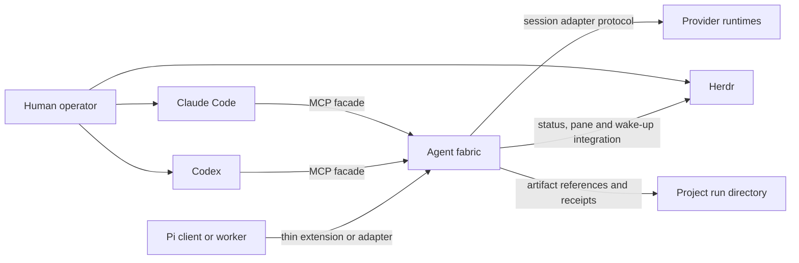

## 1. Decision requested

Implement the accepted local, harness-neutral agent fabric that Claude Code, Codex and future
clients can use through a shared protocol. The fabric provides durable two-way
messages, task and team ownership, provider session control, bounded hierarchy,
and optional Herdr visibility.

The human instruction on 10 July 2026 accepted this specification and named all
five implementation stages. It authorises local source, tests, compatibility
data and documentation. It does not authorise daemon installation or startup,
provider login, MCP registration, external messaging, deployment, release,
provider-session deletion, or Git staging and commits. Those actions retain
their separate gates.

### 1.1 Pre-release baseline and cutover

Until the first human-accepted release, source HEAD owns one canonical database
schema epoch and one current public protocol contract. Fresh state is created
directly from that baseline. The runtime shall not carry old-schema repair,
implicit legacy-run import, vintage-daemon fixtures, old-client/new-daemon
result shims or an old-protocol Console retry. A database bearing an earlier or
unknown schema fingerprint fails closed with a typed cutover-required error;
the runtime never rewrites, deletes or silently adopts it. Any operator-chosen
export, archive or replacement of that state is a separate explicit action.

This rule does not remove current extensibility. Closed codecs, bounded feature
negotiation for independently optional current capabilities, provider
capability handshakes, adapter/model allowlists and pinned compatibility
artifacts remain mandatory. They protect the current system and future
extension; they do not promise execution of an obsolete binary or schema.

## 2. Problem

The harness already defines Claude Code and Codex as equal primaries, one
session chair, one stage owner and one writer for a shared source surface. Its
paired-primary mode exchanges immutable artifacts and uses Herdr for observable
steering. These contracts prevent competing bosses, but the runtime is still
turn-based:

- pane sends are best-effort wake-ups rather than acknowledged messages;
- there is no shared mailbox or replay cursor;
- no registry binds a fabric identity to Claude, Codex or Pi session IDs;
- team hierarchy, inherited budgets and delegation narrowing are prose rules;
- each provider needs bespoke dispatch glue;
- interactive sessions are observable but cannot accept reliable external
  structured push messages.

The proposed fabric makes those contracts executable while preserving the
existing source of truth and the option to watch paired agents side-by-side.

## 3. Goals

- Give Claude Code and Codex the same chair and participant interface.
- Let either primary chair without making the other primary's private plugin or
  session store authoritative.
- Support persistent paired collaboration with durable request, response and
  acknowledgement semantics.
- Support headless, observed, interactive and hybrid execution profiles.
- Model a single chair, bounded leader teams and workers without creating
  multiple authorities.
- Permit direct agent-to-agent communication without treating messages as
  permission grants.
- Keep model and effort routing in `config/model-routing.json`.
- Add providers through capability-advertising adapters, not provider-specific
  skills.
- Preserve project-owned artifacts and curated project documentation.
- Recover safely from daemon, adapter, worker and chair interruption.
- Make operational cost, context pressure, failures and human intervention
  visible in receipts.

## 4. Non-goals

- A distributed or remote multi-user control plane.
- Global peer-to-peer broadcast or consensus-based ownership.
- Guaranteed structured push into an unmanaged interactive TUI.
- Replacement of Claude Code, Codex, Herdr or provider-native subagents.
- A new model catalogue separate from `config/model-routing.json`.
- Physical filesystem isolation. Coordination leases complement, but do not
  replace, runtime sandboxes and operating-system controls.
- Automatic public release, deployment, provider login or subscription use.
- Unlimited recursive teams in the first release.
- Durable storage of complete chat transcripts as project truth.

## 5. Stakeholders and concerns

| Stakeholder | Concern | Design response |
|---|---|---|
| Human operator | Side-by-side visibility and the ability to intervene | Herdr observed and interactive profiles; intervention receipts |
| Session chair | One interface for assignment, messages, gates and synthesis | Symmetric MCP facade and fenced chair lease |
| Stage or task owner | Clear authority, dependencies and completion barrier | Task graph, authority envelope and task-owner lease |
| Peer or reviewer | Independent access to evidence without write overlap | Read-only authority, artifact references and authorship records |
| Team leader | Bounded ability to delegate and supervise | Narrowing validation, budget reservation and depth limits |
| Worker agent | Stable assignment, mailbox and lifecycle contract | Provider-neutral adapter protocol and resumable identity |
| Maintainer | Replaceable providers and testable upgrades | Adapter capability handshake and contract tests |
| Project owner | Project knowledge remains portable | Project run directories remain authoritative |

### 5.1 Release and conformance boundary

This specification describes the Stage 5 target state. Stages 1 and 2 are
internal foundation milestones. The first operational release ends at Stage 3
and supports one chair, one paired primary, direct chair-owned workers, shared
MCP messaging, and headless, observed and interactive profiles. Provider
expansion is Stage 4. Leader-managed teams, inherited budgets and recursive
records are Stage 5 and remain disabled before that stage.

Each requirement and acceptance scenario names its introduction stage. A stage
passes only the requirements introduced at or before it. The implementation
plan shall contain a requirements traceability matrix covering tests and
stages; an unmapped
requirement blocks acceptance of that stage.

## 6. Risk and authority profile

Risk tier: **crucial**. The design affects a shared harness, credentials-adjacent
provider processes, write authority and stateful runtime data.

The following envelope records the completed design pass. The active delivery
authority is recorded in the canonical `.agent-run/AFAB-001/RUN.json`
`delivery-run` receipt.

```yaml
authority:
  approver: human-maintainer
  expires_at: design-approval-or-rejection
  allowed_source_paths:
    - docs/specs/
  allowed_artifact_paths:
    - /tmp/fable-agent-fabric-design.md
    - /tmp/agent-fabric-review-*.md
  prohibited_actions:
    - implement-runtime-code
    - register-mcp-server
    - modify-provider-authentication
    - start-or-install-daemon
    - delete-or-compact-provider-sessions
    - change-model-routing
    - commit-or-release
  disclosure:
    external_provider_source: local-harness-docs-only
    secrets: prohibited
```

## 7. System context



> The fabric owns coordination state. The project owns durable work products.
> Herdr owns visibility, not authority or message truth.

## 8. Runtime containers

```text
Claude or Codex MCP process
  -> lightweight stdio proxy
  -> private local Unix socket
  -> one shared agent-fabric daemon
       -> SQLite/WAL coordination store
       -> append-only event and receipt exporter
       -> provider adapter supervisors
       -> Herdr integration
       -> project artifact resolver
```

### 8.1 Source layout

```text
~/.agents/
  runtime/agent-fabric/
    package.json
    src/core/
    src/adapters/
    src/transports/
    schemas/
    migrations/
    tests/
  config/agent-fabric.yaml
  config/model-routing.json
  scripts/agent-fabric
  scripts/agent-fabric-mcp
```

### 8.2 Runtime layout

```text
~/.local/state/agent-harness/fabric/fabric-v1.sqlite3
~/.local/state/agent-harness/fabric/exports/<run-id>/
$XDG_RUNTIME_DIR/agent-harness/fabric-v1.sock
<project>/.agent-run/<run-id>/
```

When `XDG_RUNTIME_DIR` is absent, macOS uses a fabric-owned `0700` directory
under `$TMPDIR`. The socket is `0600`. No network listener is enabled by
default.

### 8.3 Configuration precedence

Configuration is validated before use. Unknown keys are errors. Project
configuration is untrusted: it may select only globally allow-listed values and
may narrow policy, never choose executable code, credentials or listeners.

```yaml
configuration_contract:
  schema_version: 1
  unknown_keys: error
  trusted_layers:
    - ${AGENTS_HOME}/config/agent-fabric.yaml
    - ${XDG_CONFIG_HOME}/agent-fabric/local.yaml
  untrusted_project_layer: <project>/.agents/agent-fabric.yaml
  run_layer: validated-run-authority-envelope
  merge_rules:
    authority_sets: intersection
    numeric_limits: minimum
    expiries: earliest
    deny_flags: false-dominates
    named_profile_selection: later-layer-within-trusted-allow-list
  trusted_only_fields:
    - adapter-command
    - adapter-package-or-plugin-path
    - executable-path
    - environment-source
    - listener-or-socket-location
    - provider-credential-selector
  project_permitted_fields:
    - named-execution-profile
    - allow-listed-adapter-id
    - role-routing-within-global-policy
    - narrowed-workspace-roots
    - narrowed-resource-limits
secrets:
  sources:
    - environment
    - operating-system-keychain
  permitted_in_yaml: false
routing:
  source: ~/.agents/config/model-routing.json
```

## 9. Execution control, visibility and inbox delivery

Execution control, operator visibility and inbox delivery are independent
dimensions. A named profile resolves all three and is accepted only when the
selected adapter advertises the required capabilities.

```yaml
profile_dimensions:
  control_mode:
    - managed
    - shared-session-ui
    - attached-interactive
  visibility_mode:
    - none
    - event-mirror
    - provider-tui
  inbox_delivery_mode:
    - structured-push
    - verified-boundary-inject
    - cooperative-pull
    - notify-only
```

Authority, task, mailbox and evidence semantics do not change with the profile.
Control strength, delivery latency and direct-input provenance are explicit in
the run receipt.

### 9.1 Headless managed sessions

Provider sessions run through SDK, app-server, RPC or ACP adapters without a
dedicated Herdr pane. They require `managed` control and normally use
`structured-push`. This is the lowest-overhead profile for mechanical workers
and large fan-out.

### 9.2 Observed managed sessions

The provider session remains owned by its adapter. Herdr starts a read-only
`agent-fabric observe` renderer in a pane. The renderer follows the fabric's
redacted activity-event cursor and displays bounded status, tool and output
events. It cannot send provider turns, acknowledge mailbox messages, acquire
leases or mutate task state.

Closing the pane stops only the renderer. Reopening it resumes from the last
display cursor or a bounded current snapshot; it never creates another provider
session. A provider-native shared-session UI may replace the renderer only when
the adapter contract-tests that capability.

The renderer consumes redacted event-envelope version 1, persists only its
display cursor, and exits non-zero on schema or authentication failure. Its CLI
supports `observe --run <id> [--agent <id>] [--after <cursor>] [--json]`.
Renderer reads never claim or acknowledge mailbox deliveries.

Observed managed sessions are recommended for the non-chair primary when direct
typing into it is not required. The chair remains the human-driven session and
is never replaced by a fabric-owned observer.

### 9.3 Attached interactive sessions

A provider TUI runs in a terminal the operator controls: either the terminal
where the human started it or a Herdr pane opened for it. A running TUI cannot
be re-parented into Herdr. A chair outside Herdr remains interactive but has no
pane telemetry. Its delivery mode is declared by the adapter:

- `verified-boundary-inject` requires an integration that returns the delivered
  message IDs to the fabric;
- `cooperative-pull` requires the agent to call `fabric_message_receive` and
  `fabric_message_ack` at instructed turn boundaries;
- `notify-only` surfaces unread state but cannot satisfy a bounded automatic
  response requirement.

An idle interactive session has no bounded delivery time. The fabric retries
wake-ups with backoff and escalates a still-unacknowledged `requires_ack`
message to the operator after the configured deadline.

A safe turn boundary is a versioned adapter event emitted after the provider
reports no active tool or model turn and before the adapter accepts another
turn. Cooperative clients pull the mailbox only at this boundary or on an
explicit operator request. Absence of this event keeps delivery pending.

A message is consumed only when the fabric receives an authenticated consume or
acknowledgement operation for its ID. Hook invocation, pane focus, terminal
input and prompt submission are not consumption evidence. Terminal input is a
wake-up capability, never a structured `send_turn`.

Direct operator input may change the active turn outside the task plan. Fabric
tools provide an explicit `operator_intervention` operation. When an integration
reports an external revision or the operator records an intervention, the task
owner reconciles it before barrier closure. If direct-input provenance is
unavailable, the receipt records that limitation and interactive task closure
requires explicit owner confirmation.

### 9.4 Profile changes

A profile change that cannot preserve the provider session is a lifecycle
rotation: checkpoint, stop delivery, close the adapter-turn lease, attach or
spawn the replacement, rehydrate it from the checkpoint, then acknowledge the
new generation. Only a contract-tested `shared-session-ui` adapter may add or
remove a view without rotation.
