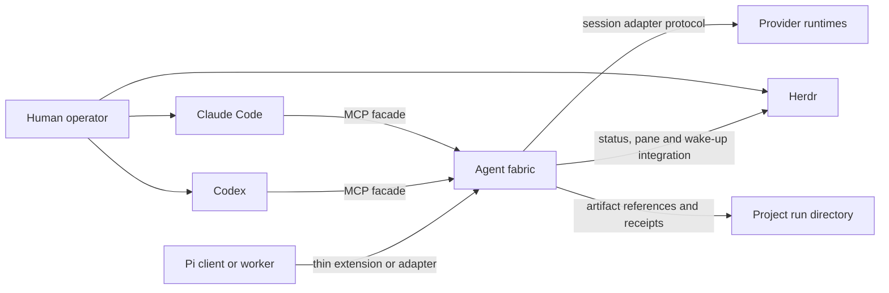

# Agent Fabric scope and invariants

This is the current pre-release Agent Fabric behaviour contract. It records design authority and current invariants; implementation, acceptance and release remain separate gates.

## Decision requested

Implement the accepted local, harness-neutral agent fabric that Claude Code, Codex and future clients can use through a shared protocol. The fabric provides durable two-way messages, task and team ownership, provider session control, bounded hierarchy, and optional Herdr visibility.

The human instruction on 10 July 2026 accepted this specification and named all five implementation stages. It authorises local source, tests, compatibility data and documentation. It does not authorise daemon installation or startup, provider login, MCP registration, external messaging, deployment, release, provider-session deletion, or Git staging and commits. Those actions retain their separate gates.

### Pre-release baseline and cutover

Until the first human-accepted release, source HEAD owns one canonical database schema epoch and one current public protocol contract. Fresh state is created directly from that baseline. The runtime shall not carry old-schema repair, implicit legacy-run import, vintage-daemon fixtures, old-client/new-daemon result shims or an old-protocol Console retry. A database bearing an earlier or unknown schema fingerprint fails closed with a typed cutover-required error; the runtime never rewrites, deletes or silently adopts it. Any operator-chosen export, archive or replacement of that state is a separate explicit action.

This rule does not remove current extensibility. Closed codecs, bounded feature negotiation for independently optional current capabilities, provider capability handshakes, adapter/model allowlists and pinned compatibility artifacts remain mandatory. They protect the current system and future extension; they do not promise execution of an obsolete binary or schema.

## Problem

The harness already defines Claude Code and Codex as equal primaries, one session chair, one stage owner and one writer for a shared source surface. Its paired-primary mode exchanges immutable artifacts and uses Herdr for observable steering. These contracts prevent competing bosses, but the runtime is still turn-based:

- pane sends are best-effort wake-ups rather than acknowledged messages;
- there is no shared mailbox or replay cursor;
- no registry binds a fabric identity to Claude, Codex or Pi session IDs;
- team hierarchy, inherited budgets and delegation narrowing are prose rules;
- each provider needs bespoke dispatch glue;
- interactive sessions are observable but cannot accept reliable external
  structured push messages.

The proposed fabric makes those contracts executable while preserving the existing source of truth and the option to watch paired agents side-by-side.

## Goals

- Give Claude Code and Codex the same chair and participant interface.
- Let either primary chair without making the other primary's private plugin or
  session store authoritative.
- Support persistent paired collaboration with durable request, response and
  acknowledgement semantics.
- Support headless, observed, interactive and hybrid execution profiles.
- Model a single chair, bounded leader teams and workers without creating
  multiple authorities.
- Permit direct agent-to-agent communication without treating messages as
  permission grants.
- Keep model and effort routing in `config/model-routing.json`.
- Add providers through capability-advertising adapters, not provider-specific
  skills.
- Preserve project-owned artifacts and curated project documentation.
- Recover safely from daemon, adapter, worker and chair interruption.
- Make operational cost, context pressure, failures and human intervention
  visible in receipts.

## Non-goals

- A distributed or remote multi-user control plane.
- Global peer-to-peer broadcast or consensus-based ownership.
- Guaranteed structured push into an unmanaged interactive TUI.
- Replacement of Claude Code, Codex, Herdr or provider-native subagents.
- A new model catalogue separate from `config/model-routing.json`.
- Physical filesystem isolation. Coordination leases complement, but do not
  replace, runtime sandboxes and operating-system controls.
- Automatic public release, deployment, provider login or subscription use.
- Unlimited recursive teams in the first release.
- Durable storage of complete chat transcripts as project truth.

## Stakeholders and concerns

| Stakeholder | Concern | Design response |
|---|---|---|
| Human operator | Side-by-side visibility and the ability to intervene | Herdr observed and interactive profiles; intervention receipts |
| Session chair | One interface for assignment, messages, gates and synthesis | Symmetric MCP facade and fenced chair lease |
| Stage or task owner | Clear authority, dependencies and completion barrier | Task graph, authority envelope and task-owner lease |
| Peer or reviewer | Independent access to evidence without write overlap | Read-only authority, artifact references and authorship records |
| Team leader | Bounded ability to delegate and supervise | Narrowing validation, budget reservation and depth limits |
| Worker agent | Stable assignment, mailbox and lifecycle contract | Provider-neutral adapter protocol and resumable identity |
| Maintainer | Replaceable providers and testable upgrades | Adapter capability handshake and contract tests |
| Project owner | Project knowledge remains portable | Project run directories remain authoritative |

### Release and conformance boundary

This specification describes the Stage 5 target state. Stages 1 and 2 are internal foundation milestones. The first operational release ends at Stage 3 and supports one chair, one paired primary, direct chair-owned workers, shared MCP messaging, and headless, observed and interactive profiles. Provider expansion is Stage 4. Leader-managed teams, inherited budgets and recursive records are Stage 5 and remain disabled before that stage.

Each requirement and acceptance scenario names its introduction stage. A stage passes only the requirements introduced at or before it. The implementation plan shall contain a requirements traceability matrix covering tests and stages; an unmapped requirement blocks acceptance of that stage.

## System context



> The fabric owns coordination state. The project owns durable work products.
> Herdr owns visibility, not authority or message truth.

## Runtime containers

```text
Claude or Codex MCP process
  -> lightweight stdio proxy
  -> private local Unix socket
  -> one shared agent-fabric daemon
       -> SQLite/WAL coordination store
       -> append-only event and receipt exporter
       -> provider adapter supervisors
       -> Herdr integration
       -> project artifact resolver
```

### Source layout

```text
~/.agents/
  runtime/agent-fabric/
    package.json
    src/core/
    src/adapters/
    src/transports/
    schemas/
    migrations/
    tests/
  config/agent-fabric.yaml
  config/model-routing.json
  scripts/agent-fabric
  scripts/agent-fabric-mcp
```

### Runtime layout

```text
~/.local/state/agent-harness/fabric/fabric-v1.sqlite3
~/.local/state/agent-harness/fabric/exports/<run-id>/
$XDG_RUNTIME_DIR/agent-harness/fabric-v1.sock
<project>/.agent-run/<run-id>/
```

When `XDG_RUNTIME_DIR` is absent, macOS uses a fabric-owned `0700` directory under `$TMPDIR`. The socket is `0600`. No network listener is enabled by default.

### Configuration precedence

Configuration is validated before use. Unknown keys are errors. Project configuration is untrusted: it may select only globally allow-listed values and may narrow policy, never choose executable code, credentials or listeners.

```yaml
configuration_contract:
  schema_version: 1
  unknown_keys: error
  trusted_layers:
    - ${AGENTS_HOME}/config/agent-fabric.yaml
    - ${XDG_CONFIG_HOME}/agent-fabric/local.yaml
  untrusted_project_layer: <project>/.agents/agent-fabric.yaml
  run_layer: validated-run-authority-envelope
  merge_rules:
    authority_sets: intersection
    numeric_limits: minimum
    expiries: earliest
    deny_flags: false-dominates
    named_profile_selection: later-layer-within-trusted-allow-list
  trusted_only_fields:
    - adapter-command
    - adapter-package-or-plugin-path
    - executable-path
    - environment-source
    - listener-or-socket-location
    - provider-credential-selector
  project_permitted_fields:
    - named-execution-profile
    - allow-listed-adapter-id
    - role-routing-within-global-policy
    - narrowed-workspace-roots
    - narrowed-resource-limits
secrets:
  sources:
    - environment
    - operating-system-keychain
  permitted_in_yaml: false
routing:
  source: ~/.agents/config/model-routing.json
```

## Performance and resource policy

The system is local and single-user through Stage 5. Defaults favour bounded work; leader limits remain disabled until Stage 5:

```yaml
limits:
  maximum_tree_depth_below_chair: 2
  maximum_leaders: 4
  maximum_workers_per_leader: 5
  maximum_concurrent_provider_turns: 8
  maximum_inline_message_bytes: 4096
  maximum_message_hops: 4
  maximum_unacknowledged_messages_per_agent: 100
  reserve_for_verification_and_recovery_percent: 25
```

`maximum_leaders` is the run-wide count of all active top-level and nested team leaders, not a per-depth allowance. The fifth leader is rejected atomically before any authority, agent, task, group or budget row survives.

The Stage 1 core shall support at least 32 registered simulated agents. Stage 3 shall support eight concurrent provider turns on the local development machine. Local mailbox and task operations shall complete within 100 ms at p95 under that load, excluding provider and filesystem artifact latency.

## Pinned implementation baseline

These versions are the proposed Stage 1 core baseline, verified on 10 July
2026. Review shall revalidate them before implementation begins.

| Dependency | Version |
|---|---|
| Node.js | 24.15.0 |
| TypeScript | 7.0.2 |
| `@modelcontextprotocol/sdk` | 1.29.0 |
| `better-sqlite3` | 12.11.1 |
| `yaml` | 2.9.0 |
| `ajv` | 8.20.0 |
| `uuid` | 14.0.1 |
| Vitest | 4.1.10 |
The lockfile pins exact transitive Fabric dependencies. A provider stage cannot
enter implementation until `config/adapter-compatibility.yaml` records its
adapter contract, stable launcher, required vendor-identity policy,
protocol/schema evidence, supported runtime, capability fixture, official
source and verification date. Provider CLI versions and digests are observed,
never admission locks; activation instead proves the bounded non-answer
interface. Fabric SDK libraries, wrappers and protocol schemas retain their
lockfile, Git-provenance and hash gates. An adapter without a verified entry
remains disabled.

## Requirements

### Functional requirements

- **FR-001 (Stage 2):** Claude Code and Codex shall expose the same fabric tool and
  resource semantics through their MCP clients.
- **FR-002 (Stage 2):** Separate client proxies shall communicate with one shared daemon
  and coordination store.
- **FR-003 (Stage 1):** The fabric shall persist each message before delivery and shall
  support receive, acknowledge, retry and replay by cursor.
- **FR-004 (Stage 1):** The fabric shall preserve one chair and one owner for every active
  task or stage.
- **FR-005 (Stage 1):** The fabric shall reject delegation that widens authority, expiry
  or budget.
- **FR-006 (Stage 1):** The fabric shall reject overlapping active write-scope leases.
- **FR-007 (Stage 3):** The fabric shall support headless, observed, interactive and
  hybrid visibility profiles.
- **FR-008 (Stage 3):** The paired-visible profile shall display the chair and paired
  primary side-by-side in Herdr while workers remain headless by default when   the chair was launched under Herdr; otherwise it shall show the peer and   record degraded chair-pane visibility.
- **FR-009 (Stage 3):** Loss of Herdr shall not lose tasks, messages, leases or provider
  resume references.
- **FR-010 (Stage 1):** Agents sharing an authorised task, dependency or discussion group
  shall be able to address each other directly.
- **FR-011 (Stage 1):** A direct message shall not transfer task ownership or authority.
- **FR-012 (Stage 3):** The fabric shall support persistent primary sessions
  and ephemeral chair-owned workers through capability-advertising adapters.
- **FR-013 (Stage 3):** Agents shall request compaction, rotation or release through a
  checkpointed lifecycle operation.
- **FR-014 (Stage 3):** The daemon shall not delete provider-native session files.
- **FR-015 (Stage 3):** Model and effort resolution shall use the existing
  trusted model router. For a task-bound answer-bearing spawn, the daemon shall   invoke it from a strict route request at new-action admission and atomically   retain the canonical request, receipt and both digests on the provider action   before provider I/O; a caller-authored post-hoc receipt cannot certify the   action.
- **FR-016 (Stage 4):** A distinct-family review or adversarial leg shall follow
  its configured retry and acknowledgement deadline, then terminate as degraded
  or failed and record the reason rather than replace the required other-primary
  path.
- **FR-016A (Stage 4):** A fresh ephemeral provider worker or reviewer shall run
  through a route-bound, task-bound `provider-action.dispatch` `spawn`, commit   its bounded answer privately and project the applicable bounded answer or   certifying-review digest/safe result. It shall create no   retained agent identity or implicit provider-session authority. Review   certification shall use the terminal action's daemon-derived route and   artifact lineage rather than caller-supplied reviewer-family relation.
- **FR-017 (Stage 1):** The daemon shall resume committed coordination state after an
  unclean restart.
- **FR-018 (Stage 1):** Before barrier closure, the fabric shall export a
  schema-valid `fabric-receipt.json`; the chair shall declare it as the   `fabric-coordination-receipt` evidence artifact in the canonical   `delivery-run` receipt before the run is accepted.
- **FR-019 (Stage 5):** The fabric shall support bounded leaders and registered
  worker subtrees subject to depth, authority and budget limits.

### Quality requirements

- **NFR-001 (Stage 1, security):** No remote listener shall be active by default.
- **NFR-002 (Stage 1, security):** Socket, state and discovery files shall reject access by
  other local users.
- **NFR-003 (Stage 1, reliability):** A crash after message commit and before delivery
  shall result in replay, not message loss.
- **NFR-004 (Stage 3, reliability):** Retried fabric commands shall map to one
  durable action record. An ambiguous side-effecting provider command shall not   be replayed automatically unless downstream idempotency is proven for the   same canonical adapter/action pair.
- **NFR-005 (Stage 1, performance):** Local coordination operations shall meet the p95
  target in the performance and resource policy.
- **NFR-006 (Stage 1, maintainability):** A new fake adapter shall pass the
  published adapter conformance suite without modifying task, lease or mailbox   core logic; real adapters add only compatibility data and adapter-local code.
- **NFR-007 (Stage 2, portability):** Claude and Codex clients shall use the same protocol
  and schemas without harness-specific forks.
- **NFR-008 (Stage 3, auditability):** Every fabric-mediated intervention and
  every intervention reported by an integration shall appear in the fabric   receipt. Interactive profiles shall declare direct-input provenance as   `complete`, `partial` or `unavailable`.
- **NFR-009 (Stage 3, usability):** The operator shall be able to select a named
  execution profile without editing provider adapter code.
- **NFR-010 (Stage 1, recoverability):** Restart tests shall recover the last
  committed mailbox watermark and out-of-order acknowledgements, task revision   and lease generation.

## Acceptance scenarios

### AC-001 (Stage 3): symmetric paired messaging

Given Claude Code is chair and a persistent Codex peer is attached When Claude sends a task message and Codex replies Then both messages, acknowledgements, revisions and artifact hashes are visible through the same fabric interface And the scenario also passes with Codex and Claude roles reversed.

### AC-002 (Stage 3): observed paired programming

Given the `paired-observed` profile And the human launched or attached the chair session inside Herdr When a Claude/Codex pair begins work Then Herdr places both primary sessions side-by-side And their task, lifecycle and unread-message state is visible And closing the non-chair observed pane stops only its renderer And recreating that renderer resumes its display cursor without acknowledging mailbox messages or creating another provider session And closing or losing the chair TUI follows the interactive-session-loss behaviour in the failure-handling contract.

### AC-003 (Stage 3): interactive delivery limitation

Given an interactive TUI is busy in a provider turn When another agent sends it a structured message Then the message is durably queued And no delivery acknowledgement is recorded until the TUI drains and consumes the message And a Herdr wake-up alone does not satisfy delivery.

### AC-003A (Stage 3): interactive paired round trip

Given both paired primaries use `cooperative-pull` or a stronger mode When the chair queues a message while the peer is idle Then unread state is surfaced in its Herdr pane And the peer explicitly consumes and acknowledges the exact message ID at its next safe turn And its reply is persisted and acknowledged through the same fabric API And a missed deadline remains `delivery-pending`, not delivered.

### AC-004 (Stage 5): bounded hierarchy

Given a chair delegates a budget and source scope to a leader When the leader creates worker tasks Then each child grant is contained by the leader's grant And an over-depth, over-budget or wider-path grant is rejected.

### AC-005 (Stage 1): fenced ownership recovery

Given a task owner or writer loses its session while holding a task lease When the chair reassigns the task after checkpoint or expiry Then the replacement receives a higher lease generation And the successor cannot start until predecessor revocation, operating-system isolation or patch-only serial application is proven And otherwise the scope becomes `quarantined`.

### AC-006 (Stage 1): daemon restart

Given messages, tasks and provider resume references are committed When the daemon is terminated without graceful shutdown and restarted Then it restores the last committed state And redelivers unacknowledged messages without duplicating acknowledged actions.

### AC-007 (Stage 3): visibility degradation

Given observed workers are running and Herdr telemetry or a renderer becomes unavailable When the provider runtimes remain healthy Then work may continue under policy And the run records `visibility-degraded` And no task or message is inferred from missing pane telemetry And loss of an interactive TUI is instead reconciled as provider-session loss.

### AC-008 (Stage 3): safe completion

Given an agent reports completion-ready When it still owns a write lease or has an in-flight child Then release is refused And it is released only after checkpoint, child reconciliation, barrier closure and lease release.

### AC-009 (Stage 3): unannounced compaction

Given an interactive provider compacts without a valid fabric checkpoint When the fabric detects a new provider-session generation or context revision Then it atomically records one typed generation-loss predecessor with the exact old/new session, generation, bridge, capability, checkpoint and source rows And the agent becomes `context-unreconciled`, its writes/turns/claims/barriers are fenced, and no missing custody is inferred And `agent-lifecycle-recovery` accepts that exact generation-loss arm or an exact custody arm, never a bare null predecessor And only fresh rotation through a verified checkpoint or confirmed abandonment can close the loss; generic Resume and chair-loss recovery cannot.

### AC-010 (Stage 1): untrusted project configuration

Given project configuration attempts to replace an adapter command, add an environment source or widen a workspace root When configuration is validated Then validation fails before daemon or adapter startup And no project field selects executable code or credentials.

### AC-011 (Stage 3): ambiguous provider action

Given an adapter terminates after provider acceptance but before terminal-result commit When the daemon recovers Then it reconciles the stable action ID And either records the single provider action or quarantines the ambiguity And it never automatically creates a second side-effecting action.

### AC-012 (Stage 2): shared daemon and symmetric proxies

Given two independently started MCP proxy processes identify as Claude and Codex clients When each connects through the per-user socket and calls the same tool and resource schemas Then both observe one run, task revision and mailbox store And no harness-specific fork changes the protocol or resource result.

### AC-013 (Stage 4): optional adapter degradation

Given an enabled optional-family adapter passes conformance but its provider is unavailable When its configured retry and acknowledgement deadline expires Then the optional leg becomes degraded or failed with the reason recorded And the required Claude/Codex path remains unblocked And no side-effecting action is replayed without reconciliation.

### AC-014 (Stage 4): task-bound ephemeral provider review

Given the chair owns or participates in one active review task and delegates a read-only externally disclosable authority envelope When it dispatches `operation: spawn` as the current target chair to an activated certifying-review-packet-only.v1 adapter with an exact current target/slot/head, structural route request, resolved profile, complete bundle/coverage and exact task ID Then Fabric persists one action and promptly returns its immutable accepted `prepared` or `dispatched` dispatch receipt; provider completion never changes that receipt And the action's immutable route binding contains the canonical daemon-produced route receipt and digest before provider I/O And one daemon-owned completion settles it while the chair reads the same action through `provider-action.read` rather than redispatching And a safe or UNUSABLE terminal result automatically creates immutable evidence and CAS-advances the reserved slot head before that terminal read is visible; optional `review-evidence.annotate` cannot change certification And exact replay returns that same route and action, while a missing task, stale task scope, forbidden disclosure, route/payload mismatch, changed route request, duplicate changed action or unsupported adapter fails before provider work And Fabric derives the safe result, model identity, open findings and one reviewer-family-versus-target-chair relation from the exact terminal action, target/head/bundle, route, task, result/answer digests and reviewed artifact And project lifecycle, membership, coordinated and independent topology and one-chair invariants survive races and restart And no retained agent identity, capability or hidden direct-CLI result path is created.

## Verification strategy

### Static and schema checks

- Parse every YAML configuration example and JSON Schema.
- Validate MCP tool input and output schemas.
- Validate authority subset and path canonicalisation rules.
- Validate `adapter-compatibility.yaml` and reject untrusted configuration that
  selects executable code, credentials or listeners.
- Extend `scripts/check-harness` with fabric protocol and documentation checks.

### Unit tests

- mailbox ordering, cursors, acknowledgement and deduplication;
- task dependency transitions and compare-and-set revisions;
- lease acquisition, renewal, expiry, transfer and stale-generation rejection;
- authority and budget narrowing;
- path overlap, traversal and symlink escape;
- lifecycle checkpoint completeness;
- visibility profile resolution.

### Integration tests

- two simulated MCP clients exchange messages through one daemon;
- daemon crash and restart during message delivery;
- adapter crash without core crash;
- crash injection before dispatch, after provider acceptance and before
  terminal-result commit for every mutating adapter operation;
- one active turn per provider session;
- Herdr telemetry loss, observed-renderer loss and interactive TUI loss as
  distinct cases;
- observed renderer restart and interactive round-trip behaviour;
- Claude-chair/Codex-peer and Codex-chair/Claude-peer smoke tests.

### Evaluation scenarios

Because orchestration is judgement-bearing, deterministic tests are necessary but insufficient. A repeatable evaluation set shall cover:

- leader over-delegation attempts;
- cross-team confused-deputy messages;
- two agents requesting the same write surface;
- an interactive operator changing the task mid-turn;
- provider outage and optional-family degradation;
- compaction requested before checkpoint;
- a council disagreement incorrectly treated as a vote;
- an agent attempting to clear itself while owning work;
- excessive fan-out and message storms;
- reviewer-family relation after shared authorship.

## Delivery stages

### Stage 0: approve the design

- Cross-family and independent review of this specification.
- Resolve blocking findings and record disagreements.
- Human accepts, rejects or amends this specification.

### Stage 1: protocol and mailbox slice

- Versioned schemas, file-compatible event export and fake adapters.
- SQLite core, migrations and command-line inspection tools.
- No provider credentials or real provider sessions.

### Stage 2: shared MCP facade

- Two MCP proxies connect to one daemon.
- Symmetric Claude/Codex mailbox, artifact and task operations through the
  Stage 2 subset in the MCP and client-interface contract.
- Resource round-trip tests from both clients, with the documented read-only
  tool fallback if required.
- No automatic registration without a separate human gate.

### Stage 3: persistent primary pair

- Codex app-server and Claude Agent SDK adapters.
- Headless managed and observed managed profiles.
- Capability-gated interactive inbox delivery and Herdr wake-ups.
- This is the first operational release boundary.

### Stage 4: provider expansion

- Pi as the first generic worker adapter.
- Agy, Cursor Composer/Grok and Kiro or ACP adapters behind the same contract.
- Fresh optional-family work uses the current task-bound ephemeral provider
  action; retained child agents continue to require a generation-bound bridge.

### Stage 5: teams and hardening

- Shallow leader teams, budget inheritance and subtree recovery.
- Security, load, migration and judgement-bearing evaluation suites.
- Review whether evidence justifies deeper hierarchy or Pi as another chair.

The direct implementation instruction on 10 July 2026 names Stages 1–5. Each stage still requires deterministic verification and independent review before the next stage is treated as conformant. External configuration and runtime activation remain separately gated.

## Decision record and alternatives

Decision status: **Accepted on 10 July 2026**. The human maintainer owns final implementation acceptance.

The proposed decision is to implement one harness-neutral local agent-fabric daemon in `~/.agents`. Claude Code and Codex use the same MCP facade. Provider adapters manage worker sessions. Herdr provides optional observation, interaction and wake-ups without owning durable messages, authority or project artifacts. Pi is an optional generic worker runtime rather than the initial chair.

Consequences:

- either primary can chair through the same protocol;
- visible paired programming remains available;
- provider runtimes and model routing remain replaceable;
- the daemon becomes load-bearing local software with security, migration and
  crash-recovery obligations;
- interactive sessions have explicitly weaker delivery and auditability than
  fabric-managed sessions;
- project artifacts remain outside the coordination database.

### Standalone daemon versus provider plugin

The daemon adds operational weight but avoids giving one harness ownership of shared state. Thin plugins remain useful for discovery, hooks and commands.

### SQLite versus files only

SQLite provides transactions and concurrent cursors. Append-only exports keep coordination inspectable and provide a degraded recovery format. Project artifacts do not move into the database.

### Observed sessions versus interactive TUIs

Observed sessions provide reliable structured control and almost the same visibility. Interactive TUIs permit direct human intervention but cannot offer guaranteed mid-turn delivery. Both are supported because paired programming may value human visibility more than minimum overhead.

### Shallow versus arbitrary hierarchy

The recursive schema keeps future options open. A shallow initial limit avoids telephone loss, cost growth and unclear ownership before real runs demonstrate the need for deeper management layers.

### Pi worker versus Pi chair

Pi reduces adapter overhead for model-neutral workers. It does not remove the need for shared authority, mailboxes and receipts, so it remains below the fabric until operating evidence supports a chair role.

## Known risks

- Provider protocols, particularly experimental app-server surfaces, may drift.
- The daemon is a new single point of local coordination failure.
- Interactive operator input cannot always be distinguished from provider or
  hook output.
- Flat-rate subscription automation may have economic or terms-of-service
  constraints that differ by provider.
- A coordination lease cannot stop a full-access process from writing outside
  scope; runtime isolation remains necessary.
- Deep teams can spend more context on reporting than execution.
- A central coordination database can become a second source of truth if
  project artifacts are allowed to migrate into it.

## Review questions

Reviewers shall answer with evidence and proposed text changes:

1. Does the observed/interactive/hybrid model preserve both reliable
   orchestration and the requested side-by-side experience?
2. Are authority, ownership and direct messaging sufficiently separated?
3. Can the system recover without silently duplicating side effects?
4. Does any record wrongly compete with project-owned artifacts or provider
   session stores?
5. Are the adapter boundary and capability negotiation flexible enough for Agy,
   Cursor Composer/Grok, Kiro/ACP and future providers?
6. Are lifecycle and compaction responsibilities implementable across Claude,
   Codex and Pi?
7. Which requirements or acceptance scenarios are not objectively testable?
8. Is any first-release surface unnecessarily broad?

## Approval gate

The specification and Stages 1–5 were authorised by direct human instruction on 10 July 2026 after the recorded Fable and independent reviews. Final human acceptance remains mandatory after deterministic verification, evaluation and independent implementation review. Installation, MCP registration, provider login, daemon activation, deployment, release and Git publication remain separate actions.

## Implementation clarifications

These choices refine existing requirements without widening scope:

- Authority paths are canonical workspace-relative prefixes. Empty paths,
  absolute paths, traversal, glob syntax and unresolved symlink escapes are   rejected. Denies dominate allows. Actions use the versioned fabric operation   vocabulary; disclosure narrows from `allowed` to `scoped` to `forbidden`.
- Write scopes use the same canonical prefix records. Intersection means equal
  prefixes or one prefix containing the other. Non-existent targets are   resolved through their nearest existing ancestor before admission.
- Budget dimensions carry a `unit_key`. Currency is `cost:<ISO-4217>` and
  provider-sensitive tokens use `input_tokens:<provider-family>` or   `output_tokens:<provider-family>`. Unlike units never aggregate.
- Principal generation fences capability rotation. Individual mutations also
  name every required resource lease and expected generation; there is no   ambiguous principal-wide current lease.
- A ready task has one proposed owner but no owner lease. Claim atomically
  verifies dependencies, advances the task to active and issues its owner   lease. Complete, cancelled and explicitly degraded dependencies satisfy   readiness; blocked dependencies do not.
- Task participants are its owner plus explicitly registered participants.
  Direct communication is allowed for a shared task, either direction of a   direct dependency edge, or a shared discussion group. These records grant no   work authority.
- The daemon owns the canonical adapter-action journal. Each adapter also keeps
  reconciliation evidence behind its process boundary. The daemon imports that   evidence only through `lookup_action`.
- `fabric_team_create` accepts the leader, root task, initial registered
  members, discussion groups and reserved budget atomically. Existing agent and   task operations manage later assignment. Subtree freeze and adoption remain   chair-only lifecycle commands rather than separate public team tools.
- Deterministic Stage 3 acceptance uses contract fixtures and fake provider
  processes. Live Claude, Codex and Herdr smoke tests are opt-in because they   require authentication and may consume provider quotas; a live smoke result   is operational evidence, not a unit-test prerequisite.
- Performance evidence records host, Node version, database mode, agent count,
  operation mix, warm-up and sample count. The 100 ms p95 gate uses at least 32   simulated agents and 1,000 measured local operations after warm-up.
- If an interactive provider cannot report compaction or context revision, the
  receipt declares detection unavailable. Such a session cannot claim complete   direct-input provenance and requires explicit owner reconciliation before a   barrier closes.

## Project-session and operator protocol ownership

The direct implementation instruction of 11 July 2026 authorises this shared protocol. The Console specifications own product behaviour; the operational-hardening specifications own persistence, bootstrap and daemon-liveness mechanics. Existing run, agent, task, lease and mailbox contracts remain valid.
