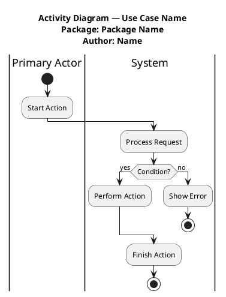

# Activity Diagram Rules

These rules encode activity-diagram notation for a requirements specification (typically SRS Section 7). Activity diagrams model the flow of events within one clearly identified use case.

## 1. Required structure

Every activity diagram should identify:

- Activity / use case name.
- Package name.
- Author / contributor if the specification requires it.
- Partitions/swimlanes when more than one actor/system/role participates.

PlantUML pattern:



## 2. Notation rules

- Use exactly **one starting point** (`start`).
- Use one or more ending points (`stop`, `end`, `kill`, or `detach`) only when justified by alternate endings.
- Use rounded action nodes (`:Verb Noun;`).
- Action names should be **Verb–Noun**, no more than five words where practical.
- Do not name actions with UML metaterms such as `Node`, `Activity`, `Decision`, `Fork`, or `Flow`.
- Connect nodes with control flows. In PlantUML, sequential actions are implicitly connected; use arrows only when you need labels or layout control.

## 3. Decisions and merges

Use a labelled decision question and guards on every outgoing path.

```plantuml
if (Payment Valid?) then (yes)
  :Confirm Booking;
else (no)
  :Display Payment Error;
endif
```

Rules:

- The decision node must be labelled, usually as a question: `Payment Valid?`.
- Conditions/guards are mandatory on outgoing paths: `(yes)`, `(no)`, `(approved)`, `(declined)`, etc.
- Alternate flows that rejoin must be merged before continuing. PlantUML creates the merge at `endif` when both branches continue.
- **A merge node is required when two or more alternate flows reconverge on a single shared downstream node.** A single edge from a decision branch to its first action does NOT need a merge.
- A merge node is also valuable when paths inside multi-track activity converge after independent processing (for example, `[approved]` and `[declined]` both terminating in their own outcome chain need no merge; but a `[yes]→Specialist Owner→Set Pending` plus a direct `[no]` both feeding `Apply Resolution` need a merge between them and the resolution step).

## 4. Forks and joins

Use forks only for real concurrent work.

```plantuml
fork
  :Reserve Flight;
fork again
  :Reserve Hotel;
end fork
:Confirm Itinerary;
```

Rules:

- Every `fork` must be closed by `end fork` or `end merge`.
- Use `end fork` when all concurrent branches must finish before continuing.
- Use `end merge` when any one branch can continue the flow.
- Do not use forks as a visual shortcut for alternatives; alternatives are decisions.

## 5. Partitions/swimlanes

Use partitions to show responsibility by actor or system.

```plantuml
|Registered User|
:Enter Search Criteria;
|Booking Platform|
:Display Results;
```

Rules:

- Use a swimlane for each major participant: human actor, the system, and relevant external systems.
- **Every declared swimlane must contain at least one action.** Empty swimlanes are a hard defect. If a role has no action, do not draw a lane for it.
- Keep an action in the lane of the role/system **responsible for performing** that action.
- For request/response patterns, split the work across the two lanes: the requester's lane holds `Request X`, the responder's lane holds `Provide X`. Cross-lane arrows make the handoff explicit.
- Use concise role names, e.g. `Registered User`, `Booking Platform`, `Payment Service`.

## 6. Finals

- Multiple final nodes are allowed — one per terminating flow.
- **Two finals stacked at the same coordinate on the same arrow is a UML error.** Either separate the finals horizontally or merge the flows through a merge diamond to a single shared final.
- Place each final at the end of its terminating column, with its own short arrow from the last action.

## 7. Arrow targeting

Every arrow must end at a node port:

- For action boxes, end at the top-centre, bottom-centre, left-mid, or right-mid.
- For merge diamonds, end at one of the four diamond points.
- Arrows that float in empty space or stop short of their target are real defects, not stylistic preferences.
- For PlantUML the layout engine handles this; for manual SVG generators see `manual-rendering-quality.md`.

## 8. Invoke/sub-activity nodes

When an action invokes another use case, mark it clearly and ensure the invoked use case is described elsewhere in the specification.

```plantuml
:<<invoke>> Validate Payment;
```

Rules:

- Use invoke nodes sparingly.
- If a diagram invokes included/extending/general use cases, those invoked behaviours need a textual description or their own activity diagram.

## 9. Workflow quality checks

Before finalising, ask:

- Does this diagram capture the actor's perspective and system responses?
- Are error/alternative flows included where important?
- Are all decisions labelled with guarded outgoing paths?
- Are all forks/joins opened and closed?
- Does the flow end in a sensible post-condition?
- Are all swimlanes populated and do the actions live in the right lane?
- Does the activity diagram trace cleanly against the use case's typical and alternative scenarios?
