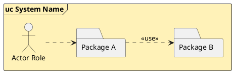
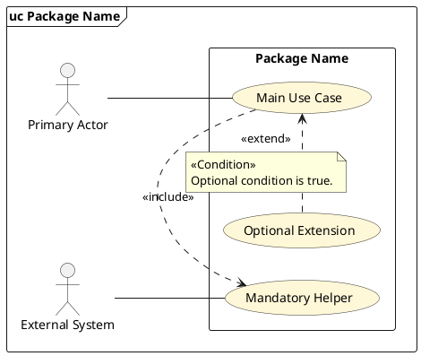
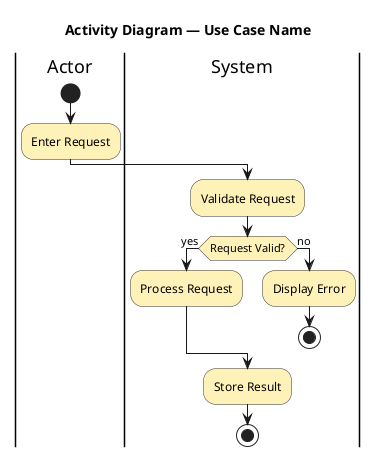

# PlantUML Patterns

Use these as neutral fallbacks only when the project has no template. Preserve
existing project notation, fonts, palette and identifiers.

## Shared header

```plantuml
@startuml
' Diagram generated from structured requirements.
skinparam shadowing false
skinparam actorStyle stickman
skinparam ArrowColor #333333
skinparam BorderColor #333333
skinparam BackgroundColor #FFFFFF
@enduml
```

## Package overview



## Per-package use case diagram



## Actor generalisation

```plantuml
actor "Customer" as A_Customer
actor "Bank Customer" as A_BankCustomer
actor "Foreign Customer" as A_ForeignCustomer
A_BankCustomer --|> A_Customer
A_ForeignCustomer --|> A_Customer
```

## Activity with swimlanes and decision



## Activity with concurrent branches

```plantuml
fork
  |System|
  :Send Confirmation;
fork again
  |External Service|
  :Reserve Inventory;
end fork
```

## Optional project-defined call marker

```plantuml
:<<invoke>> Validate Payment;
```

`<<invoke>>` is not a universal UML requirement. Use it only when the project
defines that convention and the target behaviour is separately documented;
otherwise use the project's call-activity notation.
