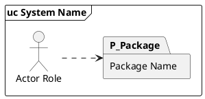
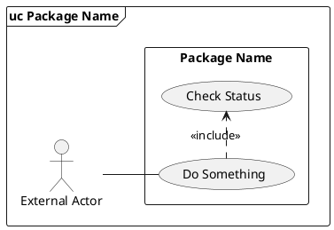

# Use Case and Use-Case Package Diagram Rules

These rules encode a consistent requirements-spec use-case notation. They are deliberately stricter than general UML to keep a diagram set clear and internally consistent across a specification.

## 1. Diagram types

### Use-case package overview

Use for Requirements Specification **Section 2.1 Package Diagram**. It answers: "What cohesive use-case packages exist, which actors use them, and what broad dependencies exist between packages?"

PlantUML pattern:



Rules:

- Use an outer **`uc <System Name>` frame**, not `pkg`, for the use-case package overview.
- Use folder-shaped `package` elements for packages.
- Show packages only. Do **not** put individual use-case ovals inside packages in the overview.
- Actor-to-package links use dashed directed dependencies (`..>`).
- Inter-package dependencies also use dashed directed dependencies (`P_Client ..> P_Supplier`). The arrow points from the package that needs/uses another package to the package being used.
- Label package dependencies only if the dependency type is not obvious, e.g. `: <<use>>`, `: <<import>>`, `: accesses`. If you label one, label all (or none) — partial labelling reads as a notation mistake.
- Use a package diagram plus a Package Descriptions table; each package description should be one sentence.

## 2. Per-package use case diagram

Use for Requirements Specification **Section 3.0 Use Case Diagrams**. It answers: "What use cases are inside this package and which actors interact with them?"

PlantUML pattern:



Rules:

- The **automation/system boundary is compulsory**. In PlantUML, use a `rectangle "Package Name" { ... }` inside the `frame`.
- Actors are external roles that interact directly with the system, not internal classes, screens, teams, or named people.
- Put actors outside the package/system boundary. Use cases go inside the boundary.
- Actor associations are solid lines without arrowheads (`--`).
- A use case must represent a system function or complete transaction that leaves the system in a complete state.
- Use cases are named in Title Case, normally **Verb–Noun** form: `Place Order`, `Validate Payment`, `Update Profile`.
- A use case may have multiple actors.
- Do not show sequence or timing. Use case diagrams show scope and relationships, not workflow order.

## 3. Include and extend

### Include

Use include for **common mandatory behaviour** reused by one or more base use cases.

```plantuml
UC_Base .> UC_Included : <<include>>
```

Direction: base use case → included use case. Arrowhead at the included use case.

### Extend

Use extend for **optional or conditional behaviour** that augments a base use case.

```plantuml
UC_Optional .> UC_Base : <<extend>>
note on link
  <<Condition>>
  Applied only when the condition is true.
end note
```

Direction: extending use case → extended/base use case. Arrowhead at the base.

Rules:

- Every `<<extend>>` relationship must have a condition in a note attached to the arrow.
- Do not use `<<extend>>` when the behaviour is always required; use `<<include>>` instead.
- Do not use `<<include>>` simply to show chronological order; use an activity diagram for flow.
- Plain associations (`--`, `..>`, `-->`) **between two use cases are invalid UML**. Only valid use-case-to-use-case relationships are `<<include>>`, `<<extend>>`, and generalisation. Plain associations connect actor↔use case only.
- Place the stereotype label adjacent to the source or destination port, not midway through an L-shaped route. Labels dropped in the middle of unrelated routes read as a third relationship.

## 4. Cross-package references

When a base use case references an included or extended use case defined in another package:

```plantuml
usecase "Process Refund\n(defined in P5)" as UC_ProcessRefund
UC_CancelBooking .> UC_ProcessRefund : <<include>>
```

Rules:

- Annotate the cross-package oval with `(defined in P<n>)` where `<n>` is the **defining** package number, not the package referencing it.
- The cross-package include or extend arrow points from the local base to the cross-package destination, with the standard `<<include>>` or `<<extend>>` label.
- Document the cross-package relationship in the textual use case description.

## 5. Transitive includes are not direct includes

If `A includes B`, and `B includes C`, then C is NOT a direct include of A. The Includes field for A lists `B` only. Use a Notes line to document the transitive chain: `Confirm Reservation is reached transitively through Make Reservation`.

Rules:

- Spec typical-scenario steps that invoke transitive includes should credit the parent use case: `Make Reservation continues by invoking Confirm Reservation (transitive include).`
- Use case diagram arrows show only direct includes/extends. The transitive chain is documented in the Notes column of the textual description.

## 6. Actor generalisation

Use only when specialised actors share behaviour through a more general actor role.

```plantuml
actor "Customer" as A_Customer
actor "Bank Customer" as A_BankCustomer
actor "Foreign Customer" as A_ForeignCustomer
A_BankCustomer --|> A_Customer
A_ForeignCustomer --|> A_Customer
```

Direction: specialised actor → general actor.

## 7. Actor consistency across the spec

Every change to a use case's actor list must propagate to:

1. Section 5 Table 5 (Actor column).
2. Section 6 detailed description (Primary Actor + Secondary Actors fields).
3. The corresponding package use case diagram (actor associations).

Also:

- Every actor listed in Section 4 must appear in at least one Section 5 row.
- Every actor association shown in a diagram must match the Section 5 / Section 6 declaration.

Mismatches between these three views are the most common cross-reference defect.

## 8. Visual conventions

- Use simple pale fill colours and black borders; do not rely on colours for meaning.
- Prefer left-to-right direction for use case diagrams.
- Keep lines short: place actors beside the use cases or packages they primarily use.
- Use stable aliases: `A_` for actors, `UC_` for use cases, `P_` for packages.
- Avoid crossed and overlapping lines by grouping related use cases and actors.
- For manual SVG generators: route association lines around use case ovals, not through them.
- Leave canvas margins (≥60 px) around actors so labels never clip at edges.
